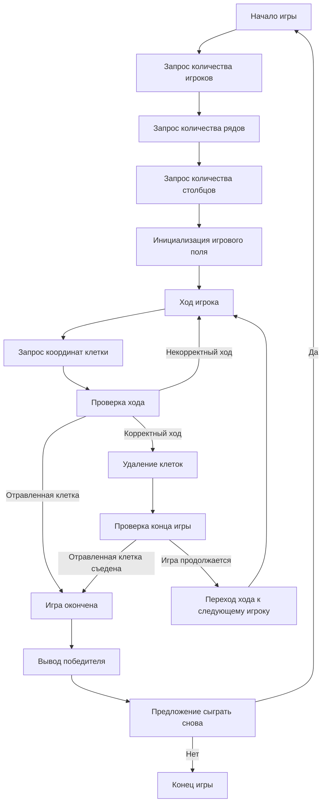

## Анализ кода игры CHOMP

### <алгоритм>
1. **Начало игры:**
   - Запрашивается количество игроков (обычно 2) и размер игрового поля (количество рядов и столбцов).
   - Игровое поле инициализируется. Каждая клетка представляется как доступная для хода. Отравленная клетка помещается в верхний левый угол.
   
   *Пример: Игровое поле 4x7:*
   ```
   [P, _, _, _, _, _, _]
   [_, _, _, _, _, _, _]
   [_, _, _, _, _, _, _]
   [_, _, _, _, _, _, _]
   ```

2. **Основной цикл игры (ход игрока):**
   - Запрашивается ход текущего игрока:
     - Вводятся координаты клетки (ряд, колонка).
   - **Проверка хода:**
     - Проверяется, не выходит ли клетка за пределы поля.
     - Проверяется, не съедена ли клетка ранее.
     - Если игрок выбрал отравленную клетку (верхний левый угол), то игра заканчивается.

     *Пример 1: игрок выбирает клетку (3, 4)*
      ```
        [P, _, _, _, _, _, _]
        [_, _, _, _, _, _, _]
        [_, _, _, _, _, _, _]
        [_, _, _, _, X, X, X]
      ```
      *Пример 2: игрок выбирает клетку (2, 3)*
      ```
       [P, _, _, _, _, _, _]
       [_, _, _, X, X, X, X]
       [_, _, _, X, X, X, X]
      ```

     - Если клетка допустима, то:
       - Все клетки, которые находятся ниже и правее выбранной, включая саму клетку, помечаются как съеденные.
   - **Смена игрока:**
     - Переход хода к следующему игроку.
   - **Проверка конца игры:**
     - Если текущий игрок выбрал отравленную клетку, то игра завершается.

3. **Подсчёт победителя:**
   - Если игрок выбрал отравленную клетку, то он считается проигравшим, а предыдущий игрок — победителем.

4. **Завершение игры:**
   - Выводится сообщение о победителе.
   - Запрашивается, хотят ли игроки сыграть снова.

### <mermaid>

**Объяснение диаграммы:**
1.  **Начало игры:** Игра начинается с запроса количества игроков, рядов и столбцов для определения размеров игрового поля.
2.  **Инициализация игрового поля:** Создается игровая доска, где верхняя левая клетка обозначается как "отравленная".
3.  **Ход игрока:** Начинается цикл игры, где каждый игрок по очереди делает ход.
4.  **Запрос координат клетки:** Игрок вводит координаты клетки, которую он хочет "съесть".
5.  **Проверка хода:** Проверяется, является ли ход корректным: не выходит ли за границы поля и не выбрана ли уже съеденная клетка.
6.  **Удаление клеток:** Если ход корректный, то все клетки, расположенные ниже и правее выбранной, удаляются с игрового поля.
7.  **Проверка конца игры:** Проверяется, не была ли съедена "отравленная" клетка.
8.  **Переход хода к следующему игроку:** Если "отравленная" клетка не была съедена, ход переходит к следующему игроку.
9.  **Игра окончена:** Если "отравленная" клетка была съедена, игра завершается.
10. **Вывод победителя:** Объявляется победитель (игрок, который не съел "отравленную" клетку).
11. **Предложение сыграть снова:** Игрокам предлагается сыграть еще раз.
12. **Конец игры:** Если игроки отказываются играть снова, игра завершается.

### <объяснение>

**Импорты:**

В предоставленном коде отсутствуют импорты. Однако, если бы в коде присутствовали импорты, например `import header`, тогда был бы необходим дополнительный блок `mermaid` (см. шаблон в инструкции), который бы объяснял, что делает `header.py`, как он определяет корень проекта и импортирует глобальные настройки.

**Классы:**

В описании кода не используются классы.

**Функции:**
Описанный игровой процесс, может быть представлен следующими функциями (хотя они не представлены в коде):

1.  `initialize_game(rows, cols)`:
    -   Аргументы: `rows` (количество рядов), `cols` (количество столбцов).
    -   Возвращаемое значение: `board` (двумерный массив, представляющий игровое поле).
    -   Назначение: Создаёт и инициализирует игровое поле, устанавливает отравленную клетку в верхний левый угол.
    -   Пример: `board = initialize_game(4, 7)` создаст поле 4x7 с отравленной клеткой.

2.  `get_player_move(player_number)`:
    -   Аргументы: `player_number` (номер текущего игрока).
    -   Возвращаемое значение: `(row, col)` (координаты выбранной клетки).
    -   Назначение: Запрашивает ввод координат клетки у текущего игрока.
    -   Пример: `row, col = get_player_move(1)` вернёт координаты клетки, выбранной первым игроком.

3.  `validate_move(board, row, col)`:
    -   Аргументы: `board` (игровое поле), `row` (ряд), `col` (колонка).
    -   Возвращаемое значение: `True` (если ход корректен), `False` (если ход некорректен).
    -   Назначение: Проверяет, является ли ход корректным (не выходит ли за пределы поля, не выбрана ли уже съеденная клетка, не является ли выбранная клетка отравленной).
    -   Пример: `if validate_move(board, 3, 4):` проверит, допустим ли ход в клетку (3,4).

4.  `remove_cells(board, row, col)`:
    -   Аргументы: `board` (игровое поле), `row` (ряд), `col` (колонка).
    -   Возвращаемое значение: `board` (обновленное игровое поле).
    -   Назначение: Удаляет клетки, которые расположены ниже и правее выбранной клетки.
    -   Пример: `updated_board = remove_cells(board, 3, 4)` удалит клетки начиная с координаты (3,4) и ниже/правее

5.  `check_game_over(board, row, col)`:
    -   Аргументы: `board` (игровое поле), `row` (ряд), `col` (колонка).
    -   Возвращаемое значение: `True` (если игра закончена), `False` (если игра не закончена).
    -   Назначение: Проверяет, была ли выбрана отравленная клетка.
    -   Пример: `if check_game_over(board, 0, 0):` проверит, была ли выбрана отравленная клетка.

6.  `display_winner(winner_number)`:
    -   Аргументы: `winner_number` (номер победившего игрока).
    -   Возвращаемое значение: `None`.
    -   Назначение: Выводит сообщение о победителе.
    -   Пример: `display_winner(2)` выведет сообщение о победе второго игрока.

7.  `play_again()`:
    -   Аргументы: `None`.
    -   Возвращаемое значение: `True` (если игроки хотят сыграть еще раз), `False` (если нет).
    -   Назначение: Запрашивает, хотят ли игроки сыграть снова.
    -   Пример: `if play_again():` будет запрашивать повторную игру.

**Переменные:**

-   `players`: Целое число, количество игроков.
-   `rows`: Целое число, количество рядов игрового поля.
-   `cols`: Целое число, количество столбцов игрового поля.
-   `board`: Двумерный массив (список списков) или матрица, представляющая игровое поле.
-   `row`: Целое число, ряд выбранной игроком клетки.
-   `col`: Целое число, колонка выбранной игроком клетки.
-   `current_player`: Целое число, номер текущего игрока.

**Потенциальные ошибки или области для улучшения:**

-   **Отсутствие кода:**  Представлен только текст с описанием, реальный код не предоставлен, что затрудняет полный анализ.
-   **Обработка ввода:** Код должен проверять вводимые данные на корректность (например, целые числа для рядов и столбцов).
-   **Реализация игрового поля:** Игровое поле должно быть реализовано в виде структуры данных (например, двумерного массива), чтобы можно было манипулировать клетками.
-   **Интерфейс пользователя:** Отсутствует интерфейс, который бы отображал текущее состояние игрового поля пользователю.
-   **Объектно-ориентированное программирование:**  Код можно улучшить, используя классы для представления игры и игроков, что сделало бы код более структурированным.

**Взаимосвязи с другими частями проекта:**

Учитывая отсутствие кода, невозможно определить зависимости от других частей проекта. Однако, если бы была реализация, она могла бы зависеть от модулей, связанных с:

*   **Вводом/выводом:** Модули для запроса ввода данных от пользователя и вывода сообщений.
*   **Графическим интерфейсом (GUI):** Модули для отрисовки игрового поля и обработки взаимодействия с пользователем.

**Цепочка взаимосвязей (если бы были другие части проекта):**

1.  **Модуль ввода/вывода:** Получение данных от пользователя, вывод состояния игрового поля и результатов игры.
2.  **Модуль логики игры:** Реализация функций `initialize_game`, `get_player_move`, `validate_move`, `remove_cells`, `check_game_over`, `display_winner`, `play_again`.
3.  **Модуль графического интерфейса (если есть):** Отрисовка игрового поля, обработка событий пользовательского интерфейса.

Таким образом, предоставленный анализ кода описывает структуру и логику игры CHOMP, а также предлагает возможные варианты реализации и улучшения.