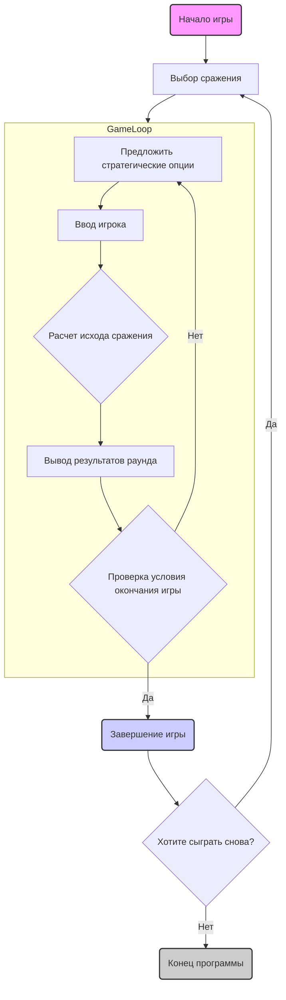

## АНАЛИЗ КОДА:

### <алгоритм>

**Начало:**
1.  **Инициализация игры:**
    *   Выбор сражения из списка доступных (например, Битва при Булл-Ран, Шилох).
    *   Игрок управляет армией конфедератов, компьютер - армией Союза.
2.  **Основной цикл игры:**
    *   **Начало раунда:**
        *   Вывод на экран возможных стратегических опций:
            *   Оборонительные: Артиллерийская атака, Укрепления против фронтальных атак, Укрепления против фланговых маневров, Отступление.
            *   Наступательные: Артиллерийская атака, Прямой удар, Маневры по флангу, Окружение.
        *   Прием ввода пользователя (выбор стратегии).
    *   **Выбор стратегии** (Пример: Игрок выбирает «1. Артиллерийская атака»).
        *   Компьютер выбирает свою стратегию (например, "2. Укрепления против фронтальной атаки").
    *   **Расчет исхода сражения:**
        *   Сравнение выбранных стратегий игрока и компьютера.
        *   Определение потерь каждой стороны на основе исторических данных и выбранных стратегий.
        *   Вывод на экран информации о потерях (например, "Ваши потери: 500 человек. Потери противника: 700 человек").
        *   Определение победителя на основе потерь.
    *   **Вывод результатов раунда:**
        *   Вывод на экран сообщения о победе или поражении (например, "Вы выиграли сражение").
    *   **Проверка условия окончания игры:**
        *   Проверка, не завершены ли все сражения.
        *   Проверка, не достиг ли игрок критических потерь.
    *   **Если условие окончания не выполнено** переход к началу раунда.
3.  **Завершение игры:**
    *   Вывод на экран сообщения об окончании игры.
    *   Запрос на новую игру (да/нет).
        *  Если "да", перезапуск игры.
        *  Если "нет", завершение программы.

### <mermaid>

### <объяснение>

**Объяснение:**

*   **Инициализация игры:** Игра начинается с выбора сражения. Игрок выступает в роли командира армии Конфедерации, в то время как компьютер управляет армией Союза. Это создает базовые условия для конфликта, который будет разворачиваться в игре.

*   **Основной цикл игры:**
    *   **Ввод данных:** Игроку предоставляется выбор между различными стратегиями, которые разделены на оборонительные и наступательные. Этот выбор основывается на исторической тактике Гражданской войны.
    *   **Выбор стратегии:** Игрок принимает решение, выбирая одну из предложенных стратегий. После выбора стратегия используется в расчете текущего раунда.
    *   **Расчет исхода сражения:** Программа имитирует сражение, учитывая выбор игрока и сравнивая его с действиями компьютера, а также историческими данными по потерям. Это ядро игровой механики, которое моделирует результат стратегических решений.
    *   **Вывод результатов раунда:** Игроку предоставляется обратная связь по результатам его действий, включая потери и общий итог сражения (победа или поражение).
    *   **Проверка условия окончания игры:** Цикл игры продолжается до тех пор, пока не будет достигнуто условие завершения, такое как проигрыш или успешное прохождение всех сражений.

*   **Завершение игры:** После завершения цикла игры пользователю предлагается сыграть снова, что обеспечивает реиграбельность.
  
**Взаимосвязи с другими частями проекта:**

Данный код, как описано в инструкции, является правилами игры `CIVILW`, и является частью текстовой документации, описывающей логику игры. Код не взаимодействует с другими частями проекта напрямую (например, не происходит импорта классов или функций). Игра, скорее всего, реализована в рамках отдельного класса или набора функций, где текст документации является основой для создания логики игры.