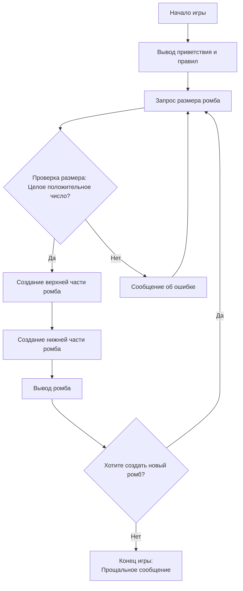

## Анализ кода игры DIAMND

### <алгоритм>

1. **Начало игры:**
   - Выводится приветствие и объяснение правил игры.
   - Запрашивается у пользователя размер ромба (целое положительное число).
   - **Пример:** `print("Добро пожаловать в игру DIAMND!")`, `size = input("Введите размер ромба: ")`

2. **Проверка ввода:**
   - Проверяется, является ли введенное значение целым числом и больше нуля.
   - Если ввод некорректен, выводится сообщение об ошибке, и пользователь просят ввести значение повторно.
   - **Пример:** `if not size.isdigit() or int(size) <= 0: print("Некорректный ввод.")`

3. **Генерация верхней части ромба:**
    - Инициализируется пустой список `diamond`.
    - Создается цикл от `1` до `size`.
    - Для каждой итерации цикла:
      - Вычисляется количество пробелов слева от звездочек как `size - i`.
      - Вычисляется количество звездочек как `2 * i - 1`.
      - Формируется строка `пробелы + звездочки` и добавляется в список `diamond`.
    - **Пример:** Если `size=4`, то для `i=2` будет: `spaces = "  "`, `stars = "***"`, строка будет `"  ***"`.

4. **Генерация нижней части ромба:**
    - Создается цикл от `size - 1` до `1` (в обратном порядке).
    - Для каждой итерации цикла:
       - Вычисляется количество пробелов слева от звездочек как `size - i`.
       - Вычисляется количество звездочек как `2 * i - 1`.
       - Формируется строка `пробелы + звездочки` и добавляется в список `diamond`.
     - **Пример:** Если `size=4`, то для `i=3` будет: `spaces = " "`, `stars = "*****"`, строка будет `" *****"`.

5. **Вывод ромба:**
   - Выводится каждая строка из списка `diamond` на экран.
   - **Пример:** `for row in diamond: print(row)`

6. **Продолжение игры:**
   - Пользователю предлагается создать новый ромб, повторив шаги 1-5 или завершить игру.
   - **Пример:** `answer = input("Хотите создать новый ромб? (да/нет)")`, если ответ `да`, то переходим к шагу 1.

7. **Завершение игры:**
    - Выводится прощальное сообщение.
    - **Пример:** `print("Спасибо за игру!")`

### <mermaid>

### <объяснение>

**Общая структура игры:**
Игра `DIAMND` представляет собой интерактивную программу, которая запрашивает у пользователя размер ромба и выводит его на экран. Программа состоит из этапов ввода данных, проверки, генерации и вывода.

**Импорты:**
В предоставленном коде нет явных импортов. Это указывает на то, что игра использует только встроенные в Python функции, такие как `print()`, `input()`, `isdigit()` и др. Если бы использовались какие-либо импорты из других частей проекта `src`, они бы были указаны в начале файла.

**Классы:**
В данном коде не используются классы. Вся логика реализуется в виде последовательности действий и вызовов функций.

**Функции:**
В коде предполагается использование ряда функций, таких как:
- **`main` (неявная):** Основная функция, управляющая потоком программы (основной цикл).
- **`get_diamond_size()`:** Функция для запроса размера ромба у пользователя и проверки его корректности (пример: `size = get_diamond_size()`).
- **`create_diamond(size)`:** Функция для генерации строк ромба (пример: `diamond = create_diamond(size)`).
- **`display_diamond(diamond)`:** Функция для вывода ромба на экран (пример: `display_diamond(diamond)`).
- **`play_again()`:** Функция для запроса повторного запуска игры (пример: `answer = play_again()`).

**Переменные:**
- **`size`:** Целое число, представляющее размер ромба (количество строк верхней части).
- **`i`:** Целочисленный счетчик циклов для построения ромба.
- **`spaces`:** Строка, представляющая пробелы в начале каждой строки ромба.
- **`stars`:** Строка, представляющая звездочки в каждой строке ромба.
- **`diamond`:** Список, содержащий строки, формирующие ромб.
- **`row`:** Строка, представляющая текущую строку ромба.
- **`answer`:** Строка, хранящая ответ пользователя на вопрос о повторной игре.

**Потенциальные ошибки и улучшения:**
- **Фиксированный символ:** Ромб строится только из `*`. Можно добавить возможность выбора символа пользователем.
- **Обработка исключений:** Код может улучшить обработку исключений при вводе размера ромба (например, если пользователь введет не число, то программа "упадет" из-за невозможности привести его к integer).
- **Модульность:** Код можно разбить на более мелкие функции для лучшей читаемости и переиспользуемости.
- **Проверка ответа:**  Проверка ответа `да/нет` может быть улучшена, учитывая разные варианты ввода (`Yes`, `y`, `д`, `Да` и т.д.).

**Взаимосвязь с другими частями проекта:**
Поскольку в предоставленном коде не указаны импорты, нет прямой связи с другими частями проекта. Однако, в более крупном проекте можно было бы выделить функции работы с пользовательским вводом, формирования строк, и отображения результата в отдельные модули для переиспользования в других играх.