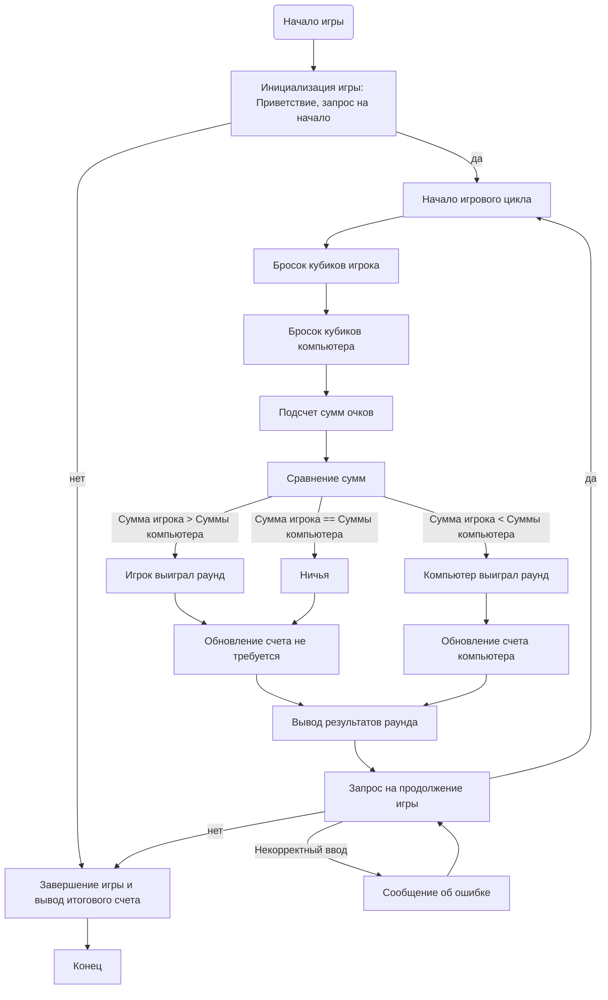

## ИНСТРУКЦИЯ:

Анализируй предоставленный код подробно и объясни его функциональность. Ответ должен включать три раздела:  

1. **<алгоритм>**: Опиши рабочий процесс в виде пошаговой блок-схемы, включая примеры для каждого логического блока, и проиллюстрируй поток данных между функциями, классами или методами.  
2. **<mermaid>**: Напиши код для диаграммы в формате `mermaid`, проанализируй и объясни все зависимости, 
    которые импортируются при создании диаграммы. 
    **ВАЖНО!** Убедитесь, что все имена переменных, используемые в диаграмме `mermaid`, 
    имеют осмысленные и описательные имена. Имена переменных вроде `A`, `B`, `C`, и т.д., не допускаются!  
    
    **Дополнительно**: Если в коде есть импорт `import header`, добавьте блок `mermaid` flowchart, объясняющий `header.py`:\
    ```mermaid\
    flowchart TD\
        Start --> Header[<code>header.py</code><br> Determine Project Root]\
    \
        Header --> import[Import Global Settings: <br><code>from src import gs</code>] \
    ```\

3. **<объяснение>**: Предоставьте подробные объяснения:  
   - **Импорты**: Их назначение и взаимосвязь с другими пакетами `src.`.  
   - **Классы**: Их роль, атрибуты, методы и взаимодействие с другими компонентами проекта.  
   - **Функции**: Их аргументы, возвращаемые значения, назначение и примеры.  
   - **Переменные**: Их типы и использование.  
   - Выделите потенциальные ошибки или области для улучшения.  

Дополнительно, постройте цепочку взаимосвязей с другими частями проекта (если применимо).  

Это обеспечивает всесторонний и структурированный анализ кода.
## Формат ответа: `.md` (markdown)
**КОНЕЦ ИНСТРУКЦИИ**

### <алгоритм>

**1. Инициализация игры:**

   *   **Начало:** Выводится приветственное сообщение и правила игры.
   *   **Ввод пользователя:** Запрашивается ввод пользователя, желает ли он начать игру (`да` или `нет`).
    *   **Пример:** `>да`

**2. Основной цикл игры:**

   *   **Бросок кубиков игрока:** Генерируется 2 случайных числа от 1 до 6 (эмуляция броска кубиков) и суммируется.
        *   **Пример:** `user_dice1 = 4`, `user_dice2 = 5`, `user_sum = 9`
   *   **Бросок кубиков компьютера:**  Генерируется 2 случайных числа от 1 до 6 (эмуляция броска кубиков) и суммируется.
        *   **Пример:** `computer_dice1 = 2`, `computer_dice2 = 6`, `computer_sum = 8`
   *   **Сравнение результатов:**
        *   Если `user_sum` > `computer_sum`: Пользователь выиграл раунд.
        *   Если `user_sum` < `computer_sum`: Компьютер выиграл раунд.
        *   Если `user_sum` == `computer_sum`: Ничья.
   *   **Вывод результатов:** Выводятся результаты бросков и победитель раунда.
   *   **Счётчик побед:** Увеличивается счётчик побед пользователя или компьютера.
   *   **Запрос на продолжение игры:**  Запрашивается ввод пользователя, желает ли он продолжить игру (`да` или `нет`).
    *   **Пример:** `>нет`

**3. Завершение игры:**

   *   **Вывод итогового счёта:**  Выводятся общее количество побед пользователя и компьютера.
   *   **Конец:** Завершение программы.

**4. Обработка ошибок:**
 * **Некорректный ввод:** Если пользователь вводит некорректный ответ на вопрос о продолжении игры, программа выводит сообщение об ошибке и повторяет запрос.

### <mermaid>


**Объяснение `mermaid`:**

*   `Start`: Начало игры.
*   `Init`: Инициализация игры. Здесь происходит вывод приветствия и запрос на начало игры.
*   `GameLoopStart`: Начало цикла игры.
*   `UserDiceRoll`: Бросок кубиков игроком. Генерируются случайные числа от 1 до 6 для двух кубиков.
*  `ComputerDiceRoll`: Бросок кубиков компьютером. Генерируются случайные числа от 1 до 6 для двух кубиков.
*   `CalculateSums`: Подсчет суммы очков игрока и компьютера.
*   `CompareSums`: Сравнение суммы очков игрока и компьютера.
*   `UserWins`: Игрок выиграл раунд.
*   `ComputerWins`: Компьютер выиграл раунд.
*   `Tie`: Ничья.
*   `UpdateScore`: Обновление счета игрока.
*    `UpdateScoreComputer`: Обновление счета компьютера.
*   `ResultOutput`: Вывод результатов раунда.
*   `PlayAgain`: Запрос на продолжение игры от пользователя.
*  `ErrorMessage`: Выводится сообщение об ошибке если ввели не "да" или "нет".
*   `End`: Завершение игры и вывод итогового счета.
*   `Stop`: Конец программы.

### <объяснение>

*   **Импорты:**
    *   В описании кода упоминается, что игра может использовать модуль `random` для генерации случайных чисел, но фактически импорт не представлен, так как это описание игры, а не сам код.
*   **Классы:**
    *   В предоставленном описании нет классов. В контексте игры, классы могли бы использоваться для представления игроков или кубиков, но здесь все реализовано в рамках описания пошаговой инструкции.
*   **Функции:**
    *   В описании кода, подразумеваются следующие функции:
        *  `init_game()`: Функция для инициализации игры, вывода приветствия и запроса начала игры.
        *   `roll_dice()`: Функция для генерации случайных чисел от 1 до 6, имитирующая бросок кубика.
        *   `calculate_sum(dice1, dice2)`: Функция для подсчета суммы двух кубиков.
        *  `compare_sums(user_sum, computer_sum)`: Функция сравнения очков игрока и компьютера и определение победителя.
        *  `update_score(winner)`: Функция обновления счета побед игрока или компьютера.
        *   `game_loop()`: Функция реализующая цикл игры.
        *   `end_game()`: Функция для завершения игры и вывода итогового счета.
        *   `handle_invalid_input()`: Функция обработки некорректного ввода пользователя.
*   **Переменные:**
    *   `user_dice1`, `user_dice2` (int): Числа от 1 до 6, представляющие бросок кубика игроком.
    *   `computer_dice1`, `computer_dice2` (int): Числа от 1 до 6, представляющие бросок кубика компьютером.
    *   `user_sum` (int): Сумма очков, набранных игроком.
    *   `computer_sum` (int): Сумма очков, набранных компьютером.
    *    `user_wins` (int):  Счётчик побед пользователя.
    *    `computer_wins` (int):  Счётчик побед компьютера.
    *    `play_again` (str): Ответ пользователя на вопрос о продолжении игры ("да" или "нет").

*   **Потенциальные ошибки и области для улучшения:**

    *   **Валидация ввода:** Валидация ввода пользователя (на `да/нет`) может быть улучшена для обработки не только строчных, но и прописных букв, а также других некорректных данных.
    *   **Объектно-ориентированный подход:**  Реализация в виде классов (например, класс `Player` и класс `Dice`) сделала бы код более структурированным.
    *   **Возможности расширения:** Код можно расширить, добавив возможность выбора количества кубиков или количества граней на кубиках, как это и предлагается в описании.
    *   **Вывод сообщений:** Вывод сообщений можно сделать более интерактивным и понятным для пользователя.
    *  **Обработка исключений:** Добавить обработку возможных исключений при вводе данных.

*   **Цепочка взаимосвязей с другими частями проекта:**

    *  В данном контексте, так как это описание игры, а не код, то нет прямой связи с другими частями проекта. Однако, если бы это был код, он мог бы быть частью более крупного пакета с играми, и возможно, использовать общие модули для вывода сообщений, обработки пользовательского ввода, и т.д.