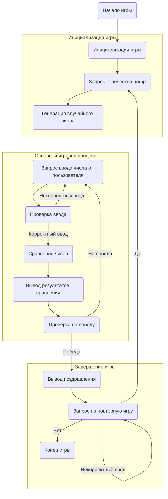

## ИНСТРУКЦИЯ:

Анализируй предоставленный код подробно и объясни его функциональность. Ответ должен включать три раздела:  

1. **<алгоритм>**: Опиши рабочий процесс в виде пошаговой блок-схемы, включая примеры для каждого логического блока, и проиллюстрируй поток данных между функциями, классами или методами.  
2. **<mermaid>**: Напиши код для диаграммы в формате `mermaid`, проанализируй и объясни все зависимости, 
    которые импортируются при создании диаграммы. 
    **ВАЖНО!** Убедитесь, что все имена переменных, используемые в диаграмме `mermaid`, 
    имеют осмысленные и описательные имена. Имена переменных вроде `A`, `B`, `C`, и т.д., не допускаются!  
    
    **Дополнительно**: Если в коде есть импорт `import header`, добавьте блок `mermaid` flowchart, объясняющий `header.py`:\
    ```mermaid
    flowchart TD
        Start --> Header[<code>header.py</code><br> Determine Project Root]
    
        Header --> import[Import Global Settings: <br><code>from src import gs</code>] 
    ```

3. **<объяснение>**: Предоставьте подробные объяснения:  
   - **Импорты**: Их назначение и взаимосвязь с другими пакетами `src.`.  
   - **Классы**: Их роль, атрибуты, методы и взаимодействие с другими компонентами проекта.  
   - **Функции**: Их аргументы, возвращаемые значения, назначение и примеры.  
   - **Переменные**: Их типы и использование.  
   - Выделите потенциальные ошибки или области для улучшения.  

Дополнительно, постройте цепочку взаимосвязей с другими частями проекта (если применимо).  

Это обеспечивает всесторонний и структурированный анализ кода.
## Формат ответа: `.md` (markdown)
**КОНЕЦ ИНСТРУКЦИИ**

### <алгоритм>

**1. Инициализация игры:**

   -   **Начало:**
      -   Вывод приветственного сообщения с названием игры "DIGITS" и объяснением правил.
      -   Пример:
          ```
          Добро пожаловать в игру DIGITS!
          ```

   -   **Выбор количества цифр:**
        - Запрос у пользователя количества цифр в загадываемом числе (от 2 до 5).
        - Пример:
          ```
           Укажите количество цифр в загаданном числе (от 2 до 5):
           > 3
          ```
   -   **Генерация случайного числа:**
        - Генерация компьютером случайного числа с выбранным количеством уникальных цифр.
        - Пример:
          - Если выбрано 3 цифры, то может быть сгенерировано число, например `543`.

**2. Основной игровой процесс:**

   -   **Ввод числа пользователем:**
        -   Запрос у пользователя ввода числа.
        -   Пример:
          ```
          Введите ваше предположение:
          > 123
          ```
    -   **Проверка корректности ввода:**
        -   Проверка длины введенного числа и наличия повторяющихся цифр.
        -   Если ввод некорректный, то выводится сообщение об ошибке и запрос ввода повторяется.
        -   Пример:
             ```
            Введите ваше предположение:
            > 122
            Ошибка! Число должно содержать уникальные цифры. Попробуйте еще раз.
             ```

   -   **Сравнение чисел и вывод результатов:**
        -   Сравнение введенного числа с загаданным числом.
        -   Подсчет количества цифр, которые угаданы и стоят на правильных местах, и количества цифр, которые угаданы, но стоят не на своих местах.
        -   Вывод результатов сравнения.
        -   Пример:
             ```
            Угадано и на правильном месте: 1
            Угадано, но не на своём месте: 1
             ```
    
    -  **Проверка на победу:**
        - Проверка, совпадает ли введенное число с загаданным.
        - Если числа совпадают, то вывод поздравления и конец игры.
        - Пример:
           ```
           Поздравляем! Вы угадали число: 543
           ```
         
**3. Продолжение игры:**
   
   - **Запрос на повторную игру:**
       - Запрос у пользователя, хочет ли он сыграть еще раз (да/нет).
       - Пример:
         ```
           Хотите сыграть снова? (да/нет):
           > да
         ```
    -  **Обработка ответа:**
        - Если пользователь отвечает "да", игра начинается заново с выбора количества цифр.
        - Если пользователь отвечает "нет", игра завершается.
        - Пример:
            ```
             Спасибо за игру!
            ```
        - В случае некорректного ответа, запрос повторяется.

### <mermaid>


**Описание диаграммы:**
- **Start:** Начало игры.
- **InitGame:** Инициализация игры, включающая приветствие и настройку начальных параметров.
- **InputDigitCount:** Запрос у пользователя количества цифр для загадываемого числа.
- **GenerateSecretNumber:** Генерация компьютером случайного числа с заданным количеством цифр.
- **InputUserGuess:** Запрос у пользователя ввода числа для угадывания.
- **ValidateUserGuess:** Проверка корректности введенного числа. Если число некорректное, то возврат к InputUserGuess.
- **CompareNumbers:** Сравнение введенного числа с загаданным числом и подсчет совпадений.
- **OutputResults:** Вывод результатов сравнения на экран.
- **CheckWin:** Проверка на победу (полное совпадение введенного числа с загаданным).
- **OutputWinMessage:** Вывод сообщения о победе.
- **AskPlayAgain:** Запрос у пользователя, хочет ли он сыграть еще раз. Если да, то возврат к InputDigitCount.
- **End:** Конец игры.
    
    
### <объяснение>

**1. Общее описание:**

Игра **DIGITS** представляет собой классическую игру на угадывание числа. Основная цель игры - угадать случайное число, сгенерированное компьютером, путем ввода предположений и получения подсказок о количестве угаданных цифр и их позиций.

**2. Пошаговое объяснение процесса:**

- **Инициализация игры:**
   - Игра начинается с приветствия пользователя и объяснения правил.
   - Пользователю предлагается выбрать количество цифр в загаданном числе (от 2 до 5).
   - Программа генерирует случайное число с выбранной длиной, в котором все цифры уникальны.

- **Основной процесс игры:**
   - Пользователь вводит свое предположение.
   - Программа проверяет корректность ввода (длина и уникальность цифр).
   - Если ввод некорректен, программа просит пользователя ввести число заново.
   - Программа сравнивает введенное число с загаданным и сообщает:
     - Количество цифр, которые угаданы и находятся на правильных позициях.
     - Количество цифр, которые угаданы, но находятся не на своих позициях.
   - После каждой попытки пользователя программа выводит эту статистику.
   - Если пользователь угадывает число, программа поздравляет его и завершает игру.

- **Завершение игры:**
   - После завершения игры пользователю предлагается сыграть еще раз.
   - Если пользователь отвечает "да", игра начинается заново.
   - Если пользователь отвечает "нет", игра завершается.

**3. Детали:**

-   **Генерация случайного числа:**
    -   При генерации случайного числа используется алгоритм, который обеспечивает уникальность цифр в загаданном числе.

-   **Сравнение чисел:**
    -   Сравнение чисел происходит путем посимвольного сравнения цифр.
    -   Подсчитывается количество совпадений на правильных позициях и количество совпадений на неправильных позициях.

-   **Обработка ошибок:**
    -   Программа обрабатывает следующие ошибки:
        -   Некорректная длина введенного числа.
        -   Наличие повторяющихся цифр в введенном числе.
        -   Некорректный ввод при запросе о повторной игре.

-   **Пользовательский интерфейс:**
    -   Игра использует текстовый интерфейс для взаимодействия с пользователем.
    -   Сообщения программы понятны и информативны.

**4. Потенциальные улучшения:**

-   **Счётчик попыток:** Добавить счётчик попыток и выводить его в конце игры, что может мотивировать пользователя улучшать свои результаты.
-   **Выбор диапазона цифр:** Позволить пользователю выбирать диапазон цифр (например, от 0 до 9) для усложнения игры.
-   **Уровни сложности:** Реализовать уровни сложности, увеличивая максимальное количество цифр в загадываемом числе.
-   **Графический интерфейс:** Переход на графический интерфейс может улучшить пользовательский опыт и сделать игру более привлекательной.
-   **Подсказки:** Добавить подсказки, например, давать пользователю информацию о том, какие цифры больше или меньше загаданных.
-   **Статистика:** Ввести статистику игр (количество попыток, время), что может добавить соревновательный элемент.

**5. Связь с другими частями проекта:**

-   Данная игра может быть частью более крупного проекта с набором различных текстовых игр.
-   Реализация может быть основана на базовых структурах данных и управляющих структурах, которые могут использоваться повторно в других играх проекта.

**6. Пример работы программы:**

   - **Начало игры:**
     ```
     Добро пожаловать в игру DIGITS!
     Укажите количество цифр в загаданном числе (от 2 до 5):
     > 3
     Компьютер загадал число из 3 уникальных цифр. Попробуйте угадать!
     ```
   - **Попытки угадывания:**
      ```
      Введите ваше предположение:
      > 123
      Угадано и на правильном месте: 1
      Угадано, но не на своём месте: 1
     ```
   - **Результат игры:**
      ```
      Введите ваше предположение:
      > 543
      Поздравляем! Вы угадали число: 543
      Хотите сыграть снова? (да/нет):
      > нет
      Спасибо за игру!
      ```
**Заключение:**

Игра **DIGITS** представляет собой простой, но интересный проект, который демонстрирует основы программирования, включая генерацию случайных чисел, обработку пользовательского ввода, сравнение чисел и управление игровым процессом. Приведенный анализ охватывает все ключевые аспекты игры, а также содержит предложения по ее улучшению.