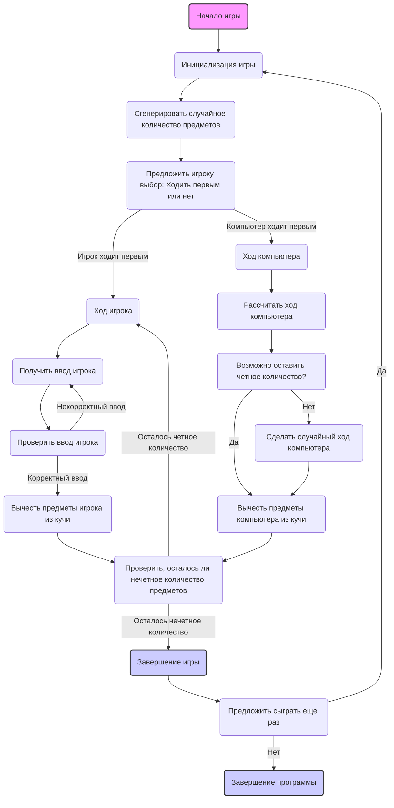

## Анализ кода игры "EVEN"

### 1. <алгоритм>

**Блок-схема игрового процесса:**

```mermaid
graph TD
    A[Начало игры] --> B{Приветствие игрока и инструкция};
    B --> C{Генерация случайного количества предметов (10-30)};
    C --> D{Выбор игрока: ходить первым?};
    D -- да --> E[Ход игрока];
    D -- нет --> F[Ход компьютера];
    E --> G{Ввод игрока (1-3 предмета)};
    G --> H{Проверка ввода: корректен?};
    H -- да --> I{Вычитание предметов из кучи};
    H -- нет --> G;
    I --> J{Осталось нечетное кол-во?};
     J -- да --> K[Игрок проиграл];
     J -- нет --> L[Ход компьютера];
    
    F --> L;
    L --> M{Расчет хода компьютера (оставить четное)};
    M --> N{Возможно оставить четное?};
    N -- да --> O{Вычитание предметов из кучи};
    N -- нет --> P{Случайный ход компьютера (1-3 предмета)};
    O --> Q{Осталось нечетное кол-во?};
    P --> Q;
     Q -- да --> R[Компьютер проиграл];
     Q -- нет --> E;
   
     K --> S{Предложить сыграть еще раз};
    R --> S;
    S -- да --> C;
    S -- нет --> T[Конец игры];

    
    style A fill:#f9f,stroke:#333,stroke-width:2px
    style K fill:#ccf,stroke:#333,stroke-width:2px
     style R fill:#ccf,stroke:#333,stroke-width:2px
     style T fill:#ccf,stroke:#333,stroke-width:2px
```
**Примеры для каждого блока:**

*   **A (Начало игры):** Запускается программа.
*   **B (Приветствие игрока и инструкция):** Выводится сообщение "Добро пожаловать в игру EVEN!" и правила игры.
*   **C (Генерация случайного количества предметов):** Количество предметов = 23.
*   **D (Выбор игрока: ходить первым?):** Игрок выбирает "да".
*   **E (Ход игрока):**
    *   **G (Ввод игрока):** Игрок вводит 2.
    *   **H (Проверка ввода):** 2 - корректное число.
    *   **I (Вычитание предметов из кучи):** 23 - 2 = 21, в куче осталось 21 предмет.
   *   **J (Осталось нечетное кол-во?):** Да.
* **K (Игрок проиграл):** Выводится сообщение о проигрыше игрока
    
*   **D (Выбор игрока: ходить первым?):** Игрок выбирает "нет".
*   **F (Ход компьютера):**
    *   **L (Расчет хода компьютера):** Компьютер пытается оставить четное количество предметов, если это возможно
    *   **N (Возможно оставить четное?):** Да
    *   **O (Вычитание предметов из кучи):** 23-1 = 22, в куче осталось 22 предмета
    *    **Q (Осталось нечетное кол-во?):** Нет. 
*   **S (Предложить сыграть еще раз):** Выводится сообщение "Хотите сыграть еще раз? (да/нет)".
    * **S - да --> C:** Начинается новый раунд.
    * **S - нет --> T:** Выводится сообщение "Спасибо за игру!".
*   **T (Конец игры):** Завершение программы.

### 2. <mermaid>



**Описание зависимостей:**

В данном коде нет импорта каких-либо модулей, за исключением использования `random` внутри игры. 
Данная диаграмма описывает логику работы игры, поэтому нет необходимости в импорте других модулей.

### 3. <объяснение>

**Импорты:**
- В явном виде нет импортов, но игра предполагает использование `random` для генерации случайного количества предметов.

**Классы:**
- В предоставленном описании игры не используются классы. Код представляет собой последовательность инструкций, логических блоков и проверок.

**Функции:**
- В описании не представлены функции, но предполагается их использование для организации кода:
    - **`init_game()`**: Функция для инициализации игры: генерации случайного количества предметов, приветствия игрока и запроса на выбор первого хода.
    - **`player_turn()`**: Функция, отвечающая за ход игрока. Запрашивает ввод, проверяет корректность и изменяет состояние кучи.
    - **`computer_turn()`**: Функция, отвечающая за ход компьютера. Вычисляет оптимальный ход и изменяет состояние кучи.
    - **`check_winner()`**: Функция, проверяющая, не осталось ли нечетное количество предметов, и определяет победителя.
    - **`play_again()`**: Функция, предлагающая сыграть еще раз и возвращающая результат выбора игрока.

**Переменные:**
-   `items_count` (int): Количество предметов в куче, генерируется случайным образом.
-   `player_choice` (str): Выбор игрока, кто ходит первым ("да" или "нет").
-  `player_input` (int): Количество предметов, которое игрок хочет взять.
-   `computer_move` (int): Количество предметов, которое забирает компьютер.

**Потенциальные ошибки и улучшения:**

*   **Отсутствие обработки ошибок ввода:** В описании присутствует проверка ввода, но не указано, как обрабатывать ситуации, когда пользователь вводит нечисловые значения.
*   **Отсутствие функций:** Код может быть улучшен путем разбиения на функции, что сделает его более модульным и читаемым.
*  **Сложность кода:** Код может стать более сложным, если добавить уровни сложности для компьютера, поэтому необходимо использовать ООП для упрощения реализации.
*   **Улучшенный ИИ:** Компьютер мог бы играть более стратегически, например, с учетом комбинаций ходов.
*   **Счётчик раундов:** Добавление счетчика выигранных раундов для игрока и компьютера сделало бы игру более интересной.

**Взаимосвязи с другими частями проекта:**

*   **`src.ai.helicone`**: Эта игра может быть частью более крупного проекта `ai_games` в рамках `helicone`, что предполагает наличие общих модулей и зависимостей в рамках этой структуры. В данном случае, взаимодействие с другими частями проекта в явном виде не прослеживается, так как предоставлен лишь алгоритм игры без фактической реализации, однако, если бы данный код был частью проекта, он, скорее всего, взаимодействовал бы с другими модулями (например, для вывода сообщений или для работы с пользовательским вводом).

**Цепочка взаимосвязей:**
1. **Инициализация:** Игра начинается с `init_game()`, которая настраивает начальное состояние.
2. **Игровой цикл:**
   -  `player_turn()` для хода игрока.
   -  `computer_turn()` для хода компьютера.
   -  `check_winner()` проверяет условие победы после каждого хода.
3. **Завершение:**
   - `play_again()` предлагает сыграть еще раз или завершает игру.

Этот анализ предоставляет полную картину алгоритма, его структуры и возможных улучшений для данной логической игры.