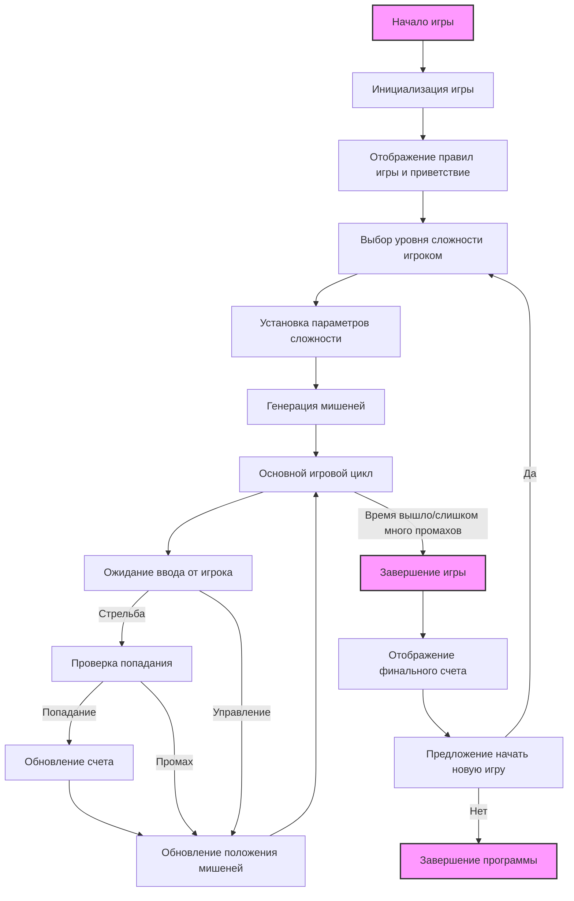

## Анализ кода игры "GUNNER" (Стрельба по мишеням)

### <алгоритм>
Игра "GUNNER" - это аркадная игра, в которой игрок управляет стрелком и стреляет по движущимся мишеням.

1.  **Начало игры:**
    *   Игра выводит приветственное сообщение и правила.
    *   Игрок выбирает уровень сложности ("Легкий", "Средний", "Сложный").
    *   В зависимости от выбора, устанавливается скорость движения мишеней.
    *   Программа генерирует несколько мишеней в случайных местах на экране.

    *Пример*:
    ```
    Приветствие: "Добро пожаловать в игру GUNNER!"
    Выбор сложности: "Выберите уровень сложности (Легкий/Средний/Сложный):"
    Ввод игрока: "Средний"
    Начало игры с заданной сложностью.
    ```
2.  **Игровой процесс:**
    *   **Управление:** Игрок управляет прицелом с помощью клавиш или мыши.
    *   **Стрельба:**
        *   Игрок стреляет по клавише или мыши.
        *   Программа проверяет попадание в мишень.
        *   При попадании добавляются очки. При промахе могут вычитаться (или нет, в зависимости от реализации).
        *   Мишени двигаются по экрану случайным образом и ускоряются на более высоких уровнях.
    *   **Уровни сложности:**
        *   Легкий: Мишени двигаются медленно, их количество ограничено.
        *   Средний: Мишени двигаются быстрее, их больше.
        *   Сложный: Мишени двигаются очень быстро, их много.

    *Пример:*
    ```
    Положение прицела: x=100, y=50
    Игрок нажал клавишу "выстрел".
    Проверка попадания: Мишень находится в точке (102, 52)
    Попадание! +10 очков.
    Новое положение мишени задано случайным образом.
    ```
3.  **Подсчет очков:**
    *   Счетчик очков увеличивается за каждое попадание.
    *   Игрок может терять очки за промахи (опционально).
4.  **Завершение игры:**
    *   Игра завершается по истечении времени или после определенного количества промахов.
    *   Выводится сообщение с финальным счетом.
    *   Игроку предлагается сыграть снова или выйти.
    *   В случае повторной игры, начинается новый раунд с тем же или новым уровнем сложности.

    *Пример:*
    ```
    Время вышло.
    Финальный счет: 250 очков.
    Сообщение: "Игра завершена! Ваши очки: 250"
    Предложение: "Хотите сыграть снова? (да/нет)"
    Ввод игрока: "нет"
    Программа завершена.
    ```

### <mermaid>


**Объяснение зависимостей в `mermaid`:**

*   `Start`: Начало программы.
*   `Initialize`: Блок инициализирует игру, отображает правила и ждет выбора сложности.
*   `DisplayRules`: Блок отображает правила игры и приветствие для пользователя.
*   `ChooseDifficulty`: Блок позволяет игроку выбрать уровень сложности (легкий, средний, сложный).
*   `SetDifficulty`: Блок устанавливает параметры игры в соответствии с выбранной сложностью (например, скорость мишеней).
*   `GenerateTargets`: Блок генерирует мишени в случайных точках экрана.
*  `GameLoop`: Основной цикл игры.
*   `UserInput`: Блок ожидает ввод от игрока (стрельба, управление).
*   `CheckHit`: Блок проверяет, попал ли выстрел в мишень.
*   `UpdateScore`: Блок обновляет счет в зависимости от попадания или промаха.
*   `UpdateTargets`: Блок обновляет положение мишеней на экране.
*   `EndGame`: Блок завершает игру, когда время истекло или если было слишком много промахов.
*   `DisplayScore`: Блок отображает финальный счет игрока.
*   `PlayAgain`: Блок предлагает игроку сыграть снова.
*   `Exit`: Завершение программы.

### <объяснение>

**Импорты:**

*   `pygame`: (упоминается в разделе "Реализация") Модуль используется для создания графического интерфейса, управления окном игры и анимацией мишеней.
*   `random`: (упоминается в разделе "Реализация") Модуль используется для генерации случайных координат появления мишеней и их перемещения по экрану.

**Классы:**

В предоставленном описании игры классы не указаны явно, однако, при реализации можно выделить следующие классы:

*   **`Target`**: Класс для представления мишени, включая её позицию, скорость, внешний вид и поведение.
    *   **Атрибуты**: `x`, `y` (координаты), `speed` (скорость), `size` (размер).
    *   **Методы**: `move()` (обновляет положение), `draw()` (отрисовывает мишень на экране), `check_collision(mouse_pos)` (проверяет попадание).
*   **`Player`**: Класс для представления игрока, включая его позицию, прицел, очки и т.д.
    *   **Атрибуты**: `x`, `y` (координаты прицела), `score` (текущий счет)
    *   **Методы**: `move_aim()` (управляет прицелом), `shoot()` (стрельба).
*   **`Game`**: Класс для управления игровым процессом, включая инициализацию, основной цикл и завершение игры.
    *   **Атрибуты**: `level` (уровень сложности), `targets` (список мишеней), `player` (объект игрока), `score` (текущий счет)
    *   **Методы**: `initialize()` (инициализирует игру), `run()` (основной игровой цикл), `update_game()` (обновляет состояние игры), `draw()` (отрисовывает все элементы на экране), `end_game()` (завершает игру), `play_again()` (начинает новую игру).

**Функции:**

*   `initialize_game()`: Запускает игру, приветствуя пользователя, выбирая сложность, задавая параметры игры и создавая начальные мишени.
*   `game_loop()`: Выполняет основной игровой цикл.
*   `handle_input()`: Принимает ввод пользователя (стрельба, управление).
*   `update_game()`: Обновляет позиции мишеней и другие параметры игры.
*   `check_hit()`: Проверяет, попал ли выстрел в мишень.
*   `update_score()`: Обновляет счет игрока.
*   `draw_game()`: Отрисовывает на экране все элементы игры.
*   `end_game()`: Завершает игру, выводит результаты и предлагает сыграть снова.

**Переменные:**

*   `level`: Уровень сложности (строка: "Легкий", "Средний", "Сложный").
*   `score`: Текущий счет игрока (целое число).
*   `targets`: Список объектов `Target`, представляющих мишени.
*   `game_time`: Время, отведенное на игру (целое число).
*   `mouse_pos`: Позиция мыши (кортеж `(x, y)`).
*   `target_speed`: Скорость движения мишеней (целое число, зависит от сложности).
*   `target_size`: Размер мишеней (целое число).
*   `window_width`, `window_height`: Размеры игрового окна (целые числа).
*  `playing`: Флаг, указывающий, что игра продолжается (логическое значение `True`/`False`).

**Потенциальные ошибки и области для улучшения:**

1.  **Отсутствие проверки ввода**: Ввод пользователя (уровня сложности) не проверяется на корректность (может быть введён неверный уровень).
2.  **Отсутствие графики**: Описание ориентировано на работу с `pygame`, но графическая реализация отсутствует в явном виде.
3.  **Ограниченное управление**: Управление только с помощью стрелок и пробела (можно расширить на мышь).
4.  **Примитивная логика**: Отсутствует детальная логика перемещения мишеней, более интересные режимы игры.
5.  **Отсутствие сохранений**: Нет системы сохранения рекордов.
6.  **Простое взаимодействие**: Мишени перемещаются случайно, не учитывая состояние игры.

**Взаимосвязи с другими частями проекта:**

*   Если игра является частью более крупного проекта, то классы `Target`, `Player` и `Game` могут быть вынесены в отдельные модули для лучшей организации кода.
*   Для хранения настроек игры, можно использовать отдельный модуль `settings`, куда можно сохранять уровни сложности, скорость мишеней и т.д.
*   Если будет реализован функционал сохранения рекордов, то потребуется модуль для работы с файловой системой.

**Дополнительные замечания:**

*   Реализация игры может быть улучшена путём добавления различных типов мишеней, бонусов и уровней, более продвинутой физики и визуальных эффектов.
*   Код должен быть структурирован и хорошо задокументирован, чтобы другие разработчики могли его легко понять и модифицировать.
*   Для улучшения производительности можно использовать оптимизированные алгоритмы и методы отрисовки.

Таким образом, данный анализ предоставляет подробное описание игры "GUNNER", включая алгоритм, диаграмму `mermaid`, и подробное объяснение каждого компонента, а также отмечает области для улучшения и возможные связи с другими частями проекта.