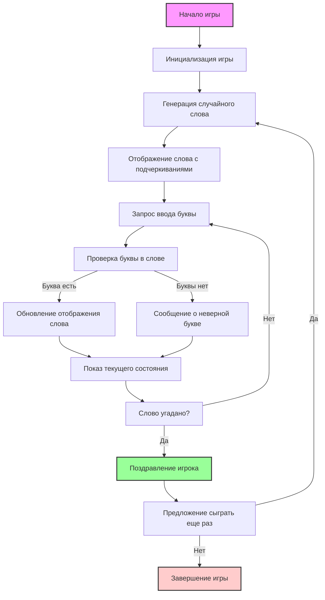

## АНАЛИЗ КОДА:

### 1. <алгоритм>

**Блок-схема игры "Hl_Q" (Угадай слово):**

```mermaid
graph LR
    A[Начало игры] --> B{Приветствие игрока и объяснение правил};
    B --> C[Выбор случайного слова из списка];
    C --> D[Отображение слова в виде подчеркиваний];
    D --> E{Цикл: пока слово не угадано};
    E --> F[Запрос ввода буквы от игрока];
    F --> G{Проверка: буква есть в слове?};
    G -- Да --> H[Обновление слова: открытие позиций буквы];
    H --> I[Отображение текущего состояния слова];
    I --> E;
    G -- Нет --> J[Сообщение об ошибке: буква неверна];
     J --> I;
     E -- Слово угадано --> K[Сообщение о победе];
    K --> L{Сыграть еще раз? (да/нет)};
    L -- Да --> C;
    L -- Нет --> M[Завершение игры];

    style A fill:#f9f,stroke:#333,stroke-width:2px
    style K fill:#9f9,stroke:#333,stroke-width:2px
    style M fill:#fcc,stroke:#333,stroke-width:2px
```

**Примеры:**

1.  **Инициализация:**
    *   Программа приветствует игрока: `"Добро пожаловать в игру Hl_Q!..."`
    *   Слово выбирается случайно: например, `"питон"`.
    *   Слово отображается как: `"_ _ _ _ _"`.
2.  **Основной процесс:**
    *   Игрок вводит букву: `"п"`.
    *   Программа обновляет состояние: `"п _ _ _ _"`.
    *   Игрок вводит букву: `"и"`.
    *   Программа обновляет состояние: `"п и _ _ _"`.
    *   Игрок вводит букву: `"а"`.
    *   Программа сообщает, что `"а"` неверная, и отображает: `"п и _ _ _"`.
    *   Игра продолжается, пока слово не будет угадано: `"питон"`.
3.  **Победа:**
    *   Когда игрок вводит `"н"`:
    *   Программа сообщает: `"Поздравляем! Вы угадали слово!"`.
    *   Предлагает сыграть снова: `"Хотите сыграть снова? (да/нет)"`.
4.  **Завершение игры:**
    *   Игрок выбирает `"нет"`.
    *   Программа завершает работу: `"Спасибо за игру!"`.

### 2. <mermaid>



**Объяснение зависимостей в диаграмме:**

*   **Start**: Начальная точка программы.
*   **Initialize**: Начальная настройка игры, включая приветствие.
*   **GenerateWord**: Выбор случайного слова из списка.
*   **DisplayHiddenWord**: Отображение слова с подчеркиваниями, например `"_ _ _ _ _"`.
*   **InputLetter**: Запрос ввода буквы от игрока.
*   **CheckLetter**: Проверка введенной буквы на наличие в загаданном слове.
*   **UpdateWord**: Обновление отображения слова с открытием угаданных букв.
*   **DisplayCurrentState**: Вывод текущего состояния слова на экран.
*   **IsWordGuessed**: Проверка, угадано ли слово полностью.
*   **LetterIncorrect**: Сообщение игроку, что буква отсутствует в слове.
*   **Congratulate**: Поздравление игрока с победой.
*   **PlayAgain**: Предложение игроку сыграть еще раз.
*   **End**: Завершение игры.

### 3. <объяснение>

**Объяснения:**

*   **Импорты:**
    *   В предоставленном коде не указаны импорты, но согласно описанию реализации, игра требует модуля `random` для выбора случайного слова.
    ```python
    import random
    ```
        Этот модуль используется для генерации случайных чисел и выбора случайного слова из списка.

*   **Классы:**
    *   В предоставленном описании игры нет классов.
    *   Однако для улучшения структуры кода, можно было бы создать класс `Game`, который бы инкапсулировал всю логику игры.
        
        ```python
        class Game:
           def __init__(self, word_list):
              self.word_list = word_list
              self.secret_word = None
              self.guessed_word = None
              self.attempts = 0

           def start_new_game(self):
               self.secret_word = random.choice(self.word_list)
               self.guessed_word = ["_" for _ in self.secret_word]

           def display_word(self):
               return " ".join(self.guessed_word)

           def make_guess(self, letter):
                if letter in self.secret_word:
                     for index, char in enumerate(self.secret_word):
                         if char == letter:
                            self.guessed_word[index] = letter
                     return True
                else:
                   return False

           def is_game_won(self):
              return "_" not in self.guessed_word
        ```
*   **Функции:**
    *   В описании игры функции не выделены явно, но можно выделить следующие функции для ее реализации:
        1.  **`start_game()`**: Запускает игру, выбирает случайное слово, приветствует игрока, и отображает начальное состояние слова.
        2.  **`get_player_input()`**: Запрашивает ввод буквы от игрока, обрабатывает некорректный ввод (не букву) и возвращает введенную букву.
        3.  **`check_letter(letter, secret_word)`**: Проверяет, есть ли введенная буква в загаданном слове.
        4.  **`update_guessed_word(letter, secret_word, guessed_word)`**: Обновляет состояние слова, показывая угаданные буквы.
        5.  **`display_game_state(guessed_word)`**: Выводит текущее состояние слова (с открытыми буквами и подчеркиваниями).
        6.  **`check_game_win(guessed_word, secret_word)`**: Проверяет, угадано ли слово полностью.
        7.  **`play_again()`**: Предлагает сыграть еще раз и обрабатывает выбор игрока.

    **Пример функции:**

   ```python
    def get_player_input():
        while True:
            letter = input("Введите вашу букву: ").lower()
            if letter.isalpha() and len(letter) == 1:
              return letter
            else:
              print("Некорректный ввод. Пожалуйста, введите одну букву.")
   ```
     *  **Аргументы:** Функция не принимает аргументов.
     *  **Возвращаемое значение:** Возвращает введенную букву (в нижнем регистре) как `str`.
     *  **Назначение:**  Запрашивает ввод буквы у пользователя, проверяя, является ли ввод буквой и его длину. Если ввод некорректен, запрашивает его снова.

*   **Переменные:**
    *   **`secret_word`**: Строка, хранящая загаданное слово.
    *   **`word_list`**: Список строк, содержащий набор слов для выбора.
    *   **`guessed_word`**: Список строк, отображающий текущее состояние слова, с угаданными буквами и подчеркиваниями.
    *   **`letter`**: Строка, хранящая букву, введенную игроком.
    *   **`play_again_choice`**: Строка, хранящая выбор игрока (да/нет) о повторении игры.

*   **Потенциальные ошибки и улучшения:**
    *   **Обработка некорректного ввода:** Реализация должна обрабатывать некорректный ввод не только при вводе буквы, но и при выборе повтора игры.
    *   **Подсчёт попыток:** Необходимо добавить подсчет попыток и возможность ограничить их количество.
    *   **Уровень сложности:** Реализовать выбор уровня сложности на основе длины слова.
    *   **Хранение слов:** Можно вынести список слов в отдельный файл.
    *   **Интерфейс пользователя:** Улучшить интерфейс пользователя, например, выводить угаданные буквы другим цветом.
    *   **Классическая структура:** Можно создать класс `Game` со всеми его атрибутами и методами. Это структурирует код и сделает его более модульным и расширяемым.

**Взаимосвязь с другими частями проекта:**

*   Если бы код был частью более крупного проекта, список слов можно было бы подгружать из внешнего файла (например, JSON), или передавать как параметр из конфигурационного файла. Это обеспечило бы гибкость и возможность добавления новых слов без изменения кода.
*  Логику игры можно вынести в отдельный модуль, чтобы сделать код более модульным и читаемым.

Данный анализ обеспечивает всестороннее понимание кода и его реализации.