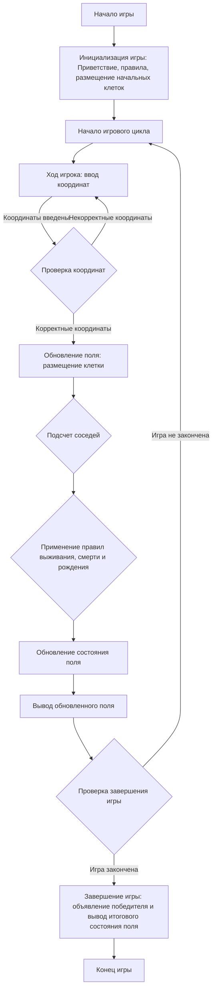

## АНАЛИЗ КОДА:

### <алгоритм>

**Общее описание:**

Игра LIFE-2 - это двухпользовательская версия игры "Жизнь" на поле 5x5. Игроки по очереди размещают свои клетки (`*` для первого, `#` для второго), и после каждого хода поле обновляется согласно правилам выживания, смерти и рождения. Игра продолжается до тех пор, пока у одного из игроков не останется живых клеток.

**Пошаговая блок-схема:**

1.  **Инициализация игры:**
    *   Вывод приветствия и правил.
    *   Игроки размещают по 3 начальных клетки, вводя координаты.
        *   Пример ввода для игрока 1: (1,2), (2,3), (3,3).
        *   Пример ввода для игрока 2: (2,2), (3,2), (4,4).
    *   Если оба игрока пытаются занять одну клетку, она остаётся пустой.

2.  **Основной игровой цикл:**
    *   **Ход игрока:**
        *   Игрок вводит координаты для добавления одной клетки.
            *   Пример ввода: (4,3).
        *   Проверка корректности ввода:
            *   Если координаты выходят за пределы поля или клетка занята, вывод сообщения об ошибке и повторный запрос ввода.
    *   **Обновление поля:**
        *   Для каждой клетки на поле:
            *   Подсчет количества живых соседей (оба типа клеток).
            *   Применение правил:
                *   Если у клетки 2 или 3 соседа - она остаётся живой.
                *   Если у клетки < 2 или > 3 соседа - она умирает.
                *   Если пустая ячейка имеет ровно 3 соседа, то в ней появляется новая клетка.
                    *   Если большинство соседей - клетки игрока 1, то создается `*`.
                    *   Если большинство соседей - клетки игрока 2, то создается `#`.
        *   Вывод обновленного поля на экран.
    *   Повторение хода игрока для следующего игрока.

3.  **Завершение игры:**
    *   Проверка количества живых клеток каждого игрока.
    *   Если у одного из игроков не осталось живых клеток - игра завершается.
    *   Вывод финального состояния поля и объявление победителя.

**Поток данных:**

*   Ввод пользователя (координаты) -> Обработка ввода -> Размещение клетки на поле -> Обновление поля -> Вывод поля на экран -> Проверка условия окончания игры.
*   Данные о поле (массив) -> Функция обновления -> Обновленное состояние поля.

### <mermaid>

**Объяснение:**
*   **`Start`**: Начальная точка игры.
*   **`Initialize`**: Инициализирует игру, выводит приветствие и правила, а также позволяет игрокам разместить начальные клетки.
*   **`GameLoopStart`**: Начало игрового цикла, который повторяется до конца игры.
*   **`PlayerTurn`**: Запрашивает у игрока координаты для размещения новой клетки.
*   **`ValidateCoordinates`**: Проверяет, что введенные координаты корректны и не выходят за границы игрового поля.
*   **`UpdateBoard`**: Обновляет поле с учетом ввода игрока.
*   **`CalculateNeighbors`**: Подсчитывает количество живых соседей для каждой клетки.
*  **`ApplyRules`**: Применяет правила игры для определения, какие клетки остаются живыми, умирают или рождаются.
*   **`UpdateBoardState`**: Обновляет состояние поля на основе правил игры.
*  **`DisplayBoard`**: Отображает обновленное состояние игрового поля.
*   **`CheckGameEnd`**: Проверяет, не закончилась ли игра, то есть, остались ли клетки у обоих игроков.
*   **`EndGame`**: Завершает игру, объявляет победителя и выводит итоговое состояние игрового поля.
*   **`Stop`**: Конечная точка игры.

### <объяснение>

**Импорты:**
В предоставленном описании кода нет явных импортов. Игра использует массивы или списки, циклы и условия для своей реализации, которые являются встроенными возможностями языка Python.

**Классы:**
В коде нет явного определения классов. Вся игровая логика реализована на уровне функций и переменных.

**Функции:**
*   Функция **`init_game()`** - для инициализации игры, вывод приветствия и правил, а так же ввод начальных клеток для обоих игроков.
    *   Аргументы: Нет.
    *   Возвращаемое значение: Начальное состояние поля.
*   Функция **`player_turn(board, player)`** - для обработки хода игрока, ввод координат для новой клетки, проверка корректности ввода и обновление поля.
    *   Аргументы: `board` - текущее состояние поля, `player` - номер текущего игрока (1 или 2).
    *   Возвращаемое значение: Обновленное состояние поля.
*   Функция **`update_board(board)`** - для обновления состояния поля после хода игрока.
    *   Аргументы: `board` - текущее состояние поля.
    *   Возвращаемое значение: Обновленное состояние поля.
*   Функция **`check_game_end(board)`** - для проверки условия завершения игры (если у одного из игроков не осталось живых клеток).
    *   Аргументы: `board` - текущее состояние поля.
    *   Возвращаемое значение: `True` если игра окончена, `False` если нет.
*   Функция **`display_board(board)`** - для вывода текущего состояния игрового поля на экран.
    *   Аргументы: `board` - текущее состояние поля.
    *   Возвращаемое значение: None (выводит поле в консоль)

**Переменные:**

*   `board` (список списков): Представляет игровое поле.  
    *   Тип: Список списков (массив 2D).
    *   Использование: Хранит текущее состояние поля, где:
        *   `*` - живая клетка первого игрока
        *   `#` - живая клетка второго игрока
        *   `.` - пустая ячейка
*   `player` (целое число): Представляет текущего игрока.
    *   Тип: `int`
    *   Использование: Переменная для управления ходами игроков.
*   `row`, `col` (целые числа): Представляют координаты (строку и столбец).
    *   Тип: `int`
    *   Использование: Переменные для хранения координат клетки, введенных пользователем.
* `neighbors_count` (целое число): Представляет количество соседей клетки.
    * Тип: `int`
    * Использование: Переменная для подсчета количества живых соседей для проверки правил выживания.

**Потенциальные ошибки и области для улучшения:**

1.  **Обработка ошибок ввода:**  
    *   В текущей реализации не обрабатываются некорректные вводы, кроме координат за пределами поля или уже занятых клеток. Например, ввод не чисел.
2.  **Рефакторинг:**  
    *   Разделить логику подсчета соседей и применения правил в отдельные функции для улучшения читаемости кода.
3.  **Улучшение логики обновления поля:**  
    *   Использовать генераторы списков и функции высшего порядка для более элегантного и эффективного обновления поля.
4.  **Игровой движок:**  
    *   Создать базовую модель для игры (Game class) и методы для хода игрока и обновления состояния игры.
5.  **GUI:**  
    *   Реализовать графический интерфейс для более наглядного отображения игрового процесса.

**Взаимосвязь с другими частями проекта:**
В данном описании кода не указаны связи с другими частями проекта. Однако игра может быть интегрирована в более крупную систему, где `board`, `player` и другие игровые переменные могут быть частью общей модели игры.

**Дополнительно:**
*   Реализация `LIFE-2` может быть использована как основа для добавления новых функций, таких как изменение размеров игрового поля, различные правила жизни, или добавления ИИ противника.
*   `LIFE-2` может быть использована для тестирования алгоритмов и изучения основ разработки игр.