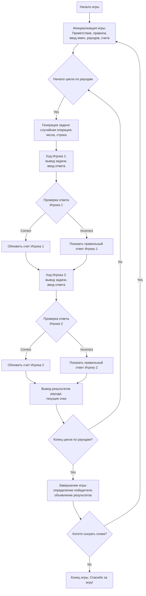

## <алгоритм>

### Пошаговая блок-схема игры MATHDI

1. **Инициализация игры:**
   - Начало игры.
   - Вывод приветственного сообщения и правил.
   - Запрос имен игроков.
     ```
     Пример:
     Приветствие: "Добро пожаловать в MATHDI!"
     Правила: "Два игрока решают математические задачи..."
     Имя Игрока 1: "Анна"
     Имя Игрока 2: "Иван"
     ```
   - Запрос количества раундов.
     ```
     Пример:
      Количество раундов: 3
     ```
   - Сохранение имен игроков и количества раундов в переменных: `player1_name`, `player2_name`, `num_rounds`.
   - Инициализация счета игроков: `player1_score` = 0, `player2_score` = 0.

2. **Основной игровой процесс (цикл по раундам):**
   - Начало цикла для каждого раунда (`current_round` от 1 до `num_rounds`).
     ```
     Пример:
       Для current_round = 1 до 3.
     ```
   - **Генерация задачи:**
     - Выбор случайной операции (сложение, вычитание, умножение, деление).
     - Генерация двух случайных чисел для выбранной операции.
       ```
       Пример:
       Операция: Сложение
       Числа: 15, 27
       Задача: "15 + 27 = ?"
       ```
     - Формирование строковой задачи: `math_task`.
   - **Ход игрока 1:**
     - Вывод задачи для игрока 1.
     - Запрос ответа от игрока 1: `player1_answer`.
     - Проверка правильности ответа.
        ```
        Пример:
        Задача: "15 + 27 = ?"
        Ответ игрока 1: 42
        Проверка: 15 + 27 == 42
        ```
       - Если ответ правильный:
          - Начисление 10 баллов игроку 1: `player1_score` += 10.
          - Вывод сообщения "Правильно! Вы заработали 10 баллов".
       - Если ответ не правильный:
          - Вывод сообщения "Неправильно. Правильный ответ: {correct_answer}".
   - **Ход игрока 2:**
     - Повторение шагов генерации задачи и проверки ответа для игрока 2, используя отдельную `math_task`.
   - **Вывод результатов раунда:**
     - Вывод текущих очков игроков:
       ```
       Пример:
       Результаты после раунда 1:
       Анна: 10 баллов
       Иван: 10 баллов
       ```
  
3.  **Завершение игры:**
    - После завершения всех раундов.
    - Сравнение очков игроков:
        ```
        Пример:
        player1_score = 20
        player2_score = 30
        ```
     - Если `player1_score` > `player2_score`:
       - Объявление победителя: "Победитель: {player1_name}! Поздравляем!".
     - Иначе если `player2_score` > `player1_score`:
       - Объявление победителя: "Победитель: {player2_name}! Поздравляем!".
     - Иначе:
       - Объявление ничьей: "Игра окончена! Это ничья!".
    - Предложение сыграть снова или завершить игру: "Хотите сыграть снова? (да/нет)".
    - Если игрок выбирает "нет":
      - Вывод сообщения: "Спасибо за игру!".
    - Конец игры.

## <mermaid>



**Объяснение зависимостей:**

В данном `mermaid` коде нет импортов, поскольку это описание логики игры, а не программного кода. Однако, если бы код игры зависел от каких-либо библиотек (например, `random` для генерации случайных чисел), эти зависимости не отображались бы в диаграмме `mermaid`, но были бы описаны в секции **<объяснение>**.

## <объяснение>

### Общее описание
Представленный текст описывает логику и правила игры **MATHDI** — математической дуэли для двух игроков. Этот текст не является кодом, а представляет собой подробное описание алгоритма и шагов для создания такой игры на языке программирования, например, Python.

### Разделы и их интерпретация:
-   **Название игры:** Указывает название игры "MATHDI".
-   **Описание:** Кратко описывает суть игры: соревнование на скорость и точность математических вычислений между двумя игроками.
-   **Пошаговая инструкция для реализации:**
    -   **Инициализация игры:**
        -   Выводит приветствие и объяснение правил игры.
        -   Запрашивает имена игроков.
        -   Запрашивает количество раундов.
    -   **Основной процесс игры:**
        -   **Генерация задач:** Генерирует случайные математические примеры (сложение, вычитание, умножение, деление).
        -   **Ход игрока:** Поочередно игроки вводят ответы, которые программа проверяет, начисляя баллы за правильные ответы.
        -   **Очки и подсчёт:** Выводит текущие результаты после каждого раунда.
    -   **Завершение игры:**
        -   Объявляет победителя или ничью.
        -   Предлагает сыграть снова.
-   **Пример работы программы:**
    -   Демонстрирует, как может выглядеть взаимодействие пользователя с программой на разных этапах игры.
-   **Возможные ограничения:**
    -   Указывает на необходимость корректной обработки ввода и деления на ноль.
-   **Реализация:**
    -   Предлагает использовать Python и модуль `random`.
-   **Рекомендуемые улучшения:**
    -   Предлагает идеи для усовершенствования игры (таймер, таблица рекордов, уровни сложности, одиночный режим).

### Компоненты (хотя это не код):
-   **Функции:** Хотя конкретный код не представлен, предполагается использование функций для:
    -   Генерации математических задач.
    -   Проверки ответов.
    -   Подсчета очков.
    -   Вывода сообщений.
-   **Переменные:** Предполагается использование переменных для хранения:
    -   Имен игроков (`player1_name`, `player2_name`).
    -   Количества раундов (`num_rounds`).
    -   Счета игроков (`player1_score`, `player2_score`).
    -   Сгенерированных чисел и операций для задач.
    -   Ответов игроков.
    -   Правильных ответов.

### Цепочка взаимосвязей с другими частями проекта:

В контексте данного описания, нет непосредственной связи с другими частями проекта. Это высокоуровневое описание логики игры. Если бы этот текст был частью более крупного проекта, то он бы, вероятно, был бы связан с:
-   **Интерфейсом пользователя:** Для отображения сообщений и получения ввода от игроков.
-   **Логикой игры:** Включая генерацию задач и проверку ответов.
-   **Хранилищем данных (опционально):** Для сохранения рекордов.

### Потенциальные ошибки и области для улучшения:
-   **Обработка ввода:** Необходимо предусмотреть проверку корректности ввода (например, ввод только чисел при ответе на задачу).
-   **Деление на ноль:** Программа должна избегать генерации задач с делением на ноль.
-   **Сложность задач:** Можно ввести уровни сложности, увеличивая сложность математических примеров с каждым раундом или по мере прогресса игрока.
-   **Таймер:** Добавление таймера могло бы повысить динамичность игры.
-   **Интерфейс:** Описание не касается интерфейса. Можно добавить графический интерфейс для удобства.
-   **Одиночный режим:** Реализация игры против компьютера может быть интересной добавкой.
-   **Таблица рекордов:** Сохранение и отображение лучших результатов повысит мотивацию игроков.

В целом, предоставленный текст — это четкая инструкция для разработки математической игры. Он легко переводится в код на Python или другом языке программирования.