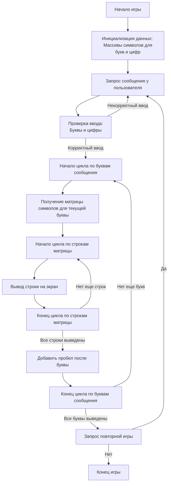

## ИНСТРУКЦИЯ:

Анализируй предоставленный код подробно и объясни его функциональность. Ответ должен включать три раздела:

1. **<алгоритм>**: Опиши рабочий процесс в виде пошаговой блок-схемы, включая примеры для каждого логического блока, и проиллюстрируй поток данных между функциями, классами или методами.
2. **<mermaid>**: Напиши код для диаграммы в формате `mermaid`, проанализируй и объясни все зависимости,
    которые импортируются при создании диаграммы.
    **ВАЖНО!** Убедитесь, что все имена переменных, используемые в диаграмме `mermaid`,
    имеют осмысленные и описательные имена. Имена переменных вроде `A`, `B`, `C`, и т.д., не допускаются!

    **Дополнительно**: Если в коде есть импорт `import header`, добавьте блок `mermaid` flowchart, объясняющий `header.py`:
    ```mermaid
    flowchart TD
        Start --> Header[<code>header.py</code><br> Determine Project Root]

        Header --> import[Import Global Settings: <br><code>from src import gs</code>]
    ```

3. **<объяснение>**: Предоставьте подробные объяснения:
   - **Импорты**: Их назначение и взаимосвязь с другими пакетами `src.`.
   - **Классы**: Их роль, атрибуты, методы и взаимодействие с другими компонентами проекта.
   - **Функции**: Их аргументы, возвращаемые значения, назначение и примеры.
   - **Переменные**: Их типы и использование.
   - Выделите потенциальные ошибки или области для улучшения.

Дополнительно, постройте цепочку взаимосвязей с другими частями проекта (если применимо).

Это обеспечивает всесторонний и структурированный анализ кода.
## Формат ответа: `.md` (markdown)
**КОНЕЦ ИНСТРУКЦИИ**

## <алгоритм>

1. **Инициализация игры:**
    - Создаются массивы (или словари) символов для каждой буквы алфавита (A-Z) и цифр (0-9). Каждый символ представляется в виде матрицы символов, например, 5x5.
    - *Пример:* Для буквы 'A' может быть массив `[[' ', '*', ' ',], ['*', ' ', '*'], ['*', '*', '*']]`.

2. **Основной цикл игры:**
   - Запрашивается у игрока сообщение для преобразования в баннер.
      - *Пример:* Пользователь вводит "HELLO".
   - Проверяется корректность ввода. Ввод должен содержать только буквы и цифры, без пробелов и специальных символов.
      - *Пример:* Ввод "HELLO" - корректный. Ввод "H ELLO!" - некорректный. Если некорректный - запрос повторного ввода.
   - Цикл по каждой букве в сообщении:
      - Найти матрицу символов, соответствующую текущей букве.
        - *Пример:* Для буквы 'H' находится матрица из заранее определенного набора.
      - Цикл по каждой строке в матрице символов:
         - Вывод строки на экран.
        - *Пример:* Вывод первой строки матрицы буквы 'H'.
      - После вывода всех строк буквы добавить пробел.
      - После вывода всех букв, завершение цикла.
   - Вывод сообщения с вопросом о повторной игре.
      - *Пример:* "Хотите создать еще один баннер? (да/нет)".
   - При согласии - повторение цикла.
   - При отказе - завершение программы.
      - *Пример:* "Спасибо за игру!".
  
## <mermaid>


## <объяснение>

**Описание игры "Banner"**
Игра "Banner" представляет собой программу, которая принимает на вход строку от пользователя и отображает её в виде большого баннера, где каждая буква или цифра представляется в виде матрицы символов. 

**Разбор шагов алгоритма:**

1. **Инициализация игры:**
   - На данном этапе происходит создание и инициализация структур данных, которые будут использоваться для представления символов баннера. Обычно это будут массивы (или словари), где каждой букве или цифре будет соответствовать матрица (многомерный массив) из символов. 
   - Эти матрицы определяют, как будет выглядеть каждый символ в "баннерном" формате.
   
2. **Основной цикл игры:**
   - В этом цикле происходит основное взаимодействие с пользователем и формирование баннера.
   - Пользователю предлагается ввести сообщение.
   - Ввод пользователя проверяется на наличие только букв и цифр. Если ввод некорректен, запрашивается повторный ввод.
   - Для каждой буквы (или цифры) из ввода происходит следующее:
      - Выбирается соответствующая матрица символов.
      - Строки этой матрицы последовательно выводятся на экран, формируя вертикальную полосу из символов, представляющих одну букву.
      - После вывода символов одной буквы добавляется пробел, обеспечивая визуальное разделение между буквами.
   - После обработки всех символов, программа запрашивает, хочет ли пользователь создать еще один баннер.

3. **Управление потоком данных:**
   - Инициализация подготавливает данные для дальнейшей работы.
   - Основной цикл управляет потоком данных, определяя, когда запрашивать ввод, проверять его, и выводить баннер.
   - Проверка ввода гарантирует, что обрабатываются только допустимые символы.
   - Циклы используются для последовательной обработки каждой буквы и строки в матрице символов.
   - Повторный запуск осуществляется при согласии пользователя.

4. **Переменные:**
    - Матрицы символов: массивы или словари, представляющие отображение символов для каждой буквы и цифры.
    - Ввод пользователя: строка, введенная пользователем.
    - Индексы циклов: переменные, используемые для итерации по буквам ввода и строкам матрицы.
    - Флаг продолжения игры: логическая переменная, определяющая, будет ли игра продолжаться или нет.

**Возможные улучшения и ошибки:**
- **Обработка регистра:** Программа может быть улучшена для обработки букв в разных регистрах (верхний и нижний).
- **Более широкий набор символов:** Можно расширить набор поддерживаемых символов, включая специальные символы, знаки препинания и другие.
- **Ошибки ввода:** Добавить более подробные сообщения об ошибках ввода для лучшего взаимодействия с пользователем.
- **Настраиваемый вид:** Позволить пользователю настраивать символ для построения баннера (например, `*`, `#`, `@`).
- **Проверка границ массива:** Убедиться, что все индексы массивов находятся в пределах допустимых значений.
- **Динамическое создание баннера:** Код может быть переписан для динамического создания матрицы баннера, а не просто последовательного вывода строк. Это даст возможность масштабирования.