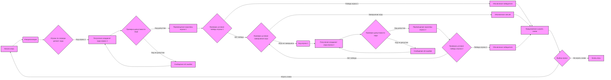
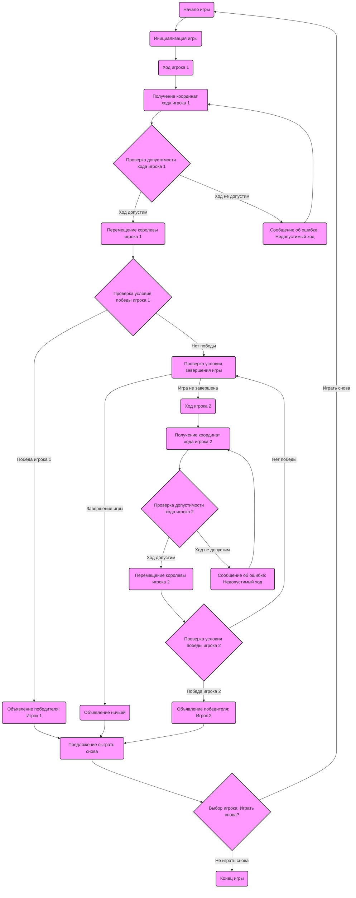

## Анализ кода игры "QUEEN"

### <алгоритм>

**Блок-схема игрового процесса:**

**Примеры:**

*   **Инициализация:** Создается доска 8x8, королева Игрока 1 размещается на A1, королева Игрока 2 на H8.
*   **Ход игрока 1:** Игрок вводит "B2". Программа проверяет, что клетка B2 свободна, не выходит за границы доски и является допустимым ходом для королевы.
*   **Проверка допустимости хода:** При вводе "A9" программа должна вернуть ошибку, т.к. эта клетка находится за пределами доски. При вводе "H8" программа должна также вернуть ошибку, т.к. эта клетка занята.
*   **Проверка условия победы:** Если королева Игрока 2 находится в клетке A1, A8, H1 или H8, то игрок 1 объявляется победителем.
*   **Проверка условия завершения игры:** Если максимальное количество ходов достигнуто (например, 20), то игра завершается ничьей.
*   **Предложение сыграть снова:** После окончания игры программа предлагает пользователю сыграть снова. Если пользователь выбирает "да", игра начинается заново, если "нет", то игра завершается.

**Поток данных:**

1.  **Инициализация:** Начальные данные, такие как размер доски и начальные позиции королев, передаются в игру.
2.  **Ход игрока:** Координаты хода передаются в функцию проверки допустимости хода.
3.  **Проверка допустимости хода:** Функция получает координаты и текущее положение королев и возвращает `True` или `False`.
4.  **Перемещение королевы:** Если ход допустим, то обновляется позиция соответствующей королевы на доске.
5.  **Проверка условий победы/завершения игры:** Функция получает текущее положение королев и возвращает победителя (или ничью) или `None`, если игра продолжается.

### <mermaid>

**Анализ зависимостей:**

Диаграмма `mermaid` описывает логику игры в "QUEEN". Нет импортов внешних библиотек. Диаграмма описывает последовательность действий в игре:

1.  `Start`: Начало игры.
2.  `Initialize`: Инициализация игрового поля и начальной расстановки фигур.
3.  `Player1Turn`: Ход первого игрока.
4.  `Player1Input`: Получение координат хода от первого игрока.
5. `ValidateMove1`: Проверка, является ли ход первого игрока допустимым.
6. `MoveQueen1`: Перемещение королевы первого игрока, если ход допустим.
7. `CheckWin1`: Проверка, победил ли первый игрок.
8. `Player1Wins`: Объявление победы первого игрока.
9. `CheckEndCondition`: Проверка условий завершения игры.
10.  `InvalidMove1`: Сообщение об ошибке, если ход первого игрока был недопустимым.
11. `Player2Turn`: Ход второго игрока.
12. `Player2Input`: Получение координат хода от второго игрока.
13. `ValidateMove2`: Проверка, является ли ход второго игрока допустимым.
14. `MoveQueen2`: Перемещение королевы второго игрока, если ход допустим.
15. `CheckWin2`: Проверка, победил ли второй игрок.
16. `Player2Wins`: Объявление победы второго игрока.
17. `InvalidMove2`: Сообщение об ошибке, если ход второго игрока был недопустимым.
18.  `Draw`: Объявление ничьи, если достигнуто максимальное количество ходов.
19. `PlayAgain`: Предложение сыграть снова.
20. `Choice`: Получение ответа от игрока, хочет ли он сыграть еще раз.
21. `End`: Завершение игры.

Взаимосвязи представляют собой последовательные шаги игры.

### <объяснение>

**Импорты:**

В представленном описании кода нет импортов, так как это не код на Python, а описание игры. В реальной реализации на Python могут быть использованы следующие импорты:

*   `array` или `list`: для представления доски.
*   `random`: для случайного выбора хода компьютера (в случае игры против компьютера).

**Классы:**

*   `Game`: Класс, который будет представлять игру "QUEEN". Он должен содержать:
    *   Атрибуты:
        *   `board`: Доска (массив или список) для хранения текущей позиции королев.
        *   `player1_queen_pos`: Позиция королевы первого игрока.
        *   `player2_queen_pos`: Позиция королевы второго игрока.
        *   `current_player`: Текущий игрок.
        *   `max_moves`: Максимальное количество ходов.
        *   `moves_counter`: Счетчик текущих ходов.
    *   Методы:
        *   `initialize_game()`: Инициализация начальных параметров игры.
        *   `is_valid_move(player, move)`: Проверка допустимости хода.
        *   `make_move(player, move)`: Обновление позиции королевы на доске.
        *   `check_win_condition(player)`: Проверка условия победы.
        *   `check_end_game()`: Проверка окончания игры (ничья).
        *   `play_game()`: Запуск игрового процесса.

**Функции:**

*   `is_valid_move(board, player_queen_pos, move)`:
    *   Аргументы: `board` (доска), `player_queen_pos` (позиция королевы игрока), `move` (координаты следующей клетки).
    *   Возвращаемое значение: `True`, если ход допустим, `False` — если нет.
    *   Назначение: Проверка того, что ход является допустимым (королева может двигаться по горизонтали, вертикали, диагонали, не выходит за границы доски и не занята другой королевой).
    *   Пример:
        *   `is_valid_move(board, "A1", "B2")` может вернуть `True`.
        *   `is_valid_move(board, "A1", "A9")` вернет `False` (выход за пределы доски).
        *   `is_valid_move(board, "A1", "H8")` вернет `False` (занято королевой соперника).
*   `check_win_condition(board, player_queen_pos)`:
    *   Аргументы: `board` (доска), `player_queen_pos` (позиция королевы).
    *   Возвращаемое значение: `True`, если королева соперника находится в углу, `False` — если нет.
    *   Назначение: Проверка, выиграл ли игрок, загнал ли он королеву соперника в угол.
    *   Пример:
        *   `check_win_condition(board, "A1")` вернет `True`, если королева соперника находится в углу H8, A8, H1.
*   `make_move(board, player_queen_pos, move)`:
    *   Аргументы: `board` (доска), `player_queen_pos` (текущая позиция королевы), `move` (новая позиция).
    *   Возвращаемое значение: Новая доска с обновленной позицией королевы.
    *   Назначение: Обновляет позицию королевы на доске.
*   `check_end_game(moves_counter, max_moves)`:
    *   Аргументы: `moves_counter` (количество ходов), `max_moves` (максимальное количество ходов).
    *   Возвращаемое значение: `True`, если достигнуто максимальное количество ходов, `False` — если нет.
    *   Назначение: Проверка, достигнуто ли максимальное количество ходов, что означает ничью.
    *   Пример:
        *   `check_end_game(20, 20)` вернет `True`.

**Переменные:**

*   `board`: Массив или список, представляющий шахматную доску.
*   `player1_queen_pos`: Строка, представляющая позицию королевы первого игрока, например, "A1".
*   `player2_queen_pos`: Строка, представляющая позицию королевы второго игрока, например, "H8".
*   `current_player`: Переменная, хранящая текущего игрока (например, 1 или 2).
*   `max_moves`: Целое число, представляющее максимальное количество ходов.
*   `moves_counter`: Целое число, представляющее количество сделанных ходов.

**Потенциальные ошибки и улучшения:**

*   **Ошибки ввода:** Недостаточная проверка формата ввода координат игрока (например, неверный формат, буквы не в верхнем регистре).
*   **Обработка некорректных ходов:** Можно добавить более подробные сообщения об ошибках в зависимости от причины некорректного хода (например, "клетка занята", "выход за пределы доски").
*   **Улучшения:**
    *   Реализация игры с компьютером (искусственный интеллект).
    *   Графический интерфейс для визуализации доски.
    *   Возможность выбора размера доски.
    *   Более сложные правила перемещения фигур (например, как в шахматах).
    *   Разделение логики игры и пользовательского интерфейса.
    *   Добавить возможность отмены хода.

**Взаимосвязь с другими частями проекта:**

*   Данная игра может быть включена в более крупный проект, например, в коллекцию настольных игр, и взаимодействовать с другими частями проекта через общий интерфейс.
*   Может использовать общие классы для ввода и вывода данных, а также для работы с пользовательским интерфейсом.
*   Может использовать класс `Settings` для хранения настроек игры.

Этот анализ обеспечивает всестороннее и структурированное понимание кода игры "QUEEN".