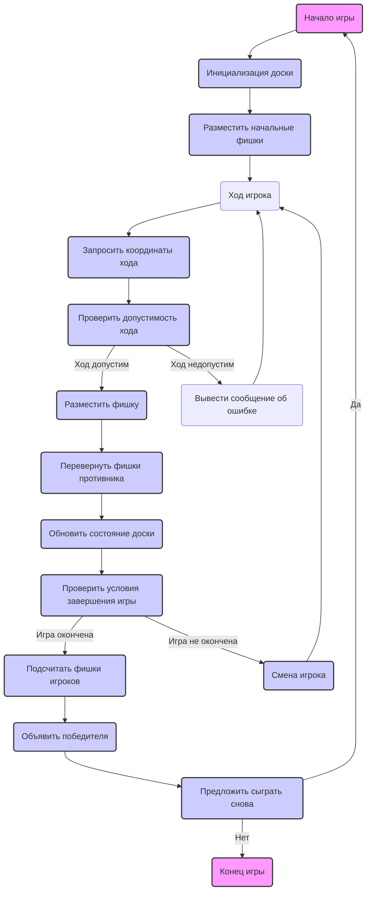

## ИНСТРУКЦИЯ:

Анализируй предоставленный код подробно и объясни его функциональность. Ответ должен включать три раздела:  

1. **<алгоритм>**: Опиши рабочий процесс в виде пошаговой блок-схемы, включая примеры для каждого логического блока, и проиллюстрируй поток данных между функциями, классами или методами.  
2. **<mermaid>**: Напиши код для диаграммы в формате `mermaid`, проанализируй и объясни все зависимости, 
    которые импортируются при создании диаграммы. 
    **ВАЖНО!** Убедитесь, что все имена переменных, используемые в диаграмме `mermaid`, 
    имеют осмысленные и описательные имена. Имена переменных вроде `A`, `B`, `C`, и т.д., не допускаются!  
    
    **Дополнительно**: Если в коде есть импорт `import header`, добавьте блок `mermaid` flowchart, объясняющий `header.py`:\
    ```mermaid
    flowchart TD
        Start --> Header[<code>header.py</code><br> Determine Project Root]
    
        Header --> import[Import Global Settings: <br><code>from src import gs</code>] 
    ```

3. **<объяснение>**: Предоставьте подробные объяснения:  
   - **Импорты**: Их назначение и взаимосвязь с другими пакетами `src.`.  
   - **Классы**: Их роль, атрибуты, методы и взаимодействие с другими компонентами проекта.  
   - **Функции**: Их аргументы, возвращаемые значения, назначение и примеры.  
   - **Переменные**: Их типы и использование.  
   - Выделите потенциальные ошибки или области для улучшения.  

Дополнительно, постройте цепочку взаимосвязей с другими частями проекта (если применимо).  

Это обеспечивает всесторонний и структурированный анализ кода.
## Формат ответа: `.md` (markdown)
**КОНЕЦ ИНСТРУКЦИИ**

## <алгоритм>

1. **Начало игры:**
    - Выводится приветственное сообщение и объяснение правил игры "Реверси".
    - Создается игровая доска 8x8 (представляется массивом или списком).
    - В центре доски размещаются начальные четыре фишки: две черные и две белые, расположенные по диагонали.
    - Игрок 1 (черные) начинает игру.
    
   *Пример:*
   
    ```
    Приветствие: "Добро пожаловать в REVRSE!"
    Правила: ...
    Доска:
     [ ][ ][ ][ ][ ][ ][ ][ ]
     [ ][ ][ ][ ][ ][ ][ ][ ]
     [ ][ ][ ][ ][ ][ ][ ][ ]
     [ ][ ][ ][B][W][ ][ ][ ]
     [ ][ ][ ][W][B][ ][ ][ ]
     [ ][ ][ ][ ][ ][ ][ ][ ]
     [ ][ ][ ][ ][ ][ ][ ][ ]
     [ ][ ][ ][ ][ ][ ][ ][ ]
    Ход: Игрок 1 (черные)
    ```
2. **Ход игрока:**
   - Запрашиваются координаты клетки, куда игрок хочет разместить свою фишку (например, D3).
   - **Проверка хода:**
     - Проверяется, является ли выбранная клетка пустой.
     - Проверяется, является ли ход допустимым: есть ли фишки противника, которые можно захватить, поставив фишку в указанное место.
       *Пример допустимого хода: D3 - фишка между B4 и W4, E3 - фишка между D4 и E2, C4 - фишка между D3 и C5*
     
    - **Если ход допустим:**
      - Размещается фишка игрока на выбранную клетку.
      - Переворачиваются захваченные фишки противника (меняют свой цвет).
      - Обновляется состояние игровой доски.
       *Пример: Ход D3, доска обновляется*
        ```
         [ ][ ][ ][ ][ ][ ][ ][ ]
         [ ][ ][ ][ ][ ][ ][ ][ ]
         [ ][ ][ ][B][W][ ][ ][ ]
         [ ][ ][B][B][B][ ][ ][ ]
         [ ][ ][ ][W][B][ ][ ][ ]
         [ ][ ][ ][ ][ ][ ][ ][ ]
         [ ][ ][ ][ ][ ][ ][ ][ ]
         [ ][ ][ ][ ][ ][ ][ ][ ]
        ```
    - **Если ход недопустим:**
       - Выводится сообщение об ошибке: "Недопустимый ход. Попробуйте снова".
       - Предлагается игроку повторить свой ход.
    
3. **Смена игрока:**
  - После того, как ход игрока обработан (удачно или нет), меняется очередь хода на другого игрока.
  
4. **Проверка условий завершения игры:**
    - Проверяется, заполнена ли доска.
    - Проверяется, может ли сделать ход хотя бы один из игроков.
    - Если доска заполнена или ни один из игроков не может сделать ход, игра заканчивается.

5. **Завершение игры:**
    - Подсчитываются фишки каждого игрока.
    - Объявляется победитель (игрок с наибольшим количеством фишек своего цвета).
      *Пример:*
     ```
     Игра окончена!
     Игрок 1 (Чёрные): 32 фишки
     Игрок 2 (Белые): 30 фишек
     Победил Игрок 1!
     ```

6. **Предложение сыграть снова:**
   - Запрашивается желание игрока сыграть снова (да/нет).
   - Если "да", то игра начинается заново, с пункта 1.
   - Если "нет", игра завершается и выводится сообщение "Спасибо за игру!".
  
 **Поток данных:**
 - **Ввод:** Координаты хода игрока, ответ на вопрос "сыграть снова?".
 - **Обработка:** Проверка хода, размещение фишек, переворачивание фишек, подсчет фишек, определение победителя.
 - **Вывод:** Приветствие, правила игры, текущее состояние доски, сообщения об ошибках, объявление победителя, предложение сыграть снова, прощание.
 
## <mermaid>


**Анализ диаграммы `mermaid`:**

Диаграмма представляет собой блок-схему игрового процесса "Реверси". Каждый прямоугольник представляет этап игры, а стрелки показывают порядок их выполнения.

-   `Start` -  Начало игры.
-   `InitializeBoard` -  Инициализация игровой доски.
-   `PlaceInitialDisks` - Размещение начальных фишек на доске.
-   `PlayerTurn` - Ожидание хода текущего игрока.
-   `GetMove` -  Получение координат, куда игрок хочет поставить фишку.
-   `ValidateMove` - Проверка, допустим ли данный ход.
-   `PlaceDisk` - Размещение фишки на доске.
-   `FlipOpponentDisks` - Переворот фишек противника, которые захвачены текущим ходом.
-  `UpdateBoard` - Обновление доски после хода.
-   `DisplayError` - Вывод сообщения об ошибке, если ход невозможен.
-   `CheckGameEnd` - Проверка, не закончилась ли игра (заполнена ли доска или нет доступных ходов).
-   `SwitchPlayer` - Смена игрока, который будет ходить дальше.
-   `CountDisks` - Подсчет фишек каждого игрока.
-  `AnnounceWinner` - Объявление победителя.
-   `PlayAgain` - Предложение сыграть еще раз.
-   `End` - Конец игры.
 
  
 Все имена узлов имеют осмысленные и описательные имена.

## <объяснение>

**Импорты:**
В представленном описании кода отсутствуют явные импорты, это описание логики, а не конкретный код.

**Классы:**
В описании кода не используются классы, но подразумевается, что для игры понадобится класс `Board` для представления доски и возможно класс `Player` для представления игроков.

**Функции:**

В описании кода явно не определены функции, но подразумевается наличие следующих функций:

1.  `initialize_board()`: Создает и инициализирует игровую доску 8x8 с начальным расположением фишек.
2.  `is_valid_move(board, x, y, player)`: Проверяет, является ли ход с координатами x, y допустимым для данного игрока.
3.  `place_disk(board, x, y, player)`: Размещает фишку игрока на доске в позиции x, y и переворачивает соответствующие фишки противника.
4.  `update_board(board)`: Обновляет и отображает текущее состояние доски.
5.  `check_game_end(board)`: Проверяет, не закончилась ли игра (доска заполнена или нет доступных ходов).
6.  `count_disks(board)`: Подсчитывает количество фишек каждого игрока.
7.  `announce_winner(player1_disks, player2_disks)`: Определяет и объявляет победителя на основе подсчитанных фишек.
8. `get_player_move(player)`: Запрашивает у игрока координаты следующего хода.
9. `play_again()`: Спрашивает, желает ли игрок сыграть еще раз.

**Переменные:**
В описании кода подразумеваются следующие переменные:

-   `board`: Представляет игровую доску (массив или список списков).
-   `x`, `y`: Координаты клетки на доске.
-   `player`: Текущий игрок (1 - черные, 2 - белые).
-   `player1_disks`: Количество фишек первого игрока.
-   `player2_disks`: Количество фишек второго игрока.

**Потенциальные ошибки и области для улучшения:**

1.  **Некорректный ввод координат:**
    -   Нужно валидировать координаты ввода игрока (например, что они соответствуют формату "A1", "B2" и не выходят за границы доски).
2.  **Обработка недопустимых ходов:**
    -   Нужна четкая логика обработки ситуации, когда игрок пытается сделать недопустимый ход.
3.  **Ограничение числа ходов:**
  - Можно добавить ограничение на кол-во ходов и сделать ничью если лимит ходов будет превышен
4. **Отсутствие ИИ:**
   - Рекомендуется добавить возможность игры с компьютером, для этого потребуется разработать алгоритм выбора ходов.
5. **Отсутствие графического интерфейса:**
   - Для лучшей визуализации следует разработать графический интерфейс, вместо вывода текстового представления доски.

**Цепочка взаимосвязей:**

Описание логики игры "Реверси" является автономным и не зависит напрямую от других частей проекта. Но может взаимодействовать с:

-   `src.ai`: Для интеграции ИИ противника
-   `src.gui`: Для реализации графического интерфейса
-   `src.config`: Для загрузки настроек игры, например, размер доски.