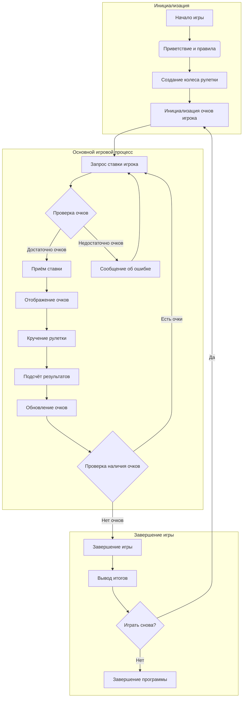

## АНАЛИЗ КОДА: ИГРА "РУЛЕТКА"

### 1. <алгоритм>

**Блок-схема игрового процесса:**

```mermaid
graph TD
    A[Начало игры] --> B(Приветствие и правила);
    B --> C{Инициализация игры};
    C --> D[Установка начальных очков игрока (100)];
    D --> E[Создание колеса рулетки (0-36)];
    E --> F{Основной игровой цикл};
    F --> G[Запрос ставки игрока: тип и сумма];
    G --> H{Проверка достаточности очков};
    H -- Очков достаточно --> I[Приём ставки];
    I --> J[Отображение текущих очков];
     J --> K[Кручение рулетки: случайный выбор числа];
    K --> L[Определение результатов: выигрыш/проигрыш];
    L --> M[Обновление очков игрока];
    M --> N{Проверка наличия очков};
    N -- Очки есть --> F;
     N -- Очков нет --> O[Завершение игры];
      O --> P(Вывод результата);

    H -- Очков недостаточно --> Q[Сообщение об ошибке];
    Q --> G
    P --> R{Играть снова?};
    R -- Да --> C;
    R -- Нет --> S[Завершение программы];
```

**Примеры для блоков:**

*   **B (Приветствие и правила):** Вывод текста "Добро пожаловать в ROULET! ... Удачи!"
*   **D (Установка начальных очков):** `player_points = 100`
*   **E (Создание колеса рулетки):** `roulette_wheel = [i for i in range(37)]`
*   **G (Запрос ставки):** Ввод пользователя: "число 15, 10"
*   **H (Проверка достаточности очков):** `if bet_amount <= player_points:`
*   **I (Приём ставки):** Сообщение "Ставка принята."
*    **J (Отображение текущих очков):** Вывод "У вас 100 очков."
*    **K (Кручение рулетки):** `result = random.choice(roulette_wheel)`
*    **L (Определение результатов):** Вычисление выигрыша или проигрыша на основе ставки и выпавшего числа.
*    **M (Обновление очков):** `player_points += win_amount` или `player_points -= bet_amount`
*    **N (Проверка наличия очков):** `if player_points > 0:`
*    **O (Завершение игры):** Сообщение "Игра окончена! ...", `player_points = 0`
*    **Q (Сообщение об ошибке):** Вывод "У вас недостаточно очков для этой ставки. Попробуйте снова."
*    **R (Играть снова?):** Ввод пользователя: "да" или "нет"
*   **S (Завершение программы):** Вывод "Спасибо за игру!"

### 2. <mermaid>



**Зависимости:**

*   В представленном коде используются условные блоки и циклы.
*   Используется случайное число для имитации колеса рулетки.

### 3. <объяснение>

**Импорты:**

*   В данном фрагменте кода **нет явных импортов**. Однако, в описании указано, что для реализации игры потребуется модуль `random`, который используется для генерации случайных чисел.

**Классы:**

*   В описании кода **классы не используются**.

**Функции:**

*   В данном фрагменте кода **функции явно не выделены**. Однако, подразумевается, что в реализации будет набор функций, например:
    *   `initialize_game()`: Инициализирует игру, устанавливает начальные параметры (очки, колесо).
    *   `get_player_bet()`: Запрашивает ставку игрока.
    *   `spin_roulette()`: Имитирует вращение колеса рулетки, возвращает результат.
    *   `calculate_results()`: Подсчитывает выигрыш/проигрыш.
    *   `update_player_points()`: Обновляет количество очков игрока.
    *   `check_game_end()`: Проверяет, закончилась ли игра.
    *   `play_again()`: Спрашивает игрока, хочет ли он сыграть снова.

**Переменные:**

*   `player_points`: Целое число, представляющее количество очков игрока.
*   `roulette_wheel`: Список (или другая структура данных), представляющий колесо рулетки.
*   `bet_type`: Строка, представляющая тип ставки (число, цвет, группа чисел).
*   `bet_amount`: Целое число, представляющее сумму ставки.
*   `result`: Целое число, представляющее результат вращения колеса рулетки.
*   `win_amount`: Целое число, представляющее выигрыш игрока.

**Потенциальные ошибки и области для улучшения:**

1.  **Обработка ввода пользователя**:
    *   Код должен обрабатывать некорректный ввод от пользователя (например, если пользователь вводит текст вместо числа).
    *   Нужно предусмотреть обработку случая, когда пользователь вводит некорректный тип ставки.
2.  **Разнообразие ставок**:
    *   Нужно добавить возможность выбора других видов ставок, кроме число/цвет/группа, например, дюжины, колонки, и т.д.
3.  **GUI**:
    *   Для лучшей наглядности и удобства можно добавить графический интерфейс (GUI), чтобы визуализировать колесо рулетки и ставки.
4.  **Мультиплеер**:
    *   Реализация многопользовательской игры увеличит сложность, но сделает игру более интересной.
5.  **Разбиение на модули**:
    *   Разделить код на модули или функции для улучшения читаемости и переиспользования.

**Взаимосвязи с другими частями проекта:**

*   Данный фрагмент кода является частью более крупного проекта, поэтому он должен взаимодействовать с другими частями проекта.
    *   Возможно, есть общая система управления играми.
    *   Для хранения данных (например, рекордов игроков) может быть использована база данных.
    *   Для графического интерфейса могут быть использованы библиотеки.

Этот анализ предоставляет полное представление о функциональности, структуре и возможных улучшениях игры "Рулетка".