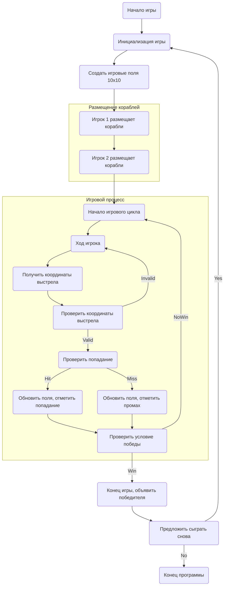

## ИНСТРУКЦИЯ:

Анализируй предоставленный код подробно и объясни его функциональность. Ответ должен включать три раздела:  

1. **<алгоритм>**: Опиши рабочий процесс в виде пошаговой блок-схемы, включая примеры для каждого логического блока, и проиллюстрируй поток данных между функциями, классами или методами.  
2. **<mermaid>**: Напиши код для диаграммы в формате `mermaid`, проанализируй и объясни все зависимости, 
    которые импортируются при создании диаграммы. 
    **ВАЖНО!** Убедитесь, что все имена переменных, используемые в диаграмме `mermaid`, 
    имеют осмысленные и описательные имена. Имена переменных вроде `A`, `B`, `C`, и т.д., не допускаются!  
    
    **Дополнительно**: Если в коде есть импорт `import header`, добавьте блок `mermaid` flowchart, объясняющий `header.py`:\
    ```mermaid
    flowchart TD
        Start --> Header[<code>header.py</code><br> Determine Project Root]
    
        Header --> import[Import Global Settings: <br><code>from src import gs</code>] 
    ```

3. **<объяснение>**: Предоставьте подробные объяснения:  
   - **Импорты**: Их назначение и взаимосвязь с другими пакетами `src.`.  
   - **Классы**: Их роль, атрибуты, методы и взаимодействие с другими компонентами проекта.  
   - **Функции**: Их аргументы, возвращаемые значения, назначение и примеры.  
   - **Переменные**: Их типы и использование.  
   - Выделите потенциальные ошибки или области для улучшения.  

Дополнительно, постройте цепочку взаимосвязей с другими частями проекта (если применимо).  

Это обеспечивает всесторонний и структурированный анализ кода.
## Формат ответа: `.md` (markdown)
**КОНЕЦ ИНСТРУКЦИИ**
```
### Название игры: **SALVO** (Салют)

---

#### Описание  
**SALVO** — это стратегическая игра, в которой игроки управляют флотами кораблей, стремясь первыми уничтожить корабли соперника. Игроки по очереди делают выстрелы по полю соперника, пытаясь попасть в корабли. Игра продолжается до тех пор, пока один из игроков не уничтожит все корабли соперника.

---

### Пошаговая инструкция для реализации

#### 1. **Инициализация игры**
   - Программа выводит приветственное сообщение и объясняет правила:  
     ```
     Добро пожаловать в SALVO!  
     Ваша задача — уничтожить все корабли соперника, делая выстрелы по его полю.  
     Игра продолжается до тех пор, пока один из игроков не уничтожит все корабли соперника.  
     Удачи!  
     ```

   - Программа создаёт два игровых поля размером 10x10 для каждого игрока.  
   - Игроки размещают свои корабли на своих полях.  
   - Игроки поочерёдно делают выстрелы по полю соперника.

---

#### 2. **Основной процесс игры**

##### **2.1. Размещение кораблей:**
   - Игрок размещает свои корабли на своём поле.  
   - Программа предлагает игроку ввести координаты начала и конца корабля (например, A1-A5 для пятиклеточного корабля).  
   - Программа проверяет, является ли размещение допустимым:  
     - Корабли не могут пересекаться или касаться друг друга.  
     - Корабли должны быть размещены в пределах поля.  
   - Если размещение недопустимо, программа сообщает об ошибке и предлагает игроку повторить попытку:  
     ```
     Недопустимое размещение. Попробуйте снова.  
     ```

##### **2.2. Ход игрока:**
   - Игрок делает выстрел, указывая координаты клетки на поле соперника (например, B2).  
   - Программа проверяет, был ли выстрел успешным:  
     - Если выстрел попал в корабль, программа сообщает о попадании:  
       ```
       Попадание!  
       ```
     - Если выстрел не попал, программа сообщает о промахе:  
       ```
       Промах.  
       ```
   - Программа обновляет состояние полей и отображает текущую ситуацию:  
     ```
     Ваше поле:  
     A B C D E F G H I J  
     1 [ ][ ][ ][ ][ ][ ][ ][ ][ ][ ]  
     2 [ ][ ][ ][ ][ ][ ][ ][ ][ ][ ]  
     3 [ ][ ][ ][ ][ ][ ][ ][ ][ ][ ]  
     4 [ ][ ][ ][ ][ ][ ][ ][ ][ ][ ]  
     5 [ ][ ][ ][ ][ ][ ][ ][ ][ ][ ]  
     6 [ ][ ][ ][ ][ ][ ][ ][ ][ ][ ]  
     7 [ ][ ][ ][ ][ ][ ][ ][ ][ ][ ]  
     8 [ ][ ][ ][ ][ ][ ][ ][ ][ ][ ]  
     9 [ ][ ][ ][ ][ ][ ][ ][ ][ ][ ]  
    10 [ ][ ][ ][ ][ ][ ][ ][ ][ ][ ]  

     Поле соперника:  
     A B C D E F G H I J  
     1 [ ][ ][ ][ ][ ][ ][ ][ ][ ][ ]  
     2 [ ][ ][ ][ ][ ][ ][ ][ ][ ][ ]  
     3 [ ][ ][ ][ ][ ][ ][ ][ ][ ][ ]  
     4 [ ][ ][ ][ ][ ][ ][ ][ ][ ][ ]  
     5 [ ][ ][ ][ ][ ][ ][ ][ ][ ][ ]  
     6 [ ][ ][ ][ ][ ][ ][ ][ ][ ][ ]  
     7 [ ][ ][ ][ ][ ][ ][ ][ ][ ][ ]  
     8 [ ][ ][ ][ ][ ][ ][ ][ ][ ][ ]  
     9 [ ][ ][ ][ ][ ][ ][ ][ ][ ][ ]  
    10 [ ][ ][ ][ ][ ][ ][ ][ ][ ][ ]  
     ```

##### **2.3. Проверка условий победы:**
   - После каждого хода программа проверяет, уничтожены ли все корабли соперника.  
   - Если все корабли уничтожены, программа объявляет победителя:  
     ```
     Игра окончена! Победил Игрок 1.  
     ```

---

#### 3. **Завершение игры**
   - После завершения игры программа предлагает сыграть снова:  
     ```
     Хотите сыграть снова? (да/нет)  
     ```

   - Если игрок выбирает "да", игра начинается заново с новыми расстановками кораблей.  

---

### Пример работы программы

1. **Начало игры:**  
   ```  
   Добро пожаловать в SALVO!  
   Игрок 1, разместите ваши корабли.  
   Введите координаты корабля (например, A1-A5):  
   > A1-A5  
   Корабль размещён.  
   ```

2. **Игровой процесс:**  
   ```  
   Игрок 2, ваш ход.  
   Введите координаты выстрела (например, B2):  
   > B2  
   Промах.  

   Игрок 1, ваш ход.  
   Введите координаты выстрела:  
   > A1  
   Попадание!  
   ```

3. **Завершение игры:**  
   ```  
   Игра окончена! Победил Игрок 1.  
   Хотите сыграть снова? (да/нет):  
   > нет  
   Спасибо за игру!  
   ```

---

### Возможные ограничения  
- Игрок должен вводить координаты в правильном формате (например, A1-A5, B2).  
- Программа должна обрабатывать неверный ввод и предлагать повторить попытку.  
- Корабли не могут пересекаться или касаться друг друга.

---

### Реализация  
Игра может быть реализована на Python с использованием следующих возможностей:  
- **Массивы или списки** для представления полей и кораблей.  
- **Циклы и условия** для проверки ввода игрока и обработки его ходов.  
- **Функции** для проверки условий победы и обновления состояния полей.  

---

### Рекомендуемые улучшения  
- Добавить возможность игры с компьютером.  
- Реализовать графический интерфейс для визуализации полей и кораблей.  
- Добавить возможность выбора размера поля (например, 8x8 или 12x12).
```
## Алгоритм:

1. **Инициализация игры:**
    - Вывод приветственного сообщения и объяснения правил игры.
    - Создание двух игровых полей размером 10x10 для каждого игрока (например, использование двумерных массивов или списков).

2. **Размещение кораблей (для каждого игрока):**
    - Запрос у игрока координат начала и конца корабля (например, "A1-A5").
    - Проверка корректности ввода:
        - Формат ввода (например, правильные буквы и цифры).
        - Проверка границ игрового поля.
        - Проверка пересечений и касаний с другими кораблями.
    - Если размещение некорректно, вывод сообщения об ошибке и повторение шага.
    - Размещение корабля на игровом поле.
    - Повторение процесса для всех кораблей каждого игрока.
    - *Пример*:
        - *Ввод игрока:* A1-A5
        - *Проверка:* Координаты корректны, границы не нарушены, нет пересечений.
        - *Действие:* Корабль размещается на поле в клетках A1, A2, A3, A4 и A5.

3. **Игровой процесс (поочередно для каждого игрока):**
    - Запрос у текущего игрока координат выстрела (например, "B2").
    - Проверка корректности ввода (например, правильные буквы и цифры, границы игрового поля).
    - Проверка попадания:
        - Если выстрел попал в корабль соперника, отображение сообщения "Попадание!".
        - Если выстрел не попал, отображение сообщения "Промах.".
    - Обновление игровых полей:
        - Отображение попаданий и промахов на поле соперника.
        - Отображение состояния своего поля.
    - Проверка условий победы (все корабли соперника уничтожены).
        - Если условия победы выполнены, объявление победителя и переход к завершению игры.
    - Передача хода следующему игроку.
    - *Пример:*
        - *Ввод игрока:* B2
        - *Проверка:* Координаты корректны, границы не нарушены.
        - *Проверка:* Попадание или промах.
        - *Действие:* Обновление полей и отображение результатов хода.

4. **Завершение игры:**
    - Вывод сообщения о победителе.
    - Предложение начать новую игру (например, "Хотите сыграть снова? (да/нет)").
    - Если игрок выбирает "да", переход к шагу 1 (инициализация игры).
    - Если игрок выбирает "нет", завершение программы.
    - *Пример:*
        - *Условие победы:* Все корабли игрока 2 уничтожены.
        - *Действие:* Вывод сообщения "Игра окончена! Победил Игрок 1."

## Mermaid:


### Объяснение:

**1. <алгоритм>:**

- Алгоритм представляет собой последовательность действий, которые выполняются для реализации игры "SALVO".
- Начинается с инициализации игры, создания игровых полей и размещения кораблей игроками.
- Затем следует игровой цикл, в котором игроки по очереди делают ходы, стреляя по полям соперника.
- После каждого выстрела проверяется условие победы, и, если оно выполняется, игра заканчивается.
- В конце игры игрокам предлагается сыграть снова.
- Пошаговые примеры иллюстрируют действия на каждом этапе.

**2. <mermaid>:**

- `flowchart TD`: Объявление диаграммы типа "блок-схема".
- `Start(Начало игры)`: Начало игры.
- `InitializeGame(Инициализация игры)`: Инициализация игры.
- `CreateGameBoard(Создать игровые поля 10x10)`: Создание двумерных массивов или списков для представления игровых полей.
- `PlaceShipsPlayer1(Игрок 1 размещает корабли)`: Процесс размещения кораблей первым игроком.
- `PlaceShipsPlayer2(Игрок 2 размещает корабли)`: Процесс размещения кораблей вторым игроком.
- `GameLoop(Начало игрового цикла)`: Основной цикл игры, повторяющийся до победы одного из игроков.
- `PlayerTurn(Ход игрока)`: Ввод координат выстрела текущим игроком.
- `GetShotCoordinates(Получить координаты выстрела)`: получение координат от игрока.
- `ValidateShotCoordinates(Проверить координаты выстрела)`: проверка валидности ввода, является ли ввод в правильном формате и в пределах доски. Если валидный ход, то переходит к следующему этапу, если нет то зацикливается на этапе `PlayerTurn`
- `CheckHit(Проверить попадание)`: Проверка, попал ли выстрел в корабль соперника.
- `UpdateBoardsHit(Обновить поля, отметить попадание)`: Обновление игровых полей в случае попадания.
- `UpdateBoardsMiss(Обновить поля, отметить промах)`: Обновление игровых полей в случае промаха.
- `CheckWinCondition(Проверить условие победы)`: Проверка, уничтожены ли все корабли соперника.
- `EndGame(Конец игры, объявить победителя)`: Завершение игры и объявление победителя.
- `PlayAgain(Предложить сыграть снова)`: Предложение игрокам начать новую игру.
- `Stop(Конец программы)`: Завершение программы.
- `subgraph Размещение кораблей` и `subgraph Игровой процесс`: Группировка блоков диаграммы.
- Стрелки (`-->`) показывают поток выполнения программы.
- Блок `ValidateShotCoordinates` имеет два направления выхода: `Valid` - если координаты валидны, `Invalid` если нет, и в таком случае происходит зацикливание на этапе `PlayerTurn`.

**3. <объяснение>:**

- **Импорты:** В представленном коде нет явных импортов, так как это описание логики игры, а не готовый код. В реальной реализации могли бы использоваться модули для работы с массивами, вводом/выводом и, возможно, графикой.
- **Классы:** Описание не предполагает наличие классов, но в реализации можно было бы создать классы для `Игрока`, `ИгровогоПоля`, `Корабля`. Например, класс `Board` мог бы иметь методы для размещения кораблей, обработки выстрелов, а также для отображения состояния игрового поля.
- **Функции:**
    - `init_game()`: Инициализирует игру, создаёт поля, выводит приветствие.
    - `place_ships(player_id)`: Позволяет игроку разместить корабли, проверяет корректность ввода и размещает корабли на поле.
    - `player_turn(player_id)`: Обрабатывает ход игрока, проверяет попадание, обновляет поля и проверяет условие победы.
    - `check_win_condition()`: Проверяет, победил ли игрок, и возвращает True/False.
    - `print_board(board)`: Отображает текущее состояние поля на экране.
- **Переменные:**
    - `game_boards`: двумерный массив/список для хранения игровых полей.
    - `player_ships`: массив/список для хранения информации о кораблях (координаты, размер, состояние).
    - `current_player`: идентификатор текущего игрока.
    - `shot_coordinates`: координаты выстрела, введенные игроком.
    - `game_over`: флаг, указывающий на завершение игры.
- **Ошибки и улучшения:**
    - Ввод данных не валидируется на предмет корректности (буквы, цифры, формат).
    - Использование функций для разбития кода на более мелкие блоки поможет улучшить читаемость и переиспользуемость.
    - Реализация игры с компьютером улучшит игровой процесс.
    - Добавление графического интерфейса сделает игру более наглядной.
    - Увеличение размера поля и количества кораблей разнообразит игру.
    - Необходимо продумать логику сохранения состояния игры (например, чтобы можно было продолжить с места прерывания).

**Взаимосвязи с другими частями проекта:**

В данном случае нет явных взаимосвязей, так как это описание логики одной игры. Однако, если бы игра была частью более крупного проекта, она могла бы использовать общие компоненты, такие как:

-   **Модуль ввода-вывода**: для взаимодействия с пользователем.
-   **Модуль хранения данных**: для сохранения прогресса игры.
-   **Библиотеки для графики**: если планируется реализовать графический интерфейс.

Этот анализ предоставляет всестороннее понимание логики и реализации игры SALVO, а также содержит рекомендации по улучшению кода.