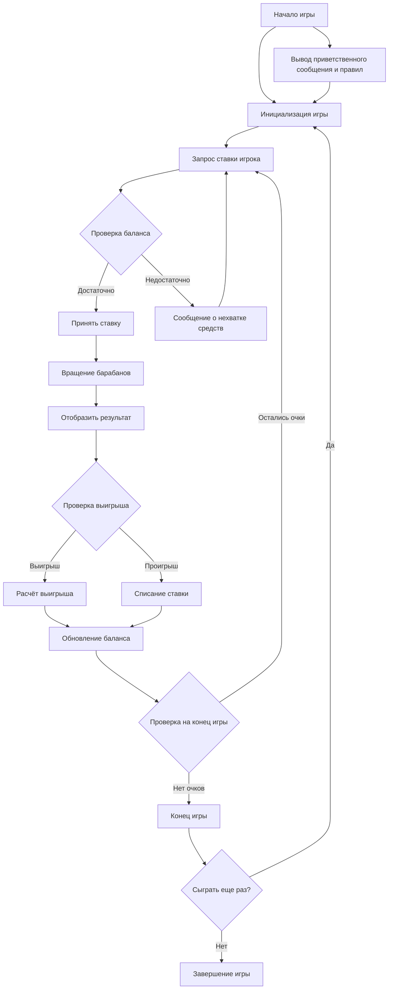

## ИНСТРУКЦИЯ:

Анализируем предоставленный текст, который описывает правила и логику игры "SLOTS" (игровой автомат).

## <алгоритм>

1.  **Инициализация Игры:**
    *   **Начало**: Выводится приветственное сообщение и правила игры.
    *   **Пример:**
        ```
        Добро пожаловать в SLOTS!
        Ваша задача — делать ставки и крутить барабаны, чтобы получить выигрышные комбинации.
        Игра продолжается до тех пор, пока у вас есть очки для ставок.
        Удачи!
        ```
    *   **Действие**: Создаются три барабана со случайными символами (например, яблоко, банан, вишня, лимон, семёрка).
    *   **Данные:** Барабаны хранят последовательность символов. Игрок начинает с определенным количеством очков (например, 100).

2.  **Основной процесс игры (цикл):**

    *   **2.1. Ставка игрока:**
        *   **Действие:** Программа запрашивает у игрока сумму ставки.
        *   **Пример:** `Введите сумму ставки: > 10`
        *   **Условие:** Проверяется, достаточно ли у игрока очков для ставки.
        *   **Действия:**
            *   **Если достаточно:** Ставка принимается.
            *   **Если недостаточно:** Выводится сообщение об ошибке и предлагается сделать ставку меньше.
            *   **Пример:**
                ```
                У вас недостаточно очков для этой ставки. Попробуйте снова.
                ```
        *   **Действия:** Отображается текущее количество очков игрока.
    *   **2.2. Кручение барабанов:**
        *   **Действие:**  Случайно выбираются символы на барабанах.
        *   **Пример:** `Барабаны: яблоко, банан, вишня.`
    *   **2.3. Подсчёт результатов:**
        *   **Условие:** Проверяется, выиграл ли игрок.
        *   **Действия:**
            *   **Три одинаковых символа:** Начисляется большой выигрыш.
            *   **Два одинаковых символа:** Начисляется небольшой выигрыш.
            *   **Нет выигрышной комбинации:** Ставка списывается.
            *   **Пример:**
                ```
                Вы выиграли 10 очков!
                У вас теперь 110 очков.
                ```
    *   **2.4. Проверка условий завершения игры:**
        *   **Условие:** Игра заканчивается, если у игрока закончились очки для ставок.
        *   **Действие:** Выводится итоговый результат.
        *   **Пример:**
            ```
            Игра окончена! У вас 0 очков.
            ```

3.  **Завершение игры:**

    *   **Действие:** Предлагается сыграть снова (да/нет).
    *   **Действия:**
        *   **Если "да":** Игра начинается заново с новым количеством очков.
        *   **Если "нет":** Выводится прощальное сообщение.

## <mermaid>



## <объяснение>

**Описание:**

Данный текст описывает логику и правила игры "SLOTS" (игровой автомат). Игра состоит из этапов инициализации, основного процесса игры (цикла ставок и вращений барабанов) и завершения игры.

**Импорты:**

В тексте не упоминаются импорты. Однако, в разделе "Реализация" указано, что для реализации на Python необходим модуль `random` для выбора случайных символов.

**Классы:**

В тексте нет описания классов. Ожидается, что в реализации будут классы, такие как `Game`, `Player`, и, возможно, `Reel`.

**Функции:**

Из описания логики можно выделить следующие необходимые функции:

*   `init_game()`: Инициализация игры, создание барабанов, начальных очков.
*   `get_player_bet()`: Запрос и проверка ставки игрока.
*   `spin_reels()`: Вращение барабанов и выбор случайных символов.
*   `calculate_result()`: Подсчет результатов вращения барабанов.
*   `update_balance()`: Обновление баланса игрока.
*   `check_end_game()`: Проверка на конец игры.
*   `play_again()`: Запрос на повторную игру.

**Переменные:**

*   `player_points`: Целое число, представляющее количество очков игрока.
*   `bet_amount`: Целое число, представляющее сумму ставки игрока.
*   `reels`: Список, содержащий символы на барабанах.
*   `symbols`: Список возможных символов на барабанах.
*   `game_status`: Логическое значение (True/False), показывающее, продолжается ли игра.

**Потенциальные ошибки или области для улучшения:**

*   **Ввод данных:** Не обрабатывается некорректный ввод ставки (например, ввод букв вместо чисел).
*   **Выигрышные комбинации:** Нет четкого описания, какие комбинации и сколько очков приносят, кроме общего указания.
*   **Реализация:** Не описаны детальные алгоритмы и структуры данных, требующиеся для реализации игры.
*   **Графика:** Нет поддержки графического интерфейса.
*   **Многопользовательская игра:** Нет поддержки нескольких игроков.
*   **Выбор ставок:** Нет выбора разных типов ставок.

**Взаимосвязи с другими частями проекта:**
В данном документе описывается только логика конкретной игры "SLOTS", без указания на другие части проекта. Однако, в рамках более крупного проекта, можно ожидать, что данная игра будет частью более широкой системы, которая может включать в себя:
- **Систему управления играми:** Компонент, позволяющий запускать и управлять разными играми.
- **Система управления пользователями:** Компонент, отвечающий за учет профилей пользователей, их очков и т.п.
- **Система хранения данных:** Компонент, отвечающий за хранение данных пользователей, их достижений и т.п.
- **Интерфейс пользователя:** Компонент, обеспечивающий взаимодействие пользователя с игрой (текстовый или графический).

В итоге, данный документ предоставляет спецификацию для реализации простой игры в слоты, но требует более детальной проработки для полноценной реализации.