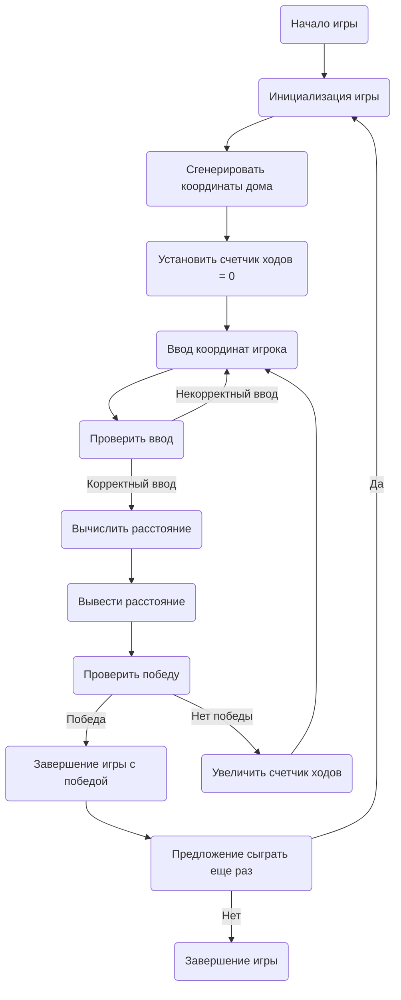

## АНАЛИЗ КОДА: SNOOPY

### <алгоритм>
1.  **Начало игры:**
    *   Выводится приветственное сообщение и правила игры.
    *   Генерируется случайная позиция дома на сетке 10x10.
    *   Количество ходов игрока устанавливается в 0.
    *   **Пример:** Приветствие игрока и генерация дома в точке (3,7).
2.  **Игровой цикл:**
    *   Игрок вводит координаты X и Y.
        *   **Пример:** Игрок вводит координаты 5, 5.
    *   Проверяется правильность ввода координат (в диапазоне от 1 до 10). Если ввод неверен, игроку предлагается повторить ввод.
        *   **Пример:** если введены координаты 12, 15 выводится сообщение об ошибке, и просится повторный ввод.
    *   Вычисляется расстояние между введенными координатами и координатами дома по формуле: `D = sqrt((X_player - X_house)^2 + (Y_player - Y_house)^2)`.
        *   **Пример:** Расстояние между (5, 5) и (3, 7) вычисляется как `sqrt((5-3)^2 + (5-7)^2) = sqrt(4 + 4) = sqrt(8) ≈ 2.8`.
    *   Расстояние выводится на экран.
        *   **Пример:** Выводится сообщение "Расстояние до дома: 2.8"
    *   Если координаты игрока совпадают с координатами дома, игра заканчивается победой.
        *   **Пример:** Если игрок ввел координаты 3,7 игра заканчивается.
    *   Если координаты не совпадают, количество ходов увеличивается на 1 и цикл повторяется.
3.  **Завершение игры:**
    *   Если дом найден, выводится сообщение о победе и общее количество ходов.
    *   Предлагается сыграть еще раз (да/нет).
    *   Если игрок выбирает "да", игра начинается заново.
    *   Если игрок выбирает "нет", игра завершается.
        *   **Пример:** Выводится сообщение "Поздравляем! Вы нашли дом! Вам потребовалось 5 ходов. Хотите сыграть еще раз? (да/нет)"

### <mermaid>

**Описание зависимостей:**
*   `InitializeGame`: Функция инициализации игры, которая устанавливает начальные значения и выводит приветствие.
*   `GenerateHouseCoordinates`: Функция, генерирующая случайные координаты дома на игровой сетке.
*   `SetMovesCounter`: Функция, устанавливающая счетчик ходов игрока в 0.
*   `PlayerInput`: Функция, принимающая ввод координат от игрока.
*    `ValidateInput`: Функция, проверяющая корректность введенных пользователем координат.
*   `CalculateDistance`: Функция, вычисляющая расстояние между координатами игрока и дома.
*   `DisplayDistance`: Функция, выводящая вычисленное расстояние на экран.
*   `CheckWin`: Функция, проверяющая, совпадают ли координаты игрока с координатами дома.
*   `EndGame`: Функция, выводящая сообщение о победе и количество ходов.
*   `IncrementMoves`: Функция, увеличивающая счетчик ходов на 1.
*   `PlayAgain`: Функция, спрашивающая игрока, хочет ли он сыграть еще раз.
*   `Stop`: Функция, завершающая игру.

### <объяснение>

**Импорты**:
*   В данном примере кода нет явных `import`.  Предполагается использование модуля `random` для генерации случайных координат дома и стандартных математических операций.

**Классы**:
*   В предоставленном описании игры нет классов.

**Функции**:
*   `Инициализация игры`:
    *   **Аргументы**: нет.
    *   **Возвращаемое значение**: нет.
    *   **Назначение**: Выводит приветственное сообщение, генерирует координаты дома, инициализирует счетчик ходов.
    *   **Пример**: Выводит приветствие, генерирует дом в точке (2, 4), устанавливает количество ходов в 0.
*   `Ввод координат игрока`:
    *   **Аргументы**: нет.
    *   **Возвращаемое значение**: Координаты (X, Y) введенные игроком в виде чисел.
    *   **Назначение**: Считывает координаты, введенные пользователем.
    *   **Пример**: Если пользователь вводит "5, 6", возвращает (5, 6).
*   `Проверка ввода`:
     *   **Аргументы**: Координаты (X, Y) введенные игроком.
    *   **Возвращаемое значение**: `True` если ввод корректен, `False` если нет.
    *   **Назначение**: Проверяет, являются ли введенные координаты целыми числами и находятся ли в пределах игрового поля (1-10).
    *   **Пример**: Если координаты (12, 4) функция вернет `False`. Если координаты (3, 5) функция вернет `True`.
*   `Вычисление расстояния`:
    *   **Аргументы**: Координаты игрока (X_player, Y_player) и координаты дома (X_house, Y_house).
    *   **Возвращаемое значение**: Расстояние между игроком и домом (float).
    *   **Назначение**: Вычисляет расстояние между игроком и домом по формуле расстояния.
    *   **Пример**: `CalculateDistance(5, 5, 3, 7)` вернет `2.828`.
*   `Вывод расстояния`:
    *   **Аргументы**: Расстояние до дома (float).
    *   **Возвращаемое значение**: нет.
    *   **Назначение**: Выводит сообщение с расстоянием до дома.
    *   **Пример**: При расстоянии `2.8`, выводится "Расстояние до дома: 2.8".
*   `Проверка победы`:
    *   **Аргументы**: Координаты игрока (X_player, Y_player) и координаты дома (X_house, Y_house).
    *   **Возвращаемое значение**: `True` если игрок угадал координаты дома, `False` если нет.
    *   **Назначение**: Проверяет, совпадают ли координаты игрока с координатами дома.
    *   **Пример**: Если координаты игрока (3, 7), а координаты дома (3, 7), возвращает `True`.
*   `Увеличение счетчика ходов`:
    *   **Аргументы**: нет.
    *   **Возвращаемое значение**: нет.
    *   **Назначение**: Увеличивает количество ходов игрока на 1.
    *   **Пример**: Если количество ходов было 3, увеличит его до 4.
*   `Завершение игры`:
    *   **Аргументы**: Количество ходов.
    *   **Возвращаемое значение**: нет.
    *   **Назначение**: Выводит сообщение о победе, количество ходов и предложение сыграть еще раз.
    *   **Пример**: Выводит "Поздравляем! Вы нашли дом! Вам потребовалось 5 ходов. Хотите сыграть еще раз? (да/нет)".
*   `Предложение сыграть еще раз`:
    *   **Аргументы**: нет.
    *   **Возвращаемое значение**: `True` если игрок хочет сыграть еще раз, `False` если нет.
    *   **Назначение**: Спрашивает игрока, хочет ли он сыграть снова.
    *   **Пример**: Если игрок вводит "да" возвращает `True`.

**Переменные**:
*   `X_player`, `Y_player`: Координаты игрока (целые числа).
*   `X_house`, `Y_house`: Координаты дома (целые числа).
*   `distance`: Расстояние между игроком и домом (число с плавающей точкой).
*    `moves_counter`: Количество ходов, затраченных игроком (целое число).

**Возможные ошибки и улучшения**:
*   **Обработка ошибок**: Необходимо добавить проверку на ввод нечисловых значений и другие ошибки ввода пользователя.
*   **Улучшение интерфейса**: Можно добавить визуализацию игрового поля или подсказки для игрока (например, направление к дому).
*   **Уровни сложности**: Реализация разных размеров сетки для разных уровней сложности.
*   **Подсказки**: Реализация системы подсказок, которые помогают игроку найти дом.
*   **Режим нескольких игроков**: Добавление режима игры для нескольких игроков.

**Взаимосвязь с другими частями проекта**:
*   В рамках данного описания нет явной связи с другими частями проекта.  В более развитом варианте, можно было бы интегрировать игру с системой хранения результатов или с общей игровой платформой.