## АНАЛИЗ КОДА:

### <алгоритм>

**Блок-схема:**

```mermaid
graph LR
    A[Начало игры] --> B(Инициализация игры: <br> Количество иннингов = 9 <br> Счет игрока = 0 <br> Счет компьютера = 0 <br> Базы пусты);
    B --> C{Вывод правил};
    C --> D[Начало цикла иннингов: <br> For i = 1 to 9];
    D --> E{Ход игрока};
        E --> E1[Компьютер делает бросок: <br> (случайное действие: мяч, подача, хитрость)];
        E1 --> E2{Игрок выбирает действие: <br> Ударить или пропустить};
        E2 --> E3{Результат удара: <br> Успешный удар => игрок бежит по базам <br> Пропуск => проверка на страйк};
        E3 --> E4{Проверка: достиг ли игрок базы или выведен из игры};
        E4 --> E5[Продолжать, пока 3 аута или конец попыток в иннинге];
    E5 --> F{Ход компьютера};
        F --> F1[Компьютер атакует: <br> (случайные действия: подача, удар, бег)];
        F1 --> F2{Игрок выбирает действие: <br> Поймать или вывести бегущего};
        F2 --> F3{Проверка: результаты и обновление счета};
    F3 --> G{Конец хода};
    G --> H{Обновление счета};
    H --> I{Конец иннинга};
    I --> J{i < 9?};
    J -- Да --> D
    J -- Нет --> K[Конец цикла иннингов];
    K --> L{Сравнение очков};
    L --> M{Вывод результатов: <br> Победа или поражение};
    M --> N[Предложение начать новую игру или выйти];
    N --> O[Конец игры]
```

**Примеры для логических блоков:**

*   **B (Инициализация игры):**
    *   `innings = 9`
    *   `player_score = 0`
    *   `computer_score = 0`
    *   `bases = [False, False, False]`
*   **E1 (Компьютер делает бросок):**
    *   Случайный выбор: "подача", "мяч", "хитрость"
*   **E2 (Игрок выбирает действие):**
    *   Игрок вводит: "ударить" или "пропустить"
*  **E3 (Результат удара):**
    *   Если "ударить": результат "попал по мячу", "не попал"
    *   Если "пропустить": результат "страйк", "не страйк"
*  **E4 (Проверка):**
     *  Игрок достиг базы: `bases = [True, False, False]`
     *  Игрок выведен: `outs += 1`
*   **F1 (Компьютер атакует):**
     * Случайный выбор: "подача", "удар"
*   **F2 (Игрок выбирает действие):**
    *   Игрок вводит: "поймать", "вывести"
*   **F3 (Проверка результатов):**
     * "Поймал" : `out += 1`
     * "Вывел": `out += 1`
*   **H (Обновление счета):**
    *   `player_score += 1`, если игрок успешно достиг дома.
*   **J (Конец иннинга):**
    *   Проверка:  `i < 9`

```mermaid
flowchart TD
    A[Начало игры] --> B(ИнициализацияИгры: <br> innings, playerScore, computerScore, bases);
    B --> C(ВыводПравилИгры);
    C --> D[НачалоЦиклаИннингов: <br> for currentInning = 1 to totalInnings];
    D --> E{ХодИгрока};
        E --> E1(КомпьютерДелаетБросок: <br> бросок);
        E1 --> E2{ИгрокВыбираетДействие: <br> ударИлиПропустить};
        E2 --> E3{РезультатУдара: <br> checkHitResult,  <br> checkStrikeResult};
        E3 --> E4{ПроверкаБазыАута: <br> checkBaseProgress, checkOuts};
        E4 --> E5[ПродолжатьХод: <br> пока totalOuts < 3];
    E5 --> F{ХодКомпьютера};
        F --> F1(КомпьютерАтакует: <br> computerAction);
        F1 --> F2{ИгрокЗащищается: <br> catchBall, makeOut};
        F2 --> F3{ПроверкаРезультатаИОбновлениеСчета: <br> updateScore};
    F3 --> G(КонецХода);
    G --> H{ОбновлениеСчетаИгрокаКомпьютера: <br> updateScores};
    H --> I{КонецИннинга};
    I --> J{currentInning < totalInnings?};
    J -- Да --> D
    J -- Нет --> K[КонецЦиклаИннингов];
    K --> L(СравнениеОчков);
    L --> M(ВыводРезультатовИгры: <br> победитель, totalScore);
    M --> N(ПредложениеНовойИгры);
    N --> O[КонецИгры]
    
    
    
    subgraph "Зависимости"
        style A fill:#f9f,stroke:#333,stroke-width:2px
        style O fill:#f9f,stroke:#333,stroke-width:2px

    end
```

### <mermaid>



**Анализ зависимостей в Mermaid:**
   * `Начало игры` и `Конец игры` - это начальные и конечные точки процесса.
   *  `ИнициализацияИгры`, `ВыводПравилИгры`, `КонецЦиклаИннингов` и `ПредложениеНовойИгры` представляют собой функции или блоки кода, которые обрабатывают определенные части игрового процесса.
   * `ХодИгрока` и `ХодКомпьютера` являются подпроцессами основного цикла игры.
   * Логические блоки, такие как `РезультатУдара`, `ПроверкаБазыАута`, `ПроверкаРезультатаИОбновлениеСчета` отвечают за проверку и обновления состояния игры.
   * `СравнениеОчков` и `ВыводРезультатовИгры` обеспечивают определение победителя и отображения результатов.

### <объяснение>

**Импорты:**
В предоставленном коде импорты отсутствуют, что указывает на то, что это текстовое описание игры, а не исполняемый код.

**Классы:**
В предоставленном коде классы отсутствуют.

**Функции:**
В предоставленном коде функции отсутствуют, поскольку это текстовое описание логики игры. Функции будут необходимы при реальной разработке игры для реализации описанных действий. Вот примерный список функций:
*   `initialize_game()`: инициализирует параметры игры.
*   `display_rules()`: выводит правила игры.
*   `player_turn()`: реализует ход игрока.
*   `computer_turn()`: реализует ход компьютера.
*   `update_score()`: обновляет счет игры.
*   `check_result()`: проверяет результаты действий.
*   `game_over()`: завершает игру и объявляет победителя.
*   `show_score()`: отображает текущий счет.

**Переменные:**
*   `innings` (целое число): количество иннингов в игре (9).
*   `player_score` (целое число): счет игрока.
*   `computer_score` (целое число): счет компьютера.
*   `bases` (список логических значений): состояние баз (заняты или нет).
*   `currentInning`(целое число): текущий иннинг.
*  `playerAction` (строка): выбор действия игрока: ударить или пропустить.
*  `computerAction`(строка): действие компьютера
*  `totalOuts`(целое число): общее количество аутов.
*   `strike`(логическое значение): флаг, который показывает был ли страйк.

**Цепочка взаимосвязей с другими частями проекта:**
Так как это текстовое описание игры, нет непосредственных взаимосвязей с другими частями проекта, но при реализации:

*   **GUI (графический интерфейс):** Функции из этого описания могут быть использованы для создания интерактивного бейсбола.
*   **AI:** Для реализации AI, необходимо будет добавить логику принятия решения компьютером в `computer_turn()`.
*   **База данных:** Можно добавить возможность сохранения и загрузки результатов игры в базу данных.

**Потенциальные ошибки и области для улучшения:**

*   **Упрощенная механика:** Текущее описание является упрощенным, что может не полностью отражать реальный бейсбол.
*   **Отсутствие детализации:** Описание действий компьютера и игрока может быть более детальным, включая различные типы бросков, бега и т.д.
*   **Нет обработки ошибок:** Описание не охватывает обработку некорректного ввода от игрока.
*   **Нет реализации:** Это текстовое описание, а не реальный код. Требуется реализация для работы.

Этот анализ предоставляет исчерпывающее понимание структуры и функционирования описанной логики игры в бейсбол, а также указывает на возможности для расширения и улучшения.