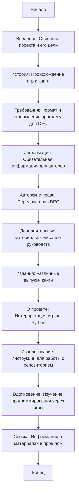

## Анализ кода:

### 1. <алгоритм>

Описание представляет собой README-файл, содержащий текстовую информацию о проекте "101 משחק ב-Python".  Этот файл не содержит исполняемого кода, но описывает цели, историю и структуру проекта. 

**Пошаговая блок-схема (текстовая):**

1.  **Начало:** Пользователь читает README.MD.
2.  **Введение:**  Общее описание проекта как коллекции игр из книги "101 BASIC Computer Games", переписанных на Python.
3.  **История:** Описание происхождения игр и книги, включая контекст эпохи и технологий (мини-компьютеры DEC, язык BASIC, телетайпы).
4.  **Требования к отправке программ в DEC:** Описание строгих требований к формату и оформлению программ для конкурса DEC (бумага, печать, и т.д.).
5.  **Информация для авторов:**  Описание обязательной информации для авторов при отправке программы (имя, адрес, возраст, и т.д.)
6.  **Авторские права:** Объяснение, что отправляя программу, авторы предоставляли права на ее публикацию, печать и распространение компании DEC.
7.  **Дополнительные материалы:** Описание дополнительных руководств, доступных в то время.
8.  **Издания:** Информация о различных изданиях книги.
9.  **О проекте:** Описание текущего проекта как *интерпретации* игр на Python.
10. **Использование:** Инструкции для пользователей как использовать репозиторий: выбрать игру, открыть код, запустить, изучить код и экспериментировать.
11. **Вдохновение:**  Описание проекта как источника вдохновения для изучения программирования через простые старые игры.
12. **Сноска:** Информация о методах обработки бумаги в то время.
13. **Конец:** Пользователь понимает цели и структуру проекта.

**Поток данных:**

-   Файл `README.MD` является статичным документом, который не обрабатывается программно, а предоставляется пользователю для чтения и понимания. Данные не передаются между функциями или классами.

### 2. <mermaid>

**Описание диаграммы:**

*   Диаграмма описывает поток чтения и понимания README.MD файла. 
*   `Start` представляет начало чтения документа.
*   Далее каждый блок описывает разделы информации в файле:
    *   `Intro`: Введение в проект.
    *   `History`:  Исторический контекст.
    *   `Requirements`: Требования DEC к предоставляемым материалам.
    *   `AuthorsInfo`: Информация для авторов программ.
    *   `Copyright`: Права интеллектуальной собственности.
    *   `AddMaterials`: Дополнительные материалы.
    *    `Editions`: Издания книги.
    *   `AboutProject`: Описание текущего проекта.
    *   `Usage`: Инструкции для пользователей.
    *   `Inspiration`: Вдохновение для изучения программирования.
    *   `Footnote`:  Информация о сносках.
*   `End` представляет конец чтения документа.

### 3. <объяснение>

*   **Импорты:** Файл `README.MD` не содержит импортов, поскольку это текстовый документ, а не исполняемый код Python.
*   **Классы:** Файл `README.MD` не содержит классов, поскольку это текстовый документ, а не программный код.
*   **Функции:** Файл `README.MD` не содержит функций, поскольку это текстовый документ, а не программный код.
*   **Переменные:** Файл `README.MD` не содержит переменных, поскольку это текстовый документ, а не программный код.

**Дополнительно:**

-   `README.MD` является важной частью проекта, поскольку предоставляет контекст и инструкции для пользователей и разработчиков.
-   Этот файл служит точкой входа в проект, объясняя его цели, структуру, и способ использования.
-   Файл не требует внесения изменений, но должен быть всегда доступен для понимания проекта.

**Взаимосвязь с другими частями проекта:**

- `README.MD` обеспечивает контекст для всех остальных файлов в проекте, включая Python-скрипты, содержащие код игр.  
- Файл помогает ориентироваться в проекте, понимать его структуру и назначение.
-  В целом `README.MD` играет ключевую роль в коммуникации между разработчиками и пользователями, устанавливая общий контекст и цели проекта.

**Потенциальные ошибки или области для улучшения:**

*   Файл в текущем виде является полным и информативным, не требуя изменений, но его следует поддерживать в актуальном состоянии.
*   Ошибок как таковых нет.