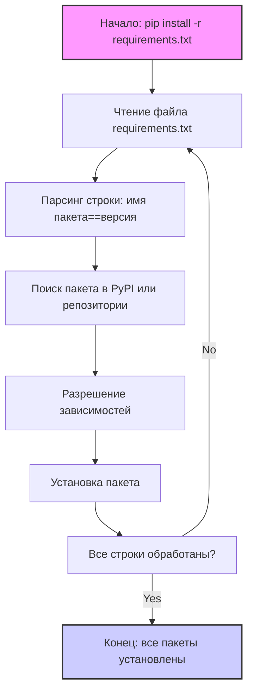

## Анализ файла requirements.txt

### 1. <алгоритм>

Файл `requirements.txt` не содержит исполняемого кода, это список зависимостей Python, необходимых для проекта. Его цель — определить конкретные версии библиотек, которые нужно установить с помощью менеджера пакетов pip. 

**Пошаговая блок-схема:**

1.  **Начало:** Запуск процесса установки зависимостей (например, командой `pip install -r requirements.txt`).
2.  **Чтение файла:** `pip` открывает файл `requirements.txt` и построчно считывает список зависимостей.
3.  **Парсинг строки:** `pip` анализирует каждую строку, разделяя имя пакета и его версию. Например, `requests==2.32.3` разделяется на пакет `requests` и версию `2.32.3`.
4.  **Поиск пакета:** `pip` обращается к PyPI (Python Package Index) или указанному репозиторию пакетов.
5.  **Разрешение зависимостей:**  `pip`  проверяет, есть ли у выбранного пакета зависимости, и также пытается разрешить их, устанавливая подходящие версии.
6.  **Установка:** `pip` скачивает и устанавливает найденный пакет с указанной версией.
7. **Повторение:** Шаги 3-6 повторяются для каждой записи в `requirements.txt`.
8.  **Завершение:** Все зависимости установлены.

**Пример:**
   - Строка `requests==2.32.3`:
     1. Пакет: `requests`
     2. Версия: `2.32.3`
   - Строка `pydantic==2.10.4`:
     1. Пакет: `pydantic`
     2. Версия: `2.10.4`

### 2. <mermaid>

**Описание `mermaid` диаграммы:**

*   **Start:** Начало процесса установки зависимостей.
*   **ReadFile:** Чтение файла `requirements.txt` построчно.
*   **ParseLine:** Разделение каждой строки на имя пакета и его версию.
*  **FindPackage:** Поиск пакета в PyPI (Python Package Index) или указанном репозитории пакетов.
*  **ResolveDependencies:** Проверка и разрешение зависимостей пакета.
*   **InstallPackage:** Установка найденного пакета с указанной версией.
*   **LoopCheck:** Проверка, все ли строки файла обработаны. Если нет, возвращаемся к чтению следующей строки; если да, завершаем процесс.
*   **End:** Конец процесса установки зависимостей.

### 3. <объяснение>

Файл `requirements.txt` содержит список пакетов и их версий, необходимых для проекта. Каждый пакет — это библиотека Python, выполняющая определенную функциональность.

**Импорты (в контексте файла):**

*   Этот файл не содержит инструкций `import` в том же смысле, как Python файлы.
*   Вместо этого, каждая строка в файле определяет **внешнюю библиотеку (пакет)**, который нужно импортировать и использовать в проекте.

**Список пакетов и их назначение:**

*   **`annotated-types==0.7.0`**: Библиотека для аннотации типов.
*   **`beautifulsoup4==4.12.3`**: Библиотека для парсинга HTML и XML.
*  **`cachetools==5.5.0`**: Набор инструментов для кэширования.
*  **`certifi==2024.12.14`**: Пакет с CA-сертификатами для HTTPS.
*  **`charset-normalizer==3.4.0`**: Библиотека для нормализации кодировок текста.
*  **`colorama==0.4.6`**: Библиотека для добавления цветного вывода в консоль.
*  **`google==3.0.0`**: Общий пакет Google.
*  **`google-ai-generativelanguage==0.6.10`**: Пакет для работы с Google AI Generative Language API.
*  **`google-api-core==2.24.0`**: Основные инструменты для работы с Google API.
*  **`google-api-python-client==2.156.0`**: Python клиент для Google API.
*  **`google-auth==2.37.0`**: Пакет для аутентификации в Google API.
*  **`google-auth-httplib2==0.2.0`**: Пакет для интеграции `google-auth` с `httplib2`.
*  **`google-generativeai==0.8.3`**: Пакет для работы с Google Generative AI.
*  **`googleapis-common-protos==1.66.0`**: Общие протоколы для Google API.
*  **`grpcio==1.68.1`**: Библиотека gRPC (удаленный вызов процедур).
*  **`grpcio-status==1.68.1`**: Статусы для gRPC.
*  **`httplib2==0.22.0`**: HTTP-клиент.
*  **`idna==3.10`**: Библиотека для работы с IDNA.
*   **`iniconfig==2.0.0`**: Библиотека для работы с INI файлами конфигурации.
*   **`packaging==24.2`**: Библиотека для управления версиями пакетов.
*   **`pluggy==1.5.0`**: Библиотека для плагинов.
*  **`proto-plus==1.25.0`**: Библиотека для работы с Protocol Buffers.
*  **`protobuf==5.29.2`**: Библиотека Protocol Buffers (для сериализации данных).
*  **`pyasn1==0.6.1`**: Библиотека для работы с ASN.1.
*  **`pyasn1_modules==0.4.1`**: Библиотека ASN.1 модулей.
*  **`pydantic==2.10.4`**: Библиотека для валидации и преобразования данных на основе схем.
*  **`pydantic_core==2.27.2`**: Основной движок для `pydantic`.
*  **`pyparsing==3.2.0`**: Библиотека для парсинга текста.
*  **`pytest==8.3.4`**: Фреймворк для тестирования.
*   **`requests==2.32.3`**: Библиотека для отправки HTTP-запросов.
*   **`rsa==4.9`**: Библиотека для работы с RSA.
*   **`soupsieve==2.6`**:  Селектор CSS для `BeautifulSoup4`.
*  **`tqdm==4.67.1`**: Библиотека для отображения прогресс-баров.
*  **`typing_extensions==4.12.2`**: Расширения для модуля `typing`.
*  **`uritemplate==4.1.1`**: Библиотека для работы с URI-шаблонами.
*   **`urllib3==2.3.0`**: Библиотека для работы с HTTP и URL.

**Взаимосвязь с другими частями проекта:**

*   Этот файл `requirements.txt` описывает **необходимые зависимости для всего проекта**. Он является отправной точкой для установки всех необходимых библиотек.

**Потенциальные ошибки и области для улучшения:**

*   **Конфликты версий:** Иногда, разные библиотеки могут требовать разные версии одного и того же пакета. Это может привести к конфликтам и ошибкам. Это решается с помощью инструментов для управления версиями (например, `pip-tools`).
*   **Уязвимости:** Старые версии библиотек могут содержать уязвимости. Необходимо регулярно обновлять пакеты.
*   **Отсутствие "pinning" версий:**  Зависимости зафиксированы с помощью оператора `==`. Это обеспечивает воспроизводимость сборок, но блокирует автоматическое обновление. Стоит рассмотреть использование `pip-compile` и `constraints`.

**Цепочка взаимосвязей:**

1.  Файл `requirements.txt` определяет список необходимых библиотек.
2.  Инструмент `pip` использует этот файл для загрузки и установки указанных библиотек.
3.  При разработке проекта, каждая из этих библиотек импортируется в код Python.
4.  Таким образом, `requirements.txt` обеспечивает правильную среду разработки с необходимыми зависимостями.