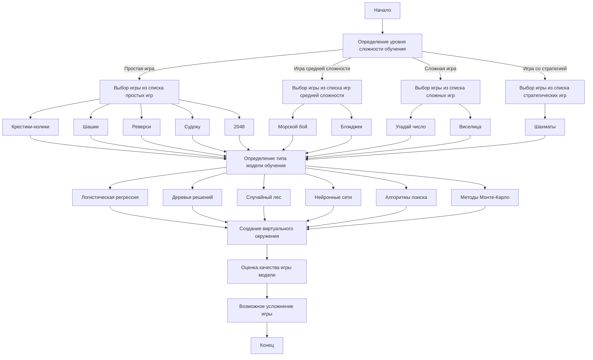

## 1. <алгоритм>
Этот текст представляет собой описание различных игр, которые могут быть использованы для обучения моделей машинного обучения. Алгоритм здесь – это, скорее, набор рекомендаций по выбору игры в зависимости от сложности и типа модели. Блок-схема не отражает конкретную последовательность действий, а скорее классификацию и описание игр.

**Блок-схема (описательная):**

```
[Начало] --> [Определение уровня сложности обучения]
[Определение уровня сложности обучения] -- "Простая игра" --> [Выбор игры из списка игр с полной информацией: Крестики-нолики, Шашки, Реверси, Судоку, 2048] 
[Определение уровня сложности обучения] -- "Игра средней сложности" --> [Выбор игры из списка игр с неполной информацией: Морской бой, Блэкджек]
[Определение уровня сложности обучения] -- "Сложная игра" --> [Выбор игры из списка игр с элементами случайности: Угадай число, Виселица] 
[Определение уровня сложности обучения] -- "Игра со стратегией" --> [Выбор игры из списка игр с элементами стратегии и тактики: Шахматы]
[Выбор игры] --> [Определение типа модели обучения: Логистическая регрессия, деревья решений, случайный лес, нейронные сети, алгоритмы поиска, методы Монте-Карло]
[Определение типа модели обучения] --> [Создание виртуального окружения]
[Создание виртуального окружения] --> [Оценка качества игры модели: процент побед, среднее количество ходов]
[Оценка качества игры модели] --> [Возможное усложнение игры]
[Конец]
```

**Примеры для каждого блока:**

*   **[Начало]** – начало процесса выбора и подготовки к обучению.
*   **[Определение уровня сложности обучения]** – разработчик решает, начинать с простых игр или сразу переходить к более сложным.
*   **[Выбор игры из списка игр с полной информацией]** – Выбор "Крестики-нолики" для начала, как простой игры.
*   **[Выбор игры из списка игр с неполной информацией]** – Выбор "Блэкджека" для обучения модели, работающей с неполной информацией.
*   **[Выбор игры из списка игр с элементами случайности]** – Выбор "Угадай число" для обучения модели, работающей со случайными событиями.
*   **[Выбор игры из списка игр с элементами стратегии и тактики]** – Выбор "Шахматы" для обучения модели сложной стратегии.
*   **[Определение типа модели обучения]** – Выбор "деревьев решений" для "Крестиков-ноликов".
*   **[Создание виртуального окружения]** – Разработка кода, позволяющего модели играть в выбранную игру.
*   **[Оценка качества игры модели]** – Процент побед модели в игре "Блэкджек".
*   **[Возможное усложнение игры]** – Увеличение размера доски в шахматах после достижения хороших результатов с моделью.
*   **[Конец]** – Завершение процесса обучения и подготовки к новым этапам.

## 2. <mermaid>



**Зависимости:**
Диаграмма не импортирует никаких внешних зависимостей, она создана для визуального представления процесса описанного в тексте. Все элементы и связи находятся в пределах контекста документа.

## 3. <объяснение>

**Импорты:**

В предоставленном коде отсутствуют импорты. Это текстовый документ, описывающий игры для обучения моделей машинного обучения, а не программный код. 

**Классы:**

В данном коде нет классов. Описаны только категории игр и рекомендации по их использованию.

**Функции:**

В тексте нет функций. Это текстовое описание, а не код.

**Переменные:**

В коде нет явных переменных, но концептуально можно рассматривать следующие:
*   **`тип_игры`**: может быть: "игра с полной информацией", "игра с неполной информацией", "игра со случайностью", "игра со стратегией".
*   **`название_игры`**: Например, "Крестики-нолики", "Шахматы", "Морской бой" и т.д.
*   **`тип_модели`**: Например, "логистическая регрессия", "нейронные сети", "методы Монте-Карло".
*   **`качество_игры`**: Например, "процент побед", "среднее количество ходов".

**Объяснение:**

Текст предоставляет обзор различных игр, которые могут использоваться для обучения моделей машинного обучения. Он классифицирует игры по уровню сложности, наличию информации и элементам случайности. 

*   **Игры с полной информацией:** Все ходы и состояние игры видны обоим игрокам, что делает обучение более предсказуемым.
*   **Игры с неполной информацией:** Часть информации скрыта, что делает процесс обучения более сложным и требует от модели принятия решений на основе неполных данных.
*   **Игры со случайностью:** Результаты игры зависят от случайных факторов, что делает обучение более сложным и требует от модели учитывать случайные события.
*   **Игры со стратегией:** Требуют от модели глубокого понимания правил и долгосрочного планирования, что делает обучение более сложным.

Текст также описывает типы моделей, которые могут быть использованы для обучения, а также предлагает подходы к оценке качества игры модели и ее усложнению.

**Цепочка взаимосвязей с другими частями проекта:**

Предположим, что этот файл `about.ru.md` находится в директории с другими файлами, описывающими отдельные игры. В таком случае этот файл будет служить введением и общим обзором, а другие файлы будут содержать более подробные описания и реализации отдельных игр.
Например:

```
hypotez/
    src/
        ai/
            helicone/
                ai_games/
                    about.ru.md
                    tic_tac_toe.py
                    chess.py
                    blackjack.py
```
В этом случае `about.ru.md` будет ссылаться на `tic_tac_toe.py`, `chess.py` и `blackjack.py` как на конкретные реализации игр, которые можно использовать для обучения.

**Потенциальные ошибки или области для улучшения:**
*   Текст в основном описывает игры, но не указывает конкретные требования для их реализации в контексте обучения моделей машинного обучения. Было бы полезно добавить подробности о том, как, например, представить состояние игры в виде входных данных для модели.
*   Также не хватает информации о том, как создавать виртуальное окружение для каждой из игр.
*   Нужно было бы включить примеры кода и алгоритмы, которые будут использоваться для обучения и игры.