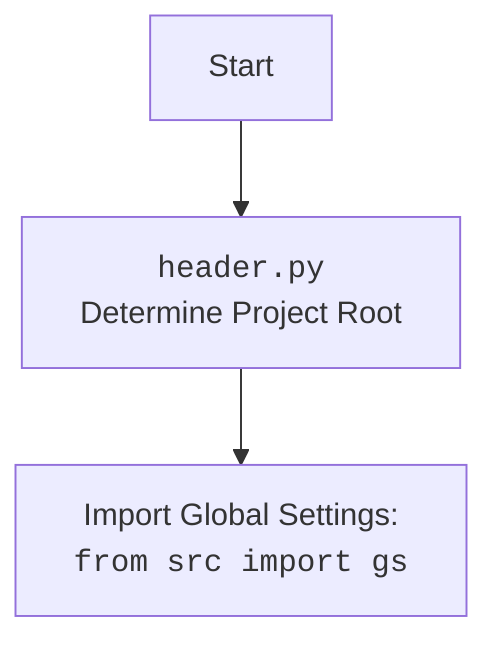

## <алгоритм>

1.  **Инициализация (`__init__`)**:
    *   Загружает конфигурацию из `more_basic_computer_games.json`.
        *   *Пример:* Загружает данные о модели AI, включая название модели и API ключ.
    *   Устанавливает язык игры (`lang`).
        *   *Пример:* `lang` = 'en' или 'ru'.
    *   Загружает системные инструкции из файла `raw.txt`.
        *   *Пример:* Инструкции о том, как AI должен себя вести.
    *   Загружает инструкции по генерации кода из файла, специфичного для языка.
        *   *Пример:* Инструкции, как именно AI должен генерировать код Python.
    *   Инициализирует `GoogleGenerativeAI` (объект `bob`) с загруженными инструкциями и ключами доступа.
    *   Вызывает `load_games_list()` для загрузки списка доступных игр.
2.  **Загрузка списка игр (`load_games_list`)**:
    *   Получает список файлов из каталога с правилами игр.
        *   *Пример:* Получает список файлов `.md` или `.txt` в каталоге `rules`.
    *   Для каждого имени файла:
        *   Извлекает имя игры из имени файла, удаляя префикс и расширение.
            *   *Пример:* Из `1_artillery_3.ru.md` извлекает `artillery_3`.
        *   Приводит имя игры к верхнему регистру и заменяет подчеркивания на пробелы.
             *   *Пример:* `artillery_3` -> `ARTILLERY 3`.
        *   Добавляет полученное имя игры в список `games_list`.
3.  **Генерация кода (`generate_python_code`)**:
    *   Для каждой игры в списке `games_list`:
        *   Формирует запрос для AI, заменяя `<GAME>` на имя текущей игры.
            *   *Пример:* Запрос "напиши python код для игры <ARTILLERY 3>"
        *   Отправляет запрос в `bob.ask()`.
        *   Обрабатывает ответ, удаляя лишние символы (```, python)
        *   Сохраняет сгенерированный код для текущей игры.
        *   Делает паузу.
4.  **Сохранение кода (`save_code`)**:
    *   Формирует имя файла для сохранения, заменяя пробелы на подчеркивания.
        *   *Пример:* Игра "ARTILLERY 3" сохраняется в файл `artillery_3.py`.
    *   Создает родительские каталоги, если они не существуют.
    *   Сохраняет код в файл.
5.  **Создание файлов правил (`create_rules_files`)**:
    *   Создает пустые файлы правил на основе списка `rules_files`.
        *   *Пример:* Создает пустые файлы `.md` в каталоге `rules`.
6. **Основная программа (`if __name__ == '__main__'`)**:
    *   Для каждого языка из списка:
       *   Создает экземпляр класса `MoreBasicGames`.
       *   Вызывает `create_rules_files()`, раскомментирован
       *   Запускает асинхронную функцию `generate_python_code()`

## <mermaid>

```mermaid
flowchart TD
    subgraph MoreBasicGames
        Start[Start] --> Init[__init__]
        Init --> LoadConfig[Load config: <br><code>more_basic_computer_games.json</code>]
        LoadConfig --> SetLang[Set Language: <br><code>lang</code>]
        SetLang --> LoadSystemInstruction[Load System Instruction: <br><code>raw.txt</code>]
        LoadSystemInstruction --> LoadCommandInstruction[Load Command Instruction: <br><code>{self.base}_write_code.{self.lang}.md</code>]
        LoadCommandInstruction --> InitBob[Initialize GoogleGenerativeAI: <br><code>bob</code>]
        InitBob --> LoadGamesList[Load Games List: <br><code>load_games_list()</code>]

        LoadGamesList --> GetRulesFiles[Get Rules Files]
        GetRulesFiles --> LoopFiles[Loop through files]
         LoopFiles --> ExtractGameName[Extract Game Name<br><code>file_name.split('_', 1)[1].split('.')[0]</code>]
         ExtractGameName --> FormatGameName[Format Game Name<br><code>upper().replace('_', ' ')</code>]
        FormatGameName --> AddToGamesList[Add to <code>games_list</code>]
        AddToGamesList --> LoopFiles
        LoopFiles -- End Loop --> GenerateCode[Generate Code: <br><code>generate_python_code()</code>]

        GenerateCode --> LoopGames[Loop through games]
        LoopGames --> CreatePrompt[Create Prompt: <br><code>replace('<GAME>', f'<{game}>')</code>]
        CreatePrompt --> AskBob[Ask AI for code: <br><code>bob.ask(q)</code>]
        AskBob --> ProcessResponse[Process Response:<br>Remove <code>\`\`\`</code>, <code>python</code>]
        ProcessResponse --> SaveCode[Save Code: <br><code>save_code(game, response)</code>]
        SaveCode --> LoopGames
        LoopGames -- End Loop --> CreateRulesFiles[Create Rules Files:<br><code>create_rules_files()</code>]


        CreateRulesFiles --> LoopRulesFiles[Loop through rules files]
        LoopRulesFiles --> CreateEmptyFile[Create Empty File:<br><code>write_text('', encoding='UTF-8')</code>]
        CreateEmptyFile --> LoopRulesFiles
         LoopRulesFiles -- End Loop --> End[End]


        subgraph save_code
            SaveCode --> CreateFileName[Create File Name: <br><code>f'{game.lower().replace(' ', '_')}.py'</code>]
            CreateFileName --> CreateParentDirs[Create Parent Directories: <br><code>mkdir(parents=True, exist_ok=True)</code>]
            CreateParentDirs --> WriteFile[Write Code to File]
        end
    end

    subgraph Main
        MainStart[Main Start] --> LoopLangs[Loop through languages]
        LoopLangs --> CreateGamesInstance[Create MoreBasicGames instance]
        CreateGamesInstance --> CallGenerateCode[Run generate_python_code()]
        CallGenerateCode --> LoopLangs
        LoopLangs -- End Loop --> MainEnd[Main End]
    end

   
    
  style MainStart fill:#f9f,stroke:#333,stroke-width:2px
  style End fill:#ccf,stroke:#333,stroke-width:2px
    
```


## <объяснение>

**Импорты:**

*   `asyncio`: Используется для асинхронного программирования, позволяя запускать несколько задач параллельно. В данном коде используется для асинхронного вызова AI.
*   `time`: Используется для добавления задержки между запросами к AI, чтобы избежать перегрузки.
*   `pathlib.Path`: Используется для работы с путями к файлам и каталогам, упрощая операции с файловой системой.
*   `header`:  Импортируется локальный файл `header.py`, предположительно для определения корневого каталога проекта. Этот модуль важен для правильной адресации путей к файлам и каталогам в рамках всего проекта.
*    `src.gs`: Импортируются глобальные настройки (`gs`) из пакета `src`. В `gs` обычно хранятся общие настройки проекта, такие как пути к каталогам, ключи API и другие конфигурационные параметры.
*   `src.ai.gemini.GoogleGenerativeAI`: Импортируется класс `GoogleGenerativeAI` из пакета `src.ai.gemini`. Этот класс используется для взаимодействия с Google Gemini AI.
*   `src.ai.openai.OpenAIModel`: Импортируется класс `OpenAIModel` из пакета `src.ai.openai`. Хотя он импортируется, в данном коде он не используется. Это может указывать на возможность расширения функциональности в будущем, используя модели OpenAI.
*   `src.utils.jjson.j_loads`, `src.utils.jjson.j_loads_ns`: Импортируются функции для загрузки JSON данных. `j_loads` и `j_loads_ns` используются для загрузки конфигурационных файлов. `j_loads_ns` вероятно загружает json в namespace object, `j_loads` - просто в dict.
*    `src.utils.file.get_filenames`: Импортируется функция для получения списка имен файлов из заданного каталога.
*    `src.utils.printer.pprint`: Импортируется функция для "красивой" печати данных, в коде не используется, возможно для отладки.

**Класс `MoreBasicGames`:**

*   **Назначение**:  Класс предназначен для автоматической генерации кода для простых компьютерных игр с использованием AI. Он управляет процессом загрузки правил игры, генерации кода и сохранения результатов.
*   **Атрибуты:**
    *   `lang` (str): Язык, на котором генерируется код.
    *   `bob` (`GoogleGenerativeAI`): Экземпляр класса `GoogleGenerativeAI` для взаимодействия с AI.
    *    `base`(str): Базовое имя для каталогов и файлов, используемое в путях.
    *    `base_path`(Path): Путь к каталогу, где хранятся файлы, связанные с играми.
    *   `command_instruction` (str): Инструкции для AI о том, как генерировать код на основе правил игры.
    *   `games_list` (list): Список имен игр, для которых будет генерироваться код.
*   **Методы:**
    *   `__init__`: Конструктор класса.
        *   Загружает конфигурацию, инициализирует атрибуты класса, включая экземпляры AI моделей.
        *   Использует `j_loads_ns` для загрузки конфигурационного файла.
        *   Использует `Path` для загрузки инструкций из файлов.
        *   Инициализирует объект `GoogleGenerativeAI` с ключом API и системными инструкциями.
    *   `load_games_list`: Загружает список игр из файлов правил.
         *  Использует `get_filenames` для получения списка файлов.
        *   Извлекает имя игры из имени файла, приводя его к верхнему регистру и заменяя подчеркивания на пробелы.
    *   `generate_python_code`: Генерирует Python код для каждой игры в списке.
        *   Формирует запрос для AI, подставляя имя игры в инструкцию.
        *   Использует `bob.ask` для получения ответа от AI.
        *   Обрабатывает ответ, удаляя лишние символы.
        *   Вызывает `save_code` для сохранения сгенерированного кода.
        *   Добавляет задержку с помощью `time.sleep`.
    *   `save_code`: Сохраняет сгенерированный код в файл.
        *   Формирует имя файла на основе имени игры.
        *   Использует `Path.mkdir` для создания родительских каталогов.
        *   Использует `Path.write_text` для сохранения кода в файл.
    *   `create_rules_files`: Создает пустые файлы правил для всех игр.
         * Создает родительские каталоги для файлов правил.
        *   Создает пустые файлы `.md` или `.txt`
       
**Функции:**

*   `__init__(self, lang='en')`: Конструктор класса, инициализирует атрибуты и загружает необходимые данные.
*   `load_games_list(self)`: Загружает и обрабатывает список доступных игр на основе файлов в директории.
*   `generate_python_code(self)`: Запускает процесс генерации Python кода для каждой игры с использованием AI.
*   `save_code(self, game: str, code: str)`: Сохраняет сгенерированный код в файл.
*   `create_rules_files(self)`: Создает пустые файлы для правил игр.
*   `if __name__ == '__main__':`: Основная точка входа скрипта. Создает экземпляры класса `MoreBasicGames` для каждого языка и запускает процесс генерации.
  
**Переменные:**
*   `langs_list` (list): Список языков для которых генерируется код.
*    `lang`(str): Язык текущей итерации.
*   `g`(`MoreBasicGames`): Экземпляр класса `MoreBasicGames`.
*   `config` (dict):  Содержит конфигурационные параметры, загруженные из JSON.
* `system_instruction`, `command_instruction`(str): Содержат текстовые инструкции для AI.
* `response`(str): Текстовый ответ от AI.
* `output_file`(Path): Путь к файлу, в который будет сохранен сгенерированный код.
* `rules_files` (list): Список файлов с правилами игр.
* `file_name`, `game_name` (str): Имя текущего обрабатываемого файла.
*   `game` (str): Имя текущей игры.
*    `code` (str):  Сгенерированный код Python.

**Цепочка взаимосвязей:**

1.  **`header.py`**: Определяет корень проекта для правильного построения путей.
2.  **`src.gs`**: Предоставляет доступ к глобальным настройкам, включая пути к каталогам и ключи API.
3.  **`GoogleGenerativeAI`**:  Используется для взаимодействия с AI. Получает запросы и возвращает ответы.
4.  **`MoreBasicGames`**: Координирует процесс генерации кода, используя AI и файловую систему.
5.  **`j_loads`**, **`j_loads_ns`**:  Загружают JSON файлы для конфигурации.
6.  **`get_filenames`**:  Используется для получения списка файлов правил.
7.   `asyncio.run`**:  Запускает асинхронный метод `generate_python_code()`.
8.  **Файловая система**: Используется для хранения конфигурации, правил, инструкций и сгенерированного кода.

**Потенциальные ошибки и области для улучшения:**

*   **Обработка ошибок**: Не хватает обработки ошибок, особенно при взаимодействии с AI, загрузке файлов и т.д.
*    **Отсутствует использование `OpenAIModel`**: Класс `OpenAIModel` импортируется, но не используется.
*   **Задержка:**  Задержка в 20 секунд с `time.sleep` может быть не оптимальной и замедляет процесс. Лучше использовать асинхронное ожидание или rate limiting.
*  **Жестко прописанные имена файлов в `create_rules_files`:**  Имена файлов правил жестко прописаны в коде. Лучше использовать динамический подход.
*   **Ограниченная функциональность**: Код фокусируется на генерации кода, но не включает тестирование, отладку или другие необходимые функции.
* **Не универсальный код парсинга AI ответа**: Код предполагает, что ответ от AI будет всегда начинаться с "```" или "```python". Это может не сработать со всеми моделями AI.
* **Отсутствует обработка ошибок от AI**: Код не обрабатывает ошибки от AI, что может привести к непредсказуемому поведению.

**Заключение:**

Этот код предоставляет базовую структуру для автоматической генерации кода игр с использованием AI. Он демонстрирует использование asyncio, асинхронного запроса к AI, взаимодействия с файловой системой и загрузки конфигурационных файлов. Тем не менее, есть области, требующие доработки для повышения надежности, гибкости и расширения функциональности.