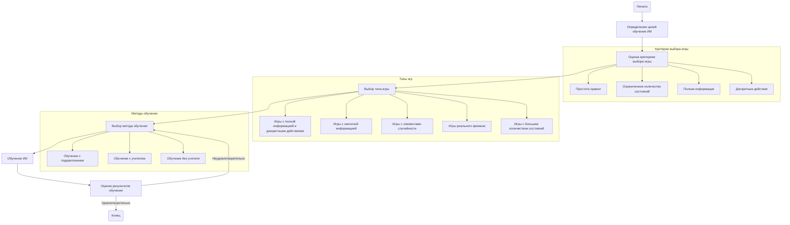

## ИНСТРУКЦИЯ:

Анализируй предоставленный код подробно и объясни его функциональность. Ответ должен включать три раздела:  

1. **<алгоритм>**: Опиши рабочий процесс в виде пошаговой блок-схемы, включая примеры для каждого логического блока, и проиллюстрируй поток данных между функциями, классами или методами.  
2. **<mermaid>**: Напиши код для диаграммы в формате `mermaid`, проанализируй и объясни все зависимости, 
    которые импортируются при создании диаграммы. 
    **ВАЖНО!** Убедитесь, что все имена переменных, используемые в диаграмме `mermaid`, 
    имеют осмысленные и описательные имена. Имена переменных вроде `A`, `B`, `C`, и т.д., не допускаются!  
    
    **Дополнительно**: Если в коде есть импорт `import header`, добавьте блок `mermaid` flowchart, объясняющий `header.py`:\
    ```mermaid
    flowchart TD
        Start --> Header[<code>header.py</code><br> Determine Project Root]
    
        Header --> import[Import Global Settings: <br><code>from src import gs</code>] 
    ```

3. **<объяснение>**: Предоставьте подробные объяснения:  
   - **Импорты**: Их назначение и взаимосвязь с другими пакетами `src.`.  
   - **Классы**: Их роль, атрибуты, методы и взаимодействие с другими компонентами проекта.  
   - **Функции**: Их аргументы, возвращаемые значения, назначение и примеры.  
   - **Переменные**: Их типы и использование.  
   - Выделите потенциальные ошибки или области для улучшения.  

Дополнительно, постройте цепочку взаимосвязей с другими частями проекта (если применимо).  

Это обеспечивает всесторонний и структурированный анализ кода.
## Формат ответа: `.md` (markdown)
**КОНЕЦ ИНСТРУКЦИИ**

## <алгоритм>

Представленный текст не является кодом, а представляет собой руководство по выбору игр для обучения искусственного интеллекта (ИИ). Тем не менее, мы можем представить алгоритм в виде блок-схемы, описывающей процесс выбора игры и обучения ИИ.

1. **Начало**: Задайте цель обучения ИИ (например, обучить ИИ играть в стратегические игры).
2. **Критерии Выбора Игры**:
    - Оцените простоту правил игры (например, "Крестики-нолики" простые, а "Dota 2" - сложные).
    - Проверьте количество возможных состояний (например, "Крестики-нолики" имеют мало состояний, "Го" - много).
    - Определите, есть ли полная информация (например, в "Шахматах" полная, в "Покере" - нет).
    - Определите тип действий (дискретные или непрерывные, например, в "Шахматах" дискретные, в симуляции физики - непрерывные).
3. **Выбор Типа Игры**:
    - Игры с полной информацией и дискретными действиями (например, "Шахматы", "Крестики-нолики").
    - Игры с неполной информацией (например, "Покер").
    - Игры с элементами случайности (например, "Морской бой").
    - Игры реального времени (например, "StarCraft").
    - Игры с большим количеством состояний (например, "Шахматы на больших досках").
4. **Методы обучения**:
    - Выберите метод обучения (например, обучение с подкреплением, обучение с учителем, обучение без учителя).
    - Пример: Если цель - обучить ИИ играть в "Крестики-нолики", можно использовать обучение с подкреплением, где ИИ играет сам с собой и получает награду за победу.
5. **Обучение ИИ**:
    - Обучите ИИ выбранным методом, используя симуляцию.
    - Пример: Для "Шахмат" можно использовать обучение с учителем, где ИИ тренируется на базе данных партий профессиональных игроков.
6. **Оценка Результатов**:
    - Оцените результаты обучения, сравнивая игру ИИ с игрой профессиональных игроков или других ИИ.
    - Пример: Если ИИ выиграет большинство игр у профессионального игрока, то обучение можно считать успешным.
7. **Итерация**:
    - Если результат не удовлетворяет, вернитесь к шагу 4 (Методы обучения) или шагу 2 (Критерии выбора игры).
8. **Конец**: Обучение закончено.

## <mermaid>



**Описание элементов диаграммы:**

-   **`Start`**: Начало процесса выбора игры и обучения ИИ.
-   **`DefineGoals`**: Определение целей обучения ИИ (например, обучить играть в определённую игру или вид игр).
-   **`EvaluateGameCriteria`**: Оценка критериев выбора игры на основе простоты правил, количества возможных состояний, наличия полной информации, дискретности действий.
    -   **`SimpleRules`**: Критерий простоты правил игры.
    -   **`LimitedStates`**: Критерий ограниченности числа возможных игровых состояний.
    -   **`CompleteInformation`**: Критерий наличия у игроков полной информации о состоянии игры.
    -    **`DiscreteActions`**: Критерий дискретности доступных действий игрока.
-  **`ChooseGameType`**: Выбор конкретного типа игры, исходя из критериев.
    - **`CompleteInfoGames`**: Игры с полной информацией и дискретными действиями.
    - **`IncompleteInfoGames`**: Игры с неполной информацией.
    - **`RandomGames`**: Игры с элементами случайности.
    - **`RealTimeGames`**: Игры, протекающие в реальном времени.
      - **`ComplexGames`**: Игры с большим количеством возможных состояний.
-   **`SelectTrainingMethod`**: Выбор подходящего метода обучения для ИИ.
    - **`ReinforcementLearning`**: Обучение с подкреплением, где ИИ учится на основе проб и ошибок.
    - **`SupervisedLearning`**: Обучение с учителем, где ИИ обучается на размеченных данных.
    - **`UnsupervisedLearning`**: Обучение без учителя, где ИИ самостоятельно выявляет закономерности в данных.
-  **`TrainAI`**: Обучение ИИ выбранным методом.
-   **`EvaluateResults`**: Оценка результатов обучения и сравнение с требуемым уровнем производительности.
- **`End`**: Конец процесса обучения ИИ.

**Зависимости:**
Диаграмма не имеет внешних зависимостей, поскольку она представляет собой блок-схему процесса и не связана с импортом каких-либо модулей. Диаграмма представляет последовательность шагов, необходимых для выбора игры и обучения ИИ.

## <объяснение>

**Общая структура текста:**

Представленный текст является обзором и руководством по выбору игр для обучения искусственного интеллекта. Он структурирован по следующим разделам:

1.  **Введение:** Объяснение зависимости выбора игры от целей исследования.
2.  **Факторы отбора:** Перечисление основных факторов, которые следует учитывать при выборе игры для обучения ИИ.
3.  **Примеры игр:** Список конкретных игр, разделенных по категориям (с полной информацией, с неполной информацией, с элементами случайности, реального времени и т.д.), с кратким объяснением их особенностей и пригодности для обучения.
4.  **Методы обучения:** Перечисление основных методов обучения ИИ.
5.  **Преимущества обучения на играх:** Обоснование выбора игр для обучения ИИ.
6.  **Сложности обучения на некоторых играх:** Описание типов игр, которые могут представлять проблемы для обучения.

**Основные понятия:**

-   **Игры с полной информацией:** Игры, где все игроки имеют доступ ко всей информации о состоянии игры (например, "Шахматы").
-   **Игры с неполной информацией:** Игры, где некоторая информация скрыта от игроков (например, "Покер").
-   **Дискретные действия:** Действия, которые могут быть выбраны из ограниченного набора опций (например, перемещение фигуры на шахматной доске).
-   **Подкрепление:** Метод обучения, при котором ИИ учится путем проб и ошибок, получая награды и наказания.
-   **Обучение с учителем:** Метод обучения, при котором ИИ обучается на примерах с правильными ответами.
-   **Обучение без учителя:** Метод обучения, при котором ИИ самостоятельно изучает структуру данных и находит закономерности.

**Импорты:**

В данном тексте нет импортов, так как это не программный код, а пояснительный текст.

**Классы:**

Текст не содержит определения классов, так как это не программный код.

**Функции:**

Текст не содержит определения функций, так как это не программный код.

**Переменные:**

Текст не содержит определения переменных, так как это не программный код.

**Объяснение:**

Текст предназначен для помощи разработчикам и исследователям в выборе подходящих игр для обучения ИИ. Он предоставляет общую информацию о различных видах игр, методах обучения и факторах, которые следует учитывать при выборе. В тексте подчеркивается, что выбор игры зависит от целей обучения, и различные типы игр подходят для разных задач и методов обучения.

**Потенциальные ошибки и улучшения:**

-   Текст не является кодом, поэтому явных ошибок нет.
-   Можно было бы добавить более подробное описание некоторых игр и методов обучения.
-  В тексте нет рекомендаций по выбору конкретных инструментов и библиотек для обучения ИИ на играх.

**Взаимосвязь с другими частями проекта (если применимо):**

Так как предоставленный текст является общим руководством, он не имеет прямой связи с другими частями проекта в контексте кода. Однако, эти рекомендации могут быть использованы для принятия решения о выборе игры для обучения ИИ в рамках проекта. Например, если проект связан с разработкой ИИ для игр, то этот текст может помочь определить, какие игры подходят для тестирования и обучения алгоритмов.

Таким образом, данный документ является важным ресурсом для планирования и проведения исследований в области обучения ИИ на игровых примерах.