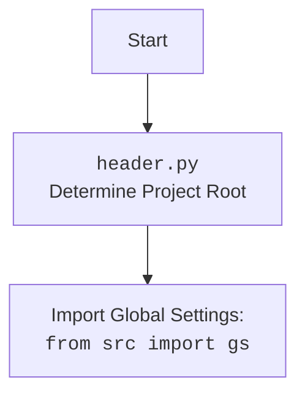

## <алгоритм>

**1. `set_project_root(marker_files)`**

   - **Начало**: Функция `set_project_root` принимает кортеж `marker_files` (например, `('__root__', '.git')`) в качестве входных данных.
   - **Инициализация**:
     -   Переменной `current_path` присваивается абсолютный путь к каталогу, в котором находится текущий файл (`header.py`).
         *  Пример: Если файл `header.py` расположен в `/home/user/hypotez/src/ai/helicone`, то `current_path` будет `/home/user/hypotez/src/ai/helicone`.
     -  Переменной `__root__` присваивается значение `current_path`.
   - **Поиск родительских каталогов**:
     -   Перебираются родительские каталоги, начиная с текущего.
          *  Пример: для `current_path` = `/home/user/hypotez/src/ai/helicone` будут перебраны `/home/user/hypotez/src/ai/helicone`, `/home/user/hypotez/src/ai`, `/home/user/hypotez/src`, `/home/user/hypotez`, `/home/user`, `/home`, `/`.
     -   Для каждого каталога `parent` проверяется, существует ли в нём любой из `marker_files`.
         *  Пример: Для `/home/user/hypotez/src/ai` проверяется существование `/home/user/hypotez/src/ai/__root__` и `/home/user/hypotez/src/ai/.git`.
     -   Если хотя бы один из файлов-маркеров найден, `__root__` обновляется до `parent` и цикл завершается.
         *  Пример: Если файл `__root__` найден в `/home/user/hypotez`, то `__root__` становится `/home/user/hypotez`.
   - **Обновление `sys.path`**:
     -   Если найденный `__root__` отсутствует в `sys.path`, то он добавляется в начало списка путей поиска модулей.
   - **Возврат**:
     -   Функция возвращает `__root__` — путь к корневому каталогу проекта.
         * Пример: `/home/user/hypotez`.

**2. Загрузка конфигурации**

   - **Вызов `set_project_root`**: вызывается `set_project_root` для определения корневой директории проекта и присвоения результата переменной `__root__` типа `Path`.
   - **Импорт `gs`**: Импортируется `gs` из `src`, предположительно содержащий глобальные настройки (пути).
   - **Чтение `config.json`**:
     -   Файл `config.json` в подкаталоге `src` загружается в переменную `config` как словарь Python.
     -   Если файл не найден или содержит некорректный JSON, выполняется обработка исключения `FileNotFoundError`, `json.JSONDecodeError`.
   - **Чтение `README.MD`**:
     -   Файл `README.MD` в подкаталоге `src` загружается в переменную `doc_str` как строка.
     -   Если файл не найден или происходит ошибка, выполняется обработка исключения `FileNotFoundError`, `json.JSONDecodeError`.

**3. Извлечение данных из конфигурации**

   - **Извлечение `__project_name__`**:
     -   Извлекается значение ключа `project_name` из `config`, иначе по умолчанию используется `hypotez`.
   - **Извлечение `__version__`**:
     -   Извлекается значение ключа `version` из `config`, иначе по умолчанию используется пустая строка.
   - **Присвоение `__doc__`**:
     -   Присваивается `doc_str`, если она не пуста, иначе - пустая строка.
   - **Присвоение `__details__`**:
     -    Присваивается пустая строка.
   - **Извлечение `__author__`**:
       - Извлекается значение ключа `author` из `config`, иначе по умолчанию используется пустая строка.
   - **Извлечение `__copyright__`**:
       - Извлекается значение ключа `copyrihgnt` из `config`, иначе по умолчанию используется пустая строка.
   - **Извлечение `__cofee__`**:
       - Извлекается значение ключа `cofee` из settings, иначе по умолчанию используется строка "Treat the developer to a cup of coffee for boosting enthusiasm in development: https://boosty.to/hypo69". Если settings = None то используется строка "Treat the developer to a cup of coffee for boosting enthusiasm in development: https://boosty.to/hypo69".

## <mermaid>

```mermaid
flowchart TD
    Start[Start] --> FindRoot[<code>set_project_root()</code><br>Determine Project Root];
    FindRoot --> SetRoot[Set <code>__root__</code> to project root path];
    SetRoot --> ImportGS[Import Global Settings: <br><code>from src import gs</code>];
    ImportGS --> ReadConfig[Read <code>config.json</code> file];
    ReadConfig -- "Success" --> ReadDoc[Read <code>README.MD</code> file];
    ReadConfig -- "File Not Found" --> ReadDoc[Read <code>README.MD</code> file];
    ReadDoc -- "Success" --> ExtractData[Extract data from <code>config</code> and <code>README.MD</code>];
    ReadDoc -- "File Not Found" --> ExtractData[Extract data from <code>config</code> and <code>README.MD</code>];
    ExtractData --> SetVariables[Set global variables: <br><code>__project_name__</code>,<code>__version__</code>,<br><code>__doc__</code>, <code>__author__</code>,<br><code>__copyright__</code>,<code>__cofee__</code> ];
    SetVariables --> End[End];
```



## <объяснение>

**Импорты:**

*   `sys`: Модуль `sys` используется для доступа к некоторым переменным и функциям, взаимодействующим с интерпретатором Python. В данном случае он используется для добавления пути к корневой директории проекта в `sys.path`, что позволяет импортировать модули из этого каталога.
*   `json`: Модуль `json` используется для работы с данными в формате JSON. Он применяется для загрузки данных из файла `config.json` в словарь Python.
*   `packaging.version`: Модуль `packaging.version` используется для работы с версиями, например, для сравнения, сортировки и т. д. В данном случае он не используется, но импортируется (возможно, для дальнейшего использования в коде).
*   `pathlib.Path`:  Класс `Path` из модуля `pathlib` используется для представления путей к файлам и директориям, что упрощает работу с файловой системой. Он используется для представления путей и манипулирования ими.

**Функции:**

*   `set_project_root(marker_files: tuple) -> Path`:
    *   **Аргументы**:
        *   `marker_files` (tuple): Кортеж имен файлов или каталогов, которые используются для определения корня проекта (по умолчанию `('__root__', '.git')`).
    *   **Возвращаемое значение**:
        *   `Path`: Объект `Path`, представляющий путь к корневому каталогу проекта.
    *   **Назначение**:
        *   Функция определяет корень проекта, поднимаясь вверх по иерархии каталогов от текущего файла и останавливаясь на первом каталоге, содержащем хотя бы один из файлов-маркеров. Она также добавляет путь к корню проекта в `sys.path`, позволяя импортировать модули из этого каталога.
    *   **Примеры**:
        *   Если маркерный файл `__root__` найден в каталоге `/home/user/hypotez`, то функция вернет `Path('/home/user/hypotez')`.
        *   Если ни один из маркеров не найден, то функция вернет путь к каталогу, в котором находится файл `header.py`.
*   `open(...)`: встроенная функция для открытия файлов.
    *    **Примеры**: `with open(gs.path.root / 'src' / 'config.json', 'r') as f:` открывает файл `config.json` для чтения.
*   `json.load(f)`: функция для загрузки данных из открытого файла в формате json.
     * **Примеры**: `config = json.load(f)` загружает данные из файла json в словарь Python `config`.

**Переменные:**

*   `__root__` (`Path`): Путь к корневому каталогу проекта.
*   `config` (`dict`): Словарь, содержащий данные конфигурации, загруженные из файла `config.json`. Может быть `None`, если файл не найден или содержит некорректный JSON.
*   `doc_str` (`str`): Строка, содержащая содержимое файла `README.MD`. Может быть `None`, если файл не найден.
*   `__project_name__` (`str`): Имя проекта, загруженное из конфигурации или `hypotez` по умолчанию.
*   `__version__` (`str`): Версия проекта, загруженная из конфигурации.
*   `__doc__` (`str`): Строка документации, загруженная из `README.MD`.
*   `__details__` (`str`): Пустая строка.
*   `__author__` (`str`): Автор проекта, загруженный из конфигурации.
*   `__copyright__` (`str`): Информация об авторских правах, загруженная из конфигурации.
*   `__cofee__` (`str`): Строка, предлагающая поддержать разработчика чашечкой кофе.

**Взаимосвязь с другими частями проекта:**

*   Модуль `header.py` является основой для многих других модулей, так как он определяет корневой каталог проекта и загружает общие настройки.
*   Импорт `from src import gs` указывает на зависимость от модуля `gs` внутри пакета `src`, который, вероятно, содержит общие пути и настройки.
*   Чтение файлов `config.json` и `README.MD` демонстрирует зависимость от данных конфигурации и документации проекта.

**Потенциальные ошибки и области для улучшения:**

*   **Обработка исключений**: Обработка исключений `FileNotFoundError` и `json.JSONDecodeError` является базовой. В реальных условиях может потребоваться более подробная обработка или логирование ошибок.
*   **Зависимость от `gs`**: Зависимость от `src.gs` не совсем ясна, и ее следует изучить, чтобы убедиться, что это правильная зависимость.
*   **Обработка отсутствия ключей в `config`**: Код обрабатывает отсутствующие ключи в словаре `config` путем возврата значений по умолчанию, что хорошо, но можно добавить логирование, чтобы выявить проблемы с конфигурацией.
*   **Объявление типов**: Код использует объявления типов (например, `__root__:Path`), но не проверяет их во время выполнения. Можно рассмотреть возможность использования инструментов проверки типов.

**Цепочка взаимосвязей:**

1.  `header.py` определяет корень проекта и добавляет его в `sys.path`.
2.  `header.py` загружает общую конфигурацию из `config.json`.
3.  `header.py` импортирует `gs` из `src`, предполагается, что он содержит глобальные пути и настройки.
4.  Другие модули импортируют `header.py` и, таким образом, получают доступ к корневому каталогу, конфигурации и другим настройкам.
5.  Взаимодействия с другими модулями и компонентами проекта используют `__root__`, `config`, `__project_name__`, `__version__`, `__doc__`, `__author__`, `__copyright__`, `__cofee__`,  для работы с путями, настройками и др.

Этот подробный анализ обеспечивает полное понимание функциональности кода, его зависимостей и потенциальных улучшений.