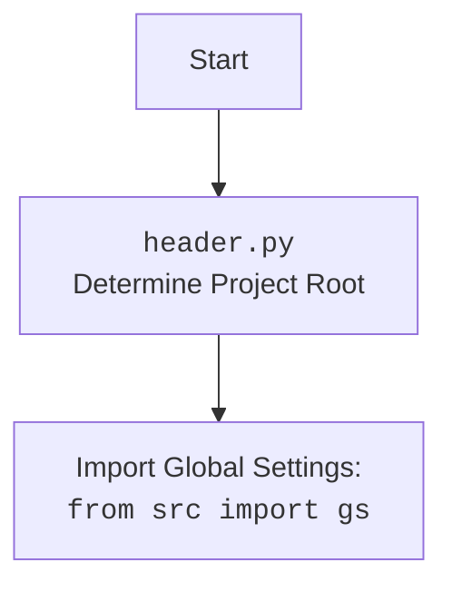

## ИНСТРУКЦИЯ:

Анализируй предоставленный код подробно и объясни его функциональность. Ответ должен включать три раздела:

1.  **<алгоритм>**: Опиши рабочий процесс в виде пошаговой блок-схемы, включая примеры для каждого логического блока, и проиллюстрируй поток данных между функциями, классами или методами.
2.  **<mermaid>**: Напиши код для диаграммы в формате `mermaid`, проанализируй и объясни все зависимости,
    которые импортируются при создании диаграммы.
    **ВАЖНО!** Убедитесь, что все имена переменных, используемые в диаграмме `mermaid`,
    имеют осмысленные и описательные имена. Имена переменных вроде `A`, `B`, `C`, и т.д., не допускаются!

    **Дополнительно**: Если в коде есть импорт `import header`, добавьте блок `mermaid` flowchart, объясняющий `header.py`:
    ```mermaid
    flowchart TD
        Start --> Header[<code>header.py</code><br> Determine Project Root]

        Header --> import[Import Global Settings: <br><code>from src import gs</code>]
    ```

3.  **<объяснение>**: Предоставьте подробные объяснения:
    - **Импорты**: Их назначение и взаимосвязь с другими пакетами `src.`.
    - **Классы**: Их роль, атрибуты, методы и взаимодействие с другими компонентами проекта.
    - **Функции**: Их аргументы, возвращаемые значения, назначение и примеры.
    - **Переменные**: Их типы и использование.
    - Выделите потенциальные ошибки или области для улучшения.

Дополнительно, постройте цепочку взаимосвязей с другими частями проекта (если применимо).

Это обеспечивает всесторонний и структурированный анализ кода.
## Формат ответа: `.md` (markdown)
**КОНЕЦ ИНСТРУКЦИИ**

## <алгоритм>

1. **Инициализация `HeliconeAI`**:
   - Создается экземпляр класса `HeliconeAI`.
   - В конструкторе `__init__` создаются экземпляры `Helicone` и `OpenAI`.

2. **Генерация стихотворения (`generate_poem`)**:
   - Принимается `prompt` (например, "Напиши мне стихотворение про кота.") в виде строки.
   - Вызывается метод `client.chat.completions.create` с моделью "gpt-3.5-turbo" и `prompt` в виде сообщения.
   - Результат запроса (ответ API OpenAI) передается в `helicone.log_completion` для логирования.
   - Возвращается сгенерированное стихотворение из `response.choices[0].message.content`.

3. **Анализ тональности (`analyze_sentiment`)**:
    - Принимается `text` (например, "Сегодня был отличный день!") в виде строки.
    - Формируется промпт для анализа тональности: "Analyze the sentiment of the following text: {text}".
    - Вызывается метод `client.completions.create` с моделью "text-davinci-003", промптом и ограничением `max_tokens`.
    - Результат запроса передается в `helicone.log_completion` для логирования.
    - Возвращается результат анализа тональности из `response.choices[0].text.strip()`.

4. **Краткое изложение текста (`summarize_text`)**:
    - Принимается `text` (например, "Длинный текст для изложения...") в виде строки.
    - Формируется промпт для изложения: "Summarize the following text: {text}".
    - Вызывается метод `client.completions.create` с моделью "text-davinci-003", промптом и ограничением `max_tokens`.
    - Результат запроса передается в `helicone.log_completion` для логирования.
    - Возвращается краткое изложение текста из `response.choices[0].text.strip()`.

5. **Перевод текста (`translate_text`)**:
    - Принимаются `text` (например, "Hello, how are you?") и `target_language` (например, "русский") в виде строк.
    - Формируется промпт для перевода: "Translate the following text to {target_language}: {text}".
    - Вызывается метод `client.completions.create` с моделью "text-davinci-003", промптом и ограничением `max_tokens`.
    - Результат запроса передается в `helicone.log_completion` для логирования.
    - Возвращается переведенный текст из `response.choices[0].text.strip()`.

6. **Основная функция `main`**:
    - Создается экземпляр `HeliconeAI`.
    - Вызываются методы `generate_poem`, `analyze_sentiment`, `summarize_text` и `translate_text` с различными входными данными.
    - Результаты вывоводятся на консоль.

## <mermaid>

```mermaid
flowchart TD
    Start[Start] --> InitHeliconeAI[Initialize HeliconeAI]
    InitHeliconeAI --> GeneratePoemCall[Call generate_poem with prompt]
    GeneratePoemCall --> GeneratePoemFunction[<code>generate_poem</code><br>Prompt: "Напиши мне стихотворение про кота."]
    GeneratePoemFunction --> CreateChatCompletion[<code>client.chat.completions.create</code><br>Model: gpt-3.5-turbo]
    CreateChatCompletion --> LogCompletion1[<code>helicone.log_completion</code><br>Log API Response]
    LogCompletion1 --> ReturnPoem[Return Generated Poem]
    ReturnPoem --> PrintPoem[Print Generated Poem]
     PrintPoem --> AnalyzeSentimentCall[Call analyze_sentiment with text]
    AnalyzeSentimentCall --> AnalyzeSentimentFunction[<code>analyze_sentiment</code><br>Text: "Сегодня был отличный день!"]
    AnalyzeSentimentFunction --> CreateCompletion1[<code>client.completions.create</code><br>Model: text-davinci-003]
    CreateCompletion1 --> LogCompletion2[<code>helicone.log_completion</code><br>Log API Response]
    LogCompletion2 --> ReturnSentiment[Return Sentiment Analysis Result]
    ReturnSentiment --> PrintSentiment[Print Sentiment Analysis Result]
    PrintSentiment --> SummarizeTextCall[Call summarize_text with text]
    SummarizeTextCall --> SummarizeTextFunction[<code>summarize_text</code><br>Text: "Длинный текст для изложения..."]
    SummarizeTextFunction --> CreateCompletion2[<code>client.completions.create</code><br>Model: text-davinci-003]
    CreateCompletion2 --> LogCompletion3[<code>helicone.log_completion</code><br>Log API Response]
    LogCompletion3 --> ReturnSummary[Return Summary of Text]
    ReturnSummary --> PrintSummary[Print Summary of Text]
    PrintSummary --> TranslateTextCall[Call translate_text with text and language]
    TranslateTextCall --> TranslateTextFunction[<code>translate_text</code><br>Text: "Hello, how are you?", Target Language: "русский"]
    TranslateTextFunction --> CreateCompletion3[<code>client.completions.create</code><br>Model: text-davinci-003]
    CreateCompletion3 --> LogCompletion4[<code>helicone.log_completion</code><br>Log API Response]
    LogCompletion4 --> ReturnTranslation[Return Translated Text]
    ReturnTranslation --> PrintTranslation[Print Translated Text]
    PrintTranslation --> End[End]


    classDef function fill:#f9f,stroke:#333,stroke-width:2px
    class GeneratePoemFunction,AnalyzeSentimentFunction,SummarizeTextFunction,TranslateTextFunction function
```



**Объяснение `mermaid`:**

-   **`Start`**: Начало программы.
-   **`InitHeliconeAI`**: Инициализация экземпляра класса `HeliconeAI`, который включает в себя инициализацию `Helicone` и `OpenAI`
    -   **Зависимости**:
        -   `HeliconeAI` зависит от классов `Helicone` и `OpenAI`.
-   **`GeneratePoemCall`**: Вызов метода `generate_poem` с заданным промптом.
    -   **Данные**: Передается строка-промпт.
-   **`GeneratePoemFunction`**: Выполнение функции `generate_poem`
    -   **Данные**: Принимает строку-промпт.
    -   **Действия**: Формирует запрос к OpenAI, используя `client.chat.completions.create`
        -   **Зависимости**:
            -   Метод `generate_poem` использует `client.chat.completions.create` из `OpenAI`.
    -    **Данные**: Отправляет промпт  в API OpenAI.
-  **`CreateChatCompletion`**: Создание запроса на чат-завершение с помощью модели `gpt-3.5-turbo`
   -    **Данные**: Передает запрос  в API OpenAI.
-   **`LogCompletion1`**: Логирование завершения запроса с помощью `helicone.log_completion`.
    -   **Данные**: Принимает ответ от API OpenAI.
        -   **Зависимости**:
            -   Использует метод `log_completion` класса `Helicone`.
-   **`ReturnPoem`**: Возвращение сгенерированного стихотворения.
    -   **Данные**: Возвращает строку с стихотворением.
-   **`PrintPoem`**: Вывод сгенерированного стихотворения на консоль.
    -   **Данные**: Принимает строку с стихотворением для вывода.
-   **`AnalyzeSentimentCall`**: Вызов метода `analyze_sentiment` с заданным текстом.
    -   **Данные**: Передается строка текста.
-  **`AnalyzeSentimentFunction`**: Выполнение функции `analyze_sentiment`
    -   **Данные**: Принимает строку текста.
    -   **Действия**: Формирует запрос к OpenAI, используя `client.completions.create`
    -   **Зависимости**:
        -   Метод `analyze_sentiment` использует `client.completions.create` из `OpenAI`.
    - **Данные**: Отправляет запрос в API OpenAI.
-  **`CreateCompletion1`**: Создание запроса на текстовое завершение с помощью модели `text-davinci-003`
    -   **Данные**: Передает запрос  в API OpenAI.
-   **`LogCompletion2`**: Логирование завершения запроса с помощью `helicone.log_completion`.
     -   **Данные**: Принимает ответ от API OpenAI.
        -   **Зависимости**:
            -   Использует метод `log_completion` класса `Helicone`.
-   **`ReturnSentiment`**: Возвращение результата анализа тональности.
    -   **Данные**: Возвращает строку с анализом тональности.
-   **`PrintSentiment`**: Вывод результата анализа тональности на консоль.
    -   **Данные**: Принимает строку с анализом тональности для вывода.
-   **`SummarizeTextCall`**: Вызов метода `summarize_text` с заданным текстом.
    -   **Данные**: Передается строка текста.
- **`SummarizeTextFunction`**: Выполнение функции `summarize_text`
    - **Данные**: Принимает строку текста.
    - **Действия**: Формирует запрос к OpenAI, используя `client.completions.create`
    - **Зависимости**:
        - Метод `summarize_text` использует `client.completions.create` из `OpenAI`.
     - **Данные**: Отправляет запрос в API OpenAI.
-  **`CreateCompletion2`**: Создание запроса на текстовое завершение с помощью модели `text-davinci-003`
   -    **Данные**: Передает запрос  в API OpenAI.
-   **`LogCompletion3`**: Логирование завершения запроса с помощью `helicone.log_completion`.
     -   **Данные**: Принимает ответ от API OpenAI.
        -   **Зависимости**:
            -   Использует метод `log_completion` класса `Helicone`.
-   **`ReturnSummary`**: Возвращение краткого изложения текста.
    -   **Данные**: Возвращает строку с кратким изложением.
-   **`PrintSummary`**: Вывод краткого изложения текста на консоль.
    -   **Данные**: Принимает строку с кратким изложением для вывода.
-  **`TranslateTextCall`**: Вызов метода `translate_text` с заданным текстом и языком.
   -    **Данные**: Передается строка текста и целевой язык перевода.
-   **`TranslateTextFunction`**: Выполнение функции `translate_text`
    -   **Данные**: Принимает строку текста и целевой язык перевода.
    -   **Действия**: Формирует запрос к OpenAI, используя `client.completions.create`
    -    **Зависимости**:
         -   Метод `translate_text` использует `client.completions.create` из `OpenAI`.
    - **Данные**: Отправляет запрос в API OpenAI.
-  **`CreateCompletion3`**: Создание запроса на текстовое завершение с помощью модели `text-davinci-003`
    -   **Данные**: Передает запрос  в API OpenAI.
-   **`LogCompletion4`**: Логирование завершения запроса с помощью `helicone.log_completion`.
     -   **Данные**: Принимает ответ от API OpenAI.
        -   **Зависимости**:
            -   Использует метод `log_completion` класса `Helicone`.
-   **`ReturnTranslation`**: Возвращение переведенного текста.
    -   **Данные**: Возвращает строку с переводом.
-   **`PrintTranslation`**: Вывод переведенного текста на консоль.
     -   **Данные**: Принимает строку с переводом для вывода.
-   **`End`**: Конец программы.

## <объяснение>

**Импорты:**

-   `import header`: Импортирует модуль `header`, который, предположительно, устанавливает путь к корню проекта и загружает глобальные настройки.

-   `from helicone import Helicone`: Импортирует класс `Helicone` из пакета `helicone`. Этот класс используется для логирования запросов к API.

-   `from openai import OpenAI`: Импортирует класс `OpenAI` из пакета `openai`. Этот класс используется для взаимодействия с API OpenAI.

**Классы:**

-   **`HeliconeAI`**:
    -   **Роль**: Класс инкапсулирует логику взаимодействия с API OpenAI и Helicone.
    -   **Атрибуты**:
        -   `helicone`: Экземпляр класса `Helicone` для логирования запросов.
        -   `client`: Экземпляр класса `OpenAI` для взаимодействия с API OpenAI.
    -   **Методы**:
        -   `__init__(self)`: Конструктор класса, инициализирует атрибуты `helicone` и `client`.
        -   `generate_poem(self, prompt: str) -> str`: Генерирует стихотворение на основе промпта.
            -   **Аргументы**:
                -   `prompt` (str): Текст промпта для генерации стихотворения.
            -   **Возвращает**:
                -   `str`: Сгенерированное стихотворение.
        -   `analyze_sentiment(self, text: str) -> str`: Анализирует тональность текста.
            -   **Аргументы**:
                -   `text` (str): Текст для анализа тональности.
            -   **Возвращает**:
                -   `str`: Результат анализа тональности.
        -   `summarize_text(self, text: str) -> str`: Создает краткое изложение текста.
            -   **Аргументы**:
                -   `text` (str): Текст для изложения.
            -   **Возвращает**:
                -   `str`: Краткое изложение текста.
        -   `translate_text(self, text: str, target_language: str) -> str`: Переводит текст на указанный язык.
            -   **Аргументы**:
                -   `text` (str): Текст для перевода.
                -   `target_language` (str): Целевой язык перевода.
            -   **Возвращает**:
                -   `str`: Переведенный текст.
    -   **Взаимодействие**:
        -   Использует `Helicone` для логирования запросов.
        -   Использует `OpenAI` для генерации текста, анализа тональности, изложения и перевода.

**Функции:**

-   `main()`:
    -   **Роль**: Основная функция, которая создает экземпляр `HeliconeAI` и вызывает его методы для демонстрации функциональности.
    -   **Действия**:
        -   Создает экземпляр `HeliconeAI`.
        -   Вызывает методы `generate_poem`, `analyze_sentiment`, `summarize_text` и `translate_text` с различными входными данными.
        -   Выводит результаты на консоль.
    -   **Примеры**:
        -   Вызов `generate_poem` с промптом "Напиши мне стихотворение про кота."
        -   Вызов `analyze_sentiment` с текстом "Сегодня был отличный день!"
        -   Вызов `summarize_text` с текстом "Длинный текст для изложения..."
        -   Вызов `translate_text` с текстом "Hello, how are you?" и целевым языком "русский"

**Переменные:**

-   `helicone_ai`: Экземпляр класса `HeliconeAI`, используемый в `main()` для вызова методов.
-   `poem`: Строковая переменная, хранящая сгенерированное стихотворение.
-   `sentiment`: Строковая переменная, хранящая результат анализа тональности.
-   `summary`: Строковая переменная, хранящая краткое изложение текста.
-   `translation`: Строковая переменная, хранящая переведенный текст.
-   `prompt` : Строковая переменная, хранящая запрос для модели.
-   `text`: Строковая переменная, хранящая текст для обработки.
-   `target_language` : Строковая переменная, хранящая целевой язык перевода.
-   `response`: Переменная, хранящая ответ от API OpenAI (объект).

**Потенциальные ошибки или области для улучшения:**

-   **Обработка ошибок API:** Код не обрабатывает потенциальные ошибки при вызовах API OpenAI. Необходимо добавить обработку исключений для таких случаев (например, тайм-ауты, ошибки авторизации, превышение лимитов).
-   **Управление параметрами API:** Параметры моделей (например, `temperature`, `top_p`) не настраиваются. Следует добавить возможность настройки параметров запросов.
-   **Абстракция моделей OpenAI:** Модели `"gpt-3.5-turbo"` и `"text-davinci-003"`  захардкожены в коде. Нужно сделать выбор модели гибким.
-   **Логирование:** `helicone.log_completion` не демонстрирует, как именно происходит логирование.

**Взаимосвязь с другими частями проекта:**

-   Модуль `header` используется для определения корня проекта и импорта глобальных настроек, что позволяет коду находить необходимые ресурсы и конфигурации.
-   Зависимость от `helicone` и `openai` указывает на интеграцию с этими библиотеками для логирования и доступа к моделям AI.
-   Потенциально, этот модуль может использоваться в других частях проекта для интеграции с AI моделями.

В целом, код предоставляет базовую функциональность для взаимодействия с API OpenAI через класс `HeliconeAI`, позволяя выполнять задачи генерации текста, анализа тональности, изложения и перевода. Однако требует улучшения в обработке ошибок, управлении параметрами и абстракции моделей.