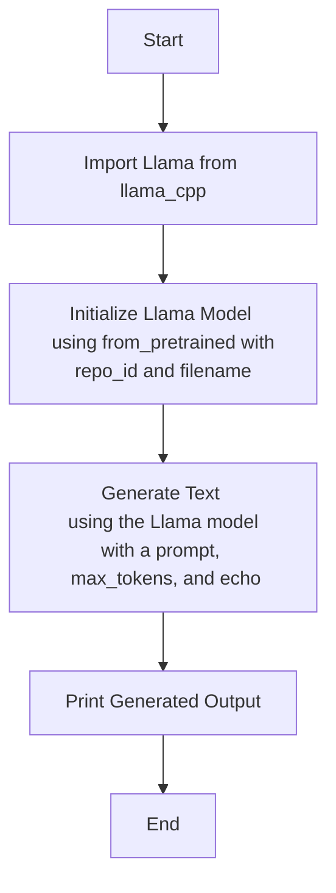

## АНАЛИЗ КОДА: `src/ai/llama/model.py`

### <алгоритм>

1.  **Импорт `Llama`:** Импортируется класс `Llama` из библиотеки `llama_cpp`, который используется для работы с языковой моделью Llama.
    *   Пример: `from llama_cpp import Llama`
2.  **Создание экземпляра `Llama`:**  Создается экземпляр класса `Llama` с использованием метода `from_pretrained`.  Указывается путь к репозиторию модели и имя файла модели.
    *   Пример:
        ```python
        llm = Llama.from_pretrained(
            repo_id="lmstudio-community/Meta-Llama-3.1-8B-Instruct-GGUF",
            filename="Meta-Llama-3.1-8B-Instruct-IQ4_XS.gguf",
        )
        ```
3.  **Вызов модели:** Вызывается метод `__call__` объекта `llm` (созданного экземпляра `Llama`), чтобы сгенерировать текст на основе заданной подсказки. Указываются параметры, такие как максимальное количество токенов и флаг `echo`.
    *   Пример:
        ```python
        output = llm(
            "Once upon a time,",
            max_tokens=512,
            echo=True
        )
        ```
4.  **Вывод результата:**  Результат генерации текста выводится в консоль.
    *   Пример: `print(output)`

### <mermaid>



**Анализ зависимостей (mermaid):**

*   **`Start`**: Начало выполнения скрипта.
*   **`ImportLlama`**: Импортируется класс `Llama` из библиотеки `llama_cpp`. Это ключевая зависимость для работы с моделью Llama.
*   **`InitializeLlama`**: Инициализируется экземпляр класса `Llama` с помощью метода `from_pretrained`. Для этого необходимы `repo_id` (идентификатор репозитория модели) и `filename` (имя файла модели). Это устанавливает связь с предобученной моделью.
*   **`GenerateText`**: Используется метод `__call__` объекта `Llama` для генерации текста на основе входной строки (промпта), максимального количества токенов (`max_tokens`) и флага `echo`.
*   **`PrintOutput`**: Выводит сгенерированный текст в консоль.
*   **`End`**: Конец выполнения скрипта.

### <объяснение>

**Импорты:**

*   `from llama_cpp import Llama`:
    *   `llama_cpp` - это Python-обёртка для библиотеки `llama.cpp`, которая позволяет работать с языковыми моделями Llama. Импортируется класс `Llama`, который обеспечивает основной интерфейс для взаимодействия с моделью. Этот класс используется для загрузки модели и генерации текста. Без него код не сможет взаимодействовать с моделью Llama.

**Классы:**

*   `Llama`:
    *   `Llama` это класс из библиотеки `llama_cpp` для работы с языковыми моделями Llama.
    *   Основные методы:
        *   `from_pretrained(repo_id, filename)` - статический метод, который загружает предварительно обученную модель Llama из указанного репозитория и файла.
        *   `__call__(prompt, max_tokens, echo)` - метод, вызываемый как функция, для генерации текста на основе входного промпта.
    *   Взаимодействие: Экземпляр `Llama` создается на основе конфигурации `repo_id` и `filename` и используется для генерации текста.

**Функции:**

*   `Llama.from_pretrained(repo_id, filename)`:
    *   Аргументы:
        *   `repo_id`: строка, идентификатор репозитория модели на Hugging Face.
        *   `filename`: строка, имя файла модели.
    *   Возвращает: Экземпляр класса `Llama`.
    *   Назначение: Загружает предварительно обученную языковую модель Llama.
*   `llm.__call__(prompt, max_tokens, echo)`:
    *   Аргументы:
        *   `prompt`: строка, входной текст для генерации.
        *   `max_tokens`: целое число, максимальное количество токенов для генерации.
        *   `echo`: булево значение, флаг для вывода входного промпта вместе с сгенерированным текстом.
    *   Возвращает: Словарь, содержащий сгенерированный текст и другую информацию.
    *   Назначение: Генерирует текст на основе входного промпта, используя модель Llama.
*   `print(output)`:
    *   Аргументы: `output` - словарь, который возвращает модель.
    *   Возвращает: Ничего.
    *   Назначение: Выводит сгенерированный текст в консоль.

**Переменные:**

*   `llm`: Экземпляр класса `Llama`, представляет загруженную модель.
*   `output`: Словарь, хранящий результат работы метода `__call__` модели `llm`.
*  `repo_id`: Строка, представляющая идентификатор репозитория модели на Hugging Face.
* `filename`: Строка, представляющая имя файла модели.

**Потенциальные ошибки и области для улучшения:**

1.  **Обработка ошибок:**  Код не содержит обработки ошибок, например, ошибок при загрузке модели или при генерации текста. Желательно добавить блоки `try-except` для перехвата исключений.
2.  **Конфигурация модели:** Пути к репозиторию и файлу модели заданы непосредственно в коде. Лучше использовать переменные окружения или файл конфигурации для большей гибкости.
3.  **Параметры модели:** Параметры `max_tokens` и другие параметры генерации также можно вынести в конфигурацию.
4.  **Логирование:**  Добавить логирование для отслеживания хода выполнения и ошибок.
5.  **Использование GPU:**  Если доступна GPU, использовать её для ускорения работы модели.

**Цепочка взаимосвязей с другими частями проекта:**

*   Этот файл является частью модуля `src.ai.llama`, что предполагает наличие других связанных файлов.  Этот файл полагается на `llama_cpp` для работы с Llama.
*   Предполагается, что другие модули проекта будут использовать этот модуль (`src.ai.llama`) для генерации текста с помощью языковой модели Llama.