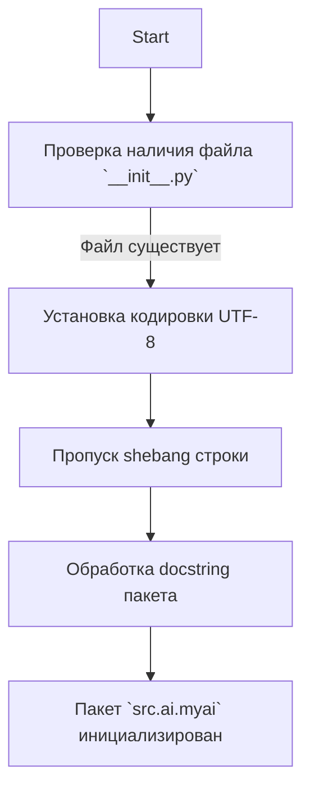

# Анализ кода `src/ai/myai/__init__.py`

## <алгоритм>

Файл `__init__.py` в Python является специальным файлом, который сигнализирует интерпретатору Python, что директория должна рассматриваться как пакет. В данном случае, файл `__init__.py` находится в директории `src/ai/myai`, что указывает на то, что `myai` является подпакетом пакета `ai` в рамках проекта `src`.

Этот конкретный файл `__init__.py` в текущем состоянии является минимальным: он не содержит никакого исполняемого кода, кроме объявления кодировки и docstring. 

Пошаговая блок-схема:

1. **Начало:** Запуск интерпретатора Python при обращении к пакету `src.ai.myai`.
2. **Анализ `__init__.py`:** Интерпретатор проверяет наличие и содержимое файла `__init__.py` в директории `src/ai/myai`.
3. **Обработка кодировки:** Интерпретатор устанавливает кодировку файла как UTF-8, как указано в первой строке `# -*- coding: utf-8 -*-`.
4. **Проверка shebang:** Интерпретатор игнорирует shebang `#! venv/bin/python/python3.12` так как это не исполняемый скрипт, а файл инициализации пакета.
5. **Обработка docstring:** Интерпретатор воспринимает docstring как описание пакета `src.ai.myai`, не выполняя никаких действий.
6. **Завершение:** Завершение обработки `__init__.py`, пакет `src.ai.myai` считается инициализированным.
   
Пример:

```
    Start --> Check_init[Проверка наличия `__init__.py` в `src/ai/myai`]
    Check_init -- Есть файл --> Set_encoding[Установка кодировки UTF-8]
    Set_encoding --> Check_shebang[Проверка shebang]
    Check_shebang --> Process_docstring[Обработка docstring]
    Process_docstring --> End[Пакет `src.ai.myai` инициализирован]
```

## <mermaid>



**Объяснение `mermaid` диаграммы:**

-   **Start:** Начальная точка процесса инициализации пакета.
-   **CheckInitFile:** Проверка наличия файла `__init__.py` в директории `src/ai/myai`. Этот файл является обязательным для того, чтобы директория считалась Python-пакетом.
-   **SetEncoding:** Установка кодировки файла в UTF-8 для корректной обработки текста.
-   **ProcessShebang:** Пропуск строки shebang, так как `__init__.py` не является исполняемым скриптом.
-   **ProcessDocstring:** Обработка docstring, который служит для документации пакета.
-   **End:** Конечная точка, означающая, что пакет `src.ai.myai` успешно инициализирован.

## <объяснение>

**Импорты:**
-   В данном файле нет явных импортов, но наличие `__init__.py` в директории `src/ai/myai` позволяет другим частям проекта импортировать модули или подпакеты из `src.ai.myai` как пакет. Например, `from src.ai.myai import some_module`.
   
**Классы:**
-  Файл `__init__.py` не содержит никаких объявлений классов в этом примере.

**Функции:**
-   Файл не содержит никаких функций. Его назначение - инициализировать пакет `src.ai.myai`.

**Переменные:**
- Файл не содержит никаких переменных.

**Дополнительно:**
-   Файл `__init__.py` может быть пустым, но его наличие в директории превращает её в Python-пакет, позволяя импортировать модули и подпакеты из неё.
-   Этот конкретный файл `__init__.py` выполняет минимальную роль и не содержит никакого исполняемого кода. Он используется, в основном, для того, чтобы Python распознавал директорию `myai` как пакет.
-   Это начальный уровень инициализации пакета, в котором обычно размещаются импорты, переменные и функции, которые должны быть доступны при импорте этого пакета.
-   В будущем этот файл может быть дополнен для более сложной инициализации пакета.
-   Кодировка UTF-8 обеспечивает корректную обработку символов.
-   Docstring используется для документации пакета `src.ai.myai`.
-   Shebang строка указывает путь к интерпретатору Python для исполняемых файлов и здесь игнорируется.

**Цепочка взаимосвязей:**

1.  `src`: Корень проекта.
2.  `src/ai`: Подпакет, отвечающий за ИИ-функциональность.
3.  `src/ai/myai`: Подпакет, возможно, отвечающий за конкретные реализации ИИ, в рамках проекта.

При импорте из других частей проекта, например:
`from src.ai.myai import my_module`

Python будет использовать `__init__.py` в качестве отправной точки, чтобы распознать `myai` как пакет и найти модуль `my_module` внутри него.