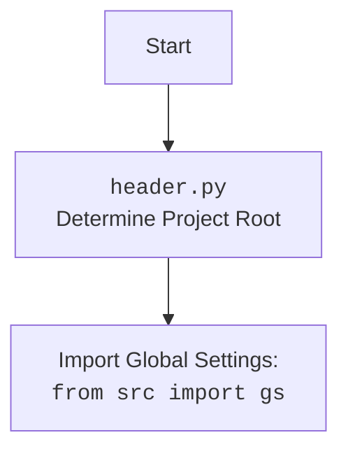

## <алгоритм>

1.  **Определение корневой директории проекта (`set_project_root`)**:
    *   Начало: Функция `set_project_root` вызывается с кортежем `marker_files`, по умолчанию равным `('__root__', '.git')`.
    *   Получение текущего пути: Определяется абсолютный путь к директории, где находится текущий файл (`header.py`).
        *   Пример: Если файл расположен по пути `/home/user/hypotez/src/ai/myai/header.py`, то `current_path` будет `/home/user/hypotez/src/ai/myai`.
    *   Установка начального значения корневой директории: Изначально `__root__` устанавливается равным `current_path`.
    *   Поиск корневой директории:
        *   Цикл проходит по текущей директории и всем ее родительским директориям.
        *   Для каждой директории проверяется, существует ли в ней какой-либо из `marker_files`.
            *   Пример: Для директории `/home/user/hypotez/src/ai/myai` проверяется наличие файлов/папок `__root__` или `.git`.
        *   Если один из маркерных файлов найден, то эта директория становится корневой `__root__`.
        *   Цикл прерывается.
    *   Добавление корневой директории в `sys.path`: Если корневая директория еще не в `sys.path`, она добавляется в начало.
    *   Возвращение: Функция возвращает объект `Path`, представляющий корневую директорию.

2.  **Загрузка настроек из `settings.json`**:
    *   Попытка открытия файла `settings.json`: Попытка открыть файл по пути, сформированному как `root/src/settings.json`, где `root` — это корневая директория, определенная на предыдущем шаге.
    *   Чтение и парсинг JSON: Если файл открыт успешно, его содержимое парсится как JSON и сохраняется в переменную `settings`.
    *   Обработка ошибок: Если возникает ошибка `FileNotFoundError` или `json.JSONDecodeError`, то блок `try` переходит в блок `except`, где выполняется `pass`.

3.  **Чтение README.MD**:
    *   Попытка открытия файла `README.MD`: Попытка открыть файл по пути, сформированному как `root/src/README.MD`.
    *   Чтение содержимого: Если файл открыт успешно, его содержимое читается и сохраняется в переменную `doc_str`.
    *   Обработка ошибок: Если возникает ошибка `FileNotFoundError` или `json.JSONDecodeError`, то блок `try` переходит в блок `except`, где выполняется `pass`.

4.  **Инициализация глобальных переменных**:
    *   `__project_name__`: Если `settings` существует, устанавливается из `settings.get("project_name", 'hypotez')`, иначе устанавливается в значение `'hypotez'`.
    *   `__version__`: Если `settings` существует, устанавливается из `settings.get("version", '')`, иначе устанавливается в значение `''`.
    *   `__doc__`: Если `doc_str` существует, устанавливается в его значение, иначе устанавливается в значение `''`.
    *   `__details__`: Устанавливается в значение `''`.
    *   `__author__`: Если `settings` существует, устанавливается из `settings.get("author", '')`, иначе устанавливается в значение `''`.
    *   `__copyright__`: Если `settings` существует, устанавливается из `settings.get("copyrihgnt", '')`, иначе устанавливается в значение `''`.
    *   `__cofee__`: Если `settings` существует, устанавливается из `settings.get("cofee", "Treat the developer to a cup of coffee for boosting enthusiasm in development: https://boosty.to/hypo69")`, иначе устанавливается в дефолтное сообщение.

## <mermaid>

```mermaid
flowchart TD
    Start --> FindProjectRoot[Find Project Root using <br><code>set_project_root(marker_files)</code>]
    FindProjectRoot --> GetCurrentPath[Get Absolute Path <br> of <code>header.py</code>]
    GetCurrentPath --> CheckParentDirs[Iterate through Parent Directories]
    CheckParentDirs --> CheckMarkerFiles{Check for marker files <br> (<code>__root__</code>, <code>.git</code>)}
    CheckMarkerFiles -- Yes --> SetProjectRoot[Set as Project Root <br> & Break]
    CheckMarkerFiles -- No --> CheckParentDirs
    SetProjectRoot --> AddToSysPath{Add project root to <code>sys.path</code>}
    AddToSysPath --> ReturnProjectRoot[Return Project Root Path]
    ReturnProjectRoot --> LoadSettings[Load Settings from <code>settings.json</code>]
    LoadSettings --> OpenSettingsFile{Open <code>settings.json</code>}
    OpenSettingsFile -- Success --> ParseSettingsJSON[Parse JSON and store <br> to <code>settings</code>]
    OpenSettingsFile -- Failure --> HandleSettingsError[Handle <code>FileNotFoundError</code> <br> or <code>json.JSONDecodeError</code> (pass)]
    ParseSettingsJSON --> LoadREADME[Load <code>README.MD</code>]
    HandleSettingsError --> LoadREADME
    LoadREADME --> OpenREADMEFile{Open <code>README.MD</code>}
    OpenREADMEFile -- Success --> ReadREADME[Read <code>README.MD</code> and <br> store to <code>doc_str</code>]
    OpenREADMEFile -- Failure --> HandleREADMEError[Handle <code>FileNotFoundError</code> <br> or <code>json.JSONDecodeError</code> (pass)]
    ReadREADME --> InitializeGlobalVariables[Initialize global <br> project variables]
    HandleREADMEError --> InitializeGlobalVariables
    InitializeGlobalVariables --> SetProjectName[Set <code>__project_name__</code>]
    InitializeGlobalVariables --> SetVersion[Set <code>__version__</code>]
    InitializeGlobalVariables --> SetDoc[Set <code>__doc__</code>]
    InitializeGlobalVariables --> SetDetails[Set <code>__details__</code> to <code>''</code>]
    InitializeGlobalVariables --> SetAuthor[Set <code>__author__</code>]
    InitializeGlobalVariables --> SetCopyright[Set <code>__copyright__</code>]
    InitializeGlobalVariables --> SetCoffee[Set <code>__cofee__</code>]
    SetProjectName --> End
    SetVersion --> End
    SetDoc --> End
    SetDetails --> End
    SetAuthor --> End
    SetCopyright --> End
    SetCoffee --> End

    
```



## <объяснение>

### Импорты:

*   **`sys`**: Модуль `sys` используется для доступа к некоторым переменным и функциям, взаимодействующим с интерпретатором Python. В частности, `sys.path` используется для добавления корневой директории проекта к путям поиска модулей, что позволяет импортировать модули из проекта.
*   **`json`**: Модуль `json` используется для работы с данными в формате JSON. В данном случае, он применяется для загрузки настроек из файла `settings.json`.
*   **`packaging.version.Version`**: Этот модуль используется для работы с версиями, но не используется в этом конкретном файле `header.py`. Вероятно, он предназначен для использования в других частях проекта.
*   **`pathlib.Path`**: Модуль `pathlib` предоставляет классы для представления путей в файловой системе. Здесь `Path` используется для работы с путями к файлам и директориям, что делает код более читабельным и кросс-платформенным.

### Функции:

*   **`set_project_root(marker_files=('__root__', '.git')) -> Path`**:
    *   **Назначение**: Эта функция определяет корневую директорию проекта, начиная поиск от директории текущего файла и вверх по иерархии. Поиск останавливается, когда обнаруживается папка, содержащая один из файлов-маркеров.
    *   **Аргументы**:
        *   `marker_files` (tuple): Кортеж имен файлов или директорий, которые используются в качестве маркеров для идентификации корневой директории. По умолчанию это `('__root__', '.git')`.
    *   **Возвращаемое значение**: Объект `Path`, представляющий корневую директорию проекта. Если корневая директория не найдена, возвращается путь к директории, где расположен скрипт.
    *   **Пример**:
        *   Если файл `header.py` находится в `/home/user/project/src/ai/myai` и в `/home/user/project` есть файл `__root__`, то функция вернет `Path('/home/user/project')`.
    *   **Логика**:
        1.  Определяет путь к директории, содержащей `header.py`.
        2.  Последовательно проверяет текущую директорию и все её родительские директории.
        3.  Проверка каждой директории осуществляется на наличие в ней любого из маркеров, предоставленных в аргументе `marker_files`.
        4.  Если маркер найден, директория считается корневой и цикл поиска останавливается.
        5.  Корневой путь добавляется в `sys.path` для импорта модулей из проекта.
        6.  Возвращается объект `Path`, представляющий корневой путь.

### Переменные:

*   `__root__` (Path): Глобальная переменная, хранящая корневой путь проекта. Она устанавливается путем вызова функции `set_project_root()`.
*   `settings` (dict): Словарь, содержащий настройки проекта, загруженные из файла `settings.json`. Он инициализируется как `None` и наполняется данными после успешной загрузки.
*   `doc_str` (str): Строка, содержащая содержимое файла `README.MD`. Инициализируется как `None` и наполняется после успешного чтения файла.
*   `__project_name__` (str): Имя проекта, извлекается из настроек, если `settings` доступен, иначе устанавливается в `'hypotez'`.
*   `__version__` (str): Версия проекта, извлекается из настроек, если `settings` доступен, иначе устанавливается в `''`.
*   `__doc__` (str): Документация проекта, берётся из `doc_str`.
*   `__details__` (str): Пустая строка, зарезервированная для деталей проекта.
*   `__author__` (str): Автор проекта, извлекается из настроек, если `settings` доступен, иначе устанавливается в `''`.
*    `__copyright__` (str): Копирайт проекта, извлекается из настроек, если `settings` доступен, иначе устанавливается в `''`.
*   `__cofee__` (str): Сообщение для пожертвований разработчику, извлекается из настроек, если `settings` доступен, иначе устанавливается в стандартное сообщение.
*   `gs`: объект с глобальными настройками,  импортируется из  `src` и используется для доступа к `gs.path.root`.

### Дополнительные замечания:

*   **Потенциальные ошибки и улучшения:**
    *   Обработка ошибок при загрузке `settings.json` и `README.MD` выполняется через `pass`, что может привести к непредсказуемым результатам, если файлы отсутствуют или повреждены. Необходимо добавить логирование или другую обработку ошибок для улучшения надежности.
    *   Использование глобальных переменных, таких как `__project_name__`, `__version__` и т.д., может быть не лучшей практикой. Рассмотреть возможность использования классов или `dataclasses` для хранения данных о проекте.
    *   Модуль `packaging.version` импортируется, но не используется в данном файле. Возможно, стоит удалить неиспользуемые импорты.
*   **Взаимосвязь с другими частями проекта:**
    *   Данный файл `header.py` используется для определения корневой директории проекта и загрузки основных настроек, которые, в свою очередь, используются по всему проекту.
    *   Он взаимодействует с модулем `src.gs` для доступа к глобальным путям и параметрам.
    *   Результат работы `header.py` (значения глобальных переменных) используется другими модулями для работы с файловой системой, загрузкой конфигураций, версионирования, и т.д.