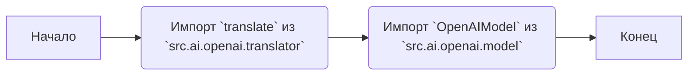
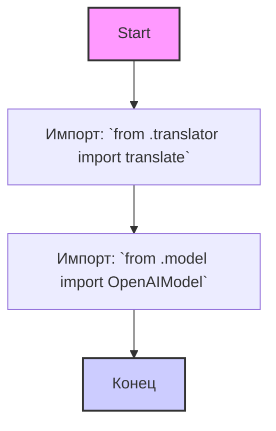

## АНАЛИЗ КОДА: `hypotez/src/ai/openai/__init__.py`

### 1. <алгоритм>

**Описание:**

Модуль `__init__.py` в пакете `src.ai.openai` служит точкой входа для этого подмодуля. Он импортирует необходимые классы и функции из других модулей внутри пакета, делая их доступными при импорте пакета `src.ai.openai`. Это позволяет пользователям удобно обращаться к функциональности, связанной с моделью OpenAI, не углубляясь в структуру подпапок.

**Блок-схема:**



**Примеры:**

1.  **Импорт `translate`:**
    
    ```python
    from src.ai.openai import translate
    
    translated_text = translate("Hello", target_language="fr")
    print(translated_text)
    ```
2.  **Импорт `OpenAIModel`:**
    
    ```python
    from src.ai.openai import OpenAIModel
    
    model = OpenAIModel(api_key="YOUR_API_KEY")
    response = model.generate_text("What is the capital of France?")
    print(response)
    ```

### 2. <mermaid>



**Объяснение зависимостей `mermaid`:**

Диаграмма показывает поток импорта внутри пакета `src.ai.openai`.
    1. **`Start`**: Начало процесса.
    2. **`ImportTranslator`**: Импортируется функция `translate` из модуля `translator.py`, который находится в том же каталоге. 
    3. **`ImportOpenAIModel`**: Импортируется класс `OpenAIModel` из модуля `model.py`, который также находится в том же каталоге.
    4. **`End`**: Конец процесса.
    
Здесь нет импорта внешних библиотек, только модули из этого же пакета, поэтому граф простой.

### 3. <объяснение>

**Импорты:**

*   `from .translator import translate`: Импортирует функцию `translate` из модуля `translator.py`, расположенного в той же директории (`src/ai/openai`). Эта функция, вероятно, отвечает за перевод текста с использованием моделей OpenAI. Путь `.` означает, что это относительный импорт внутри текущего пакета.

*   `from .model import OpenAIModel`: Импортирует класс `OpenAIModel` из модуля `model.py`, расположенного в той же директории (`src/ai/openai`). Этот класс, вероятно, инкапсулирует логику взаимодействия с API OpenAI для создания и обработки моделей.

**Классы:**

*   `OpenAIModel`:
    *   **Роль:** Представляет модель OpenAI и инкапсулирует ее функциональность (генерация текста, возможно, тонкая настройка и т. д.).
    *   **Атрибуты:** Вероятно, включает атрибуты, такие как API ключ, идентификатор модели и другие параметры конфигурации.
    *   **Методы:** Может содержать методы для генерации текста (`generate_text`), запроса ответов и другие операции, связанные с API OpenAI.
    *   **Взаимодействие:** Взаимодействует с API OpenAI для запроса и получения результатов, а также может предоставлять методы для форматирования и обработки данных.

**Функции:**

*   `translate`:
    *   **Аргументы:** Принимает текст для перевода и целевой язык. Может включать другие аргументы, такие как исходный язык.
    *   **Возвращаемое значение:** Возвращает переведенный текст.
    *   **Назначение:** Использует модели OpenAI для перевода текста с одного языка на другой.
    *   **Примеры:**
        ```python
        translated_text = translate("Hello", target_language="fr")
        print(translated_text) # Выведет: Bonjour
        ```

**Переменные:**

В данном `__init__.py` файле не определены явные переменные. Он в основном служит для управления импортом и экспортом функций и классов.

**Потенциальные ошибки и области для улучшения:**

*   **Отсутствие обработки ошибок:** В модуле не показана обработка ошибок, которая могла бы быть полезна в реальных приложениях. Например, при неверном API ключе или сетевых ошибках.
*   **Нет документации:**  Добавление docstring для классов и функций поможет улучшить читаемость и понимание кода.
*   **Нет конфигурации:** Параметры API, вероятно, должны быть настраиваемыми.
*   **Расширяемость:** Можно добавить поддержку большего количества моделей OpenAI или других провайдеров.

**Взаимосвязи с другими частями проекта:**

*   Вероятно, этот модуль будет использоваться другими частями проекта, которым требуется функциональность OpenAI, например, в модулях, отвечающих за обработку текста, генерацию контента или общение с пользователем.
*   Может зависеть от глобальных настроек (например, `src.gs` - глобальные настройки).