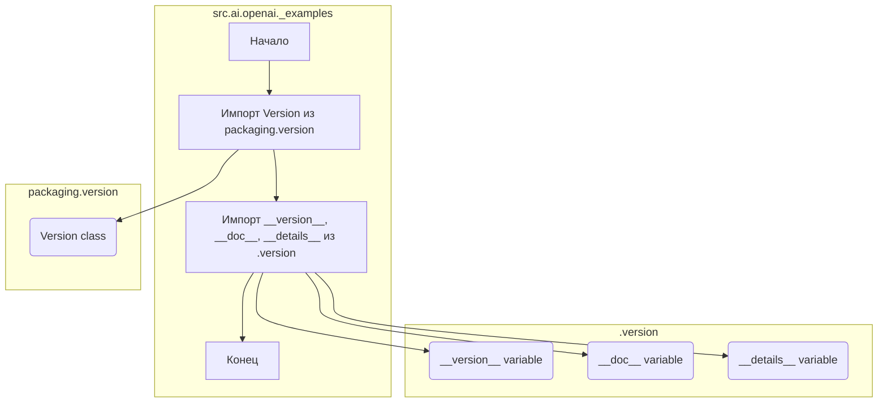

## Анализ кода `src/ai/openai/_examples/__init__.py`

### <алгоритм>
1. **Импорт модулей**:
   -  Импортируется класс `Version` из библиотеки `packaging.version`. Этот класс используется для сравнения и управления версиями.
   -  Из файла `.version.py`, находящегося в той же директории импортируются три переменные `__version__`, `__doc__`, и `__details__`, которые вероятно содержат информацию о версии, документации и дополнительную информацию о пакете соответственно.
2. **Назначение переменных**:
    -  Переменные `__version__`, `__doc__`, и `__details__`, импортированные из `version.py`, становятся доступны в контексте пакета `src.ai.openai._examples`.

**Примеры:**

   - `from packaging.version import Version`: Например, `Version("1.2.3")` создаст объект версии, который можно сравнивать с другими версиями.
   - `from .version import __version__, __doc__, __details__`:  Если `version.py` содержит `__version__ = "0.1.0"`, то после импорта переменная `__version__` в `__init__.py` будет иметь значение "0.1.0".

### <mermaid>

**Объяснение диаграммы:**
-   Диаграмма показывает поток импорта внутри пакета `src.ai.openai._examples`.
-   Импорт начинается с `Version` класса из `packaging.version`. 
-   Далее идет импорт переменных `__version__`, `__doc__`, и `__details__` из `version.py`. 
-   Каждый импортированный компонент показан как отдельный блок.
-   Связи (стрелки) отображают, откуда и куда происходит импорт.
-   Показаны связи с внешними библиотеками `packaging.version` и локальным модулем `.version.py`.

### <объяснение>
**Импорты:**

- `from packaging.version import Version`:
   - **Назначение:** Импортирует класс `Version` из библиотеки `packaging`. Этот класс позволяет работать с версиями пакетов, сравнивать их и т.д.
   - **Взаимосвязь с другими пакетами:** `packaging` - это отдельная библиотека, которая не зависит от `src`, но используется в данном модуле.  Она обеспечивает стандартизированный способ работы с версиями.
- `from .version import __version__, __doc__, __details__`:
  - **Назначение:** Импортирует переменные `__version__`, `__doc__` и `__details__` из модуля `version.py`, находящегося в той же директории. Эти переменные обычно используются для определения версии текущего модуля, его документации и дополнительных деталей.
  - **Взаимосвязь с другими пакетами:** Модуль `version.py` является частью текущего пакета `src.ai.openai._examples`, и импортируется для определения свойств пакета.

**Классы:**
- Класс `Version`
   - **Роль:**  Предоставляет функциональность для представления и сравнения версий.
   - **Атрибуты и методы**:  Имеет различные методы для сравнения версий (например, `>, <, ==`) и анализа версионной строки.

**Функции:**
- В данном коде нет явно определённых функций.

**Переменные:**
- `__version__`:
  - **Тип**: Строка (обычно).
  - **Использование**: Содержит строку с номером версии текущего модуля.
- `__doc__`:
  - **Тип**: Строка (обычно).
  - **Использование**: Содержит строку с документацией по модулю. Обычно используется для генерации документации.
- `__details__`:
    - **Тип**:  Строка (или другой тип, в зависимости от `version.py`).
    - **Использование**: Содержит дополнительные сведения о пакете или модуле.
**Потенциальные ошибки и области для улучшения:**
-   **Отсутствие обработки ошибок при импорте.** Если файл `version.py` отсутствует или содержит ошибки, возникнет исключение `ImportError`. Можно добавить обработку исключений, например, с помощью блока `try-except`.
-   **Отсутствие комментариев.** Код достаточно прост, но добавление комментариев, поясняющих предназначение переменных, сделает код более понятным.
-   **Недостаточная информация в docstring.** Docstring в начале файла не дает конкретного описания модуля. Можно было бы добавить более подробное описание.

**Цепочка взаимосвязей:**
1.  Пакет `src.ai.openai._examples` зависит от библиотеки `packaging` для работы с версиями.
2.  Пакет `src.ai.openai._examples` зависит от своего подмодуля `version.py` для получения информации о версии, документации и деталей.
3.  Эти переменные `__version__`, `__doc__`, и `__details__` могут использоваться в других частях пакета `src` (или вообще в проекте) для проверки версии, генерации документации или для отладки.

**Дополнительные замечания:**
- Этот файл `__init__.py` используется для инициализации пакета `src.ai.openai._examples`.  Он делает переменные `__version__`, `__doc__`, и `__details__` доступными при импорте пакета.
- Отсутствие явных классов и функций делает его, в основном, файлом, определяющим метаданные пакета.