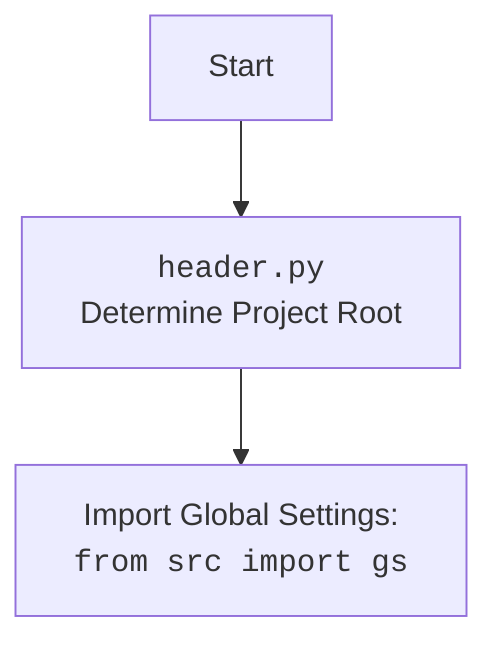

## АНАЛИЗ КОДА: `hypotez/src/ai/openai/header.py`

### 1. <алгоритм>

**Функция `set_project_root(marker_files: tuple = ('__root__', '.git')) -> Path`**
  1. **Начало:** Функция вызывается с параметром `marker_files` (по умолчанию `('__root__', '.git')`).
  2.  **Определение текущего пути:** Определяется абсолютный путь к директории, в которой находится текущий файл `header.py` (`current_path`).
     *   _Пример:_ Если `header.py` находится по пути `/home/user/hypotez/src/ai/openai/header.py`, то `current_path` будет `/home/user/hypotez/src/ai/openai`.
  3.  **Инициализация `__root__`**: Переменная `__root__` инициализируется значением `current_path`.
  4. **Поиск родительских директорий:**
        *   Цикл `for parent in [current_path] + list(current_path.parents)`:  Перебираются текущая директория и все ее родительские директории.
           *   _Пример_: Если `current_path` это `/home/user/hypotez/src/ai/openai`,  цикл будет проходить по `/home/user/hypotez/src/ai/openai`, `/home/user/hypotez/src/ai`, `/home/user/hypotez/src`, `/home/user/hypotez`, `/home/user`, `/home`, `/`.
        *   Проверка наличия маркера: Для каждой директории `parent` проверяется, существует ли хотя бы один из маркеров (файлов или директорий) из `marker_files` (`any((parent / marker).exists() for marker in marker_files)`).
             *  _Пример:_ Если в директории `/home/user/hypotez` существует файл `.git`, то условие будет истинным.
        *  Если маркер найден:
           *  `__root__` обновляется до `parent`.
           *   Цикл прерывается (`break`).
  5.  **Добавление `__root__` в `sys.path`**: Если путь к корневой директории `__root__` не содержится в `sys.path`, то он добавляется в начало списка `sys.path`, что позволяет импортировать модули из корневой директории.
      *   _Пример:_ Если `__root__` это `/home/user/hypotez`, то этот путь будет добавлен в `sys.path`
  6.  **Возврат `__root__`**: Функция возвращает путь к корневой директории `__root__`.
  
**Основной блок кода:**

  1.  **Вызов `set_project_root`**: Функция `set_project_root` вызывается, и ее возвращаемое значение сохраняется в глобальной переменной `__root__`.
  2.  **Импорт `gs`**: Выполняется импорт `from src import gs`, который использует установленный `sys.path`.
  3. **Чтение `settings.json`**:
    *  Пытается открыть и прочитать файл `settings.json`, расположенный в директории `src` относительно корневой директории `gs.path.root`.
     *  Если файл успешно прочитан, его содержимое загружается в словарь `settings`.
    *   В случае ошибки `FileNotFoundError` или `json.JSONDecodeError` блок `try` перехватывает исключение и пропускает код в блоке `except`.
  4.  **Чтение `README.MD`**:
    *   Пытается открыть и прочитать файл `README.MD`, расположенный в директории `src` относительно корневой директории `gs.path.root`.
    *  Если файл успешно прочитан, его содержимое загружается в строку `doc_str`.
    *   В случае ошибки `FileNotFoundError` или `json.JSONDecodeError` блок `try` перехватывает исключение и пропускает код в блоке `except`.
  5.  **Инициализация глобальных переменных**: Инициализируются глобальные переменные:
     *   `__project_name__` берется из `settings`, если `settings` существует, иначе устанавливается в `hypotez`.
    *   `__version__`  берется из `settings`, если `settings` существует, иначе устанавливается в `''`.
    *   `__doc__` устанавливается в `doc_str`, если `doc_str` существует, иначе устанавливается в `''`.
    *   `__details__` устанавливается в `''`.
    *   `__author__` берется из `settings`, если `settings` существует, иначе устанавливается в `''`.
    *   `__copyright__` берется из `settings`, если `settings` существует, иначе устанавливается в `''`.
    *   `__cofee__` берется из `settings`, если `settings` существует, иначе устанавливается в стандартную строку.

### 2. <mermaid>

```mermaid
flowchart TD
    Start[Start] --> FindRoot[<code>set_project_root()</code><br>Find Project Root Directory]
    FindRoot -- Return Project Root --> SetRootVar[Set <code>__root__</code> Variable]
    SetRootVar --> AddRootToPath{Add __root__ to sys.path?}
     AddRootToPath -- Yes --> InsertPath[Insert <code>__root__</code> to <code>sys.path</code>]
     AddRootToPath -- No --> ImportGS[Import Global Settings: <br><code>from src import gs</code>]
    InsertPath -->  ImportGS
    ImportGS --> LoadSettings{Load <code>settings.json</code>}
    LoadSettings -- Success --> SetSettingsVar[Set Settings Variable]
    LoadSettings -- Fail -->  LoadReadme{Load <code>README.MD</code>}
    SetSettingsVar --> LoadReadme
    LoadReadme -- Success --> SetReadmeVar[Set Readme Variable]
     LoadReadme -- Fail -->  InitializeGlobals[Initialize Global Variables <br>(project_name, version, etc.)]
    SetReadmeVar --> InitializeGlobals
    InitializeGlobals --> End[End]
```

**Импорты для mermaid диаграммы:**

*   **`flowchart TD`**: Определяет тип диаграммы как блок-схема (flowchart) с направлением слева направо (TD).
*   **`Start[Start]`**: Узел диаграммы, обозначающий начало процесса.
*   **`FindRoot[...]`**: Узел диаграммы, представляющий вызов функции `set_project_root()`, которая ищет корневую директорию проекта. Текст внутри скобок описывает действие узла.
*   **`SetRootVar[...]`**: Узел, представляющий установку переменной `__root__`.
*   **`AddRootToPath{...}`**: Узел принятия решения, определяющий нужно ли добавлять корневой путь в `sys.path`.
*   **`InsertPath[...]`**: Узел, представляющий добавление корневого пути в `sys.path`.
*    **`ImportGS[...]`**: Узел, представляющий импорт глобальных настроек из `src`.
*   **`LoadSettings{...}`**: Узел, представляющий попытку загрузки `settings.json`.
*   **`SetSettingsVar[...]`**: Узел, представляющий установку переменной `settings`.
*   **`LoadReadme{...}`**: Узел, представляющий попытку загрузки `README.MD`.
*   **`SetReadmeVar[...]`**: Узел, представляющий установку переменной `doc_str`.
*   **`InitializeGlobals[...]`**: Узел, представляющий инициализацию глобальных переменных, таких как `project_name`, `version` и т.д.
*   **`End[End]`**: Узел диаграммы, обозначающий конец процесса.

**Дополнительно**:



### 3. <объяснение>

**Импорты:**

*   `sys`: Используется для доступа к параметрам и функциям, специфичным для интерпретатора Python, например, для изменения `sys.path`.
*   `json`: Используется для работы с файлами JSON, в частности, для чтения `settings.json`.
*    `packaging.version`: Используется для работы с версиями пакетов.  В данном коде не используется, но импортируется. Возможно задел на будущее.
*   `pathlib.Path`: Используется для представления файловых путей, что делает код более читаемым и кроссплатформенным.

**Функция `set_project_root(marker_files: tuple = ('__root__', '.git')) -> Path`**

*   **Аргументы**:
    *   `marker_files` (tuple): Кортеж имен файлов или каталогов, используемых для поиска корня проекта. По умолчанию `('__root__', '.git')`.
*   **Возвращаемое значение**:
    *   `Path`: Объект `pathlib.Path`, представляющий путь к корню проекта.
*   **Назначение**: Функция рекурсивно ищет корень проекта, поднимаясь по родительским директориям, пока не найдет хотя бы один маркер. Это позволяет запускать скрипты из разных мест, не меняя пути импорта.
*   **Пример**: Если проект имеет следующую структуру:
    ```
    project/
        __root__
        src/
            ai/
                openai/
                    header.py
    ```
    То при запуске `header.py` функция `set_project_root` найдет корень проекта `project/`, поскольку там есть маркерный файл `__root__`.

**Глобальные переменные:**

*   `__root__` (Path): Путь к корневой директории проекта. Вычисляется с помощью `set_project_root`.
*   `settings` (dict): Словарь, содержащий настройки проекта, загруженные из `settings.json`. Изначально `None`, если файл не найден или не удалось прочитать.
*   `doc_str` (str): Строка, содержащая содержимое файла `README.MD`.  Изначально `None`, если файл не найден или не удалось прочитать.
*   `__project_name__` (str): Название проекта. Загружается из `settings` или равно `'hypotez'` по умолчанию.
*   `__version__` (str): Версия проекта. Загружается из `settings` или равна `''` по умолчанию.
*   `__doc__` (str): Описание проекта. Загружается из `doc_str` или равно `''` по умолчанию.
*   `__details__` (str): Детальная информация о проекте, инициализируется пустой строкой.
*   `__author__` (str): Автор проекта. Загружается из `settings` или равна `''` по умолчанию.
*    `__copyright__` (str): Информация о копирайте проекта. Загружается из `settings` или равна `''` по умолчанию.
*   `__cofee__` (str): Призыв к угощению разработчика кофе. Загружается из `settings` или равно  "Treat the developer to a cup of coffee for boosting enthusiasm in development: https://boosty.to/hypo69" по умолчанию.

**Взаимодействие с другими частями проекта:**

*   `from src import gs`: Импортирует глобальные настройки проекта, которые вероятно содержат путь к корневой директории, но они не используются, так как корень проекта вычисляется в этом модуле.
*  Модуль `header.py` создает точку отсчета для всех импортов в проекте, устанавливая корневую директорию и добавляя ее в `sys.path`. Другие модули проекта будут использовать этот `sys.path` для импорта.
*   `settings.json` и `README.MD` используются для получения информации о проекте, которая затем используется для определения глобальных переменных.

**Потенциальные ошибки и области для улучшения:**

*   **Обработка ошибок:** Используется общее исключение `...` вместо обработки ошибок. Желательно добавить более конкретную обработку исключений и вывод сообщений об ошибках в консоль.
*  **Отсутствие `settings.json` и `README.MD`**: Код просто пропускает ошибки, связанные с отсутствием этих файлов. Возможно, стоит выдавать предупреждение, если эти файлы не найдены.
*  **`packaging.version`**: Импорт `packaging.version` есть, но он не используется. Его можно убрать, если он не нужен.
*  **Маркерные файлы:** Можно добавить возможность передавать маркерные файлы извне, чтобы сделать функцию более гибкой.
* **Установка `sys.path`:**  При каждом импорте модуля будет происходить установка  `sys.path`.

**Заключение:**

Модуль `header.py` является важной частью проекта, так как он определяет корневую директорию и предоставляет глобальные переменные, такие как имя проекта, версия, автор и т. д. Это позволяет другим модулям проекта иметь доступ к общей информации и импортировать другие модули без проблем с путями.