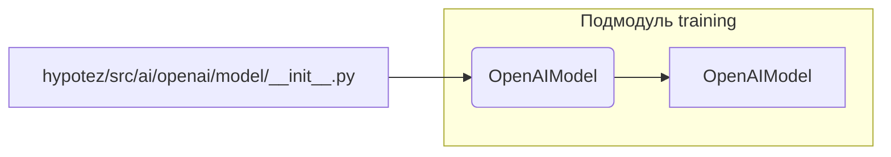

```MD
# Анализ кода hypotez/src/ai/openai/model/__init__.py

## <input code>

```python
## \file hypotez/src/ai/openai/model/__init__.py
# -*- coding: utf-8 -*-

#! venv/bin/python/python3.12

"""
.. module: src.ai.openai.model 
	:platform: Windows, Unix
	:synopsis:

"""


from .training import OpenAIModel
```

## <algorithm>

Алгоритм работы крайне прост. Файл `__init__.py` служит инициализатором модуля `src.ai.openai.model`. Он импортирует класс `OpenAIModel` из подмодуля `training`.  Далее, в файле задаётся константа `MODE` со значением 'dev'.

**Пример:**

1. При импорте модуля `src.ai.openai.model` из другого места проекта, Python выполняет этот `__init__.py`.
2. Внутри `__init__.py` происходит импорт класса `OpenAIModel`.
3.  Значение переменной `MODE` устанавливается в 'dev'.

## <mermaid>



## <explanation>

**Импорты:**

- `from .training import OpenAIModel`: Этот импорт необходим для использования класса `OpenAIModel`, находящегося в подпапке `training` внутри того же пакета `src.ai.openai.model`.  Символ `.` указывает на поиск в текущем пакете.  Это типичная практика для организации кода в Python.  Без этого импорта класс `OpenAIModel` недоступен для использования в `__init__.py`.

**Классы:**

- `OpenAIModel`:  Определён в подмодуле `training` и, вероятно, представляет модель OpenAI для обучения или использования.  Подробности о его реализации (атрибуты, методы) недоступны без доступа к файлу `hypotez/src/ai/openai/model/training.py`.

**Функции:**

- Нет функций в этом файле.

**Переменные:**

- ``: Эта константа, скорее всего, используется для переключения между режимами работы (например, 'dev', 'prod').   Значение 'dev' указывает на режим разработки. Эта переменная  может влиять на поведение других частей приложения, в зависимости от настроек.

**Возможные ошибки и улучшения:**

- Отсутствие документации для класса `OpenAIModel` (и других возможных элементов) затрудняет понимание его использования и целей.
- Неясно, используется ли константа `MODE` для каких-либо условий (например, для активации/деактивации функциональности). В идеале, в коде должны быть примеры использования `MODE`.
-  Попытка запуска python напрямую через `#!` устарела и не рекомендуется.  Вместо нее должны использоваться стандартные механизмы запуска Python-скриптов в среде.


**Взаимосвязи с другими частями проекта:**

- Этот файл является частью пакета `src.ai.openai.model`, предполагается, что он взаимодействует с другими частями проекта, которые используют модель OpenAI.
- `OpenAIModel` является ключевым компонентом, который вероятно, интегрируется в другие части проекта, связанные с обработкой или применением моделей машинного обучения.
- Дополнительная информация о взаимодействии `OpenAIModel` и `MODE` с другими частями проекта необходима для полной оценки функциональности.