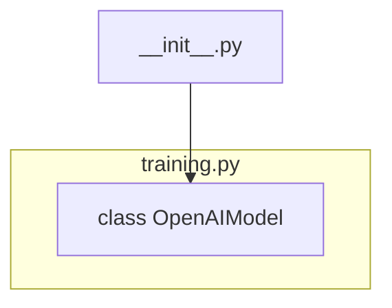

## Анализ кода `src/ai/openai/model/__init__.py`

### 1. <алгоритм>

1. **Импорт модуля `OpenAIModel`:**
   - Выполняется импорт класса `OpenAIModel` из модуля `src.ai.openai.model.training`.
   - Пример: `from .training import OpenAIModel` - импортирует класс для использования в данном модуле.

### 2. <mermaid>

**Объяснение диаграммы:**

*   `__init__.py`: Представляет собой текущий файл `__init__.py`, который является точкой входа для пакета `src.ai.openai.model`.
*   `training.py`: Это модуль, из которого импортируется класс `OpenAIModel`.
*   `OpenAIModel[class OpenAIModel]`: Это класс `OpenAIModel`, который импортируется из `training.py`.

### 3. <объяснение>

**Импорты:**

*   `from .training import OpenAIModel`:
    *   `.training`: Это относительный импорт, указывающий на модуль `training.py`, находящийся в той же директории, что и текущий файл `__init__.py`.
    *   `OpenAIModel`: Это класс, который импортируется из модуля `training.py`. Этот класс, вероятно, содержит логику для взаимодействия с OpenAI API, включая обучение и получение предсказаний модели.

**Классы:**

*   `OpenAIModel`:
    *   Это класс, импортированный из `src.ai.openai.model.training`.
    *   Предположительно, он содержит методы для настройки, обучения и использования моделей OpenAI.
    *   Взаимодействует с OpenAI API, предоставляя высокоуровневый интерфейс для работы с моделями.
    *   Может содержать атрибуты, такие как ключ API, идентификатор модели, параметры обучения и т. д.

**Функции:**

*   В данном файле функции отсутствуют. Основная цель этого файла - сделать класс `OpenAIModel` доступным для импорта из пакета `src.ai.openai.model`.

**Переменные:**

*   В данном файле переменные отсутствуют.

**Потенциальные ошибки или области для улучшения:**

*   **Отсутствие документации:** В текущем виде файл имеет только комментарий модуля и импорт. Дополнительная документация (docstrings) для класса `OpenAIModel` в `training.py`, а также для самого пакета была бы полезна для понимания его функциональности.
*   **Относительный импорт:** Использование относительного импорта (`.training`) может быть менее явным для новых разработчиков. В более сложных случаях стоит рассматривать использование абсолютных путей, особенно если структура пакета разветвленная.
*   **Обработка ошибок:** Необходимо убедиться, что класс `OpenAIModel` обрабатывает все потенциальные ошибки (например, проблемы с соединением, некорректные данные) при работе с OpenAI API.
*   **Настройка модели:** Хотелось бы видеть более подробную информацию о том, как настраивается модель (параметры обучения и т.д.), и как эта информация передаётся в `OpenAIModel`.

**Цепочка взаимосвязей:**

1.  `src.ai.openai.model.__init__.py` является точкой входа для пакета `src.ai.openai.model`.
2.  Импортирует `OpenAIModel` из `src.ai.openai.model.training`.
3.  Пользователь, импортируя пакет `src.ai.openai.model` получит доступ к классу `OpenAIModel`, что позволит использовать API OpenAI.
4.  `OpenAIModel` будет использовать библиотеку для работы с OpenAI API и, возможно, другие части проекта, например, для логирования, хранения данных или конфигурации.

В целом, файл `__init__.py` выполняет свою основную функцию - делает класс `OpenAIModel` доступным для импорта.