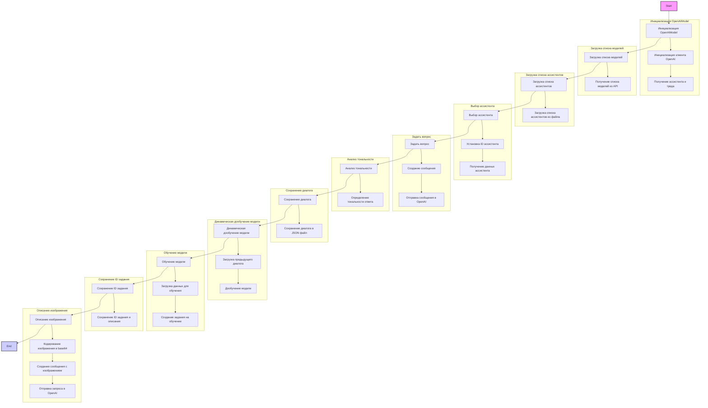
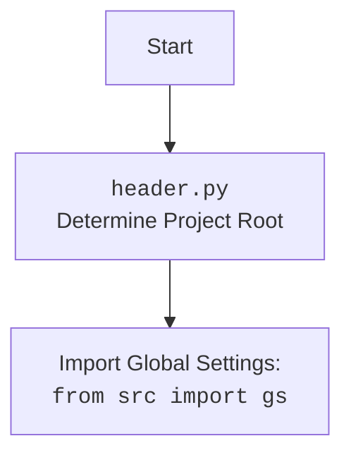

## ИНСТРУКЦИЯ:

Анализируй предоставленный код подробно и объясни его функциональность. Ответ должен включать три раздела:

1.  **<алгоритм>**: Опиши рабочий процесс в виде пошаговой блок-схемы, включая примеры для каждого логического блока, и проиллюстрируй поток данных между функциями, классами или методами.
2.  **<mermaid>**: Напиши код для диаграммы в формате `mermaid`, проанализируй и объясни все зависимости,
    которые импортируются при создании диаграммы.
    **ВАЖНО!** Убедитесь, что все имена переменных, используемые в диаграмме `mermaid`,
    имеют осмысленные и описательные имена. Имена переменных вроде `A`, `B`, `C`, и т.д., не допускаются!

    **Дополнительно**: Если в коде есть импорт `import header`, добавьте блок `mermaid` flowchart, объясняющий `header.py`:
    ```mermaid
    flowchart TD
        Start --> Header[<code>header.py</code><br> Determine Project Root]

        Header --> import[Import Global Settings: <br><code>from src import gs</code>]
    ```

3.  **<объяснение>**: Предоставьте подробные объяснения:
    -   **Импорты**: Их назначение и взаимосвязь с другими пакетами `src.`.
    -   **Классы**: Их роль, атрибуты, методы и взаимодействие с другими компонентами проекта.
    -   **Функции**: Их аргументы, возвращаемые значения, назначение и примеры.
    -   **Переменные**: Их типы и использование.
    -   Выделите потенциальные ошибки или области для улучшения.

Дополнительно, постройте цепочку взаимосвязей с другими частями проекта (если применимо).

Это обеспечивает всесторонний и структурированный анализ кода.
## Формат ответа: `.md` (markdown)
**КОНЕЦ ИНСТРУКЦИИ**

## <алгоритм>



**Примеры для логических блоков:**

1.  **Инициализация `OpenAIModel`**:

    *   Пример: `model = OpenAIModel(system_instruction="You are a helpful assistant.", assistant_id="asst_dr5AgQnhhhnef5OSMzQ9zdk9")`
    *   **Поток данных**: Создается экземпляр класса `OpenAIModel`, загружаются настройки, создается клиент OpenAI, устанавливается `assistant_id`, загружается assistant и thread.

2.  **Загрузка моделей (`list_models`)**:

    *   Пример: `models = model.list_models`
    *   **Поток данных**: Выполняется запрос к OpenAI API для получения списка доступных моделей.

3.  **Загрузка ассистентов (`list_assistants`)**:

    *   Пример: `assistants = model.list_assistants`
    *   **Поток данных**: Загружается список ассистентов из файла `assistants.json`.

4.  **Установка ассистента (`set_assistant`)**:

    *   Пример: `model.set_assistant("asst_another_id")`
    *   **Поток данных**: Устанавливается новый `assistant_id`, обновляется объект ассистента через OpenAI API.

5.  **Задание вопроса (`ask`)**:

    *   Пример: `response = model.ask("What is the capital of France?", system_instruction = "Answer in short sentence")`
    *   **Поток данных**: Создается сообщение для отправки в OpenAI, отправляется запрос к API, получается ответ.
        Далее определяется тональность ответа, добавляются в диалог и сохраняются в файл.

6.  **Определение тональности (`determine_sentiment`)**:

    *   Пример: `sentiment = model.determine_sentiment("This is a great day!")`
    *   **Поток данных**: Анализируется сообщение на наличие позитивных, негативных или нейтральных слов, возвращается соответствующее значение.

7.  **Сохранение диалога (`_save_dialogue`)**:

    *   Пример: `model._save_dialogue()`
    *   **Поток данных**: Весь диалог сохраняется в формате JSON в файл, указанный в `dialogue_log_path`.

8.  **Динамическое обучение (`dynamic_train`)**:

    *   Пример: `model.dynamic_train()`
    *   **Поток данных**: Загружается предыдущий диалог из JSON файла и используется для дообучения модели.

9.  **Обучение модели (`train`)**:
    *   Пример: `training_result = model.train(data_file=gs.path.google_drive / 'AI' / 'training_data.csv', positive=True)`
    *   **Поток данных**: Загружаются данные для обучения из CSV файла, вызывается API OpenAI для создания задачи обучения.
10. **Сохранение ID задания (`save_job_id`)**:
    *   Пример: `model.save_job_id(training_result, "Training model with new data", filename="job_ids.json")`
    *   **Поток данных**: ID задания и его описание сохраняются в JSON файл.
11. **Описание изображения (`describe_image`)**:
    *   Пример: `description = model.describe_image(image_path, "Describe this image in details")`
    *   **Поток данных**: Изображение кодируется в base64, отправляется в OpenAI API для получения описания.

```mermaid
flowchart TD
    Start --> OpenAIModelInitialization[Initialize OpenAIModel]
    OpenAIModelInitialization --> ModelClientCreation[Create OpenAI Client]
    ModelClientCreation --> AssistantThreadSetup[Setup Assistant and Thread]
    AssistantThreadSetup --> LoadModels[Load Models]
    LoadModels --> ListModelsFromAPI[List Models from API]
    ListModelsFromAPI --> LoadAssistants[Load Assistants]
    LoadAssistants --> LoadAssistantsFromFile[Load Assistants from JSON File]
    LoadAssistantsFromFile --> SetAssistant[Set Assistant]
    SetAssistant --> RetrieveAssistantDetails[Retrieve Assistant Details]
    RetrieveAssistantDetails --> AskQuestion[Ask Question]
    AskQuestion --> PrepareMessage[Prepare User Message]
    PrepareMessage --> SendMessageToModel[Send Message to OpenAI Model]
    SendMessageToModel --> AnalyzeSentiment[Analyze Sentiment]
    AnalyzeSentiment --> SaveDialogueLog[Save Dialogue Log]
    SaveDialogueLog --> DynamicTrainModel[Dynamic Train Model]
    DynamicTrainModel --> LoadPreviousDialogue[Load Previous Dialogue]
    LoadPreviousDialogue --> FineTuneModel[Fine-tune Model]
    FineTuneModel --> TrainModel[Train Model]
    TrainModel --> LoadTrainingData[Load Training Data]
    LoadTrainingData --> CreateTrainingJob[Create Training Job]
     CreateTrainingJob --> SaveTrainingJobId[Save Training Job ID]
    SaveTrainingJobId --> DescribeImage[Describe Image]
    DescribeImage --> EncodeImageToBase64[Encode Image to Base64]
    EncodeImageToBase64 --> SendImageToModel[Send Image to OpenAI Model]
    SendImageToModel --> End
    
    subgraph OpenAIModel Initialization
    OpenAIModelInitialization --> ModelClientCreation
    ModelClientCreation --> AssistantThreadSetup
    end

    subgraph List Models
    LoadModels --> ListModelsFromAPI
    end

    subgraph List Assistants
     LoadAssistants --> LoadAssistantsFromFile
    end

    subgraph Set Assistant
    SetAssistant --> RetrieveAssistantDetails
    end

    subgraph Ask Question
    AskQuestion --> PrepareMessage
    PrepareMessage --> SendMessageToModel
    end
    
    subgraph Analyze Sentiment
    SendMessageToModel --> AnalyzeSentiment
    end
    
     subgraph Save Dialogue Log
     AnalyzeSentiment --> SaveDialogueLog
     end
     
     subgraph Dynamic Train Model
     SaveDialogueLog --> DynamicTrainModel
     DynamicTrainModel --> LoadPreviousDialogue
     LoadPreviousDialogue --> FineTuneModel
     end
     
     subgraph Train Model
        FineTuneModel --> TrainModel
        TrainModel --> LoadTrainingData
        LoadTrainingData --> CreateTrainingJob
     end
     
     subgraph Save Training Job ID
     CreateTrainingJob --> SaveTrainingJobId
     end
     
     subgraph Describe Image
     SaveTrainingJobId --> DescribeImage
     DescribeImage --> EncodeImageToBase64
     EncodeImageToBase64 --> SendImageToModel
     end
    
    
     
    style Start fill:#f9f,stroke:#333,stroke-width:2px
    style End fill:#ccf,stroke:#333,stroke-width:2px
```

## <mermaid>





**Анализ зависимостей:**

1.  `from __future__ import annotations`:
    *   Используется для отложенного вычисления аннотаций типов, что позволяет использовать типы, которые еще не определены во время компиляции.
2.  `import time`:
    *   Используется для работы со временем, например, для пауз при повторных попытках запросов к API.
3.  `from pathlib import Path`:
    *   Используется для работы с файловыми путями, упрощая манипуляции с путями.
4.  `from types import SimpleNamespace`:
    *   Используется для создания простых объектов, которые могут иметь произвольные атрибуты.
5.  `from typing import List, Dict, Optional`:
    *   Используется для аннотации типов, что повышает читаемость и позволяет выявлять ошибки на ранних стадиях разработки.
6.  `import pandas as pd`:
    *   Используется для работы с табличными данными (не используется в данном коде).
7.  `from openai import OpenAI`:
    *   Используется для взаимодействия с OpenAI API.
8.  `import requests`:
    *   Используется для отправки HTTP-запросов (используется для описания изображения через requests).
9.  `from PIL import Image`:
    *   Используется для обработки изображений (не используется напрямую, но упоминается в коде).
10. `from io import BytesIO`:
    *   Используется для работы с байтовыми потоками в памяти.
11. `from src import gs`:
    *   Импортирует глобальные настройки проекта из пакета `src`.
12. `from src.utils.jjson import j_loads, j_loads_ns, j_dumps`:
    *   Используется для работы с JSON файлами, включая загрузку и сохранение данных.
13. `from src.utils.csv import save_csv_file`:
    *   Используется для сохранения данных в CSV файл (не используется в данном коде).
14. `from src.utils.printer import pprint`:
    *   Используется для удобного вывода данных в консоль.
15. `from src.utils.convertors.base64 import base64encode`:
    *   Используется для кодирования данных в base64 (например, изображений).
16. `from src.utils.convertors.md import md2dict`:
    *  Используется для конвертации markdown в словарь (не используется в данном коде).
17. `from src.logger.logger import logger`:
    *   Используется для логирования событий.

## <объяснение>

**Импорты:**

*   `from __future__ import annotations`: Позволяет использовать типы данных, которые еще не определены на этапе компиляции.
*   `time`: Модуль для работы со временем, используется в функции `ask` для ожидания при повторных попытках запроса к API.
*   `pathlib.Path`: Модуль для работы с путями к файлам. Позволяет использовать объектно-ориентированный подход к путям.
*   `types.SimpleNamespace`: Используется для создания простых объектов с атрибутами.
*   `typing.List, Dict, Optional`: Используется для статической типизации, что делает код более читаемым и помогает находить ошибки на этапе разработки.
*    `pandas as pd`: Используется для работы с табличными данными (не используется в данном коде).
*   `openai.OpenAI`: Основной класс для работы с API OpenAI.
*   `requests`: Используется для выполнения HTTP-запросов, например, при отправке запроса для описания изображения.
*   `PIL.Image`:  Используется для работы с изображениями (не используется напрямую, но упоминается в коде).
*   `io.BytesIO`: Модуль для работы с байтовыми потоками.
*   `src.gs`: Модуль глобальных настроек, используется для доступа к настройкам проекта, путям и учетным данным.
*   `src.utils.jjson.j_loads, j_loads_ns, j_dumps`: Функции для работы с JSON, включая загрузку из файла, загрузку в namespace и сохранения в файл.
*   `src.utils.csv.save_csv_file`: Функция для сохранения CSV файлов (не используется в данном коде).
*   `src.utils.printer.pprint`: Функция для форматированного вывода на печать, используется для отладки.
*   `src.utils.convertors.base64.base64encode`: Функция для кодирования данных в base64 (например, для передачи изображений).
*   `src.utils.convertors.md.md2dict`: Функция для конвертации markdown в словарь (не используется в данном коде).
*   `src.logger.logger`: Объект для логирования событий.

**Классы:**

*   `OpenAIModel`:
    *   **Роль**: Основной класс для взаимодействия с OpenAI API, управления моделями, ассистентами и обучения.
    *   **Атрибуты**:
        *   `model (str)`: Название модели, используемой для запросов.
        *   `client (OpenAI)`: Экземпляр клиента OpenAI для доступа к API.
        *   `current_job_id (str)`: ID текущего задания на обучение.
        *   `assistant_id (str)`: ID ассистента, используемого для запросов.
        *   `assistant (SimpleNamespace)`: Объект ассистента, полученный из API.
        *   `thread (SimpleNamespace)`: Объект треда, используемый для общения с ассистентом.
        *   `system_instruction (str)`: Инструкция для системы, используется для управления поведением модели.
        *   `dialogue_log_path (str | Path)`: Путь к файлу, в который сохраняется диалог.
        *   `dialogue (List[Dict[str, str]])`: Список диалогов, где каждый элемент - это сообщение с ролями "user", "assistant" и "system".
        *   `assistants (List[SimpleNamespace])`: Список доступных ассистентов, загруженных из файла.
        *   `models_list (List[str])`: Список доступных моделей, полученных из API.
    *   **Методы**:
        *   `__init__`: Конструктор класса, инициализирует клиент OpenAI, ассистента и тред.
        *   `list_models`: Возвращает список доступных моделей из OpenAI API.
        *   `list_assistants`: Возвращает список доступных ассистентов из JSON файла.
        *   `set_assistant`: Устанавливает ID ассистента.
        *   `_save_dialogue`: Сохраняет текущий диалог в JSON файл.
        *   `determine_sentiment`: Определяет тональность сообщения.
        *   `ask`: Отправляет сообщение в OpenAI API и возвращает ответ.
        *  `describe_image`: Отправляет изображение для получения описания от модели.
        *   `describe_image_by_requests`: Отправляет изображение для получения описания от модели через HTTP-запросы.
        *   `dynamic_train`: Динамическое дообучение модели на основе предыдущего диалога.
        *   `train`: Обучение модели на основе данных, загруженных из файла или директории.
        *   `save_job_id`: Сохраняет ID задания обучения в JSON файл.

**Функции:**

*   `__init__(self, system_instruction: str = None, model_name:str = 'gpt-4o-mini', assistant_id: str = None)`:
    *   **Аргументы**:
        *   `system_instruction (str, optional)`: Системная инструкция для модели, по умолчанию `None`.
        *    `model_name (str, optional)`: Имя модели, по умолчанию `gpt-4o-mini`.
        *   `assistant_id (str, optional)`: ID ассистента, по умолчанию `None`.
    *   **Возвращаемое значение**: None
    *   **Назначение**: Инициализирует объект `OpenAIModel`, устанавливает клиент OpenAI, получает ассистента и тред.
*   `list_models(self) -> List[str]`:
    *   **Аргументы**: None
    *   **Возвращаемое значение**: `List[str]` – список доступных моделей.
    *   **Назначение**: Получает список доступных моделей из OpenAI API.
*    `list_assistants(self) -> List[str]`:
    *   **Аргументы**: None
    *   **Возвращаемое значение**: `List[str]` – список доступных ассистентов.
    *   **Назначение**: Загружает список доступных ассистентов из JSON файла.
*    `set_assistant(self, assistant_id: str)`:
    *   **Аргументы**:
        *   `assistant_id (str)`: ID ассистента, который нужно установить.
    *   **Возвращаемое значение**: None
    *   **Назначение**: Устанавливает ID ассистента и загружает его данные.
*   `_save_dialogue(self)`:
    *   **Аргументы**: None
    *   **Возвращаемое значение**: None
    *   **Назначение**: Сохраняет текущий диалог в JSON файл.
*   `determine_sentiment(self, message: str) -> str`:
    *   **Аргументы**:
        *   `message (str)`: Сообщение для анализа тональности.
    *   **Возвращаемое значение**: `str` – тональность сообщения (positive, negative, neutral).
    *   **Назначение**: Анализирует тональность сообщения на основе ключевых слов.
*  `ask(self, message: str, system_instruction: str = None, attempts: int = 3) -> str`:
    *   **Аргументы**:
        *   `message (str)`: Сообщение для отправки модели.
        *   `system_instruction (str, optional)`: Системная инструкция, по умолчанию `None`.
        *   `attempts (int, optional)`: Количество повторных попыток отправки запроса, по умолчанию `3`.
    *   **Возвращаемое значение**: `str` – ответ модели.
    *   **Назначение**: Отправляет сообщение в OpenAI API и возвращает ответ с анализом тональности.
*   `describe_image(self, image_path: str | Path, prompt:Optional[str] = None, system_instruction:Optional[str] = None ) -> str`:
    *    **Аргументы**:
         *   `image_path (str | Path)`: Путь к файлу изображения.
         *    `prompt (str, optional)`: Запрос к модели, по умолчанию `None`.
         *    `system_instruction (str, optional)`: Системная инструкция, по умолчанию `None`.
    *   **Возвращаемое значение**: `str` – описание изображения.
    *   **Назначение**: Отправляет изображение в OpenAI API и возвращает его описание.
*    `describe_image_by_requests(self, image_path: str | Path, prompt:str = None) -> str`:
    *    **Аргументы**:
         *   `image_path (str | Path)`: Путь к файлу изображения.
         *   `prompt (str, optional)`: Запрос к модели, по умолчанию `None`.
    *   **Возвращаемое значение**: `str` – описание изображения.
    *   **Назначение**: Отправляет изображение в OpenAI API через HTTP-запросы и возвращает его описание.
*   `dynamic_train(self)`:
    *   **Аргументы**: None
    *   **Возвращаемое значение**: None
    *   **Назначение**: Динамическое дообучение модели на основе предыдущего диалога.
*   `train(self, data: str = None, data_dir: Path | str = None, data_file: Path | str = None, positive: bool = True) -> str | None`:
    *   **Аргументы**:
        *   `data (str, optional)`: Строка данных для обучения.
        *   `data_dir (Path | str, optional)`: Путь к директории с данными для обучения.
        *   `data_file (Path | str, optional)`: Путь к файлу с данными для обучения.
        *   `positive (bool, optional)`: Флаг, указывающий, что данные позитивные, по умолчанию `True`.
    *   **Возвращаемое значение**: `str | None` – ID задания обучения или `None` при ошибке.
    *   **Назначение**: Обучает модель на основе предоставленных данных.
*  `save_job_id(self, job_id: str, description: str, filename: str = "job_ids.json")`:
    *    **Аргументы**:
         *    `job_id (str)`: ID задания обучения.
         *    `description (str)`: Описание задания обучения.
         *    `filename (str, optional)`: Имя файла для сохранения ID задания, по умолчанию `job_ids.json`.
    *   **Возвращаемое значение**: None
    *    **Назначение**: Сохраняет ID задания обучения с описанием в JSON файл.
*   `main()`:
    *   **Аргументы**: None
    *   **Возвращаемое значение**: None
    *   **Назначение**: Главная функция для запуска примеров использования класса `OpenAIModel`.

**Переменные:**

*   Переменные класса `OpenAIModel` (например, `model`, `client`, `current_job_id`, `assistant_id` и другие) хранят состояние экземпляра класса.
*   Локальные переменные функций (например, `messages`, `response`, `sentiment`) используются для хранения промежуточных данных во время выполнения функций.

**Потенциальные ошибки и области для улучшения:**

*   Обработка ошибок: В некоторых методах (например, `ask`, `train`) используется базовая обработка исключений. Следует добавить более подробную логику обработки ошибок, включая retry-механизмы и логирование.
*   Логика определения тональности (`determine_sentiment`):  Можно улучшить, используя более продвинутые методы анализа тональности, а не просто проверку на вхождение ключевых слов.
*   Загрузка ассистентов: Загрузка ассистентов происходит из локального JSON файла. Можно рассмотреть возможность загрузки из API OpenAI.
*   Динамическое обучение: Не реализована логика сохранения предыдущих диалогов для дальнейшего обучения.
*   `describe_image_by_requests` в коде использует `gs.credentials.openai.project_api`, а `describe_image` использует `gs.credentials.openai.api_key`. Нужно унифицировать.
*   Метод `train` допускает загрузку из строки, директории или файла, но при этом использует `j_loads` без разбора, что может привести к ошибкам, если данные имеют несовместимый формат. Нужно добавить логику проверки или преобразования формата загружаемых данных.
*  В функциях `describe_image` и `describe_image_by_requests` есть недоработки:
   *   Используется `...` в блоке try/except. Необходимо прописать логику обработки исключений.
   *   В функции `describe_image` возвращается `j_loads_ns(raw_reply)`, предполагая, что ответ от модели будет JSON. Если это не так, будет ошибка. Нужно добавить логику для обработки не JSON ответа.
   *   В функции `describe_image` используется `reply = response` (вместо извлечения контента) и не используется значение переменной `reply`, и далее переопределяется переменной `raw_reply`
*   В функции `dynamic_train` нужно добавить логику для сохранения предыдущих диалогов, например, перед тем как использовать их в качестве входных данных для fine-tuning.
*   `save_job_id` не проверяет, существует ли файл перед загрузкой, что может вызвать ошибку, если файл был удален.
*   Необходимо добавить валидацию данных, поступающих извне (например, параметры функций) для предотвращения некорректного использования.

**Цепочка взаимосвязей с другими частями проекта:**

1.  **`src.gs` (Global Settings)**: Этот модуль предоставляет доступ к глобальным настройкам проекта, таким как API-ключи, пути к файлам и другие параметры.
2.  **`src.utils.jjson`**: Этот модуль отвечает за сериализацию и десериализацию JSON, используется для сохранения и загрузки диалогов, настроек и других данных.
3.  **`src.utils.csv`**: Этот модуль отвечает за работу с CSV-файлами, но в данном коде не используется.
4.  **`src.utils.printer`**: Этот модуль используется для форматированного вывода в консоль, что облегчает отладку и чтение данных.
5.  **`src.utils.convertors.base64`**: Используется для кодирования изображений в base64 для отправки в OpenAI API.
6.  **`src.logger`**: Этот модуль отвечает за логирование событий, что полезно для мониторинга и отладки.
7.  **OpenAI API**: Внешний сервис, с которым взаимодействует класс `OpenAIModel` для выполнения запросов к моделям, ассистентам и для обучения.

Этот анализ предоставляет подробное представление о функциональности кода, его структуре и взаимосвязях с другими частями проекта.