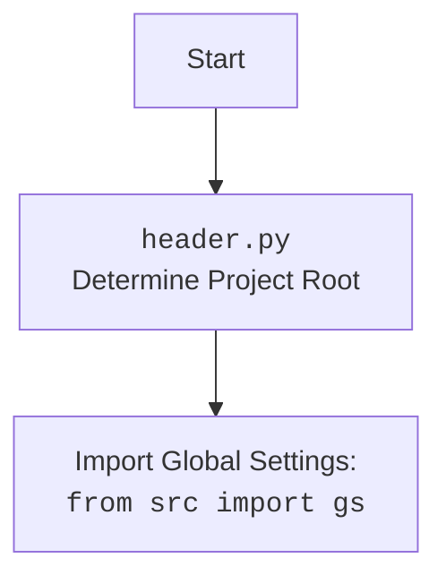

## АНАЛИЗ КОДА: `src/ai/openai/translator.py`

### <алгоритм>

**Блок-схема процесса перевода текста с использованием OpenAI API:**

1.  **Начало:**
    *   Инициализация: Программа начинает выполнение.

2.  **Импорт библиотек:**
    *   Импортируются необходимые библиотеки: `openai` для взаимодействия с OpenAI API, `gs` для глобальных настроек, `logger` для логирования.
    *   Пример: `import openai`, `from src import gs`, `from src.logger.logger import logger`
3.  **Настройка API Key:**
    *   Из глобальных настроек (`gs`) извлекается API-ключ OpenAI и устанавливается.
    *   Пример: `openai.api_key = gs.credentials.openai`

4.  **Функция `translate`:**
    *   Входные данные: Текст (`text`), исходный язык (`source_language`), целевой язык (`target_language`).
    *   Формирование запроса (`prompt`): Создание текстового запроса для OpenAI с указанием языков и текста для перевода.
    *   Пример:
        ```python
        prompt = (
            f"Translate the following text from {source_language} to {target_language}:\n\n"
            f"{text}\n\n"
            f"Translation:"
        )
        ```
5.  **Отправка запроса в OpenAI API:**
    *   Отправка запроса в OpenAI с использованием `openai.Completion.create()`.
    *   Параметры: Используется модель `text-davinci-003`, сформированный `prompt`, `max_tokens`, `n`, `stop`, `temperature`.
    *   Пример:
        ```python
        response = openai.Completion.create(
            engine="text-davinci-003",
            prompt=prompt,
            max_tokens=1000,
            n=1,
            stop=None,
            temperature=0.3
        )
        ```

6.  **Получение и обработка ответа:**
    *   Извлечение переведенного текста из ответа API (`response.choices[0].text`).
    *   Удаление лишних пробелов в начале и конце переведенного текста (`strip()`).
    *   Пример: `translation = response.choices[0].text.strip()`

7.  **Возврат переведенного текста:**
    *   Возврат переведенного текста.
    *   Пример: `return translation`

8.  **Обработка ошибок:**
    *   В случае возникновения исключения во время запроса к API, ошибка логируется.
    *   Пример:
        ```python
        except Exception as ex:
            logger.error("Error during translation", ex)
            return
        ```

9.  **Конец:**
    *   Завершение работы функции `translate`.

### <mermaid>

```mermaid
flowchart TD
    Start[Начало] --> ImportLibraries[Импорт библиотек: <br><code>openai</code>, <code>src.gs</code>, <code>src.logger.logger</code>];
    ImportLibraries --> SetApiKey[Установка API ключа: <br><code>openai.api_key = gs.credentials.openai</code>];
    SetApiKey --> TranslateFunction[Функция <code>translate(text, source_language, target_language)</code>];
    TranslateFunction --> GeneratePrompt[Формирование запроса <code>prompt</code> для OpenAI];
    GeneratePrompt --> SendRequest[Отправка запроса в OpenAI API: <br><code>openai.Completion.create()</code>];
    SendRequest --> ProcessResponse{Обработка ответа API};
    ProcessResponse -- Успех --> ExtractTranslation[Извлечение переведенного текста: <br><code>response.choices[0].text.strip()</code>];
    ExtractTranslation --> ReturnTranslation[Возврат переведенного текста];
    ProcessResponse -- Ошибка --> LogError[Логирование ошибки: <code>logger.error()</code>];
    LogError --> ReturnNone[Возврат <code>None</code>];
    ReturnTranslation --> End[Конец];
    ReturnNone --> End;
```

**Объяснение диаграммы `mermaid`:**

*   **Start**: Начало выполнения программы.
*   **ImportLibraries**: Импортируются библиотеки: `openai` для взаимодействия с OpenAI API, `gs` для глобальных настроек, `logger` для логирования ошибок. Эти импорты создают зависимости, необходимые для работы программы.
*   **SetApiKey**: Устанавливается API ключ OpenAI, используя глобальные настройки из `gs`.
*  **TranslateFunction**: Функция `translate` принимает текст, исходный и целевой языки в качестве аргументов.
*   **GeneratePrompt**: Формируется текстовый запрос `prompt`, который будет отправлен в OpenAI API.
*   **SendRequest**: Запрос отправляется в OpenAI API с использованием метода `openai.Completion.create()`.
*   **ProcessResponse**: Проверяется результат ответа от OpenAI API. Если запрос успешен, извлекается переведенный текст. Если произошла ошибка, ошибка логируется.
*   **ExtractTranslation**: Извлекается переведенный текст из ответа API.
*   **ReturnTranslation**: Функция возвращает переведенный текст.
*   **LogError**: Логируется ошибка, возникшая при обращении к OpenAI API.
*  **ReturnNone**: В случае ошибки функция возвращает `None`.
*   **End**: Конец выполнения программы.



### <объяснение>

**Импорты:**

*   `import openai`: Импортирует библиотеку `openai`, которая обеспечивает взаимодействие с API OpenAI. Эта библиотека позволяет отправлять запросы к моделям OpenAI, таким как `text-davinci-003`, для выполнения задач перевода. Она является внешней зависимостью и устанавливается через `pip install openai`.
*   `from src import gs`: Импортирует модуль `gs` (global settings) из пакета `src`. Этот модуль используется для хранения глобальных настроек приложения, таких как API-ключи и другие конфигурационные параметры. Этот модуль является частью проекта и управляется локально.
*   `from src.logger.logger import logger`: Импортирует объект `logger` из модуля `logger` внутри пакета `src`. Этот модуль используется для записи сообщений об ошибках и другой отладочной информации в файл журнала. Это позволяет разработчикам отслеживать и устранять проблемы в приложении. Он является частью проекта и управляется локально.

**Функции:**

*   `translate(text, source_language, target_language)`:
    *   **Аргументы**:
        *   `text` (str): Текст, который нужно перевести.
        *   `source_language` (str): Язык исходного текста.
        *   `target_language` (str): Язык, на который нужно перевести текст.
    *   **Возвращаемое значение**:
        *   (str): Переведенный текст, если перевод выполнен успешно.
        *   None: Возвращает `None`, если во время перевода произошла ошибка.
    *   **Назначение**: Функция принимает текст, исходный и целевой языки и использует OpenAI API для перевода текста с одного языка на другой.
    *   **Пример**:
        ```python
        source_text = "Привет, как дела?"
        source_language = "Russian"
        target_language = "English"
        translation = translate(source_text, source_language, target_language)
        print(f"Translated text: {translation}")  # Выведет переведенный текст на английском
        ```

**Переменные:**

*   `openai.api_key`: Глобальная переменная, устанавливаемая в начале кода, которая хранит API-ключ OpenAI. Этот ключ используется для аутентификации при отправке запросов к API OpenAI.
*  `prompt`: Строка, которая содержит запрос, который будет отправлен в OpenAI API для перевода текста.
*   `response`: Объект, который хранит ответ от OpenAI API после отправки запроса на перевод.
*   `translation`: Строка, которая хранит переведенный текст, извлеченный из ответа OpenAI API.
*  `ex`: Объект исключения, который хранит информацию об ошибке, если она произошла во время запроса к API.

**Потенциальные ошибки и области для улучшения:**

*   **Обработка ошибок**: В текущей реализации ошибки при обращении к OpenAI API обрабатываются простым логированием. Можно улучшить обработку ошибок, добавив более детальный анализ исключений и предоставление пользователю более информативных сообщений об ошибке. Например, можно добавить повторные попытки запроса в случае временных проблем с сетью или перегрузкой сервера OpenAI.
*   **Параметры модели**: Параметры модели (`engine`, `max_tokens`, `temperature` и т.д.) заданы жестко в коде. Было бы лучше вынести эти параметры в конфигурационный файл или переменные окружения, чтобы их можно было легко изменять без необходимости редактирования кода.
*   **Управление API Key**: Сейчас API-ключ загружается из глобальных настроек. В продакшене рекомендуется использовать более безопасные методы хранения и управления API-ключами, например, использовать менеджеры секретов или переменные окружения.
*   **Обработка лимитов API**: OpenAI имеет лимиты на количество запросов в определенный период времени. Следует добавить обработку ошибок, связанных с превышением лимита запросов, чтобы избежать сбоев приложения. Например, можно добавить механизм задержки между запросами или использовать очереди запросов.
*  **Логирование**: В настоящее время логируется только базовая ошибка. Можно расширить логирование, чтобы записывать больше деталей, таких как идентификаторы запросов, параметры и время выполнения, для облегчения отладки и анализа.
*  **Улучшения:** Можно добавить поддержку выбора разных моделей OpenAI, не только `text-davinci-003`. Можно добавить поддержку перевода в несколько языков.
*  **Зависимости:** Модуль зависит от наличия `openai`, `src.gs`, `src.logger`. Нужно проверить, что эти зависимости установлены и доступны.

**Взаимосвязи с другими частями проекта:**

*   Модуль `translator.py` взаимодействует с модулем `gs` для получения API-ключа OpenAI. Это позволяет конфигурировать параметры API без жесткого кодирования в коде.
*   Модуль использует `logger` для логирования ошибок.
*   Этот модуль можно использовать в других частях проекта, например, в компонентах, которые обрабатывают текстовые данные и требуют перевода.

**Цепочка взаимосвязей:**

1.  Зависимость от `openai`: Для взаимодействия с OpenAI API.
2.  Зависимость от `src.gs`: Для получения глобальных настроек, включая API-ключ.
3.  Зависимость от `src.logger.logger`: Для логирования ошибок и других сообщений.
4.  Модуль `translator.py` может использоваться другими модулями для выполнения операций перевода.

Таким образом, данный модуль предоставляет функциональность перевода текста, которая может быть интегрирована в различные части проекта для поддержки мультиязычности.