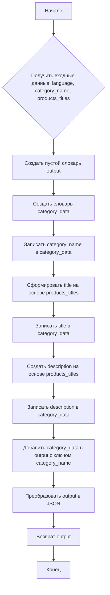

## Анализ кода

### 1. <алгоритм>

**Общее описание:**
Код представляет собой инструкцию для модели искусственного интеллекта (ИИ), которая должна генерировать рекламные описания для товаров на основе предоставленных данных. Инструкция определяет роль ИИ как `promo_creater`, определяет формат входных данных (категория товара, список названий товаров и язык) и ожидаемый формат вывода (JSON словарь).

**Пошаговая блок-схема:**

1.  **Входные данные:**
    *   `language` (строка): Язык, на котором должен быть создан текст описания (например, "RU", "HE").
    *   `category_name` (строка): Название категории товара (например, "liitokala_18650", "mom_and_baby").
    *   `products_titles` (список строк): Список названий товаров в данной категории.

    *Пример:*
    ```
        language = "RU"
        category_name = "liitokala_18650"
        products_titles = ["Зарядное устройство LiitoKala...", "LiitoKala Lii-S12 ...", ...]
    ```

2.  **Обработка:**
    *   Создание словаря с ключом `category_name`, внутри которого будет словарь с тремя ключами: `category_name`, `title` и `description`.
    *   `category_name` будет просто скопировано из входных данных.
    *   `title` должен быть кратким (до 50 символов) обобщением всех `products_titles`.
         *Пример:* `title` для категории "liitokala_18650" может быть "Зарядные устройства LiitoKala для аккумуляторов 18650 ...".
    *   `description` должен представлять собой заметку для домохозяек, использующую названия товаров для придания разнообразия. Описание должно быть не более 1200 символов и имитировать заметку из домашнего календаря.
         *Пример:* `description` для категории "liitokala_18650" может содержать текст "LiitoKala для разных типов аккумуляторов: iitoKala Lii-M4S-M4,  LiitoKala Lii-S12 Lii-D4XL-Lii S8 LCD, ...".

3.  **Выходные данные:**
    *   JSON-словарь, где ключ – `category_name`, а значение – словарь с полями `category_name`, `title` и `description`.

    *Пример:*
    ```json
    {
        "liitokala_18650": {
            "category_name": "liitokala_18650",
            "title": "Зарядные устройства LiitoKala для аккумуляторов 18650 ...",
            "description": "LiitoKala для разных типов аккумуляторов: iitoKala Lii-M4S-M4,  LiitoKala Lii-S12 Lii-D4XL-Lii S8 LCD, LiitoKala Lii-S12 Lii-S8 Lii-PD4 Lii-PD2 Lii-500S, LiitoKala Lii-M4,  LiitoKala Lii-202 Lii-402,  LiitoKala Lii-D4,  LiitoKala Lii-PD2,  LiitoKala Lii-M4S + U1,  OPUS BT-C3100,   Зарядное устройство LiitoKala для Li-Ion LiFePO4 Ni-MH Ni-Cd батарей с ЖК-дисплеем,  Зарядное устройство LiitoKala для аккумуляторов  AA AAA 10440 14500 16340 17335 17500 18490 17670  и другие. Все зарядные устройства отличаются высоким качеством, функциональностью и надежностью. Выбирайте зарядное устройство LiitoKala для ваших аккумуляторов и будьте уверены в их безопасности и долговечности"
        }
    }
    ```

### 2. <mermaid>



**Объяснение:**

*   **`flowchart TD`**: Объявляет тип диаграммы - блок-схема, направление слева направо (TD - top down).
*   **`A[Начало]`**: Начальная точка блок-схемы.
*   **`B{Получить входные данные: language, category_name, products_titles}`**: Блок ввода, в котором ИИ получает необходимые данные (язык, имя категории и список названий продуктов).
*   **`C[Создать пустой словарь output]`**: Создание основного словаря, куда будет сохранен результат.
*   **`D[Создать словарь category_data]`**: Создание словаря для данных конкретной категории.
*  **`E[Записать category_name в category_data]`**: Запись имени категории в соответствующий словарь.
*   **`F[Сформировать title на основе products_titles]`**: Формирование краткого заголовка на основе названий продуктов.
*   **`G[Записать title в category_data]`**: Запись заголовка в словарь категории.
*   **`H[Создать description на основе products_titles]`**: Создание описания на основе названий продуктов, имитирующего календарную заметку.
*   **`I[Записать description в category_data]`**: Запись описания в словарь категории.
*   **`J[Добавить category_data в output с ключом category_name]`**: Добавление словаря категории в основной словарь с именем категории в качестве ключа.
*   **`K[Преобразовать output в JSON]`**: Преобразование словаря `output` в JSON строку.
*   **`L[Возврат output]`**: Возврат сформированного JSON словаря.
*   **`M[Конец]`**: Конечная точка блок-схемы.

В этой диаграмме не используются импорты, поэтому дополнительный блок `mermaid` для `header.py` не требуется.

### 3. <объяснение>

**Импорты:**
В данном коде импорты отсутствуют. Это связано с тем, что это не исполняемый код, а инструкция для ИИ.

**Классы:**
В этом коде нет классов.

**Функции:**
Код описывает логику работы функции, но не содержит ее определения. Логически, функция:
   *   Принимает на вход `language`, `category_name` и `products_titles`.
   *   Возвращает JSON-словарь, где ключ - название категории, а значение - словарь с  ключами `category_name`, `title` и `description`.
   *   `category_name` равно имени входной категории.
   *   `title` является кратким обобщением `products_titles`.
   *   `description` представляет собой описание для домохозяек, имитирующее заметку из домашнего календаря, на основе `products_titles`.

**Переменные:**
*   `language` - строка, представляющая язык описания.
*   `category_name` - строка, представляющая имя категории товаров.
*   `products_titles` - список строк, представляющий названия продуктов.
*   `output` - словарь, хранящий результирующий JSON объект.
*   `category_data` - словарь, хранящий данные для конкретной категории.
*   `title` - строка, представляющая краткий заголовок.
*   `description` - строка, представляющая детальное описание.

**Потенциальные ошибки и улучшения:**

*   **Генерация `title`:** Инструкция говорит, что `title` должен быть кратким обобщением `products_titles`, но не указывает, как это обобщение должно происходить. Это может привести к неоднозначным результатам.
    *   **Улучшение:** Можно добавить инструкции о том, как именно формировать заголовок (например, выбирать первые несколько слов из самого длинного названия товара или использовать ключевые слова из всех названий).
*   **Генерация `description`:** Инструкция говорит, что `description` должен имитировать календарную заметку для домохозяек, но не уточняет, какой должен быть стиль этой заметки.
    *   **Улучшение:** Можно добавить требования к стилю описания (например, использование разговорного стиля, фокус на практическое применение товаров, создание ощущения полезности).
*   **Длина `title` и `description`**:
     *   **Улучшение:** Добавить проверку на длину заголовка и описания.
*   **Обработка пустых списков:**
     *   **Улучшение:** Добавить логику обработки ситуации, когда `products_titles` пустой.
*   **Тестовые примеры**: В тексте инструкции примеры не полные.
    *   **Улучшение:**  Уточнить тестовые примеры в инструкции, сделать их более показательными.

**Взаимосвязь с другими частями проекта:**
Этот код является инструкцией для ИИ, предназначенного для генерации рекламного контента для AliExpress. Он, вероятно, является частью системы, которая использует ИИ для автоматизации процессов маркетинга и продвижения товаров.

В целом, код является подробным и понятным, но требует дополнительных уточнений для генерации более качественного и однозначного результата.