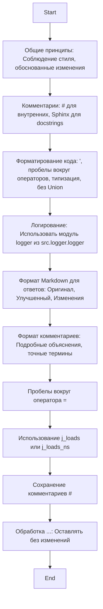

## ИНСТРУКЦИЯ:

Анализируй предоставленный код подробно и объясни его функциональность. Ответ должен включать три раздела:

1. **<алгоритм>**: Опиши рабочий процесс в виде пошаговой блок-схемы, включая примеры для каждого логического блока, и проиллюстрируй поток данных между функциями, классами или методами.
2. **<mermaid>**: Напиши код для диаграммы в формате `mermaid`, проанализируй и объясни все зависимости,
    которые импортируются при создании диаграммы.
    **ВАЖНО!** Убедитесь, что все имена переменных, используемые в диаграмме `mermaid`,
    имеют осмысленные и описательные имена. Имена переменных вроде `A`, `B`, `C`, и т.д., не допускаются!

    **Дополнительно**: Если в коде есть импорт `import header`, добавьте блок `mermaid` flowchart, объясняющий `header.py`:
    ```mermaid
    flowchart TD
        Start --> Header[<code>header.py</code><br> Determine Project Root]

        Header --> import[Import Global Settings: <br><code>from src import gs</code>]
    ```

3. **<объяснение>**: Предоставьте подробные объяснения:
   - **Импорты**: Их назначение и взаимосвязь с другими пакетами `src.`.
   - **Классы**: Их роль, атрибуты, методы и взаимодействие с другими компонентами проекта.
   - **Функции**: Их аргументы, возвращаемые значения, назначение и примеры.
   - **Переменные**: Их типы и использование.
   - Выделите потенциальные ошибки или области для улучшения.

Дополнительно, постройте цепочку взаимосвязей с другими частями проекта (если применимо).

Это обеспечивает всесторонний и структурированный анализ кода.
## Формат ответа: `.md` (markdown)
**КОНЕЦ ИНСТРУКЦИИ**

### <алгоритм>

Представленный код является инструкцией для модели машинного обучения, описывающей правила и требования к стилю, форматированию, комментариям и обработке кода.  Он определяет, как модель должна генерировать, анализировать и улучшать код, обеспечивая единообразие и читаемость.

1. **Общие принципы**:
   - **Описание**: Определяет общие правила: придерживаться единого стиля, все изменения обоснованы.
   - **Пример**: Применение стиля PEP 8, избегать магических чисел.
2. **Комментарии**:
   - **Описание**: Указывает на использование `#` для внутренних комментариев и Sphinx для документации функций, методов и классов.
   - **Пример**: `# Это внутренний комментарий`,
   ```python
   def example_function(arg: int) -> int:
        """
        Docstring для функции.
        """
        ...
   ```
3. **Форматирование кода**:
   - **Описание**: Требует использовать одинарные кавычки, пробелы вокруг операторов, типизацию параметров и исключение `Union`.
   - **Пример**: `x = 5`, `def my_function(arg: int) -> str: ...`
4. **Логирование**:
    - **Описание**: Требует использовать модуль `logger` из `src.logger.logger`.
    - **Пример**:  `logger.error("Произошла ошибка")`
5. **Формат Markdown для ответов**:
   - **Описание**: Определяет структуру ответов, включая оригинальный код, улучшенный код и список изменений.
   - **Пример**:
   ```markdown
   # Оригинальный код
   ...
   # Улучшенный код
   ...
   # Изменения
   ...
   ```
6. **Формат комментариев**:
   - **Описание**: Устанавливает стиль комментариев в коде, с подробными объяснениями, избегая общих фраз типа "получить" или "сделать".
   - **Пример**:
       ```python
       def example_function(arg: int) -> str:
           """
           Извлекает данные из базы данных.
           """
           ...
        ```
7. **Пробелы вокруг оператора присваивания**:
    - **Описание**: Требует добавления пробелов вокруг оператора `=`.
    - **Пример**: `x = 5`
8. **Использование `j_loads` или `j_loads_ns`**:
   - **Описание**: Предписывает заменять `open` и `json.load` на `j_loads` или `j_loads_ns` для JSON.
   - **Пример**: `data = j_loads('config.json')`
9. **Сохранение комментариев**:
   - **Описание**: Требует сохранять существующие комментарии `#` без изменений.
   - **Пример**: `# Это комментарий`.
10. **Обработка `...`**:
    - **Описание**: Оставляет `...` как маркеры без изменений и не документирует эти строки.

### <mermaid>



**Анализ диаграммы:**

Диаграмма `mermaid` визуализирует последовательность правил и требований, описанных в инструкции. Каждый блок представляет собой группу правил, которые должны соблюдаться при генерации, анализе и улучшении кода.
- **`Start`**: Начало процесса.
- **`GeneralPrinciples`**: Описывает общие принципы кодирования.
- **`Comments`**: Указывает на правила использования комментариев.
- **`CodeFormatting`**: Определяет правила форматирования кода.
- **`Logging`**: Указывает на правила логирования.
- **`MarkdownFormat`**: Описывает структуру Markdown для ответов.
- **`CommentFormat`**: Устанавливает формат комментариев.
- **`AssignmentOperatorSpacing`**: Указывает на необходимость пробелов вокруг оператора `=`.
- **`JsonLoading`**: Указывает на использование специальных функций для загрузки JSON.
- **`PreserveComments`**: Указывает на необходимость сохранения комментариев.
- **`EllipsisHandling`**: Указывает на обработку маркеров `...`.
- **`End`**: Конец процесса.

### <объяснение>

**Общее:**
- Код представляет собой инструкцию для модели машинного обучения, которая определяет правила и требования к генерации, анализу и улучшению кода. Она не является исполняемым кодом, а служит как руководство для модели.
- Инструкция обеспечивает единообразный стиль кода, документирование и форматирование.

**Основные положения:**

1.  **Общие принципы**:
    -   `Придерживаться однозначного стиля кодирования.` - Это означает, что весь код должен соответствовать одному и тому же набору правил оформления. Например, PEP 8 для Python.
    -   `Все изменения должны быть обоснованными и соответствовать требованиям.` - Любые изменения, которые модель вносит в код, должны быть мотивированы и соответствовать общим целям и задачам.

2.  **Комментарии**:
    -   `Использовать # для внутренних комментариев.` - Это стандартный способ добавления однострочных комментариев в Python.
    -   `Документация в формате Sphinx должна быть использована для всех функций, методов и классов.` - Sphinx – это инструмент для создания документации, и он требует специального форматирования docstring'ов.
    -   `Комментарии и документация должны быть понятными, краткими и точными.` - Комментарии и документация должны предоставлять ясную информацию, необходимую для понимания кода.

3.  **Форматирование кода**:
    -   `Использовать одинарные кавычки.` - Все строковые литералы должны быть заключены в одинарные кавычки.
    -   `Добавлять пробелы вокруг операторов.` - Добавлять пробелы перед и после операторов (`=`, `+`, `-` и т.д.) для улучшения читаемости.
    -   `Все параметры должны быть типизированы.` - Все параметры функций и методов должны иметь аннотацию типа, например, `def foo(x: int) -> str: ...`.
    -   `Исключить использование Union.` -  Следует избегать использования `Union` для описания типов, вероятно, в пользу более конкретных типов или `Optional`.

4.  **Логирование**:
     -  `Использовать модуль logger из src.logger.logger.` - Все логи должны быть записаны через специальный модуль логирования, определенный в `src.logger.logger`. Это позволяет стандартизировать процесс логирования и может упростить анализ логов.
     -  `Примеры ошибок должны быть записаны через logger.error.` - Ошибки и исключения, обнаруженные в процессе выполнения кода, должны быть записаны с использованием `logger.error`, что позволяет отличать их от других уровней логов.

**Основные требования:**

1.  **Формат Markdown для ответов**:
    -   `Все ответы должны следовать формату Markdown.` - Ответы модели должны быть в формате Markdown для обеспечения читаемости и структурированности.
    -   `Структура ответа должна включать:  Оригинальный код, Улучшенный код, Изменения.` - Ответы должны содержать оригинальный код, его улучшенную версию и список внесенных изменений.
    -   `Код должен быть обрамлён в соответствующие теги подсветки синтаксиса.` - Код должен быть выделен с помощью тегов для подсветки синтаксиса.

2.  **Формат комментариев**:
    -   `Используйте стиль для комментариев и документации в коде.` - Указывает на необходимость следования стилю, описанному в примере.
    -   `Всегда предоставляйте подробные объяснения в комментариях. Избегайте расплывчатых терминов...` - Комментарии должны быть подробными и избегать общих фраз типа "получить" или "сделать".
    -   `Комментарии должны немедленно предшествовать описываемому блоку кода и объяснять его цель.` - Комментарии должны предшествовать коду, который они объясняют.

3.  **Пробелы вокруг оператора присваивания**:
    -   `Всегда добавляйте пробелы вокруг оператора =.` - Пробелы вокруг оператора присваивания улучшают читаемость кода.

4.  **Использование `j_loads` или `j_loads_ns`**:
    -   `Для чтения JSON или конфигурационных файлов заменяйте стандартное open и json.load на j_loads или j_loads_ns.` - Рекомендуется использовать специализированные функции `j_loads` или `j_loads_ns` для чтения JSON, которые могут предоставлять дополнительную обработку или безопасность.
    -   `j_loads` и `j_loads_ns` являются функциями из `src.utils.json_utils`, и их назначение -- чтение JSON файлов. `j_loads`  - основная функция. `j_loads_ns` -- функция для чтения JSON в namespace.

5.  **Сохранение комментариев**:
    -   `Все существующие комментарии, начинающиеся с #, должны быть сохранены без изменений в разделе "Улучшенный код".` - Существующие комментарии должны быть сохранены в новой версии кода, это помогает сохранить контекст кода.
    -  `Если комментарий кажется устаревшим или непонятным, не модифицируйте его. Вместо этого отметьте это в разделе "Изменения".` - Указывает на необходимость сохранения оригинальной формулировки, даже если есть сомнения в ее уместности, и отмечает необходимость дальнейшего анализа.

6.  **Обработка `...` в коде**:
    -   `Оставляйте ... как маркеры в коде без изменений.` - Многоточия (`...`) следует оставлять как маркеры без изменений, что указывает на то, что эта часть кода еще не реализована.
    -  `Не документируйте строки с ...` - Строки с `...` не нужно комментировать или документировать, поскольку это нереализованный код.

7. **Структура ответа**:
    - `Улучшенный Оптимизированный полный код:`-  Здесь должна быть приведена улучшенная версия кода с комментариями и форматированием.
    - `Изменения:` -  Здесь следует привести подробный список внесенных изменений, включая объяснения и обоснования.

**Цепочка взаимосвязей:**
- Инструкция `CODE_RULES.RU.MD` является частью системы, предназначенной для автоматической генерации, анализа и улучшения кода. Она определяет основные правила, которым должна следовать модель машинного обучения.
- Модуль логирования `src.logger.logger` используется для стандартизации процесса записи логов, обеспечивая их централизованный и организованный сбор.
- Функции `j_loads` и `j_loads_ns` из `src.utils.json_utils` предназначены для безопасного и эффективного чтения JSON файлов, заменяя стандартные функции Python.
- `src` - это корень проекта.

**Потенциальные ошибки и улучшения:**

*   **Исключение `Union`**: Установка правила исключить `Union` может привести к более сложному коду или созданию новых типов, так как требуется указать более конкретные типы.
*   **Обработка комментариев:** Необходимость сохранения старых комментариев, даже если они устарели, может затруднить понимание кода, если не будет произведен анализ и обновление комментариев вручную.
*   **Жесткие правила форматирования**: Может понадобиться гибкость в некоторых случаях, чтобы соблюдать баланс между требованиями и общей читаемостью кода.

В заключении, этот код описывает правила для автоматизированной системы по работе с кодом. Эти правила направлены на обеспечение единообразия, читаемости и высокого качества кода.