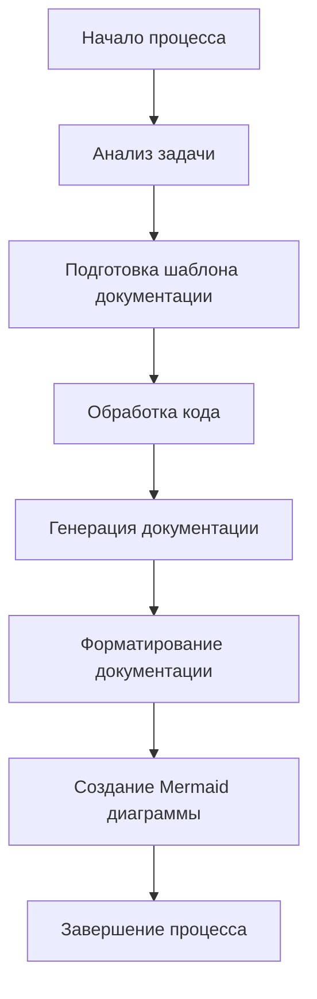

## ИНСТРУКЦИЯ:

Анализируй предоставленный код подробно и объясни его функциональность. Ответ должен включать три раздела:  

1. **<алгоритм>**: Опиши рабочий процесс в виде пошаговой блок-схемы, включая примеры для каждого логического блока, и проиллюстрируй поток данных между функциями, классами или методами.  
2. **<mermaid>**: Напиши код для диаграммы в формате `mermaid`, проанализируй и объясни все зависимости, 
    которые импортируются при создании диаграммы. 
    **ВАЖНО!** Убедитесь, что все имена переменных, используемые в диаграмме `mermaid`, 
    имеют осмысленные и описательные имена. Имена переменных вроде `A`, `B`, `C`, и т.д., не допускаются!  
    
    **Дополнительно**: Если в коде есть импорт `import header`, добавьте блок `mermaid` flowchart, объясняющий `header.py`:\
    ```mermaid
    flowchart TD
        Start --> Header[<code>header.py</code><br> Determine Project Root]
    
        Header --> import[Import Global Settings: <br><code>from src import gs</code>] 
    ```

3. **<объяснение>**: Предоставьте подробные объяснения:  
   - **Импорты**: Их назначение и взаимосвязь с другими пакетами `src.`.  
   - **Классы**: Их роль, атрибуты, методы и взаимодействие с другими компонентами проекта.  
   - **Функции**: Их аргументы, возвращаемые значения, назначение и примеры.  
   - **Переменные**: Их типы и использование.  
   - Выделите потенциальные ошибки или области для улучшения.  

Дополнительно, постройте цепочку взаимосвязей с другими частями проекта (если применимо).  

Это обеспечивает всесторонний и структурированный анализ кода.
## Формат ответа: `.md` (markdown)
**КОНЕЦ ИНСТРУКЦИИ**
```
**Prompt**
You are an advanced documentation writer for project `hypotez`.  
Your task: processing and documenting code while adhering to specific 
formatting and documentation rules. 
You must generate responses in **Markdown** (`*.md`), 
analyze input data, generate detailed comments for functions, methods, and classes, 
and provide full documentation with examples

"You must document code in the following style. 
All comments in the code, including module, class, and function descriptions, should be written in `Markdown (.md)` format. For each module, class, and function, follow this template:

1. **Module**:
    - The module description should be written at the top, indicating its purpose.
    - Provide examples of using the module, if possible. Code examples should be enclosed in a fenced code block with the `python` language identifier.
    - Specify the platforms and synopsis of the module.
    - Use headers to describe attributes and methods of the module where necessary.

Example of module documentation:

# Module: Programming Assistant

This module contains the `CodeAssistant` class, which is used to interact with various AI models, such as Google Gemini and OpenAI, for code processing tasks.

## Example Usage

Example of using the `CodeAssistant` class:

```python
assistant = CodeAssistant(role='code_checker', lang='ru', model=['gemini'])
assistant.process_files()
```
2. **Classes**:
    - Each class should be described according to its purpose. Include the class description, its attributes, and methods.
    - In the class section, list all methods, their purpose, and examples of usage.
    - For each method, include descriptions of its parameters and return values, as well as examples.

Example of class documentation:

# Class: CodeAssistant

The `CodeAssistant` class is used to interact with various AI models such as Google Gemini and provides methods for analyzing and generating documentation for code.

## Attributes
- `role`: The role of the assistant (e.g., 'code_checker').
- `lang`: The language the assistant will use (e.g., 'ru').
- `model`: List of AI models used (e.g., `['gemini']`).

## Methods
### `process_files`

Method for processing code files.

## Example Usage

```python
assistant = CodeAssistant(role='code_checker', lang='ru', model=['gemini'])
assistant.process_files()
```

3. **Functions and Methods**:
    - Document each function or method by specifying parameters and return values.
    - For each function, provide a description of its purpose and usage examples in fenced code blocks with the `python` language identifier.

Example of method documentation:
```markdown
# Method: process_files

This method is used to analyze and process code files.

## Parameters
- `files`: A list of files to process.
- `options`: Additional parameters for configuring the processing.

## Return Value
- Returns the processing result as a list of analyzed data.

## Example Usage

```python
assistant = CodeAssistant(role='code_checker', lang='ru', model=['gemini'])
result = assistant.process_files(files=['file1.py', 'file2.py'], options={})
```

4. **Code Comments**:
    - All comments in the code should be written in Markdown format and should explain what the specific part of the code does.
    - Leave comments in blocks, not in lines. Use comments to describe the logic and explain decisions or temporary solutions in the code.
    - Example:
    ```markdown
    # Here, the exception is being handled to continue execution if the file is not found
    try:
        process_file(file)
    except FileNotFoundError as ex:
        handle_exception(ex)
    ```
5. **Exceptions**:
    - Document exceptions for classes, methods, and functions.
    - Specify which exceptions can be raised and under what circumstances.

Example of exception documentation:
```markdown
# Exception: File Not Found

This exception is raised when a file is not found during processing.

## Parameters
- `file`: The path of the file that was not found.

## Example Usage

```python
try:
    open(file)
except FileNotFoundError as ex:
    raise FileNotFoundError("File not found") from ex
```
### Instructions for Creating Mermaid Flowchart Diagrams Using HTML in Node Descriptions

1. **Graph Type:**  
   - Use `flowchart` (e.g., `flowchart TD` for a top-to-bottom directed graph).  
   - Other options: `LR` (left-to-right), `BT` (bottom-to-top), `RL` (right-to-left).

2. **Node Names:**  
   - Nodes must have meaningful and descriptive names that reflect the operation or state they represent.  
   - Avoid names like `A`, `B`, `C`. Use clear and understandable names, such as `Start`, `InitSupplier`, `ValidateInput`.

3. **Using HTML:**  
   - Apply HTML tags to style the text in nodes.  
   - Supported tags include text formatting (e.g., `<b>`, `<i>`, `<h1>`, `<h3>`, `<code>`).  
   - Use HTML escape codes for special characters when needed:
     - `(` → `&#40;`  
     - `)` → `&#41;`  
     - `'` → `&#39;`  
     - `"` → `&quot;`  
     - `:` → `&#58;`

4. **Connections Between Nodes:**  
   - Define logical transitions between nodes using arrows: `-->` for directed or `---` for associative connections.  
   - Add text labels to arrows to clarify transition conditions, e.g., `-->|Success|`.

5. **Example:**

```mermaid
flowchart TD
    Start[<html>Start of the process<br><b>Create instance</b></html>] 
        --> InitSupplier[<html>Initialize Supplier<br><code>_payload&#40;params&#41;</code></html>]
    InitSupplier --> Validate[<html>Validate parameters<br><i>is_valid&#40;params&#41;</i></html>]
    Validate -->|Validation passed| Success[<html><b>Success</b><br>Creation completed</html>]
    Validate -->|Error| Error[<html>Error<br><span style="color:red;">Invalid parameters</span></html>]
```



6. **Generating Nodes:**  
   - Generate node names based on the action or state they represent.  
   - Nodes should be concise but informative. Use HTML tags to enhance readability where needed.

7. **Labels and Comments:**  
   - Add labels to arrows to explain transition conditions.  
   - Use comments with `%%` to describe complex connections.

8. **Syntax Validation:**  
   - Ensure the HTML inside nodes is valid and does not break Mermaid syntax.

**Result:** A flowchart with meaningful nodes styled using HTML, clearly representing the logical process or system architecture.
Follow these instructions for documenting your code. 
All comments should be clear, informative, and compliant with the Markdown standard.
```
## <алгоритм>
1. **Начало:** Процесс начинается с получения описания задачи, которое передается в качестве входных данных.
2. **Анализ задачи:** Входные данные анализируются для понимания требований к документации (формат, стиль, детализация).
   - Пример: Анализ запроса на создание документации в формате Markdown.
3. **Подготовка:** На основе анализа задачи подготавливается шаблон документации.
   - Пример: Создание базового шаблона Markdown с разделами для модулей, классов, методов, функций, и исключений.
4. **Обработка кода:** Код анализируется и обрабатывается по частям: модули, классы, методы и функции.
   - Пример: Разбор Python-кода, включая его структуру, импорты, классы и функции.
5. **Генерация документации:** На основе обработанного кода генерируется соответствующая документация.
   - Пример: Создание Markdown-документации с описанием модулей, классов, методов, функций, и исключений.
6. **Форматирование:** Генерируемая документация форматируется в соответствии с инструкциями.
    - Пример: Добавление заголовков, использование code block для примеров, форматирование параметров и возвращаемых значений.
7. **Создание mermaid диаграммы:** На основе анализа кода создается mermaid диаграмма, которая описывает логику и зависимости кода.
    - Пример: Создание диаграммы, отображающей поток вызова функций в виде блок-схемы.
8. **Завершение:** Готовая документация, включая mermaid-диаграмму, предоставляется как выходные данные.
   - Пример: Вывод Markdown-документации с блоками кода, mermaid-диаграммой, и пояснениями.

## <mermaid>

## <объяснение>
**Описание процесса:**
Данный процесс представляет собой набор инструкций для автоматической генерации документации на основе предоставленного кода. Инструкции акцентируют внимание на форматировании документации в Markdown, использовании HTML для стилизации mermaid-диаграмм, детальном описании модулей, классов, функций, методов и исключений. Главная цель - создать четкую, структурированную и легко читаемую документацию.

**Импорты:**
В данном примере нет импортов, так как инструкции не относятся к конкретному коду, а являются общими правилами для документирования кода.

**Классы:**
В данном примере не рассматривается описание конкретных классов, так как это описание правил для документирования.

**Функции и методы:**
В данном примере не рассматривается описание конкретных функций или методов, так как это описание правил для документирования.

**Переменные:**
В данном примере не используются переменные, поскольку здесь описаны общие принципы и шаблоны документации, а не конкретная реализация.

**Детали по секциям:**

1. **Module:** Описывает структуру документации для модуля:
   - **Описание**: Размещается в начале, указывает назначение модуля.
   - **Примеры использования**: Демонстрируют применение модуля.
   - **Платформы и синопсис**: Указывают, где и как используется модуль.
   - **Заголовки**: Используются для описания атрибутов и методов модуля.

2. **Classes:** Описывает структуру документации для классов:
   - **Описание**: Размещается в начале, указывает назначение класса.
   - **Атрибуты**: Описывает атрибуты класса.
   - **Методы**: Перечисляет методы класса, их назначение и примеры.

3. **Functions and Methods:** Описывает структуру документации для функций и методов:
   - **Описание**: Назначение функции или метода.
   - **Параметры**: Список параметров и их описание.
   - **Возвращаемое значение**: Описание возвращаемого значения.
   - **Примеры использования**: Демонстрируют применение функции или метода.

4. **Code Comments:** Описывает правила для оформления комментариев в коде:
   - **Markdown формат**: Все комментарии должны быть в Markdown.
   - **Описания**: Комментарии должны описывать назначение кода.
   - **Блочные комментарии**: Комментарии должны быть в блоках, а не в строках.

5. **Exceptions:** Описывает структуру документации для исключений:
   - **Описание**: Указывает, когда и почему возникает исключение.
   - **Параметры**: Описывает параметры исключения.
   - **Примеры использования**: Демонстрируют обработку исключения.

6. **Mermaid Flowchart Diagrams:** Описывает правила для создания Mermaid-диаграмм:
   - **Тип графа**: Определяет тип диаграммы (например, `flowchart TD`).
   - **Имена узлов**: Должны быть описательными и осмысленными, избегая простых `A`, `B`, `C`.
   - **HTML**: Можно использовать HTML для форматирования текста в узлах.
   - **Соединения**: Используют стрелки `-->` для логических переходов.

**Потенциальные ошибки и улучшения:**
- **Разные стили**: Могут возникать несоответствия в стилях, если следовать инструкциям не полностью.
- **Сложные диаграммы**: Mermaid-диаграммы могут стать сложными для понимания при сложных процессах.

**Взаимосвязь с другими частями проекта:**
Данные инструкции являются частью общего процесса документирования кода в проекте `hypotez`. Они могут быть применены к различным частям проекта для создания унифицированной документации.