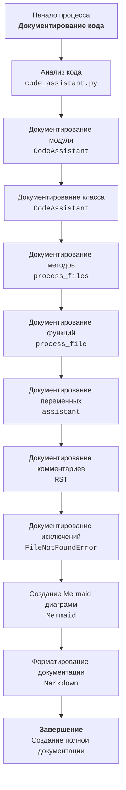

## ИНСТРУКЦИЯ:

Анализируй предоставленный код подробно и объясни его функциональность. Ответ должен включать три раздела:

1. **<алгоритм>**: Опиши рабочий процесс в виде пошаговой блок-схемы, включая примеры для каждого логического блока, и проиллюстрируй поток данных между функциями, классами или методами.
2. **<mermaid>**: Напиши код для диаграммы в формате `mermaid`, проанализируй и объясни все зависимости,
    которые импортируются при создании диаграммы.
    **ВАЖНО!** Убедитесь, что все имена переменных, используемые в диаграмме `mermaid`,
    имеют осмысленные и описательные имена. Имена переменных вроде `A`, `B`, `C`, и т.д., не допускаются!

    **Дополнительно**: Если в коде есть импорт `import header`, добавьте блок `mermaid` flowchart, объясняющий `header.py`:\
    ```mermaid
    flowchart TD
        Start --> Header[<code>header.py</code><br> Determine Project Root]

        Header --> import[Import Global Settings: <br><code>from src import gs</code>]
    ```

3. **<объяснение>**: Предоставьте подробные объяснения:
   - **Импорты**: Их назначение и взаимосвязь с другими пакетами `src.`.
   - **Классы**: Их роль, атрибуты, методы и взаимодействие с другими компонентами проекта.
   - **Функции**: Их аргументы, возвращаемые значения, назначение и примеры.
   - **Переменные**: Их типы и использование.
   - Выделите потенциальные ошибки или области для улучшения.

Дополнительно, постройте цепочку взаимосвязей с другими частями проекта (если применимо).

Это обеспечивает всесторонний и структурированный анализ кода.
## Формат ответа: `.md` (markdown)
**КОНЕЦ ИНСТРУКЦИИ**

# Модуль: `doc_writer_md_ru.md`

Этот документ содержит инструкции для технического писателя, занимающегося созданием документации для проекта `hypotez`. Инструкция определяет формат и стиль документации, включая использование markdown, русского языка, RST-формата для комментариев в коде и подробное описание модулей, классов, функций и методов.

## 1. <алгоритм>

**Блок-схема процесса документирования кода:**

1.  **Начало**: Получение инструкций для технического писателя.
    *   Пример: Чтение файла `doc_writer_md_ru.md`.
2.  **Анализ кода**:
    *   Пример: Изучение кода `CodeAssistant` в файле `code_assistant.py`.
3.  **Документирование модуля**:
    *   Описание модуля, включая назначение, примеры использования, платформы и краткое описание.
    *   Пример: Документирование модуля `code_assistant`.
        ```python
        # Модуль: CodeAssistant
        # Описание: Класс для взаимодействия с AI-моделями
        ```
4.  **Документирование классов**:
    *   Описание класса, атрибутов и методов.
    *   Пример: Документирование класса `CodeAssistant`.
        ```python
        # Класс: CodeAssistant
        # Описание: Взаимодействие с AI-моделями
        # Атрибуты: role, lang, model
        ```
5.  **Документирование методов**:
    *   Описание каждого метода, включая параметры, возвращаемые значения и примеры.
    *   Пример: Документирование метода `process_files`.
        ```python
        # Метод: process_files
        # Параметры: files, options
        # Возвращаемое значение: Результат обработки файлов
        ```
6.  **Документирование функций**:
    *   Описание каждой функции, включая параметры, возвращаемые значения и примеры.
    *   Пример: Документирование функции `process_file`.
        ```python
        # Функция: process_file
        # Параметры: file
        # Возвращаемое значение: Результат обработки файла
        ```
7.  **Документирование переменных**:
    *   Описание переменных, включая их типы и использование.
    *   Пример: Документирование переменной `assistant`.
        ```python
        # Переменная: assistant
        # Тип: CodeAssistant
        # Использование: Для обработки файлов кода
        ```
8.  **Документирование комментариев в коде**:
    *   Комментарии в формате RST для объяснения логики кода.
    *   Пример: Комментирование блока обработки исключений.
        ```markdown
        # Здесь исключение обрабатывается для продолжения выполнения, если файл не найден
        try:
            process_file(file)
        except FileNotFoundError as ex:
            handle_exception(ex)
        ```
9.  **Документирование исключений**:
    *   Описание исключений для классов, методов и функций.
    *   Пример: Документирование исключения `FileNotFoundError`.
        ```markdown
        # Исключение: Файл не найден
        # Параметры: file
        ```
10. **Создание Mermaid диаграмм**:
    *   Создание `mermaid` диаграмм для визуализации процессов и зависимостей.
    *   Пример: Диаграмма для метода `process_files`.
11. **Форматирование документации**:
    *   Форматирование документации в формате Markdown.
12. **Завершение**: Создание полной документации.

## 2. <mermaid>



**Зависимости и пояснения:**

Диаграмма `mermaid` описывает процесс документирования кода, используя следующие узлы:

-   **Start**: Начало процесса документирования.
-   **AnalyzeCode**: Этап анализа кода, например, файла `code_assistant.py`.
-   **DocumentModule**: Документирование модуля, например, `CodeAssistant`.
-   **DocumentClass**: Документирование класса, например, `CodeAssistant`.
-   **DocumentMethods**: Документирование методов класса, например, `process_files`.
-   **DocumentFunctions**: Документирование функций, например, `process_file`.
-   **DocumentVariables**: Документирование переменных, например, `assistant`.
-   **DocumentComments**: Документирование комментариев в формате RST.
-   **DocumentExceptions**: Документирование исключений, например, `FileNotFoundError`.
-   **GenerateDiagram**: Создание `mermaid` диаграмм для визуализации.
-   **FormatDocumentation**: Форматирование документации в формате Markdown.
-   **End**: Завершение процесса и создание полной документации.

## 3. <объяснение>

**Импорты:**

В данном тексте нет импортов, так как это инструкция, а не код. Если бы были, то они бы анализировались следующим образом:

-   Если бы был импорт `import header`, то была бы добавлена диаграмма `mermaid` для объяснения `header.py`.
-   Импорты пакетов из `src.` также были бы проанализированы для понимания их назначения и взаимосвязей.

**Классы:**

В данном документе классы не описаны, так как это инструкция, а не код.  В примере использования, при анализе кода `CodeAssistant`, были бы рассмотрены его роль, атрибуты и методы:

-   **Роль**: Класс для взаимодействия с AI-моделями.
-   **Атрибуты**: `role`, `lang`, `model`.
-   **Методы**: `process_files`, `process_file`, `handle_exception`.

**Функции:**

В данном документе функции не описаны, так как это инструкция, а не код. В примере использования, при анализе кода, функции были бы проанализированы следующим образом:

-   Функция `process_files`:
    -   **Аргументы**: `files`, `options`.
    -   **Возвращаемое значение**: Результат обработки файлов.
    -   **Назначение**: Анализ и обработка файлов кода.
-   Функция `process_file`:
    -   **Аргументы**: `file`.
    -   **Возвращаемое значение**: Результат обработки файла.
    -   **Назначение**: Обработка одного файла кода.
-   Функция `handle_exception`:
    -   **Аргументы**: `ex`.
    -   **Возвращаемое значение**: Нет.
    -   **Назначение**: Обработка исключений.

**Переменные:**

В данном документе переменные не описаны, так как это инструкция, а не код.  В примере использования, при анализе кода, были бы описаны переменные:

-   `assistant`:
    -   **Тип**: `CodeAssistant`.
    -   **Использование**: Для обработки файлов кода.
-   `files`:
    -   **Тип**: `list`.
    -   **Использование**: Список файлов для обработки.
-   `options`:
    -   **Тип**: `dict`.
    -   **Использование**: Дополнительные параметры для обработки.

**Потенциальные ошибки и области для улучшения:**

-   **Отсутствие конкретного примера кода:** Инструкция не содержит конкретных примеров кода, требующих документирования.
-   **Зависимость от понимания контекста:** Предполагается, что технический писатель понимает структуру и назначение проекта `hypotez`.
-   **Отсутствие обработки специфических случаев**: Инструкция не рассматривает обработку сложных или нестандартных ситуаций в коде.

**Взаимосвязь с другими частями проекта:**

-   Эта инструкция предназначена для создания документации для всех частей проекта `hypotez`.
-   Связь с другими частями проекта происходит через анализ кода и создание документации для каждого модуля, класса, функции и метода.

Эта инструкция обеспечивает полное и структурированное руководство для документирования кода проекта `hypotez`.