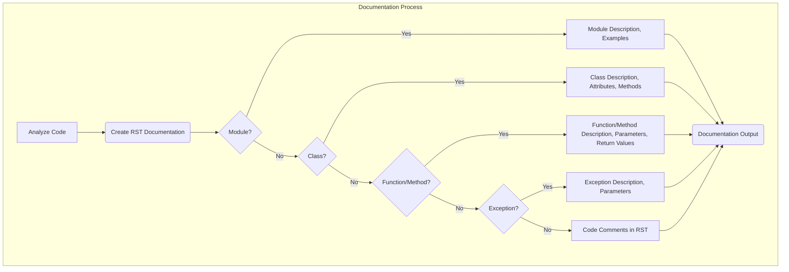

## ИНСТРУКЦИЯ:

Анализируй предоставленный код подробно и объясни его функциональность. Ответ должен включать три раздела:  

1. **<алгоритм>**: Опиши рабочий процесс в виде пошаговой блок-схемы, включая примеры для каждого логического блока, и проиллюстрируй поток данных между функциями, классами или методами.  
2. **<mermaid>**: Напиши код для диаграммы в формате `mermaid`, проанализируй и объясни все зависимости, 
    которые импортируются при создании диаграммы. 
    **ВАЖНО!** Убедитесь, что все имена переменных, используемые в диаграмме `mermaid`, 
    имеют осмысленные и описательные имена. Имена переменных вроде `A`, `B`, `C`, и т.д., не допускаются!  
    
    **Дополнительно**: Если в коде есть импорт `import header`, добавьте блок `mermaid` flowchart, объясняющий `header.py`:\
    ```mermaid
    flowchart TD
        Start --> Header[<code>header.py</code><br> Determine Project Root]
    
        Header --> import[Import Global Settings: <br><code>from src import gs</code>] 
    ```

3. **<объяснение>**: Предоставьте подробные объяснения:  
   - **Импорты**: Их назначение и взаимосвязь с другими пакетами `src.`.  
   - **Классы**: Их роль, атрибуты, методы и взаимодействие с другими компонентами проекта.  
   - **Функции**: Их аргументы, возвращаемые значения, назначение и примеры.  
   - **Переменные**: Их типы и использование.  
   - Выделите потенциальные ошибки или области для улучшения.  

Дополнительно, постройте цепочку взаимосвязей с другими частями проекта (если применимо).  

Это обеспечивает всесторонний и структурированный анализ кода.
## Формат ответа: `.md` (markdown)
**КОНЕЦ ИНСТРУКЦИИ**

## <алгоритм>

Представленный текст не является кодом, это инструкция по написанию документации к коду в формате reStructuredText (RST). Алгоритм, который можно вывести из этой инструкции, заключается в следующем:

1.  **Анализ кода:**
    *   Изучение структуры модуля, классов, функций и методов.
    *   Выявление назначения каждого элемента кода.
    *   Понимание связей между различными частями кода.
2.  **Создание документации в RST:**
    *   **Для модулей:**
        *   Написание заголовка модуля, описывающего его цель.
        *   Предоставление примеров использования модуля в блоке `.. code-block:: python`.
        *   Указание платформ и синопсиса модуля.
        *   Использование заголовков для свойств и методов модуля.
    *   **Для классов:**
        *   Написание описания класса, его цели.
        *   Определение и описание всех атрибутов.
        *   Перечисление всех методов, их цели и примеры использования.
        *   Уточнение параметров и возвращаемых значений для каждого метода.
    *   **Для функций и методов:**
        *   Описание назначения функции или метода.
        *   Указание параметров и возвращаемых значений.
        *   Примеры использования в блоке `.. code-block:: python`.
    *   **Для комментариев в коде:**
        *   Написание комментариев в формате RST, объясняющих логику кода.
        *   Использование блочных комментариев вместо однострочных.
    *   **Для обработки исключений (Exceptions):**
        *   Документирование возможных исключений, которые могут возникнуть.
        *   Описание параметров исключения и контекста, в котором оно возникает.
        *   Примеры обработки исключений в блоке `.. code-block:: python`.

**Пример:**

Представим, что есть такой код:

```python
# src/my_module.py

class MyClass:
    """
    Класс для примера.
    """
    def __init__(self, name):
        """
        Инициализирует объект класса.
        
        :param name: имя объекта
        """
        self.name = name

    def greet(self):
        """
        Возвращает приветствие.
        
        :return: приветствие
        """
        return f"Hello, {self.name}!"


def my_function(value):
    """
    Функция для демонстрации.
    
    :param value: число
    :return: квадрат числа
    :raises TypeError: если значение не число
    """
    if not isinstance(value, (int, float)):
        raise TypeError("Значение должно быть числом")
    return value ** 2
```

Документация в RST будет выглядеть примерно так:

```rst
Модуль my_module
=========================================================================================

Модуль предоставляет пример класса :class:`MyClass` и функции :func:`my_function` для демонстрационных целей.

Пример использования
--------------------

.. code-block:: python

    from my_module import MyClass, my_function

    obj = MyClass("Test")
    print(obj.greet())

    result = my_function(5)
    print(result)


Класс MyClass
=========================================================================================

Класс :class:`MyClass` предоставляет простой пример класса.

Атрибуты:
----------
- `name`: Имя экземпляра класса.

Методы:
--------
- `greet()`: Возвращает приветствие.

Пример использования
--------------------

.. code-block:: python

    obj = MyClass("Test")
    print(obj.greet())


Функция my_function
=========================================================================================

Функция :func:`my_function` вычисляет квадрат переданного числа.

Параметры:
----------
- `value`: Число для возведения в квадрат.

Возвращаемое значение:
----------------------
- Квадрат числа `value`.

Исключения:
-----------
- `TypeError`: Вызывается, если значение `value` не является числом.

Пример использования
--------------------

.. code-block:: python

    result = my_function(5)
    print(result)
```

## <mermaid>

**Объяснение:**

*   **subgraph Documentation Process:** Описывает общий процесс создания документации.
*   **A[Analyze Code]:** Начало процесса, где проводится анализ исходного кода.
*   **B(Create RST Documentation):** Создание документации в формате RST.
*   **C{Module?}:** Проверка, является ли текущий элемент модулем.
    *   **Yes:** Если элемент - модуль, переходим к **D[Module Description, Examples]**.
    *   **No:** Если нет, переходим к **E{Class?}**.
*   **D[Module Description, Examples]:** Описание модуля, добавление примеров использования, и т.д.
*   **E{Class?}:** Проверка, является ли текущий элемент классом.
     *   **Yes:** Если элемент - класс, переходим к **F[Class Description, Attributes, Methods]**.
    *   **No:** Если нет, переходим к **G{Function/Method?}**.
*   **F[Class Description, Attributes, Methods]:** Описание класса, атрибутов, методов и т.д.
*   **G{Function/Method?}:** Проверка, является ли текущий элемент функцией или методом.
     *   **Yes:** Если элемент - функция или метод, переходим к **H[Function/Method Description, Parameters, Return Values]**.
    *    **No:** Если нет, переходим к **I{Exception?}**.
*  **H[Function/Method Description, Parameters, Return Values]:** Описание функции/метода, параметров, возвращаемых значений и т.д.
*  **I{Exception?}:** Проверка, является ли текущий элемент исключением.
    *   **Yes:** Если элемент - исключение, переходим к **J[Exception Description, Parameters]**.
    *    **No:** Если нет, переходим к **K[Code Comments in RST]**.
*  **J[Exception Description, Parameters]:** Описание исключения и его параметров.
*  **K[Code Comments in RST]:** Документирование комментариев в коде в RST.
*   **L(Documentation Output):** Конечный этап, где вся созданная документация объединяется и формируется в готовый документ.
    
**Зависимости:**

Импорты не требуются для данного процесса, так как это абстрактный процесс документации, а не выполнение кода.

## <объяснение>

Инструкция описывает процесс создания документации для Python кода с использованием reStructuredText (RST).
Основные моменты:

1. **Формат RST:**
    * Документация должна быть написана в формате RST, который используется для создания технической документации на Python.
    * RST позволяет использовать разметку для форматирования текста, создания заголовков, списков, блоков кода и других элементов.

2. **Структура документации:**
    * **Модули:**
        * Должны иметь заголовок с описанием цели модуля.
        * Должны содержать примеры использования в блоке `.. code-block:: python`.
        * Должны указывать платформы и синопсис.
        * Свойства и методы модуля должны быть описаны с помощью заголовков.
    * **Классы:**
        * Должны иметь описание цели класса.
        * Атрибуты и методы должны быть описаны.
        * Для каждого метода необходимо указать параметры, возвращаемые значения и примеры использования.
    * **Функции и методы:**
        * Должны иметь описание цели.
        * Необходимо указать параметры и возвращаемые значения.
        * Примеры использования должны быть предоставлены в блоке `.. code-block:: python`.
    * **Комментарии в коде:**
        * Должны быть написаны в формате RST, объясняя логику кода.
        * Использование блочных комментариев вместо однострочных.
    * **Обработка исключений:**
       * Все исключения должны быть задокументированы.
       * Необходимо указать, в каких случаях исключение может возникнуть.
       * Примеры использования `try/except` блоков должны быть описаны.
       
3. **Использование `.. code-block:: python`:**
   * Этот блок используется для вставки примеров кода, которые форматируются как Python код.

4. **Цель:**
   * Инструкция направлена на создание ясной, полной и структурированной документации, которая поможет другим разработчикам понять и использовать код.

5.  **Цепочка взаимосвязей:**
   * Инструкция сама по себе не имеет взаимосвязей с другими частями проекта, так как это мета-инструкция, описывающая как нужно документировать код. Она применима к любым частям проекта, которые требуют документирования.
   * Однако, если следовать инструкции, то документация станет частью общей системы документации проекта, например, ее можно будет генерировать с помощью `sphinx` и интегрировать с другими частями проекта.

**Области для улучшения:**
   * Добавить требования к стилю написания документации (например, использование настоящего времени, избегание сокращений и т.д.).
   * Добавить требования к тестированию примеров кода в документации, чтобы убедиться, что они работают корректно.
   * Включить описание того, как именно сгенерировать документацию (например, с помощью Sphinx).