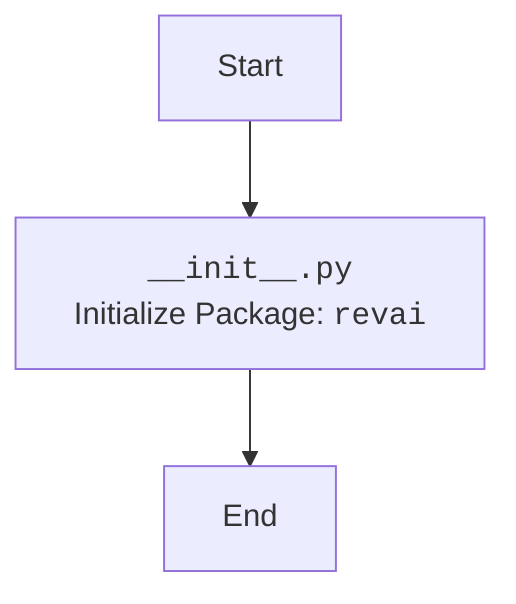

# Анализ кода `src/ai/revai/__init__.py`

## <алгоритм>

Файл `__init__.py` в Python является специальным файлом, который указывает интерпретатору Python, что каталог должен рассматриваться как пакет. В данном случае файл `src/ai/revai/__init__.py` делает каталог `revai` подпакетом пакета `ai`. 

Поскольку предоставленный код в файле `__init__.py` пуст, алгоритм будет тривиальным:

1.  **Начало:** Программа начинает выполнение с чтения файла `__init__.py`.
2.  **Инициализация пакета:** Python интерпретирует наличие файла `__init__.py` и помечает директорию `revai` как пакет.
3.  **Конец:** Программа завершает выполнение файла, но пакет `revai` теперь инициализирован.

Пример:
```
Директория: src/ai/revai/
Файл: __init__.py (пустой)

Результат: Директория 'revai' распознается как пакет Python.
```

## <mermaid>



**Объяснение диаграммы:**

*   `Start`: Начало процесса.
*   `Init`: Инициализация пакета `revai`. Этот шаг выполняется автоматически при наличии файла `__init__.py` в директории `revai`.
*   `End`: Конец процесса.

Диаграмма отражает основной процесс: Python обнаруживает файл `__init__.py` и  помечает директорию как пакет.

## <объяснение>

### Импорты

В данном файле импорты отсутствуют. Файл `__init__.py` может содержать импорты, необходимые для инициализации пакета, но здесь их нет. 

### Классы
Классы отсутствуют.

### Функции
Функции отсутствуют.

### Переменные
Переменные отсутствуют. 

**Назначение файла:**

Основное назначение файла `__init__.py` -  сделать директорию `revai` пакетом Python. Это позволяет импортировать модули и пакеты из этой директории в других частях проекта `src`. 

**Взаимосвязь с другими частями проекта:**
Пример, как можно использовать `src.ai.revai` в другом файле:
```python
# src/some_module.py
from src.ai.revai import some_module_in_revai  # предполагается, что есть модуль some_module_in_revai.py в src/ai/revai
```

**Потенциальные ошибки и области для улучшения:**

*   **Отсутствие инициализации:** В текущем виде `__init__.py` выполняет только маркировку каталога как пакета, не производя никакой дополнительной инициализации.
*   **Будущая расширяемость:** В дальнейшем, по мере развития пакета `revai`, в `__init__.py` могут быть добавлены импорты или код для инициализации пакета, определения переменных или функций, которые будут доступны при импорте пакета.

**Заключение:**

Файл `__init__.py` в `src/ai/revai` в текущем виде очень прост, но выполняет важную функцию: определяет директорию `revai` как пакет Python. Это позволяет другим частям проекта импортировать код из этого каталога. В будущем этот файл может быть дополнен для более сложной инициализации пакета.