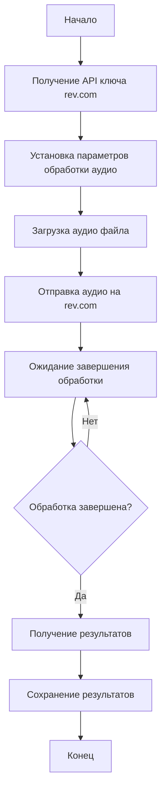

## АНАЛИЗ КОДА: `revai (rev.com - модель)`

### 1. <алгоритм>

Поскольку предоставленный код представляет собой лишь комментарий, а не исполняемый код, алгоритм будет описанием общей концепции, которую предполагается реализовать с использованием API rev.com, а не конкретным набором шагов:

1.  **Инициализация:**
    *   Получение ключа API rev.com.
    *   Установка необходимых параметров (например, формат аудио, модель распознавания).

2.  **Загрузка аудио:**
    *   Определение пути к файлу аудиозаписи.
    *   Чтение аудиофайла.
    *   Загрузка аудиофайла на сервер rev.com.
    *   Пример: `upload_url = rev_client.submit_job_local_file(file_path)`.

3.  **Обработка (Транскрипция/Анализ):**
    *   Ожидание завершения обработки (опрос статуса задания).
        *   Пример: `job_status = rev_client.get_job_details(job_id).status`
    *   Получение результатов транскрипции (или анализа).
        *   Пример: `transcript = rev_client.get_transcript_object(job_id)`

4.  **Сохранение результатов:**
    *   Сохранение полученной транскрипции (или результатов анализа) в файл или базу данных.
    *   Пример: запись транскрипции в текстовый файл.

**Поток данных:**

```
[Аудио файл] --> [Загрузка на сервер rev.com] --> [Сервер rev.com (Транскрипция/Анализ)] --> [Результаты (Транскрипция/Анализ)] --> [Сохранение результатов]
```

### 2. <mermaid>



**Зависимости:**

Диаграмма не отображает импортируемые модули, так как предоставлен только комментарий, а не код. Однако, если бы был представлен код, то, вероятнее всего, были бы зависимости от библиотек:

*   **requests:** Для выполнения HTTP-запросов к API rev.com.
*   **json:** Для работы с JSON-ответами от API rev.com.
*   **os:** Для работы с файловой системой (загрузка файлов).
*   **time:** Для работы с задержками (ожидание статуса задания).

### 3. <объяснение>

**Описание**

Предоставленный код не является исполняемым, а лишь комментарием к использованию API сервиса rev.com для обработки аудиофайлов. Rev.com предоставляет API для транскрипции, анализа речи и других операций с аудио. Код подразумевает взаимодействие с этим API для достижения следующей функциональности:

*   **Загрузка аудио:** Процесс отправки аудиофайла на сервер rev.com для обработки.
*   **Транскрипция/Анализ:** Выполнение запрошенной операции над аудиофайлом (например, распознавание речи).
*   **Получение результатов:** Загрузка полученных результатов обработки.

**Импорты (Предполагаемые):**

*   `requests`: Этот пакет, скорее всего, будет использован для выполнения HTTP-запросов к API rev.com.
*   `json`: Пакет необходим для обработки данных в формате JSON, который является стандартным форматом обмена данными между сервером и клиентом.
*   `os`: Этот пакет будет использоваться для операций с файловой системой, например, для чтения аудиофайлов.
*   `time`: Данный пакет будет использоваться для управления задержками, например, для проверки статуса обработки аудио.

**Классы:**

В данном случае, не представлено ни одного класса. Однако, в реальном приложении, вероятнее всего, будет класс (или набор классов) для инкапсуляции логики взаимодействия с API rev.com.

**Функции (Предполагаемые):**

*   `submit_job_local_file(file_path)`: Функция для загрузки аудиофайла на rev.com. Возвращает URL для доступа к заданию.
*   `get_job_details(job_id)`: Функция для получения информации о статусе задания. Возвращает объект JSON со статусом задания.
*   `get_transcript_object(job_id)`: Функция для получения результатов транскрипции. Возвращает транскрипцию в виде объекта JSON.

**Переменные:**

*   `file_path`: Строка, содержащая путь к аудиофайлу.
*   `job_id`: Строка, содержащая идентификатор задания.
*   `transcript`: Строка, содержащая транскрипцию.

**Потенциальные ошибки и улучшения:**

*   **Обработка ошибок:** Код должен включать обработку ошибок HTTP-запросов и возможных исключений, которые могут возникнуть в процессе работы.
*   **Аутентификация:** Необходимо обеспечить безопасную аутентификацию при работе с API.
*   **Параметры обработки:** Код должен предоставлять возможность настройки различных параметров обработки аудио.
*   **Обработка больших файлов:** Необходимо учесть возможность загрузки больших аудиофайлов и эффективно обрабатывать большие результаты транскрипции.

**Взаимосвязь с другими частями проекта:**

*   Этот код, вероятно, является частью модуля `ai` (и более конкретно `revai`), который отвечает за работу с API rev.com.
*   Модуль `ai` может взаимодействовать с другими модулями, например, для хранения результатов или предоставления их другим частям приложения.

**Заключение:**

Предоставленный комментарий описывает общую идею использования API rev.com для обработки аудио. В реальности, для этого необходимо реализовать полноценный программный код с использованием соответствующих библиотек, обработкой ошибок и настройками.