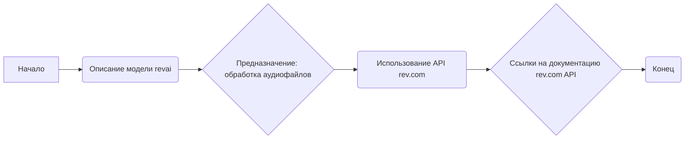

## АНАЛИЗ КОДА:

### 1. <алгоритм>

**Описание:**

Данный код представляет собой описание модели `revai`, которая предназначена для работы с аудиофайлами, такими как записи переговоров, совещаний, звонков и т.п.  Модель основывается на API сервиса rev.com.

**Блок-схема:**


**Примеры:**

1. **Начало:** Инициализация описания модели.
2. **Описание модели revai:** Определение назначения модели для работы с аудиоданными.
3. **Предназначение: обработка аудиофайлов:** Уточнение, что модель используется для анализа звуковых записей.
4. **Использование API rev.com:** Указание на то, что модель использует API сервиса rev.com.
5. **Ссылки на документацию rev.com API:** Предоставление ссылок на документацию для понимания API rev.com.
6. **Конец:** Завершение описания модели.

### 2. <mermaid>

```mermaid
flowchart TD
    Start[Начало] --> ModelDescription[<code>revai</code><br>Описание модели для обработки аудио];
    ModelDescription --> AudioProcessing[Предназначение:<br>Обработка аудиофайлов<br>(записи переговоров, совещаний, звонков)];
    AudioProcessing --> ApiUsage[Использование<br> rev.com API];
    ApiUsage --> DocumentationLinks[Ссылки на документацию<br>rev.com API:<br><a href='https://www.rev.com/api/docs'>https://www.rev.com/api/docs</a><br><a href='https://docs.rev.ai/resources/code-samples/python/'>https://docs.rev.ai/resources/code-samples/python/</a>];
    DocumentationLinks --> End[Конец];
```

**Анализ `mermaid`:**

Диаграмма описывает структуру модели `revai`. Начиная с `Start`, она показывает, что модель предназначена для обработки аудиофайлов, таких как записи переговоров, совещаний и звонков. Далее, указано, что модель использует API сервиса `rev.com`, и предоставляются ссылки на документацию по API.  Используются осмысленные имена переменных, такие как `ModelDescription`, `AudioProcessing`, `ApiUsage`, и `DocumentationLinks`, что делает диаграмму легко читаемой и понятной.

### 3. <объяснение>

**Импорты:**

В данном коде отсутствуют импорты, так как он представляет собой описание модели, а не исполняемый код. Тем не менее, если бы модель `revai` была реализована в виде Python-кода,  то она могла бы импортировать следующие библиотеки:

- `requests`: Для выполнения HTTP-запросов к API rev.com.
- `json`: Для обработки данных в формате JSON, которые API rev.com возвращает.
- `os`: Для работы с файловой системой и путями.
- `time`: Для обработки временных интервалов, если необходимо отслеживать время выполнения запросов или создавать задержки.

**Классы:**

В приведенном коде нет классов, но если бы он был реализован в виде Python-кода, то можно было бы ожидать класс, который бы инкапсулировал логику взаимодействия с API rev.com. Такой класс мог бы иметь следующие атрибуты и методы:

- Атрибуты:
    - `api_key`: API ключ для доступа к сервису rev.com.
    - `base_url`: Базовый URL для API rev.com.
- Методы:
    - `submit_job(audio_file_path)`: Метод для отправки аудиофайла на распознавание.
    - `get_job_status(job_id)`: Метод для проверки статуса выполнения задания.
    - `get_transcript(job_id)`: Метод для получения распознанного текста.
    - `cancel_job(job_id)`: Метод для отмены задания.

**Функции:**

Код не содержит функций, но при реализации модели `revai`  будут необходимы функции для выполнения конкретных действий, таких как:

- `load_audio_file(audio_file_path)`: Загрузка аудиофайла и преобразование его в нужный формат.
- `make_request(url, method, data, headers)`:  Отправка HTTP-запроса с заданными параметрами и заголовками.
- `parse_response(response)`: Разбор ответа от API rev.com.

**Переменные:**

В коде не определены переменные, но в реализации модели `revai` могут использоваться переменные для хранения:

- `audio_file_path`: Путь к аудиофайлу.
- `job_id`: ID задания, полученного от API rev.com.
- `transcript`: Распознанный текст.
- `status`: Статус выполнения задания.

**Потенциальные ошибки и области для улучшения:**

- **Обработка ошибок:**  Нужно предусмотреть обработку ошибок при выполнении HTTP-запросов, разборе ответов и обработке данных.
- **Аутентификация:**  Необходимо обеспечить безопасное хранение и использование API ключа.
- **Форматы аудио:** Нужно предусмотреть поддержку различных форматов аудио.
- **Асинхронность:**  Необходимо реализовать механизм для асинхронного выполнения запросов, чтобы не блокировать основной поток выполнения программы.
- **Обработка больших файлов:**  Необходимо оптимизировать обработку больших аудиофайлов.

**Взаимосвязи с другими частями проекта:**

Модель `revai` может взаимодействовать с другими частями проекта, например, для:

-  **Аналитики:** Отправка распознанного текста на анализ тональности или выделение ключевых фраз.
-  **Хранение:** Сохранение распознанного текста в базу данных или файл.
-  **Интерфейс пользователя:** Предоставление пользователю возможности загружать аудиофайлы и получать распознанный текст.
-  **Обработка данных:** Использование распознанного текста для дальнейшей обработки и анализа.