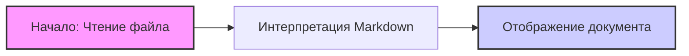

## Анализ кода `CODE_OF_CONDUCT.md`

### 1. <алгоритм>

Этот файл не содержит исполняемого кода, а представляет собой текст в формате Markdown. Алгоритм его "работы" очень прост:

1. **Начало**: Чтение файла.
2. **Интерпретация**: Markdown интерпретируется как текст, формируя структуру, содержащую ссылки и текст.
3. **Отображение**: Результат отображается как документ, в котором ссылки ведут на другие страницы, а текст формирует содержание.

Пример:
- **Ввод:**  Содержимое файла `CODE_OF_CONDUCT.md` (текст в Markdown).
- **Обработка:** Markdown парсер (например, в браузере или текстовом редакторе) интерпретирует текст, создавая HTML-структуру и ссылки.
- **Вывод:** Отображение структурированного текста со ссылками.

Здесь нет потока данных между функциями или классами. Это просто статичный документ.

### 2. <mermaid>

**Описание диаграммы:**

Диаграмма представляет собой простой процесс чтения, интерпретации и отображения Markdown-файла. 

-   **A [Начало: Чтение файла]**:  Начальный этап, где Markdown файл с кодексом поведения считывается.
-   **B [Интерпретация Markdown]**:  Текст в формате Markdown интерпретируется, ссылки и форматирование обрабатываются.
-   **C [Отображение документа]**:  Отображение итогового структурированного документа.

Зависимости отсутствуют, так как это текстовый файл, а не код.

### 3. <объяснение>

#### Объяснение

**Импорты:**
- В этом файле нет импортов, так как это текстовый документ Markdown, а не код Python или другой язык программирования.

**Классы:**
- Отсутствуют, поскольку это не программный код.

**Функции:**
- Отсутствуют, поскольку это не программный код.

**Переменные:**
- Отсутствуют, поскольку это не программный код.

**Назначение:**

Файл `CODE_OF_CONDUCT.md` определяет кодекс поведения для проекта. Он содержит ссылки на:

-   **Microsoft Open Source Code of Conduct:** Основной документ кодекса поведения.
-   **Microsoft Code of Conduct FAQ:** Раздел вопросов и ответов.
-   **opencode@microsoft.com:** Адрес электронной почты для связи по вопросам кодекса поведения.

**Взаимосвязи с другими частями проекта:**

-   Этот файл важен для всего проекта, поскольку устанавливает стандарты поведения участников сообщества и предоставляет контактную информацию для решения проблем и вопросов. Он не связан напрямую с какой-либо конкретной частью кода, но является частью общей документации проекта.

**Потенциальные ошибки или области для улучшения:**

-   Файл выглядит как статичный документ, но его необходимо периодически обновлять, чтобы соответствовать меняющимся стандартам и политикам Microsoft.
-   Также, было бы полезно добавить более подробные инструкции о том, как именно участники должны действовать в случае нарушений кодекса, и как происходит процесс решения подобных ситуаций.

**Резюме:**

Файл `CODE_OF_CONDUCT.md` представляет собой важную часть документации проекта, определяющую этические принципы и нормы поведения участников. Он не является исполняемым кодом, но играет критическую роль в обеспечении здоровой и уважительной среды для работы над проектом.