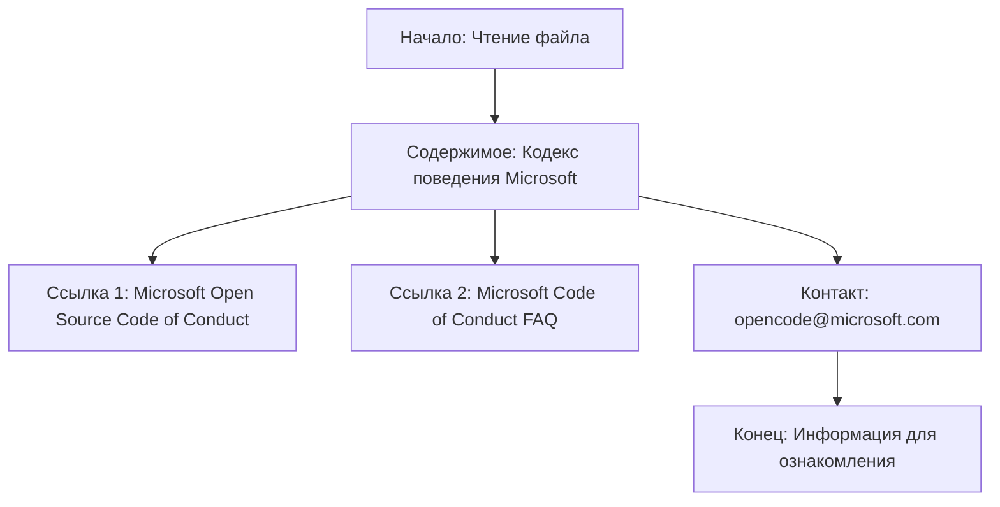

## АНАЛИЗ КОДА: `CODE_OF_CONDUCT.md`

### 1. <алгоритм>

Этот файл не содержит исполняемого кода, а представляет собой текстовый документ в формате Markdown. Алгоритм его "обработки" можно представить следующим образом:

1. **Начало**: Чтение файла `CODE_OF_CONDUCT.md`.
2. **Содержимое**: Текст файла содержит информацию о принятом в проекте Кодексе поведения.
   - **Ссылка 1:** Указана ссылка на "Microsoft Open Source Code of Conduct".
   - **Ссылка 2:** Указана ссылка на "Microsoft Code of Conduct FAQ".
   - **Контакт:** Указан email для связи с вопросами или опасениями.
3. **Конец**: Завершение обработки, данные предназначены для чтения и ознакомления.

**Пример**:
   - **Вход:** Файл `CODE_OF_CONDUCT.md`
   - **Выход:** Информативный текст с указанием ссылок на Microsoft Open Source Code of Conduct и контактным email для связи.

### 2. <mermaid>

**Объяснение диаграммы:**

Диаграмма `mermaid` визуализирует последовательность "обработки" файла `CODE_OF_CONDUCT.md`.
- `Start`: обозначает начало процесса, когда файл начинает читаться.
- `Content`: представляет основную информацию о кодексе поведения Microsoft, которая содержится в файле.
- `Link1`: представляет ссылку на основной документ кодекса поведения.
- `Link2`: представляет ссылку на часто задаваемые вопросы по кодексу поведения.
- `Contact`: показывает контактный адрес электронной почты для вопросов или сообщений о нарушениях.
- `End`: указывает завершение процесса обработки и то, что информация представлена для ознакомления.

### 3. <объяснение>

**Импорты:**

В данном файле нет импортов, так как это текстовый документ Markdown, а не файл с кодом.

**Классы:**

В данном файле нет классов.

**Функции:**

В данном файле нет функций.

**Переменные:**

В данном файле нет переменных. Содержание - это статический текст и ссылки.

**Детальное Объяснение:**
- `CODE_OF_CONDUCT.md`  это Markdown файл, который определяет стандарты поведения для участников проекта.
- **Ссылки**
    - `[Microsoft Open Source Code of Conduct](https://opensource.microsoft.com/codeofconduct/)` ведет на страницу с полным текстом кодекса.
    - `[Microsoft Code of Conduct FAQ](https://opensource.microsoft.com/codeofconduct/faq/)` ведет на страницу с часто задаваемыми вопросами.
- **Контакт**
  - `opencode@microsoft.com` предоставляет адрес электронной почты для связи с организаторами проекта по вопросам этики и поведения.
- **Назначение**
    - Цель файла - информировать участников проекта о принятых правилах поведения и предоставить ресурсы для понимания и соблюдения этих правил.

**Потенциальные ошибки или области для улучшения:**

- Текст файла может быть адаптирован под конкретные нужды проекта, добавив, например, правила для взаимодействия в рамках этого проекта, а не только общие правила Microsoft.
- Можно добавить информацию о том, что происходит, если кто-то нарушает кодекс поведения в данном проекте.
- Полезно было бы указать конкретных людей или команды, которые отвечают за обработку жалоб на нарушения кодекса.

**Взаимосвязи с другими частями проекта:**

Данный файл является важной частью проекта, так как задает стандарты поведения для его участников. Он связан со всеми частями проекта, так как все участники должны соблюдать эти правила.