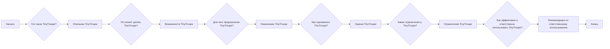

## Анализ кода: `RESPONSIBLE_AI_FAQ.md`

### 1. <алгоритм>

Этот документ представляет собой FAQ (Frequently Asked Questions) о библиотеке `TinyTroupe`. Он не содержит исполняемого кода, а представляет собой текст, описывающий назначение, возможности, ограничения и рекомендации по ответственному использованию `TinyTroupe`. 

**Блок-схема:**

**Пояснения:**

*   **A (Начало):** Начало документа.
*   **B (Что такое TinyTroupe?):**  Раздел, отвечающий на вопрос, что такое `TinyTroupe`.
*   **C (Описание TinyTroupe):** Описание `TinyTroupe` как экспериментальной библиотеки Python, предназначенной для симуляции людей с различными характеристиками.
*   **D (Что может делать TinyTroupe?):**  Раздел, описывающий возможности библиотеки.
*   **E (Возможности TinyTroupe):** Описание возможностей `TinyTroupe`, таких как симуляция персон, сред, извлечение данных, обогащение артефактов и помощь в создании историй.
*   **F (Для чего предназначен TinyTroupe?):**  Раздел, объясняющий цели использования библиотеки.
*   **G (Назначение TinyTroupe):** Описание назначения `TinyTroupe` для анализа поведения, генерации синтетических артефактов и исследования когнитивных архитектур.
*    **H (Как оценивался TinyTroupe?):** Раздел, описывающий процесс оценки библиотеки.
*    **I (Оценка TinyTroupe):** Упоминание об оценке через use cases, примеры в библиотеке и тестирование.
*   **J (Какие ограничения у TinyTroupe?):** Раздел, предостерегающий от чрезмерной надежды на соответствие симуляций реальному поведению.
*   **K (Ограничения TinyTroupe):** Описание ограничений, таких как потенциальная генерация вредоносного контента.
*   **L (Как эффективно и ответственно использовать TinyTroupe?):** Раздел с рекомендациями по ответственному использованию.
*   **M (Рекомендации по ответственному использованию):**  Рекомендации по безопасному использованию, такие как использование безопасных API, предоставление безопасных персон и запрет на управление реальными механизмами.
*   **N (Конец):** Конец документа.

```mermaid
graph LR
    A[Начало: RESPONSIBLE_AI_FAQ.md] --> B(Что такое TinyTroupe?);
    B --> C{Описание TinyTroupe: \nсимуляция людей с разными личностями};
    C --> D(Что может делать TinyTroupe?);
    D --> E{Возможности TinyTroupe: \nсимуляция персон, сред, извлечение данных};
    E --> F(Для чего предназначен TinyTroupe?);
    F --> G{Назначение TinyTroupe: \nанализ поведения, генерация артефактов};
    G --> H(Как оценивался TinyTroupe?);
    H --> I{Оценка TinyTroupe: \nчерез use cases и тестирование};
    I --> J(Какие ограничения у TinyTroupe?);
    J --> K{Ограничения TinyTroupe: \nнесоответствие реальному поведению, потенциал вредоносного контента};
     K --> L(Как эффективно и ответственно использовать TinyTroupe?);
    L --> M{Рекомендации по использованию: \nбезопасные API, безопасные персоны, запрет на управление механизмами};
    M --> N[Конец: Документ завершен];
```

### 2. <mermaid>

**Зависимости и пояснения:**

Диаграмма `mermaid` представляет собой блок-схему, аналогичную описанной в разделе "алгоритм", но в графическом формате. 

*   **A (Начало: RESPONSIBLE_AI_FAQ.md):** Начало документа.
*   **B (Что такое TinyTroupe?):**  Первый вопрос, определяющий контекст.
*   **C (Описание TinyTroupe):** Описание `TinyTroupe` как библиотеки для симуляции.
*   **D (Что может делать TinyTroupe?):**  Переход к возможностям библиотеки.
*   **E (Возможности TinyTroupe):** Описание ключевых возможностей библиотеки.
*   **F (Для чего предназначен TinyTroupe?):**  Переход к целям использования.
*   **G (Назначение TinyTroupe):** Описание целей `TinyTroupe`.
*   **H (Как оценивался TinyTroupe?):** Раздел про оценку.
*   **I (Оценка TinyTroupe):** Описание процесса оценки.
*   **J (Какие ограничения у TinyTroupe?):** Переход к ограничениям.
*   **K (Ограничения TinyTroupe):** Описание ограничений.
 *  **L (Как эффективно и ответственно использовать TinyTroupe?):** Переход к рекомендациям.
*   **M (Рекомендации по использованию):** Рекомендации по безопасному и ответственному использованию.
*   **N (Конец: Документ завершен):** Завершение документа.

### 3. <объяснение>

**Импорты:**

В данном файле нет импортов, поскольку это текстовый файл формата markdown (`.md`). Файл описывает библиотеку `TinyTroupe`, но не является её частью.

**Классы:**

Файл не содержит определений классов.

**Функции:**

Файл не содержит определений функций.

**Переменные:**

В файле не используются переменные в программном смысле. Здесь используются переменные в текстовом формате для описания свойств и назначения `TinyTroupe`.

**Объяснение разделов:**

*   **Что такое TinyTroupe?**: Раздел дает определение `TinyTroupe` как библиотеки для симуляции людей и их взаимодействий. Акцент делается на экспериментальном характере и использовании LLM (например, GPT-4).
*   **Что может делать TinyTroupe?**: Описываются основные возможности `TinyTroupe`: симуляция агентов, сред, извлечение структурированных данных, обогащение артефактов и помощь в создании историй.
*   **Для чего предназначен TinyTroupe?**: Определяется предназначение библиотеки: анализ поведения, генерация синтетических данных, исследование когнитивных архитектур.
*   **Как оценивался TinyTroupe?**: Описывается, что оценка проводилась с помощью use cases, примеров и тестов.
*   **Какие ограничения у TinyTroupe?**: Предупреждает о несоответствии симуляций реальному поведению и потенциальной генерации вредоносного контента.
*   **Как эффективно и ответственно использовать TinyTroupe?**: Предоставляет рекомендации по использованию библиотеки: безопасные API, безопасные персоны, запрет на управление реальными механизмами и необходимость собственных мер безопасности.

**Взаимосвязи с другими частями проекта:**

Этот файл (RESPONSIBLE\_AI\_FAQ.md) служит документацией и руководством по ответственному использованию библиотеки `TinyTroupe`, но не является частью исполняемого кода. Он объясняет цели, возможности и ограничения библиотеки, которую можно найти в других файлах проекта (например, в Python-файлах с определениями классов и функций).

**Потенциальные ошибки или области для улучшения:**

*   Хотя в документе подчеркивается экспериментальный характер `TinyTroupe`, пользователям нужно четко понимать, что результаты симуляций могут быть далеки от реальности.
*   Необходимо более подробно описать процессы оценки и тестирования, чтобы повысить доверие к библиотеке.
*   Следует предоставить подробные примеры того, как правильно создавать безопасные персоны и предотвращать генерацию нежелательного контента.

**Дополнительные замечания:**

В целом, этот FAQ является важной частью проекта, поскольку он обеспечивает необходимую информацию для ответственного использования `TinyTroupe`. Он подчеркивает необходимость использования этой библиотеки с осторожностью и пониманием ее ограничений.