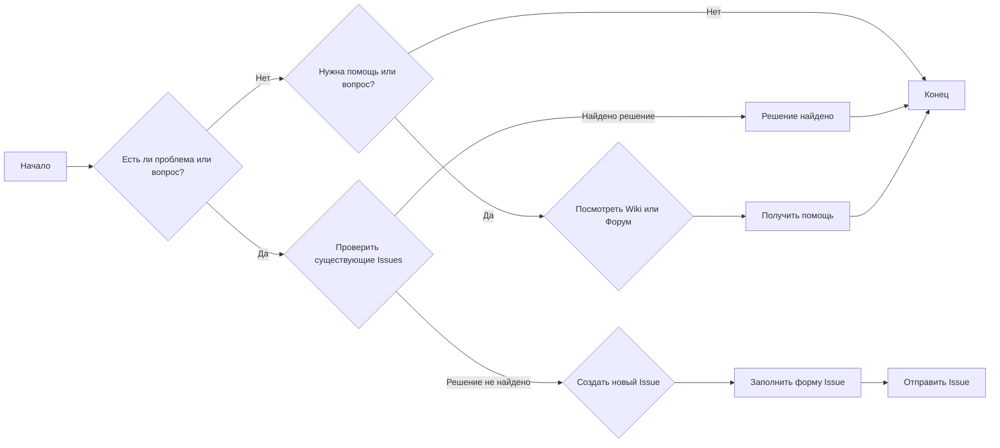
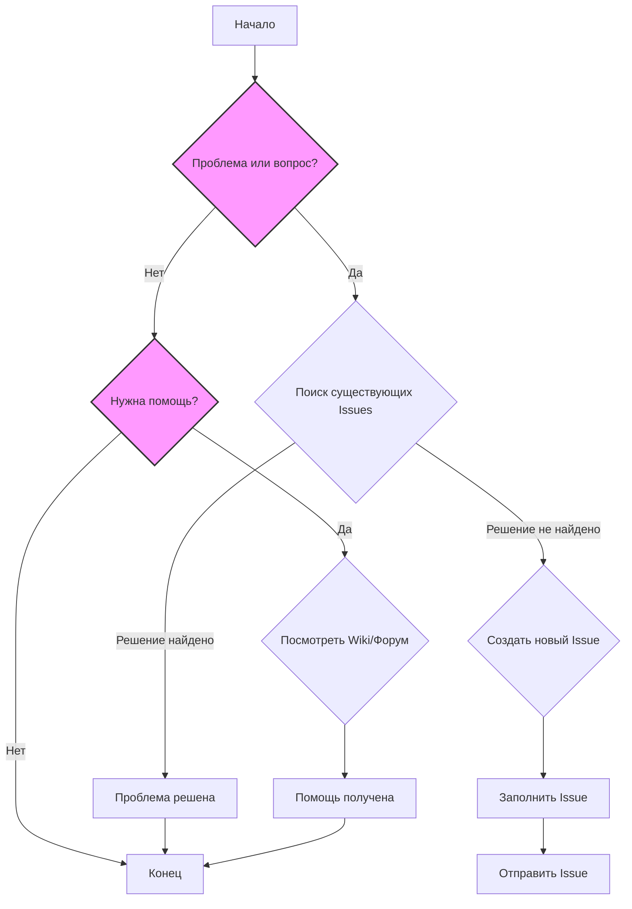

## Анализ файла `SUPPORT.md`

### 1. <алгоритм>

Файл `SUPPORT.md` представляет собой текстовый документ в формате Markdown, предназначенный для предоставления информации о том, как получать поддержку и сообщать об ошибках, связанных с проектом TinyTroupe.

**Блок-схема процесса получения поддержки:**

**Пояснения к блокам:**

*   **A**: Начало процесса.
*   **B**: Проверка: есть ли у пользователя проблема или вопрос.
    *   Пример: Пользователь столкнулся с ошибкой при использовании программы или не понимает ее функциональность.
*   **C**: Поиск: Проверка существующих Issue на GitHub.
    *   Пример: Пользователь вводит ключевые слова, чтобы найти похожие проблемы.
*   **D**: Если решение найдено, то проблема решена.
    *   Пример: Пользователь нашел Issue с описанием своей проблемы и решением.
*   **E**: Если решение не найдено, создается новый Issue.
    *   Пример: Пользователь не нашел похожих проблем и должен сообщить о своей.
*   **F**: Заполнение формы Issue.
    *   Пример: Пользователь заполняет форму, указывая заголовок, описание проблемы и шаги для ее воспроизведения.
*   **G**: Отправка Issue.
*   **H**: Если нет проблемы, то проверка: нужен ли пользователю помощь или вопрос.
    *   Пример: Пользователь хочет узнать о какой-то особенности проекта.
*  **I**: Пользователю предлагается посмотреть Wiki или Форум.
    *   Пример: Пользователь ищет ответ на свой вопрос в документации или обсуждениях.
*   **J**: Если помощь получена, то процесс завершен.
    *   Пример: Пользователь получил ответ на свой вопрос или нашел необходимую информацию.
*   **K**: Конец процесса.

**Поток данных:**

1.  Пользователь сталкивается с проблемой или имеет вопрос.
2.  Пользователь либо ищет решение в существующих Issues, либо переходит к созданию нового Issue или ищет помощь в Wiki/Форуме.
3.  После решения проблемы или получения помощи, процесс завершается.

### 2. <mermaid>

**Анализ зависимостей:**

Диаграмма не имеет импортируемых зависимостей, так как она представляет собой графическое описание процесса, а не код.  Она показывает только логику взаимодействия различных этапов получения поддержки.

### 3. <объяснение>

**Общее назначение файла:**

Файл `SUPPORT.md` — это важная часть документации проекта TinyTroupe, предоставляющая руководство по получению поддержки и сообщению об ошибках.

**Разделы файла:**

*   **How to file issues and get help**: Этот раздел описывает, как сообщать об ошибках и запрашивать новые функции. Он подчеркивает важность поиска дубликатов перед созданием новых Issue, а также указывает на GitHub Issues как на основной механизм для отслеживания проблем. Для помощи и вопросов предлагается обратиться к Wiki и форуму проекта.
*   **Microsoft Support Policy**: В этом разделе кратко упоминается, что поддержка TinyTroupe ограничена вышеупомянутыми ресурсами, что означает отсутствие официальной технической поддержки Microsoft.

**Ключевые моменты:**

*   **GitHub Issues**: Используется как основная система отслеживания проблем и запросов на новые функции. Это распространенная практика в opensource-проектах.
*   **Wiki и Форум**: Эти ресурсы предназначены для помощи пользователям и ответов на общие вопросы. Они предоставляют альтернативу созданию новых Issue.
*   **Microsoft Support Policy**: Подчеркивает, что поддержка проекта не предоставляется напрямую Microsoft, а ограничена ресурсами проекта.

**Потенциальные области для улучшения:**

*   Можно добавить конкретные ссылки на Wiki и форум.
*   Можно добавить шаблоны для Issue, чтобы стандартизировать сообщения об ошибках и запросы на функции.
*   Можно добавить более подробные инструкции о том, как создавать Issue (например, прикладывать скриншоты или логи).

**Взаимосвязь с другими частями проекта:**

Этот файл является частью документации проекта и связан со всеми его частями, поскольку он обеспечивает пользователям возможность обратной связи и получения поддержки. Он не зависит от конкретных модулей кода, но он важен для общей жизнеспособности и удобства использования проекта.