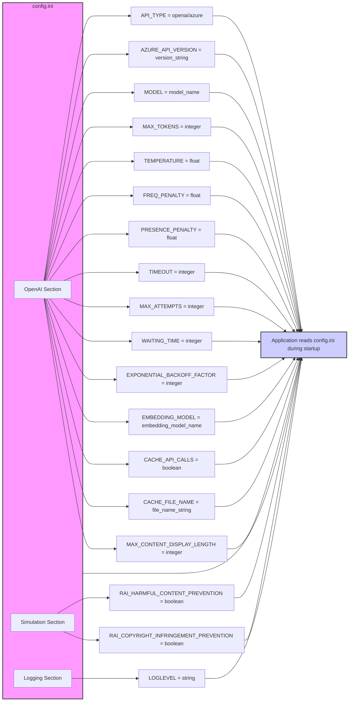

## АНАЛИЗ КОДА `hypotez/src/ai/tiny_troupe/TinyTroupe/examples/config.ini`

### 1. `<алгоритм>`:

Файл `config.ini` представляет собой конфигурационный файл в формате INI, который состоит из разделов (секций) и пар ключ-значение. Он предназначен для хранения настроек, используемых приложением.

**Логические блоки и примеры:**

1.  **Раздел `[OpenAI]`**: Определяет настройки для работы с OpenAI или Azure OpenAI API.
    *   `API_TYPE`: Определяет, какой API использовать (`openai` или `azure`).
        *   Пример: `API_TYPE=openai` - использовать OpenAI API.
    *   `AZURE_API_VERSION`: Версия Azure API.
        *   Пример: `AZURE_API_VERSION=2023-05-15` - версия API для Azure.
    *   `MODEL`: Имя модели, используемой для генерации текста.
        *   Пример: `MODEL=gpt-4o` - модель `gpt-4o` используется для генерации текста.
    *   `MAX_TOKENS`: Максимальное количество токенов в ответе.
        *   Пример: `MAX_TOKENS=4000` - максимальное количество токенов в ответе 4000.
    *   `TEMPERATURE`: Температура для генерации текста.
        *   Пример: `TEMPERATURE=0.3` - температура для генерации текста 0.3.
    *   `FREQ_PENALTY`: Штраф за частоту токенов.
        *   Пример: `FREQ_PENALTY=0.0` - штраф за частоту токенов равен 0.
    *   `PRESENCE_PENALTY`: Штраф за присутствие токенов.
        *   Пример: `PRESENCE_PENALTY=0.0` - штраф за присутствие токенов равен 0.
    *   `TIMEOUT`: Максимальное время ожидания ответа от API.
         *   Пример: `TIMEOUT=60` - максимальное время ожидания ответа от API 60 секунд.
    *   `MAX_ATTEMPTS`: Максимальное количество попыток запроса к API.
         *   Пример: `MAX_ATTEMPTS=5` - максимальное количество попыток запроса к API 5.
     *   `WAITING_TIME`: Время ожидания между попытками.
         *   Пример: `WAITING_TIME=1` - время ожидания между попытками 1 секунда.
    *   `EXPONENTIAL_BACKOFF_FACTOR`: Коэффициент экспоненциального отката.
         *   Пример: `EXPONENTIAL_BACKOFF_FACTOR=5` - коэффициент экспоненциального отката 5.
    *   `EMBEDDING_MODEL`: Модель для встраивания текста.
        *   Пример: `EMBEDDING_MODEL=text-embedding-3-small` -  модель `text-embedding-3-small` для встраивания текста.
    *  `CACHE_API_CALLS`: Включать ли кэширование вызовов API.
        * Пример: `CACHE_API_CALLS=False` - кэширование вызовов API выключено.
    *  `CACHE_FILE_NAME`: Имя файла для кэширования вызовов API.
        * Пример: `CACHE_FILE_NAME=openai_api_cache.pickle` - имя файла для кэширования вызовов API `openai_api_cache.pickle`.
    *   `MAX_CONTENT_DISPLAY_LENGTH`: Максимальная длина отображаемого контента.
        *   Пример: `MAX_CONTENT_DISPLAY_LENGTH=1024` - максимальная длина отображаемого контента 1024 символа.

2.  **Раздел `[Simulation]`**: Определяет настройки для симуляции.
    *   `RAI_HARMFUL_CONTENT_PREVENTION`: Включает защиту от вредоносного контента.
        *   Пример: `RAI_HARMFUL_CONTENT_PREVENTION=True` - защита от вредоносного контента включена.
    *   `RAI_COPYRIGHT_INFRINGEMENT_PREVENTION`: Включает защиту от нарушения авторских прав.
        *   Пример: `RAI_COPYRIGHT_INFRINGEMENT_PREVENTION=True` - защита от нарушения авторских прав включена.

3.  **Раздел `[Logging]`**: Определяет настройки логирования.
    *   `LOGLEVEL`: Уровень логирования.
        *   Пример: `LOGLEVEL=ERROR` - устанавливает уровень логирования на `ERROR`.

**Поток данных:**

Файл `config.ini` читается приложением при запуске. Значения параметров используются для инициализации и настройки различных модулей, таких как OpenAI API, симуляции и логирования. Конфигурационные данные не изменяются, а используются в качестве параметров.

### 2. `<mermaid>`:

**Объяснение:**

*   Диаграмма показывает три секции конфигурационного файла `config.ini`: `OpenAI`, `Simulation` и `Logging`.
*   Каждая секция содержит ряд параметров, которые используются приложением при запуске.
*   Названия переменных (узлов графа) являются описательными и отражают содержимое параметров в файле.
*   Стрелки показывают, какие параметры считываются из файла `config.ini` и передаются приложению (`Application`).
*  `config.ini` выделен отдельным стилем, чтобы выделить его важность как внешнего источника конфигурационных данных.
*   Приложение `Application` выделено отдельным стилем, чтобы выделить его как потребителя конфигурационных данных.

### 3. `<объяснение>`:

**Импорты:**
В данном файле `config.ini` нет импортов. Это конфигурационный файл, а не python-код. Он содержит параметры для настройки приложения, а не импортирует другие модули.

**Классы:**
В данном файле `config.ini` нет классов, так как это конфигурационный файл.

**Функции:**
В данном файле `config.ini` нет функций, так как это конфигурационный файл.

**Переменные:**

*   Все переменные (ключи) в файле `config.ini` представляют собой строки, соответствующие настройкам приложения.
*   Значения переменных могут быть строками, целыми числами, числами с плавающей точкой или булевыми значениями.
    *   `API_TYPE`: Строка, определяющая тип API (например, `openai` или `azure`).
    *   `AZURE_API_VERSION`: Строка, представляющая версию Azure API.
    *   `MODEL`: Строка, представляющая имя модели, используемой для генерации текста.
    *   `MAX_TOKENS`: Целое число, представляющее максимальное количество токенов.
    *   `TEMPERATURE`: Число с плавающей точкой, представляющее температуру для генерации текста.
    *   `FREQ_PENALTY`: Число с плавающей точкой, представляющее штраф за частоту токенов.
    *   `PRESENCE_PENALTY`: Число с плавающей точкой, представляющее штраф за присутствие токенов.
    *   `TIMEOUT`: Целое число, представляющее время ожидания ответа от API.
    *  `MAX_ATTEMPTS`: Целое число, представляющее максимальное количество попыток запроса к API.
     *  `WAITING_TIME`: Целое число, представляющее время ожидания между попытками.
     *  `EXPONENTIAL_BACKOFF_FACTOR`: Целое число, представляющее коэффициент экспоненциального отката.
    *   `EMBEDDING_MODEL`: Строка, представляющая модель для встраивания текста.
     *   `CACHE_API_CALLS`: Булево значение, определяющее, кэшировать ли вызовы API.
     *   `CACHE_FILE_NAME`: Строка, представляющая имя файла для кэша.
    *   `MAX_CONTENT_DISPLAY_LENGTH`: Целое число, представляющее максимальную длину отображаемого контента.
    *   `RAI_HARMFUL_CONTENT_PREVENTION`: Булево значение, включающее защиту от вредоносного контента.
    *   `RAI_COPYRIGHT_INFRINGEMENT_PREVENTION`: Булево значение, включающее защиту от нарушения авторских прав.
    *   `LOGLEVEL`: Строка, определяющая уровень логирования (например, `ERROR`, `WARNING`, `INFO`, `DEBUG`).

**Объяснение:**

*   Файл `config.ini` служит для централизованного управления настройками приложения.
*   Раздел `[OpenAI]` настраивает параметры API, используемого для работы с моделями OpenAI или Azure. Это включает выбор модели, температуру, ограничения токенов, параметры штрафов, таймаут и кэширование.
*   Раздел `[Simulation]` содержит параметры для моделирования, включая флаги для предотвращения вредоносного контента и нарушения авторских прав.
*   Раздел `[Logging]` устанавливает уровень логирования, определяя, какая информация будет выводиться в лог.
*  Этот конфигурационный файл является внешним источником настроек для приложения, позволяя легко изменять параметры без необходимости изменения кода.
*   Значения по умолчанию, указанные в файле, предоставляют разумные значения для начала работы.

**Потенциальные ошибки и области для улучшения:**

*   **Валидация значений:** Приложение должно проверять значения, прочитанные из `config.ini`, чтобы убедиться, что они находятся в допустимом диапазоне. Например, значения `MAX_TOKENS`, `TIMEOUT` и `TEMPERATURE` должны быть положительными и иметь разумные значения.
*  **Отсутствие комментариев:** В файле отсутствуют комментарии, объясняющие назначение некоторых параметров, которые могут быть не очевидны для новых разработчиков. Рекомендуется добавить комментарии для пояснения назначений каждого параметра.
*   **Возможность переопределения:** Было бы полезно предусмотреть возможность переопределения параметров из файла конфигурации через переменные окружения или другие способы конфигурации.
*  **Обработка ошибок:** Необходимо реализовать обработку ошибок, если файл `config.ini` не найден или имеет неверный формат.

**Цепочка взаимосвязей с другими частями проекта:**

*   Файл `config.ini` используется различными частями приложения, которые взаимодействуют с OpenAI API, симуляцией и логированием.
*   Параметры из файла `config.ini` влияют на работу основных частей приложения, включая настройку API-клиента, поведение симуляций и уровень вывода сообщений в лог.

Этот анализ предоставляет подробное объяснение функциональности `config.ini`, включая его логику, структуру, и связи с приложением.