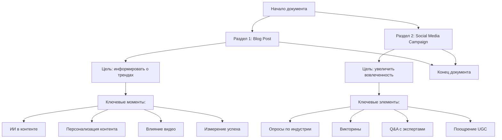

## Анализ и объяснение кода

### 1. **<алгоритм>**
Представленный код является текстом, а не кодом в обычном понимании, поэтому его "алгоритм" следует понимать как план содержания документа.

1.  **Начало**: Документ начинается с заголовка "Content Ideas for June", указывая на то, что это план контента на июнь.
2.  **Раздел 1**: "Blog Post: Latest Trends in Content Marketing"
    *   **Цель**: Информировать аудиторию о трендах контент-маркетинга.
    *   **Ключевые моменты**:
        *   Рост использования ИИ в создании контента.
        *   Важность персонализированного контента.
        *   Растущее влияние видео контента.
        *   Измерение успеха контент-маркетинга.
3.  **Раздел 2**: "Social Media Campaign: Engaging Audiences Through Interactive Content"
    *   **Цель**: Увеличить вовлеченность аудитории через интерактивный контент в соц. сетях.
    *   **Ключевые элементы**:
        *   Создание серии опросов по темам индустрии.
        *   Разработка развлекательных и познавательных викторин.
        *   Проведение сессий вопросов и ответов с экспертами.
        *   Поощрение пользовательского контента (UGC).
4.  **Конец**: Документ заканчивается, давая четкое представление о планируемых активностях на июнь.

### 2. **<mermaid>**

**Объяснение диаграммы:**

Диаграмма представляет собой блок-схему, описывающую структуру документа с идеями контента.

*   `Start`: Начало документа.
*   `Blog_Post_Section`: Раздел с идеями для поста в блог.
*   `Blog_Objective`: Цель поста в блог.
*   `Blog_Key_Points`: Ключевые моменты для рассмотрения в посте.
*   `AI_Trend`, `Personalized_Content`, `Video_Influence`, `Measure_Success`: Конкретные темы для поста.
*   `Social_Media_Section`: Раздел с идеями для кампании в социальных сетях.
*    `Social_Objective`: Цель кампании в социальных сетях.
*   `Social_Key_Elements`: Ключевые элементы кампании.
*   `Polls`, `Quizzes`, `QandA`, `UGC`: Конкретные активности для кампании.
*    `End`: Конец документа.

### 3. **<объяснение>**

**Импорты**: В представленном коде нет импортов, так как это текстовый документ, а не код Python.

**Классы**: Отсутствуют, так как это текстовый документ.

**Функции**: Отсутствуют, так как это текстовый документ.

**Переменные**: Отсутствуют, так как это текстовый документ.

**Объяснение**:

Данный документ представляет собой план контента на июнь, который включает в себя две основные активности: пост в блог и кампанию в социальных сетях.

*   **Блог-пост**: Цель поста — информировать читателей о последних трендах в контент-маркетинге, таких как использование ИИ, персонализация, видеоконтент и оценка эффективности контент-маркетинга.
*   **Кампания в социальных сетях**: Цель кампании — повысить вовлеченность аудитории за счет интерактивного контента, такого как опросы, викторины, Q&A сессии и пользовательский контент.

**Цепочка взаимосвязей**:
Этот документ является планом, определяющим контент-стратегию на месяц. Он может быть использован различными отделами компании, такими как отдел маркетинга, контент-менеджеры и SMM-специалисты, для планирования и реализации контент-активностей.

**Потенциальные ошибки или области для улучшения**:
*   **Отсутствие конкретики**: План мог бы быть более детальным. Например, можно было бы добавить конкретные темы для каждого поста, примеры вопросов для викторин и опросов, а также запланированные даты проведения активностей.
*   **Нет привязки к KPI**: Не хватает упоминания конкретных KPI, которых планируется достичь, например, количество просмотров, лайков, репостов, переходов на сайт, и т.д.
*   **Отсутствие плана продвижения**: План не описывает, как этот контент будет распространяться и продвигаться.

**Дополнительно**:
Улучшения в плане могли бы включать добавление:

*   Календаря публикаций с датами для каждого поста/активности.
*   Детальных тем для каждого контентного элемента.
*   KPI и методов их измерения.
*   План продвижения (каналы распространения).
*   Назначения ответственных за реализацию каждого элемента плана.