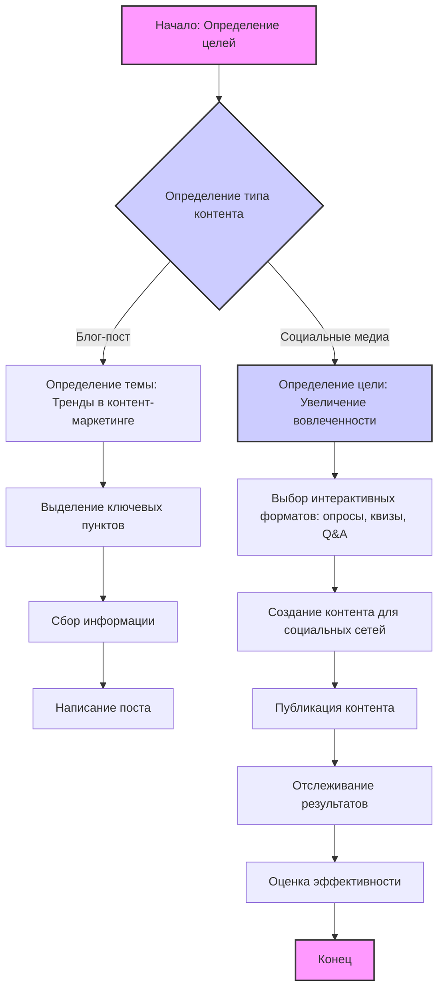

## Анализ кода: "Content Ideas for June.None.md"

### 1. <алгоритм>

Данный файл представляет собой не код, а скорее документ в формате Markdown, содержащий идеи для контент-плана на июнь. Этот план нацелен на создание различных видов контента, таких как блог-посты и социальные медиа-кампании, для привлечения и информирования аудитории.

**Блок-схема процесса создания контент-плана (как интерпретация документа):**



**Примеры для блоков:**

*   **A (Начало: Определение целей)**: Цель контент-плана — информировать аудиторию и увеличить вовлеченность.
*   **B (Определение типа контента)**: Два типа контента - блог-пост и социальные медиа-кампании.
*   **C (Определение темы)**: Тема блога: "Тренды в контент-маркетинге".
*   **D (Выделение ключевых пунктов)**: Для блога: ИИ в создании контента, персонализация, видеоконтент, измерение успеха.
*   **E (Сбор информации)**: Изучение текущих тенденций, сбор статистики.
*   **F (Написание поста)**: Подготовка текстового материала для блога.
*   **G (Определение цели)**: Цель: Увеличение вовлеченности в социальных сетях.
*   **H (Выбор интерактивных форматов)**: Использование опросов, квизов, живых Q&A.
*   **I (Создание контента для социальных сетей)**: Подготовка контента для социальных сетей на основе выбранных форматов.
*   **J (Публикация контента)**: Загрузка контента на платформы.
*   **K (Отслеживание результатов)**: Мониторинг показателей вовлеченности.
*   **L (Оценка эффективности)**: Анализ данных и корректировка стратегии.
*   **M (Конец)**: Завершение этапа контент-планирования.

### 2. <mermaid>

```mermaid
graph TD
    start[Начало] --> define_objectives[Определение целей: информирование и вовлечение]
    define_objectives --> content_type_selection{Выбор типа контента: блог-пост или соц. медиа}
    content_type_selection -- blog_post --> blog_topic_selection[Выбор темы блог-поста: Тренды в контент-маркетинге]
    blog_topic_selection --> blog_key_points[Определение ключевых моментов для блога]
    blog_key_points --> blog_research[Сбор информации для блога]
    blog_research --> blog_writing[Написание блог-поста]
    content_type_selection -- social_media --> social_media_engagement_objective[Цель: увеличение вовлеченности в соц. сетях]
    social_media_engagement_objective --> social_media_format_selection[Выбор интерактивных форматов: опросы, квизы, Q&A]
    social_media_format_selection --> social_media_content_creation[Создание контента для соц. сетей]
    social_media_content_creation --> content_publication[Публикация контента]
    content_publication --> content_tracking[Отслеживание результатов]
    content_tracking --> content_evaluation[Оценка эффективности]
    content_evaluation --> end[Конец]
   
    style start fill:#f9f,stroke:#333,stroke-width:2px
     style content_type_selection fill:#ccf,stroke:#333,stroke-width:2px
     style content_evaluation fill:#ccf,stroke:#333,stroke-width:2px
     style end fill:#f9f,stroke:#333,stroke-width:2px
```

**Объяснение зависимостей:**

Диаграмма `mermaid` описывает последовательность шагов для создания контент-плана, основываясь на предоставленном документе.

*   **start:** Начало процесса контент-планирования.
*   **define_objectives:** Определяются общие цели контент-плана: информирование аудитории и повышение вовлеченности.
*   **content_type_selection:** Выбор типа контента, который может быть блогом или кампанией в социальных сетях.
*   **blog_post:** Переход к планированию контента для блога.
*   **blog_topic_selection:** Определение темы для блог-поста — "Тренды в контент-маркетинге".
*   **blog_key_points:** Выделение основных моментов, которые нужно осветить в блог-посте.
*   **blog_research:** Сбор необходимой информации и исследований для написания блога.
*   **blog_writing:** Процесс написания статьи для блога.
*   **social_media:** Переход к планированию контента для социальных сетей.
*   **social_media_engagement_objective:** Определение цели - увеличение вовлеченности аудитории в социальных сетях.
*   **social_media_format_selection:** Выбор интерактивных форматов для социальных сетей: опросы, квизы, живые Q&A.
*   **social_media_content_creation:** Создание контента для выбранных форматов.
*   **content_publication:** Публикация созданного контента на платформах.
*   **content_tracking:** Мониторинг и отслеживание результатов.
*   **content_evaluation:** Оценка эффективности проведенной работы и результатов.
*   **end:** Конец процесса контент-планирования.

### 3. <объяснение>

**Импорты:** В данном документе нет импортов, так как это не исполняемый код, а контент-план.

**Классы:** Отсутствуют классы.

**Функции:** Отсутствуют функции.

**Переменные:** Переменные отсутствуют.

**Объяснение:**

Данный документ представляет собой план контента в формате Markdown, в котором описываются идеи для блога и социальных сетей на месяц июнь. 

**Блог-пост:**

*   **Тема:** "Тренды в контент-маркетинге".
*   **Цель:** Информировать аудиторию о последних трендах и их применении.
*   **Ключевые пункты:**
    *   Использование ИИ в создании контента.
    *   Важность персонализированного контента.
    *   Увеличение влияния видеоконтента.
    *   Методы измерения эффективности контент-маркетинга.

**Социальные медиа-кампании:**

*   **Цель:** Повысить вовлеченность аудитории.
*   **Интерактивные элементы:**
    *   Опросы на актуальные темы.
    *   Развлекательные и познавательные квизы о бренде.
    *   Живые Q&A сессии с экспертами.
    *   Поощрение пользовательского контента.

**Потенциальные ошибки и области улучшения:**

1.  **Недостаточная конкретика:** План является общим и может быть улучшен за счет конкретики:
    *   Указать точные темы для опросов и квизов.
    *   Определить экспертов для Q&A.
    *   Разработать календарный план публикаций.
2.  **Отсутствие метрик:** Нет конкретных целей в виде числовых значений (например, количество просмотров, лайков, комментариев). 
3.  **Отсутствие плана продвижения:** Нет упоминания о том, как будет продвигаться контент (например, таргетированная реклама, кросс-промоушн).
4.  **Нет привязки к другим частям проекта:** В контексте данного документа нет прямой связи с другими частями проекта (предполагается, что это начальный этап формирования плана контента).

**Взаимосвязь с другими частями проекта (предположительная):**

В контексте проекта `TinyTroupe` этот контент-план может быть частью общей маркетинговой стратегии, направленной на привлечение пользователей и продвижение продукта. Созданный контент может использоваться для обучения пользователей, демонстрации возможностей и вовлечения их в экосистему проекта.

**Общая оценка:**

Документ является хорошей отправной точкой для создания контент-плана, но требует дополнительной конкретизации и проработки для достижения поставленных целей.